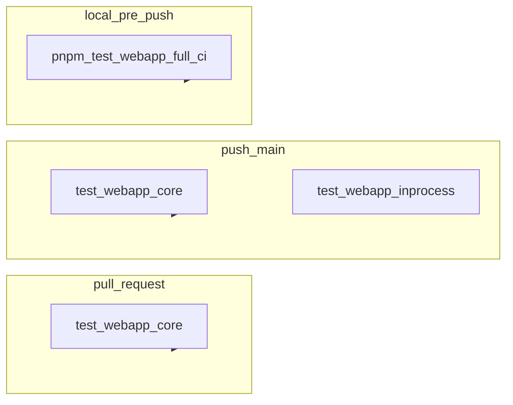

# План: webapp-тесты — таймауты, in-process, CI, шарды, lazy

## Статус плана

**Закрыт** (2026-05-14). Реализация в репозитории; постановка выполнена.

**Необязательный операционный хвост:** при желании заполнить таблицу wall-time шардов в `apps/webapp/e2e/CI_BASELINE.md` по логам GitHub Actions (не блокер кода).

## Scope boundaries

- **В scope:**
  - [`apps/webapp/vitest.config.ts`](apps/webapp/vitest.config.ts)
  - [`apps/webapp/package.json`](apps/webapp/package.json)
  - [`.github/workflows/ci.yml`](.github/workflows/ci.yml)
  - `apps/webapp/e2e/*inprocess*.test.ts`
  - точечные README/док-обновления по тест-политике
- **Вне scope:**
  - бизнес-логика страниц `app/**/page.tsx`
  - интегратор/worker/media-worker тестовая инфраструктура
  - изменения GitHub CI архитектуры вне webapp test-jobs
  - изменения pre-push правила `pnpm run ci`

## Текущее состояние (зафиксировано в репозитории)

- [apps/webapp/vitest.config.ts](apps/webapp/vitest.config.ts): два Vitest-проекта — **`fast`** (`testTimeout` 20s / `hookTimeout` 25s, `e2e/**/*.test.ts` кроме `*inprocess*`) и **`inprocess`** (30s / 120s hook, только `e2e/*inprocess*.test.ts`); включён `experimental.fsModuleCache`.
- [`.github/workflows/ci.yml`](.github/workflows/ci.yml): **`test-webapp-core`** — matrix **3 шарда** + `actions/cache` (пути `.vite` и `.experimental-vitest-cache`), ключ кэша включает **`s${{ matrix.shard }}`**; **`test-webapp-inprocess`** — то же, но **`if: push` + `refs/heads/main`**.
- Локальный pre-push: [package.json](package.json) `pnpm run ci` по-прежнему гоняет полный `pnpm test:webapp` (см. `.cursor/rules/pre-push-ci.mdc`).
- In-process smoke страниц: [apps/webapp/e2e/smoke-app-router-rsc-pages-inprocess.test.ts](apps/webapp/e2e/smoke-app-router-rsc-pages-inprocess.test.ts); доменные `*inprocess*.test.ts` без массовых повторных `import(page)`.
- Non-inprocess e2e с тяжёлым `import(page)`: один прогрев в `beforeAll` — [apps/webapp/e2e/doctor-clients-scope-redirects.test.ts](apps/webapp/e2e/doctor-clients-scope-redirects.test.ts) (см. [apps/webapp/e2e/README.md](apps/webapp/e2e/README.md)).
- Шаблон baseline/wall-time: [apps/webapp/e2e/CI_BASELINE.md](apps/webapp/e2e/CI_BASELINE.md) (таблица заполняется после замеров в GHA).

## Реализовано (кратко)

- Раздельные таймауты fast vs in-process, единый RSC-smoke, сокращение дублирующих импортов страниц в in-process наборах.
- CI: PR — только core (шардированный fast); `main` — core + in-process (шардированный); кэш Vitest не shared между шардами одного matrix-прогона.
- Документация: e2e README, baseline-шаблон, этот план синхронизирован с фактическим поведением.

## Паттерн lazy-RTL (ссылка)

- [apps/webapp/src/app/app/patient/treatment/PatientTreatmentProgramDetailClient.test.tsx](apps/webapp/src/app/app/patient/treatment/PatientTreatmentProgramDetailClient.test.tsx) — `beforeAll` + `Promise.all([import(...)])` для чанков с `React.lazy`.

## Цели

1. **Сигнал качества:** снизить таймауты там, где тесты должны быть быстрыми, чтобы ловить неоптимальные зависимости/конфиги раньше.
2. **Снижение тяжести:** убрать массовые `import("@/app/.../page")` из in-process набора, оставить только smoke-покрытие.
3. **PR быстрее, main полно:** PR получает быстрый сигнал, main подтверждает полный in-process smoke.
4. **Сокращение wall-time:** shard + cache для webapp test jobs.
5. **Стандартизация lazy-RTL:** prewarm чанков фиксируется как обязательный паттерн.

## Поэтапный план исполнения

### Шаг 1. Baseline и контролируемое снижение таймаутов

- Снять baseline длительностей (`vitest --reporter=verbose`) для `test:webapp:fast` и `test:webapp:inprocess` — команды и таблица в [apps/webapp/e2e/CI_BASELINE.md](apps/webapp/e2e/CI_BASELINE.md).
- Раздельные таймауты введены через Vitest projects `fast` / `inprocess` в [apps/webapp/vitest.config.ts](apps/webapp/vitest.config.ts).

Checklist:

- [x] Зафиксирован шаблон baseline / команды для top-slow (таблица GHA — по мере замеров).
- [x] Таймауты снижены для fast-проекта; in-process — отдельные лимиты.
- [x] `pnpm test:webapp:fast` зелёный на актуальном дереве (полный fast-прогон при проверке).

### Шаг 2. Сокращение тяжёлых in-process импортов

- Инвентаризировать `e2e/*inprocess*.test.ts` и классифицировать проверки:
  - обязательный `import(page)` smoke;
  - контракт/структурная проверка без полного графа.
- Оставить 1–2 smoke импорта страниц на доменную область (doctor/patient/core-routes).
- Остальные проверки перевести в «тонкие» контрактные тесты.

Рекомендуемая схема (минимум сюрпризов):

- Инвариант: соблюдать модульные правила (`modules/*` не ходят в infra db/repos напрямую).

Checklist:

- [x] Для каждого in-process файла определён «оставить smoke» или «перевести в контракт».
- [x] Количество размазанных `import("@/app/.../page")` сокращено; единый smoke — `smoke-app-router-rsc-pages-inprocess.test.ts`.
- [x] Сохранён smoke на критичные App Router области.

### Шаг 3. Политика CI: PR-fast, main-full

Изменения в [`.github/workflows/ci.yml`](.github/workflows/ci.yml):

- `test-webapp-core`: на всех событиях.
- `test-webapp-inprocess`: только `push` в `main`.
- Проверить поведение `deploy.needs` при skipped `test-webapp-inprocess` в PR pipeline.
- Если skipped конфликтует с `needs`, ввести обёртку-агрегатор для deploy-gate.

Checklist:

- [x] PR запускает только fast webapp tests (`test-webapp-core`).
- [x] `main` запускает fast + inprocess (`test-webapp-inprocess` с `if` на push main).
- [x] Deploy-gate: `needs` включает оба job; на PR in-process **skipped**, не **failed** — `needs` выполняется.

### Шаг 4. Sharding и cache

- Добавить matrix shards для `test-webapp-core`.
- Добавить matrix shards для `test-webapp-inprocess` на `main` (тот же механизм `vitest --shard`; число шардов подобрать по baseline, как для core).
- Настроить `actions/cache` для Vitest/Vite в обоих webapp test job: пути и ключи зафиксировать в workflow после проверки, где лежит кэш для Vitest 4.x в этом репо.

Checklist:

- [x] Matrix `VITEST_SHARD` 1/3–3/3 для core и in-process на main.
- [x] Cache: пути зафиксированы; ключ включает номер шарда (нет гонки записи кэша между параллельными шардами).
- [x] Шаблон baseline и команды — в [CI_BASELINE.md](apps/webapp/e2e/CI_BASELINE.md); сравнение wall-time шардов с цифрами в таблице — **опционально** (по логам GHA, см. «Статус плана»).

### Шаг 5. Документация и паттерн lazy prewarm

- Обновить docs о том, что PR идёт через fast, main — через full.
- Зафиксировать паттерн prewarm для `React.lazy` в тестах с ссылкой на существующий пример.

Checklist:

- [x] Доки синхронизированы (e2e README, test-execution-policy / корневой README — по факту ссылок в репо).
- [x] Паттерн lazy prewarm и `beforeAll` + `import(page)` для non-inprocess e2e описаны в [apps/webapp/e2e/README.md](apps/webapp/e2e/README.md).

## Проверки (Definition of Done)

- [x] `pnpm test:webapp:fast` стабильно проходит на сниженных таймаутах.
- [x] `pnpm test:webapp:inprocess` зелёный при целевых smoke импортах.
- [x] В PR нет запуска in-process job; на `main` он есть.
- [x] Корневой `pnpm run ci` (pre-push) остаётся валидным и без регрессий.
- [x] Изменения задокументированы (корневой `README`, `docs/README`, e2e README, `test-execution-policy`, правило `webapp-tests-lean-no-bloat.mdc`).
- [x] Нет расширения scope на несвязанные модули/сервисы.

## Риски и guardrails

- Риск флапов после снижения таймаутов: смягчать точечно в конкретных cold import тестах, не возвращать глобально 30s.
- Риск ложной «экономии» от CI фильтров: full in-process обязательно остаётся на `main`.
- Риск растущего in-process набора: новые `import(page)` добавлять только в smoke-файлы, не размазывать по доменным e2e.
- Перед merge: сверка, что правила pre-push (`pnpm run ci`) не нарушены.

