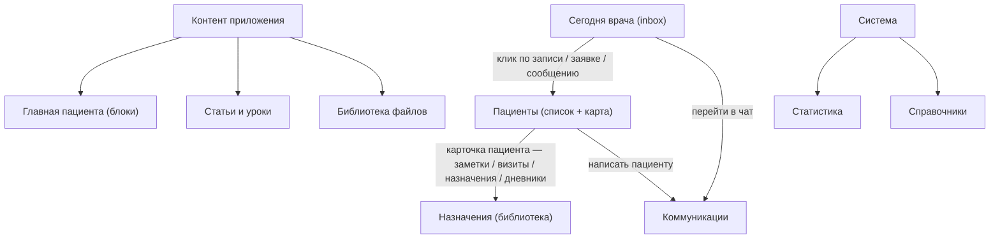

# Целевая структура кабинета врача / админа

**Статус:** **черновик / strawman** — общее видение, в которое последовательно будут вписываться зафиксированные решения.
**Дата старта:** 2026-05-01.
**Назначение:** единая мысленная карта кабинета как **рабочего инструмента**, а не панели настроек и каталогов.

**Связанные документы:**
- baseline-аудит (часть II): [`STRUCTURE_AUDIT.md`](STRUCTURE_AUDIT.md)
- рекомендации и этапы работ: [`RECOMMENDATIONS_AND_ROADMAP.md`](RECOMMENDATIONS_AND_ROADMAP.md)
- целевая структура пациента: [`TARGET_STRUCTURE_PATIENT.md`](TARGET_STRUCTURE_PATIENT.md)

---

## 1. Что кабинет даёт врачу/админу (продуктовая формулировка)

Кабинет — это **рабочее место** клинического специалиста и контент-редактора одновременно. Он закрывает 5 ролей:

1. **Сегодня** — врач в начале дня видит, что требует его внимания (записи, заявки, сообщения, тесты к проверке).
2. **Пациент** — врач работает с конкретным человеком: ведёт заметки, видит назначения, дневники, переписку.
3. **Назначения** — врач собирает свой «продукт»: упражнения, комплексы, тесты, рекомендации, программы лечения, курсы.
4. **Контент приложения** — врач/админ управляет тем, что увидит пациент в приложении: статьи, ситуации, подписочные материалы, главная пациента, мотивации.
5. **Коммуникации** — поддержка переписки, рассылки.

Плюс **системный** слой: справочники, статистика. Это не основной поток работы.

Эти роли — критерий для каждой страницы и каждого пункта меню: **«какая роль это закрывает, и насколько прямо?»** Если ни одну прямо — это лишнее или должно быть свёрнуто в подраздел.

---

## 2. Главный принцип роста интерфейса

> «Сегодня» — рабочее место дня, не отчёт. Каталоги — инструмент, не пункт назначения. Карточка пациента — главный экран работы.

Сейчас кабинет устроен «от инструментов»: меню перечисляет каталоги. В целевой модели кабинет устроен **«от потока работы дня»**:

1. Открыли «Сегодня» → увидели inbox (записи, заявки, сообщения, события пациентов).
2. Кликнули по любому пункту inbox → попали в **карточку пациента** с акцентом на то, что вы пришли смотреть.
3. Из карточки пациента можно сделать всё нужное: записать в заметку, назначить программу, ответить на сообщение, посмотреть дневник.
4. Каталоги (упражнения, комплексы, тесты, шаблоны программ, курсы) — **рабочий инструмент назначения**, а не место «куда зашёл и что-то сделал». Открываются из карточки пациента (selector «назначить из библиотеки»).
5. CMS-контент — **отдельный кластер для контент-редактора** (это другая роль, иногда другой человек).



---

## 3. Целевое меню — 5 кластеров

Исторически меню было плоским списком с разделителями. **По состоянию на 2026-05-02** в коде — кластеры + аккордеон + отдельный пункт «Библиотека файлов» между «Контент приложения» и «Коммуникации» ([`DOCTOR_MENU_RESTRUCTURE_EXECUTION_AUDIT.md`](DOCTOR_MENU_RESTRUCTURE_EXECUTION_AUDIT.md)); бейджи на «Онлайн-заявки» и «Сообщения» — [`DOCTOR_NAV_BADGES_PLAN.md`](DOCTOR_NAV_BADGES_PLAN.md). Ниже — целевая текстовая модель для дальнейшей редакции названий/IA без смены структуры кластеров.

В целевой модели — **5 кластеров с заголовками**, без декоративных разделителей:

```
РАБОТА С ПАЦИЕНТАМИ
  Сегодня
  Пациенты
  Записи
  Онлайн-заявки         (бадж новых)
  Сообщения             (бадж непрочитанных)

НАЗНАЧЕНИЯ
  Упражнения
  Комплексы ЛФК
  Клинические тесты
  Наборы тестов
  Рекомендации          (типизированный каталог — kind/region/quantity/frequency/duration)
  Программы лечения     (= шаблоны; «Курсы» — НЕ здесь, они отдельный продукт)

КОНТЕНТ ПРИЛОЖЕНИЯ
  Главная пациента
  Статьи и уроки
  Ситуации
  Подписочные
  Мотивации
  Курсы                 (геткурс-модель, см. COURSES_INITIATIVE; место в кластере — открытый вопрос §14)
  Библиотека файлов

КОММУНИКАЦИИ
  Рассылки

СИСТЕМА
  Справочники
  Статистика
```

Замечания:
- **«Сообщения»** в кластере «Работа с пациентами» (это коммуникация по конкретному пациенту); **«Рассылки»** в «Коммуникации» (массовая операция).
- **«Курсы»** — отдельный продукт по геткурс-модели, **не** шаблон программы; см. §6.3 и [`../COURSES_INITIATIVE/README.md`](../COURSES_INITIATIVE/README.md). Место в меню (внутри «Контент приложения» или отдельным кластером) — открытый вопрос §14.
- **«Подписчики»** удалены — это legacy (полный redirect на `/clients?scope=all`).
- **«Главная пациента»** перемещена из системного слоя в «Контент» — это контент-задача.
- **Реализация этапа 2 меню (2026-05-02):** в продукте «Библиотека файлов» — **отдельный верхнеуровневый пункт между** кластерами «Контент приложения» и «Коммуникации», не внутри сайдбара CMS ([`DOCTOR_MENU_RESTRUCTURE_PLAN.md`](DOCTOR_MENU_RESTRUCTURE_PLAN.md)). Ниже черновая блок-схема §3 всё ещё показывает библиотеку внутри блока «Контент» — при следующей редакции TARGET имеет смысл выровнять текст/диаграмму с фактом в коде.

## 4. «Сегодня» врача — рабочий день, не отчёт

**Факт (2026-05-02):** MVP экрана «Сегодня» реализован ([`DOCTOR_TODAY_DASHBOARD_PLAN.md`](DOCTOR_TODAY_DASHBOARD_PLAN.md), [`LOG.md`](LOG.md)) — записи на сегодня, новые заявки, непрочитанные сообщения, ближайшие записи; метрики на `/stats`. Ниже — целевая полнота inbox (включая то, что пока **не** сделано: «К проверке», проактивная лента).

```
Сегодня
├ Записи на сегодня
│    карточка с пациентом, временем, форматом
│    CTA «открыть карту», «написать», «отметить пришёл»
├ Новые онлайн-заявки                       (бадж)
│    карточка с типом заявки + предпросмотр
│    CTA «взять в работу», «отказать»
├ Непрочитанные сообщения в поддержке        (бадж)
│    компактный счётчик + переход в чат
├ К проверке
│    пациенты, прошедшие тесты или intake-вопросники
│    CTA «оценить»
├ Лента событий по пациентам (опционально, см. §7)
│    «Маша отметила боль 8/10», «Петя не выполнил ЛФК 5 дней»
└ Ближайшие приёмы (2–3 дня)
     компактный список «Завтра / Послезавтра»
```

Метрики дашборда (`всего пациентов`, `отмен за месяц`, …) переезжают в `/stats`.

**Принцип:** на «Сегодня» должны быть только **элементы, требующие действия**. Информация без действия — это статистика, ей место в `/stats`.

---

## 5. Карточка пациента — главный экран

Сейчас `ClientProfileCard.tsx` — 423 строки и 13 аккордеонов в одной колонке, где заметки врача — один из последних аккордеонов. В целевой модели — **рабочее место с пациентом**, организованное по приоритету работы:

```
Шапка пациента
  имя · телефон · аватар каналов · статус (активный/архив)

Hero «Что важно сейчас»
  • Активная программа: «Этап 3 из 8, прогресс 4/6»
  • Открытые тесты к проверке (если есть)
  • Последний визит / ближайший визит (статус)
  • Последнее сообщение в чате (превью)

Tab 1 — Заметки и история визитов  ← основной рабочий tab
  Хронологический фид:
  ▸ визит (дата, тип, ссылка на детали)
  ▸ заметка врача (markdown, можно править)
  ▸ ключевое событие (назначена программа, отменён визит)

Tab 2 — Назначения
  Активная программа лечения (= treatment_program_instance)
    + цели/задачи/срок текущего этапа
    + «Изменить шаг» / «Отключить элемент» / «Завершить программу»
    + Этап 0 «Общие рекомендации» (persistent)
  Inbox «К проверке»  ← тесты со статусом submitted, decided_by IS NULL
  CTA «Назначить новое» (selector из библиотеки)
  (Архив: завершённые программы)

Tab 3 — Дневники
  Симптомы: график (как у пациента) + комментарий врача
  ЛФК: журнал занятий, комплаенс (% отметок за период)
  Программа: лента действий пациента (program_action_log) и фид treatment_program_events

Tab 4 — Сообщения
  чат с пациентом на том же `DoctorChatPanel`, что и на `/messages` (модалка или split-view — допустимо; одна логика отправки)

Tab 5 (свернуть) — Учётная запись
  контакты, каналы, lifecycle, admin-действия
```

**Принципы карточки пациента:**

1. **Заметки — первичны.** Это единственный артефакт, который нельзя восстановить из других данных. Всё остальное — view + действие.
2. **Назначить — основное действие.** «Назначить новое» — большая кнопка, не подопция в аккордеоне.
3. **Дневники — клиническая информация.** Графики, не «Симптомы: A, B. Записи: 3, 4».
4. **Системные настройки — внизу свёрнуто.** Контакты и lifecycle важны редко, не должны быть первым, что видит врач при открытии.
5. **Чат — доступен из карточки без отдельного «второго композера».** Открыть переписку с пациентом не должно требовать выхода из контекста карточки (модалка/split с тем же `DoctorChatPanel` считается соответствием).

---

## 6. Каталоги назначений — общий паттерн

Сейчас 7 каталогов (упражнения / комплексы / тесты / наборы тестов / рекомендации / шаблоны программ / курсы). Целевая модель — **6 каталогов в кластере «Назначения»** + курсы в отдельной инициативе:

| Каталог | Кластер | Источник модели |
|---|---|---|
| Упражнения | Назначения | существует |
| Комплексы ЛФК | Назначения | существует |
| Клинические тесты | Назначения | существует (без лимитов попыток — см. §6.4) |
| Наборы тестов | Назначения | существует |
| **Рекомендации** | Назначения | расширение модели (см. §6.5) |
| Шаблоны программ лечения | Назначения | существует, расширение конструктора (см. §6.6) |
| **Курсы** | **Контент приложения** (или отдельный кластер по итогам [`../COURSES_INITIATIVE/README.md`](../COURSES_INITIATIVE/README.md)) | **отдельная сущность по геткурс-модели**, не часть «Назначений» |

> **Зафиксировано (2026-05-03):** идея «Курсы = шаблон программы с флагом `published_as_course`» (старый §6.3) **снимается**. Курсы делаются отдельной сущностью с собственными уроками + unlock-rules + доступом/оплатой ([`../COURSES_INITIATIVE/README.md`](../COURSES_INITIATIVE/README.md)). Полный план реализации каталогов «Назначений» — [`PROGRAM_PATIENT_SHAPE_PLAN.md`](PROGRAM_PATIENT_SHAPE_PLAN.md).

### 6.1 Унифицированный каталог
- Список + фильтры + master-detail (как сейчас).
- На каждой карточке элемента — **«Где используется»**: «упражнение в 5 шаблонах», «комплекс назначен 12 пациентам». **Реализовано** ([`ASSIGNMENT_CATALOG_USAGE_ARCHIVE_PLAN.md`](ASSIGNMENT_CATALOG_USAGE_ARCHIVE_PLAN.md)).
- При архивации — предупреждение, если элемент в активной программе/назначении. **Реализовано** там же.
- При удалении/архиве — soft-delete с возможностью восстановить.

### 6.2 Точки входа
- Из меню (как сейчас) — для редактирования каталога.
- Из карточки пациента (Tab 2 → «Назначить новое») — selector с фильтрами по уже выбранным критериям пациента.
- Из конструктора программы — selector items.

### 6.3 Курсы — отдельный каталог, отдельная инициатива

Курс не является шаблоном программы. По смыслу и UX:
- курс — self-paced образовательный продукт с уроками и условиями открытия;
- план лечения — индивидуальный набор назначений врача с этапами / целями / задачами;
- общего у них только источник медиа (CMS-страницы) — это и так переиспользуемо.

См. отдельный документ: [`../COURSES_INITIATIVE/README.md`](../COURSES_INITIATIVE/README.md). Стартует **после** ядра пациентского `PROGRAM_PATIENT_SHAPE_PLAN` и оплаты.

### 6.4 Клинические тесты

- **Без лимита попыток.** Пациент может пройти повторно; врач — gate этапа через `overrideResultDecision`.
- В каталоге у теста — типизированные параметры scoring (как уже есть).
- На карточке шага программы — статус (`not_started` / `submitted` / `reviewed`); подробнее — [`PROGRAM_PATIENT_SHAPE_PLAN.md`](PROGRAM_PATIENT_SHAPE_PLAN.md) §1.4 и §2.5.

### 6.5 Рекомендации — типизированный каталог

Расширение модели:
- `kind` (enum): `regimen`, `nutrition`, `device`, `self_procedure`, `external_therapy`, `lifestyle`, …;
- `body_region` (FK справочник, опц.);
- `quantity` (опц., текст «10 минут / 10 сеансов / 3 подхода»);
- `frequency` (опц., текст «3 р/нед», «ежедневно», «однократно»);
- `duration` (опц., текст «4 недели», «бессрочно»);
- опц. `external_link` / `external_org` для `kind=external_therapy`.

При добавлении в программу врач помечает item-флагом **`is_actionable`** (true → попадает в чек-лист с галочкой; false → persistent-блок без completion). Persistent-рекомендации обычно идут в **Этап 0 «Общие рекомендации»** (см. [`PROGRAM_PATIENT_SHAPE_PLAN.md`](PROGRAM_PATIENT_SHAPE_PLAN.md) §1.2).

Фильтры списка: `q`, `kind`, `body_region`. Каталог по структуре близок к каталогу упражнений.

### 6.6 Шаблоны программ — расширенный конструктор

В конструктор шаблона и в правку инстанса добавляются:
- **Цель / Задачи / Ожидаемый срок этапа** (`goals`, `objectives`, `expected_duration_*`).
- **Группы внутри этапа** — drag-n-drop items между группами; у группы — `title`, `description`, `schedule_text` (фристайл «3 р/нед»), `sort_order`.
- **«Этап 0 — Общие рекомендации»** — псевдо-stage с `sort_order=0` для persistent-рекомендаций; в UI обозначен отдельным цветом/иконкой.
- В инстансе — иконка **«отключить» (глаз)** на каждом item-е вместо удаления (`status: active/disabled`). Жёсткое удаление — только в шаблоне.

Отдельной сущности для «фильтр-вкладки «Курсы» внутри Шаблонов программ» **больше нет** (см. §6.3).

---

## 7. Inbox / лента событий — проактивная часть (опционально, отдельная инициатива)

Чтобы кабинет действительно стал «помощником», нужна **проактивная сигнализация**:

```
События по пациентам (на «Сегодня» врача и в карточке пациента)
├ Симптом за порогом
│    «Маша: боль 8/10 третий день подряд»
├ Пропуск назначений
│    «Петя: не отметил ЛФК 5 дней (назначен 3 р/нед)»
├ Заполнен тест/intake
│    «Ира: пройден тест A — нужна оценка»
├ Запись изменена пациентом
│    «Лена: перенесла приём с 10:00 на 14:00»
└ Записал срочную проблему
     «Костя: SOS — острая боль в шее»
```

Источники сигналов уже есть в БД (`symptom_diary_entries`, `lfk_sessions`, `clinical_test_responses`, `appointment_records`). Нужен только агрегатор + настройка порогов («уведомить, если боль ≥ 7»).

**Это превращает кабинет из «отвечает на запросы» в «опережает проблемы»** — главное продуктовое отличие от старой модели.

---

## 8. Контент приложения — отдельный кластер для редакторской роли

Сейчас CMS-страницы перемешаны в одном `/content` с фильтром по разделу. В целевой модели — **разделение по типу контента** (`content_sections.kind`):

```
Контент приложения
├ Главная пациента        блоки + items (что увидит пациент в "Сегодня")
├ Статьи и уроки           kind=article + kind=course_lesson
│   ├ Статьи               для пациента, разделы CMS
│   └ Уроки курсов         для конструктора программы
├ Ситуации                 kind=situation; только для блока situations
├ Подписочные              kind=subscription; только для subscription_carousel
├ Мотивации                motivational_quotes (виджет, не блок)
└ Библиотека файлов        медиа (в реализации 2026-05-02 — отдельный пункт основного меню врача «Библиотека файлов», не только внутри `/content`)
```

**Шаг 2026-05-02 (вариант C):** в репозитории уже есть `kind` (`article` \| `system`) и `system_parent_code` для кластеров вместо полного enum выше; целевая схема в дереве остаётся ориентиром на следующие итерации — см. [`CMS_RESTRUCTURE_PLAN.md`](CMS_RESTRUCTURE_PLAN.md).

Принципы:
- **Редактор знает, куда уйдёт страница.** Создавая «ситуацию», редактор выбирает `kind=situation` и сразу видит соответствующие поля и место использования.
- **Редактор главной пациента видит только разрешённые items.** Для блока `situations` — выбор только из `kind=situation`. Никаких «случайных» разделов в выпадайке.
- **Мотивации — виджет, не блок главной.** Используется внутри других экранов (после практики, в дневнике), а не на главной.
- **Новости как сущность — удалены** (см. [`RECOMMENDATIONS_AND_ROADMAP.md`](RECOMMENDATIONS_AND_ROADMAP.md) §II.4.5: на новой главной их нет, смысл совпадает с рассылками или `useful_post`).

---

## 9. Коммуникации — две сущности с разной природой

| Сущность | Природа | Где |
|----------|---------|-----|
| **Сообщения** (1:1) | Контекстная переписка по пациенту | В кластере «Работа с пациентами» + из карточки пациента через тот же `DoctorChatPanel` (модалка/split) |
| **Рассылки** (1:N) | Массовое исходящее сообщение | В кластере «Коммуникации» как самостоятельный экран с защитой (preview + двухшаговое подтверждение) |

Принципы:
- **Журнал рассылок только в `/broadcasts`**, не дублируется в `/messages`.
- **Сообщения и рассылки не сливаются** в одну сущность — у них разный режим работы и разная цена ошибки.
- **Рассылки — multiselect каналов** (на старте `bot_message + sms`, дальше `push / home_banner / notification_bell` без новой миграции).

---

## 10. Системный слой — справочники и статистика

```
Система
├ Справочники             зоны тела, типы нагрузок, и т.д. (медицинская таксономия)
└ Статистика              метрики и дашборды (то, что переехало с «Обзора»)
```

Это **не основной поток работы**, нижний кластер меню. Открывается реже, чем раз в месяц.

---

## 11. Что исчезает как отдельный пункт меню

| Сейчас | Куда уходит |
|--------|-------------|
| «Подписчики» | Удалить (legacy redirect на `/clients?scope=all`) |
| «Курсы» как отдельный каталог | Остаётся отдельным каталогом, но **по геткурс-модели** (не как фильтр шаблонов программ); место в меню — §14 |
| «CMS» как одна точка | Разнесено по типам внутри кластера «Контент приложения» |
| Журнал рассылок в `/messages` | Только в `/broadcasts` |
| `/clients/name-match-hints` | Спрятать под admin-mode (debug) |
| `/content/library/delete-errors` | Спрятать под admin-mode (debug) |
| Дашборд метрик на «Обзоре» | Переезд в «Статистика» |
| `/online-intake` (нет в меню сейчас!) | **Добавить** в кластер «Работа с пациентами» |

---

## 12. Принципы дизайна, в которых растёт кабинет

1. **Меню — кластеры по ролям, не плоский список.** Без декоративных разделителей.
2. **«Сегодня» = inbox, а не дашборд.** Только элементы, требующие действия.
3. **Карточка пациента — рабочее место с заметками, не настройки УЗ.**
4. **Каталоги — инструмент назначения, открывается из карточки пациента.**
5. **Каждый элемент каталога знает «где он используется».**
6. **CMS-разделы типизированы.** Редактор не путается, куда уходит контент.
7. **Сообщения и рассылки — две сущности, два экрана.** Никаких слияний.
8. **Inbox и события — проактивный слой.** То, что отличает «помощник» от «база данных».
9. **Бадж новых** — на пунктах меню `Онлайн-заявки`, `Сообщения` (минимум).

---

## 13. Текущее состояние vs целевое — короткая дельта

**Обновление 2026-05-02:** часть строк ниже закрыта по [`PLAN_DOCTOR_CABINET.md`](PLAN_DOCTOR_CABINET.md) и связанным ТЗ; в таблице отмечено **факт + оставшаяся цель**.

| Размер изменений | Что меняется |
|-------------------|--------------|
| **Меню** | **Сделано:** кластеры + аккордеон + «Онлайн-заявки» + standalone «Библиотека файлов» + бейджи на заявках/сообщениях (2026-05-02). **Дальше:** мелкие IA-хвосты без смены каркаса. |
| **Сегодня** | **Сделано:** MVP actionable экрана «Сегодня», метрики на `/stats` (2026-05-02). **Дальше:** секция «К проверке» при появлении источника данных; проактивная лента — roadmap IV этап 8 (не путать с этапом 8 плана кабинета — плотность UI). |
| **Карточка пациента** | **Микро-проход (2026-05-02):** без классического аккордеона, sticky-шапка, клиника выше контактов — [`DOCTOR_CLIENT_PROFILE_REPACK_EXECUTION_AUDIT.md`](DOCTOR_CLIENT_PROFILE_REPACK_EXECUTION_AUDIT.md). **Цель:** табы + hero — этап 6 глубокая часть заморозки [`PLAN_DOCTOR_CABINET.md`](PLAN_DOCTOR_CABINET.md). |
| **CMS** | **Сделано:** вариант C — `kind` + `system_parent_code`, фильтры patient-home ([`CMS_RESTRUCTURE_PLAN.md`](CMS_RESTRUCTURE_PLAN.md)). **Дальше:** расширение до полного enum / табов хаба — roadmap IV этапы 2–3. |
| **Курсы и Шаблоны программ** | **Решено (2026-05-03):** курсы — **отдельная инициатива** [`../COURSES_INITIATIVE/README.md`](../COURSES_INITIATIVE/README.md) (геткурс-модель), не объединение. roadmap IV этап 7 переформулирован. |
| **Каталоги** | **Сделано:** сводка usage и предупреждение при архивации по каталогам ([`ASSIGNMENT_CATALOG_USAGE_ARCHIVE_PLAN.md`](ASSIGNMENT_CATALOG_USAGE_ARCHIVE_PLAN.md)). **Дальше:** расширение каталогов (рекомендации с типизацией §6.5; конструктор шаблона §6.6) — [`PROGRAM_PATIENT_SHAPE_PLAN.md`](PROGRAM_PATIENT_SHAPE_PLAN.md) этапы A1–A3. |
| **План пациента** | **Решено (2026-05-03):** новая модель — цели/задачи/срок этапа, группы, Этап 0 «Общие рекомендации», `is_actionable` для рекомендаций, `program_action_log`, бейдж «План обновлён» / «Новое», «отключение» вместо удаления, Inbox «К проверке» в карточке. ТЗ — [`PROGRAM_PATIENT_SHAPE_PLAN.md`](PROGRAM_PATIENT_SHAPE_PLAN.md). |
| **Сообщения / Рассылки** | убрать дубль журнала (**сделано** для `/messages` vs `/broadcasts`); multiselect каналов в рассылках (**этап 1** roadmap / LOG). |
| **Inbox событий пациентов** | новая функциональность (отдельная инициатива) |

Этапная разводка по работам — в [`RECOMMENDATIONS_AND_ROADMAP.md`](RECOMMENDATIONS_AND_ROADMAP.md) §IV (этапы 0/1/2/3/6/7/8).

---

## 14. Открытые вопросы (фиксируем для решений)

> Сюда вписываются **зафиксированные решения** по мере проработки. Пока — список вопросов.

1. ~~**«Курсы» внутри «Программы лечения» как фильтр или как отдельная страница `/programs?published`?**~~
   **Закрыто (2026-05-03):** курсы — **отдельная инициатива** [`../COURSES_INITIATIVE/README.md`](../COURSES_INITIATIVE/README.md), не подвкладка шаблонов. Открыто — место курсов в меню (внутри «Контент приложения» vs отдельный кластер) — см. §15.
2. **«Сегодня» врача vs «Сегодня» пациента — одна терминология или разная?**
   Чтобы избежать путаницы при коммуникации внутри команды.
3. **Лента событий пациентов — отдельная инициатива или часть карточки пациента сразу?**
   Влияет на этап 6 в плане работ.
4. **Карточка пациента — табы vs scroll-секции?**
   Табы скрывают часть, scroll — длиннее, но всё на виду.
5. **Заметки врача — markdown с прикреплениями или просто текст?**
   Влияет на сложность редактора в Tab 1.
6. **«Назначить» — отдельный модальный flow или встроенный selector в табе «Назначения»?**
   UX назначения — частая операция, важно отполировать.
7. **Уровни доступа admin / doctor — где видна разница?**
   Сейчас admin-mode даёт доступ к опасным действиям. В целевой модели — admin-only кластер «Система» + admin-режим в карточке (опасные операции).

Решения по этим вопросам и любые другие — добавлять в этот документ как §15+ по мере фиксации.

---

## 15. Зафиксированные продуктовые решения по «Назначениям» и «Курсам» (2026-05-03)

> Закреплено по итогам обсуждения 2026-05-02 / 2026-05-03. Полный план — [`PROGRAM_PATIENT_SHAPE_PLAN.md`](PROGRAM_PATIENT_SHAPE_PLAN.md). Курсы — [`../COURSES_INITIATIVE/README.md`](../COURSES_INITIATIVE/README.md).

### 15.1. Каталоги назначений (кластер «Назначения»)

- 6 каталогов: упражнения, комплексы ЛФК, клинические тесты, наборы тестов, **рекомендации (типизированный)**, шаблоны программ.
- Курсы — **отдельная сущность** (не каталог назначения), не относится к «Назначениям».

### 15.2. Каталог рекомендаций — типизация

`kind` (regimen / nutrition / device / self_procedure / external_therapy / lifestyle / …), `body_region`, `quantity`, `frequency`, `duration`, опц. `external_link`/`external_org`. Фильтры списка: `q`, `kind`, `body_region`. См. §6.5.

### 15.3. Конструктор шаблона программы

Расширяется полями этапа: **`goals` / `objectives` / `expected_duration_*`**. Внутри этапа — **группы** (`tplStageGroups`) с `title` / `description` / `schedule_text` / `sort_order`. Поддержка **«Этапа 0 — Общие рекомендации»** (`sort_order=0`). См. §6.6.

### 15.4. Правка инстанса программы

В инстансе **«отключение» (`status=disabled`)** вместо удаления item-а. Замена шага = disable + add. Жёсткое удаление — только в шаблоне.

### 15.5. Inbox «К проверке»

В **карточке пациента** (Tab 2 «Назначения») — секция «Тесты, ожидающие оценки» (read по `test_results.decided_by IS NULL`). Кросс-пациентский inbox в «Сегодня» врача — backlog (мелкое расширение).

### 15.6. Тесты — без лимитов попыток

Решение врача (`overrideResultDecision`) — gate этапа. Лимитов попыток в каталоге нет.

### 15.7. Курсы — отдельный продукт по геткурс-модели

Курсы не входят в «Назначения», не используют движок программ. См. [`../COURSES_INITIATIVE/README.md`](../COURSES_INITIATIVE/README.md). Стартует **последней** инициативой после ядра пациентского `PROGRAM_PATIENT_SHAPE_PLAN` и оплаты.
