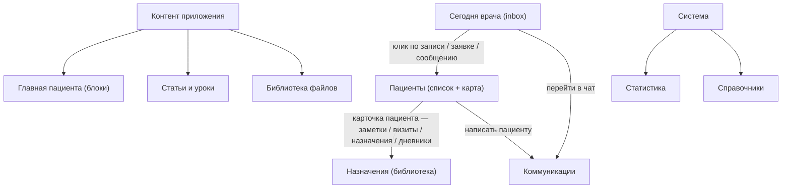

# Целевая структура кабинета врача / админа

**Статус:** **черновик / strawman** — общее видение, в которое последовательно будут вписываться зафиксированные решения.
**Дата старта:** 2026-05-01.
**Назначение:** единая мысленная карта кабинета как **рабочего инструмента**, а не панели настроек и каталогов.

**Связанные документы:**
- baseline-аудит (часть II): [`STRUCTURE_AUDIT.md`](STRUCTURE_AUDIT.md)
- рекомендации и этапы работ: [`RECOMMENDATIONS_AND_ROADMAP.md`](RECOMMENDATIONS_AND_ROADMAP.md)
- целевая структура пациента: [`TARGET_STRUCTURE_PATIENT.md`](TARGET_STRUCTURE_PATIENT.md)

---

## 1. Что кабинет даёт врачу/админу (продуктовая формулировка)

Кабинет — это **рабочее место** клинического специалиста и контент-редактора одновременно. Он закрывает 5 ролей:

1. **Сегодня** — врач в начале дня видит, что требует его внимания (записи, заявки, сообщения, тесты к проверке).
2. **Пациент** — врач работает с конкретным человеком: ведёт заметки, видит назначения, дневники, переписку.
3. **Назначения** — врач собирает свой «продукт»: упражнения, комплексы, тесты, рекомендации, программы лечения, курсы.
4. **Контент приложения** — врач/админ управляет тем, что увидит пациент в приложении: статьи, ситуации, подписочные материалы, главная пациента, мотивации.
5. **Коммуникации** — поддержка переписки, рассылки.

Плюс **системный** слой: справочники, статистика. Это не основной поток работы.

Эти роли — критерий для каждой страницы и каждого пункта меню: **«какая роль это закрывает, и насколько прямо?»** Если ни одну прямо — это лишнее или должно быть свёрнуто в подраздел.

---

## 2. Главный принцип роста интерфейса

> «Сегодня» — рабочее место дня, не отчёт. Каталоги — инструмент, не пункт назначения. Карточка пациента — главный экран работы.

Сейчас кабинет устроен «от инструментов»: меню перечисляет каталоги. В целевой модели кабинет устроен **«от потока работы дня»**:

1. Открыли «Сегодня» → увидели inbox (записи, заявки, сообщения, события пациентов).
2. Кликнули по любому пункту inbox → попали в **карточку пациента** с акцентом на то, что вы пришли смотреть.
3. Из карточки пациента можно сделать всё нужное: записать в заметку, назначить программу, ответить на сообщение, посмотреть дневник.
4. Каталоги (упражнения, комплексы, тесты, шаблоны программ, курсы) — **рабочий инструмент назначения**, а не место «куда зашёл и что-то сделал». Открываются из карточки пациента (selector «назначить из библиотеки»).
5. CMS-контент — **отдельный кластер для контент-редактора** (это другая роль, иногда другой человек).



---

## 3. Целевое меню — 5 кластеров

Сейчас 16 пунктов плоским списком. В целевой модели — **5 кластеров с заголовками**, без декоративных разделителей:

```
РАБОТА С ПАЦИЕНТАМИ
  Сегодня
  Пациенты
  Записи
  Онлайн-заявки         (бадж новых)
  Сообщения             (бадж непрочитанных)

НАЗНАЧЕНИЯ
  Упражнения
  Комплексы ЛФК
  Клинические тесты
  Наборы тестов
  Рекомендации
  Программы лечения     (= «шаблоны»; курсы — флаг «опубликован в каталог»)

КОНТЕНТ ПРИЛОЖЕНИЯ
  Главная пациента
  Статьи и уроки
  Ситуации
  Подписочные
  Мотивации
  Библиотека файлов

КОММУНИКАЦИИ
  Рассылки

СИСТЕМА
  Справочники
  Статистика
```

Замечания:
- **«Сообщения»** в кластере «Работа с пациентами» (это коммуникация по конкретному пациенту); **«Рассылки»** в «Коммуникации» (массовая операция).
- **«Курсы»** не отдельный пункт — это шаблон программы с флагом «опубликован» (см. §6.3).
- **«Подписчики»** удалены — это legacy (полный redirect на `/clients?scope=all`).
- **«Главная пациента»** перемещена из системного слоя в «Контент» — это контент-задача.

---

## 4. «Сегодня» врача — рабочий день, не отчёт

Сейчас `/app/doctor` — это плитки метрик. В целевой модели — **actionable inbox дня**:

```
Сегодня
├ Записи на сегодня
│    карточка с пациентом, временем, форматом
│    CTA «открыть карту», «написать», «отметить пришёл»
├ Новые онлайн-заявки                       (бадж)
│    карточка с типом заявки + предпросмотр
│    CTA «взять в работу», «отказать»
├ Непрочитанные сообщения в поддержке        (бадж)
│    компактный счётчик + переход в чат
├ К проверке
│    пациенты, прошедшие тесты или intake-вопросники
│    CTA «оценить»
├ Лента событий по пациентам (опционально, см. §7)
│    «Маша отметила боль 8/10», «Петя не выполнил ЛФК 5 дней»
└ Ближайшие приёмы (2–3 дня)
     компактный список «Завтра / Послезавтра»
```

Метрики дашборда (`всего пациентов`, `отмен за месяц`, …) переезжают в `/stats`.

**Принцип:** на «Сегодня» должны быть только **элементы, требующие действия**. Информация без действия — это статистика, ей место в `/stats`.

---

## 5. Карточка пациента — главный экран

Сейчас `ClientProfileCard.tsx` — 423 строки и 13 аккордеонов в одной колонке, где заметки врача — один из последних аккордеонов. В целевой модели — **рабочее место с пациентом**, организованное по приоритету работы:

```
Шапка пациента
  имя · телефон · аватар каналов · статус (активный/архив)

Hero «Что важно сейчас»
  • Активная программа: «Этап 3 из 8, прогресс 4/6»
  • Открытые тесты к проверке (если есть)
  • Последний визит / ближайший визит (статус)
  • Последнее сообщение в чате (превью)

Tab 1 — Заметки и история визитов  ← основной рабочий tab
  Хронологический фид:
  ▸ визит (дата, тип, ссылка на детали)
  ▸ заметка врача (markdown, можно править)
  ▸ ключевое событие (назначена программа, отменён визит)

Tab 2 — Назначения
  Активная программа лечения
    + кнопка «Изменить шаг» / «Завершить программу»
  Активные ЛФК-комплексы
  Активные напоминания (правила)
  CTA «Назначить новое» (selector из библиотеки)

Tab 3 — Дневники
  Симптомы: график (как у пациента) + комментарий врача
  ЛФК: журнал занятий, комплаенс (% отметок за период)

Tab 4 — Сообщения
  встроенный чат с пациентом

Tab 5 (свернуть) — Учётная запись
  контакты, каналы, lifecycle, admin-действия
```

**Принципы карточки пациента:**

1. **Заметки — первичны.** Это единственный артефакт, который нельзя восстановить из других данных. Всё остальное — view + действие.
2. **Назначить — основное действие.** «Назначить новое» — большая кнопка, не подопция в аккордеоне.
3. **Дневники — клиническая информация.** Графики, не «Симптомы: A, B. Записи: 3, 4».
4. **Системные настройки — внизу свёрнуто.** Контакты и lifecycle важны редко, не должны быть первым, что видит врач при открытии.
5. **Чат — встроен, а не отдельный экран.** Открыть чат с пациентом не должно требовать выхода из карточки.

---

## 6. Каталоги назначений — общий паттерн

Сейчас 7 каталогов (упражнения / комплексы / тесты / наборы тестов / рекомендации / шаблоны программ / курсы) с одинаковой структурой. Целевая модель сохраняет паттерн, но с улучшениями:

### 6.1 Унифицированный каталог
- Список + фильтры + master-detail (как сейчас).
- На каждой карточке элемента — **«Где используется»**: «упражнение в 5 шаблонах», «комплекс назначен 12 пациентам».
- При архивации — предупреждение, если элемент в активной программе/назначении.
- При удалении/архиве — soft-delete с возможностью восстановить.

### 6.2 Точки входа
- Из меню (как сейчас) — для редактирования каталога.
- Из карточки пациента (Tab 2 → «Назначить новое») — selector с фильтрами по уже выбранным критериям пациента.
- Из конструктора программы — selector items.

### 6.3 Курсы ↔ шаблоны программ — объединить
По коду они уже сходятся (запись на курс = создание instance программы). В целевой модели:
- одна сущность `treatment_program_template` с полем `published_as_course boolean`;
- курсы — фильтр-вкладка внутри `Программы лечения`;
- пациентский `/courses` читает шаблоны с `published_as_course=true`.

---

## 7. Inbox / лента событий — проактивная часть (опционально, отдельная инициатива)

Чтобы кабинет действительно стал «помощником», нужна **проактивная сигнализация**:

```
События по пациентам (на «Сегодня» врача и в карточке пациента)
├ Симптом за порогом
│    «Маша: боль 8/10 третий день подряд»
├ Пропуск назначений
│    «Петя: не отметил ЛФК 5 дней (назначен 3 р/нед)»
├ Заполнен тест/intake
│    «Ира: пройден тест A — нужна оценка»
├ Запись изменена пациентом
│    «Лена: перенесла приём с 10:00 на 14:00»
└ Записал срочную проблему
     «Костя: SOS — острая боль в шее»
```

Источники сигналов уже есть в БД (`symptom_diary_entries`, `lfk_sessions`, `clinical_test_responses`, `appointment_records`). Нужен только агрегатор + настройка порогов («уведомить, если боль ≥ 7»).

**Это превращает кабинет из «отвечает на запросы» в «опережает проблемы»** — главное продуктовое отличие от старой модели.

---

## 8. Контент приложения — отдельный кластер для редакторской роли

Сейчас CMS-страницы перемешаны в одном `/content` с фильтром по разделу. В целевой модели — **разделение по типу контента** (`content_sections.kind`):

```
Контент приложения
├ Главная пациента        блоки + items (что увидит пациент в "Сегодня")
├ Статьи и уроки           kind=article + kind=course_lesson
│   ├ Статьи               для пациента, разделы CMS
│   └ Уроки курсов         для конструктора программы
├ Ситуации                 kind=situation; только для блока situations
├ Подписочные              kind=subscription; только для subscription_carousel
├ Мотивации                motivational_quotes (виджет, не блок)
└ Библиотека файлов        медиа
```

**Шаг 2026-05-02 (вариант C):** в репозитории уже есть `kind` (`article` \| `system`) и `system_parent_code` для кластеров вместо полного enum выше; целевая схема в дереве остаётся ориентиром на следующие итерации — см. [`CMS_RESTRUCTURE_PLAN.md`](CMS_RESTRUCTURE_PLAN.md).

Принципы:
- **Редактор знает, куда уйдёт страница.** Создавая «ситуацию», редактор выбирает `kind=situation` и сразу видит соответствующие поля и место использования.
- **Редактор главной пациента видит только разрешённые items.** Для блока `situations` — выбор только из `kind=situation`. Никаких «случайных» разделов в выпадайке.
- **Мотивации — виджет, не блок главной.** Используется внутри других экранов (после практики, в дневнике), а не на главной.
- **Новости как сущность — удалены** (см. [`RECOMMENDATIONS_AND_ROADMAP.md`](RECOMMENDATIONS_AND_ROADMAP.md) §II.4.5: на новой главной их нет, смысл совпадает с рассылками или `useful_post`).

---

## 9. Коммуникации — две сущности с разной природой

| Сущность | Природа | Где |
|----------|---------|-----|
| **Сообщения** (1:1) | Контекстная переписка по пациенту | В кластере «Работа с пациентами» + встроено в карточку пациента |
| **Рассылки** (1:N) | Массовое исходящее сообщение | В кластере «Коммуникации» как самостоятельный экран с защитой (preview + двухшаговое подтверждение) |

Принципы:
- **Журнал рассылок только в `/broadcasts`**, не дублируется в `/messages`.
- **Сообщения и рассылки не сливаются** в одну сущность — у них разный режим работы и разная цена ошибки.
- **Рассылки — multiselect каналов** (на старте `bot_message + sms`, дальше `push / home_banner / notification_bell` без новой миграции).

---

## 10. Системный слой — справочники и статистика

```
Система
├ Справочники             зоны тела, типы нагрузок, и т.д. (медицинская таксономия)
└ Статистика              метрики и дашборды (то, что переехало с «Обзора»)
```

Это **не основной поток работы**, нижний кластер меню. Открывается реже, чем раз в месяц.

---

## 11. Что исчезает как отдельный пункт меню

| Сейчас | Куда уходит |
|--------|-------------|
| «Подписчики» | Удалить (legacy redirect на `/clients?scope=all`) |
| «Курсы» как отдельный каталог | Подвкладка/флаг внутри «Программы лечения» |
| «CMS» как одна точка | Разнесено по типам внутри кластера «Контент приложения» |
| Журнал рассылок в `/messages` | Только в `/broadcasts` |
| `/clients/name-match-hints` | Спрятать под admin-mode (debug) |
| `/content/library/delete-errors` | Спрятать под admin-mode (debug) |
| Дашборд метрик на «Обзоре» | Переезд в «Статистика» |
| `/online-intake` (нет в меню сейчас!) | **Добавить** в кластер «Работа с пациентами» |

---

## 12. Принципы дизайна, в которых растёт кабинет

1. **Меню — кластеры по ролям, не плоский список.** Без декоративных разделителей.
2. **«Сегодня» = inbox, а не дашборд.** Только элементы, требующие действия.
3. **Карточка пациента — рабочее место с заметками, не настройки УЗ.**
4. **Каталоги — инструмент назначения, открывается из карточки пациента.**
5. **Каждый элемент каталога знает «где он используется».**
6. **CMS-разделы типизированы.** Редактор не путается, куда уходит контент.
7. **Сообщения и рассылки — две сущности, два экрана.** Никаких слияний.
8. **Inbox и события — проактивный слой.** То, что отличает «помощник» от «база данных».
9. **Бадж новых** — на пунктах меню `Онлайн-заявки`, `Сообщения` (минимум).

---

## 13. Текущее состояние vs целевое — короткая дельта

| Размер изменений | Что меняется |
|-------------------|--------------|
| **Меню** | переразбить плоский список на 5 кластеров; добавить «Онлайн-заявки»; удалить «Подписчики» |
| **Сегодня** | заменить плитки метрик на actionable inbox |
| **Карточка пациента** | переделать аккордеон в табы; заметки и фид — первичны |
| **CMS** | разнести по `kind`; «Главная пациента» переехала в «Контент» |
| **Курсы и Шаблоны программ** | объединить как одну сущность с флагом `published_as_course` |
| **Каталоги** | добавить «где используется», предупреждения при архиве |
| **Сообщения / Рассылки** | убрать дубль журнала; добавить multiselect каналов в рассылках |
| **Inbox событий пациентов** | новая функциональность (отдельная инициатива) |

Этапная разводка по работам — в [`RECOMMENDATIONS_AND_ROADMAP.md`](RECOMMENDATIONS_AND_ROADMAP.md) §IV (этапы 0/1/2/3/6/7/8).

---

## 14. Открытые вопросы (фиксируем для решений)

> Сюда вписываются **зафиксированные решения** по мере проработки. Пока — список вопросов.

1. **«Курсы» внутри «Программы лечения» как фильтр или как отдельная страница `/programs?published`?**
   Решение влияет на навигацию редактора.
2. **«Сегодня» врача vs «Сегодня» пациента — одна терминология или разная?**
   Чтобы избежать путаницы при коммуникации внутри команды.
3. **Лента событий пациентов — отдельная инициатива или часть карточки пациента сразу?**
   Влияет на этап 6 в плане работ.
4. **Карточка пациента — табы vs scroll-секции?**
   Табы скрывают часть, scroll — длиннее, но всё на виду.
5. **Заметки врача — markdown с прикреплениями или просто текст?**
   Влияет на сложность редактора в Tab 1.
6. **«Назначить» — отдельный модальный flow или встроенный selector в табе «Назначения»?**
   UX назначения — частая операция, важно отполировать.
7. **Уровни доступа admin / doctor — где видна разница?**
   Сейчас admin-mode даёт доступ к опасным действиям. В целевой модели — admin-only кластер «Система» + admin-режим в карточке (опасные операции).

Решения по этим вопросам и любые другие — добавлять в этот документ как §15+ по мере фиксации.
