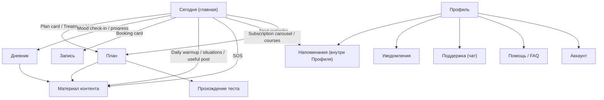

# Целевая структура пациентского приложения

**Статус:** **черновик / strawman** — общее видение, в которое последовательно будут вписываться зафиксированные решения.
**Дата старта:** 2026-05-01.
**Назначение:** единая мысленная карта, чтобы все продуктовые и технические решения по пациентскому интерфейсу принимались в одном русле, а не точечно от страницы к странице.

**Связанные документы:**
- baseline-аудит: [`STRUCTURE_AUDIT.md`](STRUCTURE_AUDIT.md)
- рекомендации и этапы работ: [`RECOMMENDATIONS_AND_ROADMAP.md`](RECOMMENDATIONS_AND_ROADMAP.md)
- редизайн «Сегодня» (архив): [`../archive/2026-05-initiatives/PATIENT_HOME_REDESIGN_INITIATIVE/README.md`](../archive/2026-05-initiatives/PATIENT_HOME_REDESIGN_INITIATIVE/README.md), [`VISUAL_SYSTEM_SPEC.md`](../archive/2026-05-initiatives/PATIENT_HOME_REDESIGN_INITIATIVE/VISUAL_SYSTEM_SPEC.md)
- контент главной (таблицы материалов / CMS): [`CONTENT_PLAN.md`](CONTENT_PLAN.md)
- стандарт реализации patient UI: [`../ARCHITECTURE/PATIENT_APP_UI_STYLE_GUIDE.md`](../ARCHITECTURE/PATIENT_APP_UI_STYLE_GUIDE.md)
- целевая структура врача: [`TARGET_STRUCTURE_DOCTOR.md`](TARGET_STRUCTURE_DOCTOR.md)

---

## 1. Что приложение даёт пациенту (продуктовая формулировка)

Приложение — это **удобный помощник** на ежедневной основе и **платформа** для:

1. Профилактики и реабилитации (разминки, привычки, контент).
2. Доступа к курсам.
3. Выполнения назначений врача (программы лечения, ЛФК, тесты).
4. Получения важных уведомлений (от клиники + по личным напоминаниям).

Эти четыре цели — критерий, по которому проверяется любая страница и любой блок: **«какой из четырёх задач это служит, и насколько прямо?»** Если ни на одну не отвечает — это лишнее.

---

## 2. Главный принцип роста интерфейса

> Главная «Сегодня» — точка входа. Всё остальное должно быть **продолжением одной из задач, начатой на главной**, а не параллельной картой меню.

Главная уже устроена так, что в ней есть «верхушка айсберга» каждого из сценариев пациента: ближайшее напоминание, разминка дня, ситуации, прогресс, чек-ин, SOS, активная программа, курсы, подписочная карусель, запись.

Внутренние страницы — это **«нырки» в эти линии**, не альтернативная навигация:

- блок `daily_warmup` → нырок в практику (`/content/[slug]?from=daily_warmup`);
- блок `plan` → нырок в активную программу;
- блок `next_reminder` → нырок в правило/настройки напоминания;
- блок `booking` → нырок в запись/визит;
- блок `sos` → нырок в материал по острому состоянию;
- блок `mood_checkin` → ведёт в дневник;
- блок `situations` / `useful_post` / `subscription_carousel` / `courses` → ведут в материал/курс.

Из этого принципа вытекает целевая модель IA: **5 вкладок, отвечающих на 5 живых вопросов пациента**.

---

## 3. Целевая верхняя навигация — 5 вкладок

| Вкладка | Вопрос пациента | Что внутри |
|---------|-----------------|------------|
| **Сегодня** | «Что мне сделать сейчас?» | Текущая главная (без изменений по сути) |
| **План** | «Что мне назначил врач? Какой следующий шаг?» | Активная программа лечения + назначенные ЛФК-комплексы + курсы (если открыт) + материалы плана |
| **Дневник** | «Как я себя чувствую и как я иду?» | Симптомы + ЛФК-журнал, отметка занятия за сегодня в фокусе |
| **Запись** | «Когда я к врачу? Как мне записаться?» | Кабинет визитов + единый wizard записи (включая онлайн-форматы) |
| **Профиль** (справа в шапке) | «Кто я и как этим пользоваться» | Аккаунт, уведомления, поддержка, помощь, установка, выход |

Эти 5 вкладок — это **5 продуктовых линий**, а не «список разделов». Дальше каждая линия растёт из главной как одна история.



---

## 4. Как растёт каждая ветка

### 4.1 «Сегодня» (главная)

**Уже сделано редизайном.** Принцип: один экран — одно главное действие («Начать разминку»). Остальное — карточки-нырки в другие линии.

Здесь же — **точки входа в скрытые сценарии**: SOS, текущее напоминание, чек-ин самочувствия. Не нужно их дублировать в меню — они приходят к пациенту сами.

### 4.2 «План» — основной артефакт назначений

Сейчас `/treatment-programs` — плоский список «название + статус». В целевой модели «План» — это **рабочее пространство выполнения назначений**, а не каталог.

> **Зафиксировано (2026-05-03):** План = строго `treatment_program_instance` (то, что назначил врач). Параллельных «активных комплексов вне программы» в новой модели нет — любое назначение проходит через программу. **Курсы** — отдельная вкладка/раздел `/courses`, **не часть Плана** (см. §4.6 и [`../COURSES_INITIATIVE/README.md`](../COURSES_INITIATIVE/README.md)). Полная нарезка реализации — [`PROGRAM_PATIENT_SHAPE_PLAN.md`](PROGRAM_PATIENT_SHAPE_PLAN.md).

```
План
├ Шапка программы (название · % прогресса · бейдж «План обновлён» при наличии)
├ Этап 0 — «Общие рекомендации»                     (всегда видим, даже после
│    persistent-рекомендации списком, без галочек     завершения программы)
├ Текущий этап (раскрыт)
│    Цель / Задачи / Ожидаемый срок                 ← из stage.goals/objectives/expected_duration
│    ────
│    Группы (аккордеоны):
│      ▼ Разминка   (3 р/нед)
│         • дыхательная разминка   [▶] [✓]
│         • растяжка плеч          [▶] [✓]
│      ▶ Силовые для кора (2 р/нед)
│      ▶ Шея (через день)
│    ────
│    Actionable-рекомендации этапа:
│      • горячая ванна вечером     [✓]
│      • самомассаж 10 мин         [✓]
│    ────
│    Тесты этапа: «Тест X — пройти»  → run-screen теста
│    [Закончить занятие] → шкала «легко/средне/тяжело» + опц. заметка
├ Прошлые этапы (свернуты, доступны для просмотра)
└ Будущие этапы (locked-вид; разлочивает врач)
```

Принципы:

- **Этап 0** — псевдо-stage с `sort_order=0`, без FSM, переживает `program.status=completed`. Туда уходят persistent-рекомендации (режим/быт/долгосрочные инструкции).
- **Группы внутри этапа** — отдельная сущность с `title`, `description`, `schedule_text` (фристайл «3 р/нед»). В UI — аккордеоны. Расписание не структурированное в первой версии (см. backlog в [`PROGRAM_PATIENT_SHAPE_PLAN.md`](PROGRAM_PATIENT_SHAPE_PLAN.md) §7 — расписание/напоминания по времени откладывается до накопления feedback).
- **Чек-лист дня** = actionable items текущего этапа (упражнения / комплексы / actionable-рекомендации) с галочками. Запись — в общий `program_action_log` через `session_id`.
- **«Сегодняшний шаг»** на Сегодня — алгоритмический (first-undone item первого `available`-этапа), без полей дедлайна на item.
- **«План обновлён N мая»** — бейдж в Сегодня, по `treatment_program_events`. Сбрасывается при открытии программы.
- **«Новое»** — бейдж на item-е, у которого `last_viewed_at IS NULL`.

**Из главной сюда ведут:** карточка `plan`, нырки внутри программы.

**Что отсюда исчезает:** отдельная страница `/diary` как «единственное место отмечать занятие» — отметки выполнения теперь в чек-листе плана. Дневник остаётся как **read-view** (графики симптомов + журнал занятий).

### 4.3 «Дневник»

Открывается **в режим действия**: «давай отметим занятие/симптом за сегодня», а не в дашборд.

```
Дневник
├ Hero — «Отметка за сегодня»
│    выбор вкладки «Симптомы | ЛФК» в зависимости от назначений
│    поля минимально необходимые (1 симптом, 1 комплекс)
│    единственный CTA «Сохранить»
├ Текущий статус
│    «Сегодня выполнено: ЛФК ✓, симптом не отмечен»
├ График симптомов (если врач назначил мониторинг)
├ Журнал занятий ЛФК
└ Архив записей
```

**Из главной сюда ведут:** `mood_checkin` (после ответа предлагает «Записать в дневник?»), карточка прогресса, запись через `next_reminder` если правило связано с дневником.

**Что отсюда исчезает:** возможность пациентского создания ЛФК-комплекса (комплексы приходят из плана). В empty-state — пояснение «назначения от врача» и ссылки на программы лечения / сообщения (**в коде с 2026-05-04**, см. [`ROADMAP_2.md`](ROADMAP_2.md) §1.2, [`LOG.md`](LOG.md)).

### 4.4 «Запись»

Объединяет нынешний `/cabinet` (мои визиты) и wizard записи в **одну линию**.

```
Запись
├ Hero — «Ближайший визит»
│    дата/время/формат, ссылки «изменить», «как добраться»
├ CTA «Записаться»
│    единый wizard (формат → город → услуга → слот → подтверждение)
│    онлайн-форматы (intake nutrition / lfk) — варианты «формата»
├ Полезное по визиту
│    «Как подготовиться» / «Стоимость» / «Адрес кабинета»
│    ведёт на отдельные материалы из CMS (kind=article), а не на /help
├ История визитов
│    объединённая лента (приёмы + intake-заявки)
└ Активные онлайн-заявки (если есть)
```

**Из главной сюда ведут:** карточка `booking`.

**Что отсюда исчезает:** отдельные `/intake/*` без AppShell, отдельная `/address` страница с iframe, отдельный пункт меню «Поддержка» (при клике «как подготовиться» уходим в материал, а не в `/help` empty stub).

### 4.5 «Профиль» (правый угол шапки)

Не вкладка в основной навигации — иконка справа, как в новом home spec. Внутри — **системные настройки и точки помощи**, сжатые до минимума:

```
Профиль
├ Аккаунт (имя, контакты, привязки, OTP, PIN)
├ Уведомления и напоминания (единая страница, см. §5)
├ Поддержка (чат с клиникой; форма обращения встроена в чат)
├ Помощь / FAQ
├ Установить как приложение (PWA-подсказки)
└ Выход (если не TG WebApp)
```

**Из главной сюда ведут:** иконка профиля справа, ссылки из чек-инов («хотите получать чек-ин в N часов?» → правило напоминания).

**Что отсюда исчезает:** отдельный аккордеон «Уведомления» (он теперь основная страница, не подраздел), `/messages` + `/support` (становятся одной «Поддержкой»), `/purchases` (скрыт до биллинга).

---

## 5. Сквозная ткань — уведомления и напоминания

В новом интерфейсе **уведомления и напоминания — одна тема**, а не два разных раздела:

- Темы рассылок от клиники (рассылки врача, новости, важное) = «что мне присылают».
- Личные правила (ЛФК, разминки, кастом) = «о чём мне напоминать».
- Каналы доставки (TG/MAX/SMS/email/push) = одно место настройки.

Целевой UX — **одна страница** в Профиле, разделённая на 3 секции в этом порядке. Никаких аккордеонов «Уведомления» с одной кнопкой «настроить» — настройка прямо в Профиле или один полноценный экран.

Связь с главной: блок `next_reminder` ведёт прямо в правило (deep-link на конкретное правило в этой странице, не на «настройки вообще»).

---

## 6. Сквозной артефакт — материал контента

Материал (`/content/[slug]`) — единственная страница, **которая остаётся самостоятельной** и не привязана к одной из 5 вкладок. Из неё можно прийти из:

- ситуации,
- разминки дня,
- этапа программы лечения,
- SOS-карточки,
- подписочной карусели,
- курса,
- библиотеки разделов (если оставим как опциональную «глубину»).

Поэтому страница материала должна:

- **знать, откуда пришёл пользователь** (`?from=daily_warmup | program | situation | sos | course | section`) и предлагать осмысленный «следующий шаг»;
- **отмечать выполнение** (если прикреплено к практике);
- **показывать связку с курсом/программой**, если есть.

«Материал» — это атом, а не страница из меню.

---

## 7. Что исчезает как отдельный пункт IA

| Сейчас | Куда уходит |
|--------|-------------|
| `/sections` («Уроки и тренировки») | Опциональная «Библиотека» внутри Плана; либо вообще убрать (главная закрывает) |
| `/sections/[slug]` | Остаётся как глубинная страница; точкой входа становится конкретный материал, не каталог |
| `/lessons`, `/emergency` | Удалить (legacy redirect) |
| `/diary/symptoms`, `/diary/lfk` | Удалить (legacy redirect) |
| `/purchases` | Скрыть до биллинга |
| `/address` | Блок в «Запись», страницы нет |
| `/help` | Подраздел «Профиля», наполнить контентом |
| `/support` | Сливается с `/messages` в «Поддержку» |
| `/install` | Подраздел «Профиля» |
| `/intake/nutrition`, `/intake/lfk` | Шаги внутри wizard «Запись», без отдельных URL в меню |

Все они продолжают существовать как deep-link маршруты при необходимости — но **никогда не как пункты основной навигации**.

---

## 8. Принципы дизайна, в которых растёт интерфейс

1. **Один экран — одна задача.** Если на странице два равноправных действия — это уже два экрана.
2. **Из главной — нырок, а не возврат к меню.** Любой блок главной должен вести прямо в место, где сценарий продолжается, не в дашборд этого сценария.
3. **Empty-state объясняет, как наполнить.** На «План» без назначений → «программа появится здесь после приёма у врача / запишитесь на консультацию».
4. **Назначения врача — первичны.** Самостоятельный пациентский ввод (создать комплекс, отметить выполнение, добавить симптом) — добавочный, спрятан за «+».
5. **Уведомления — одна ткань, не два настроечных экрана.**
6. **Материал — атом.** Все пути ведут в одну страницу `/content/[slug]`, она знает свой контекст.
7. **«Помощь» — это контент, а не пустые ссылки.** Если в `/cabinet` сказано «Как подготовиться» — это `kind=article` страница с реальным содержанием.
8. **Поддержка — один чат.** Не форма + чат + ссылка в три места.
9. **Reuse-first визуальный слой.** Новые экраны веток «План/Дневник/Запись/Профиль» собираются на shared patient primitives + shadcn/base-ui по [`../ARCHITECTURE/PATIENT_APP_UI_STYLE_GUIDE.md`](../ARCHITECTURE/PATIENT_APP_UI_STYLE_GUIDE.md), без локального одноразового chrome.

---

## 9. Текущее состояние vs целевое — короткая дельта

| Размер изменений | Что меняется |
|-------------------|--------------|
| **Сегодня** | без изменений (новый home как есть) |
| **План** | переписать `/treatment-programs` как рабочее пространство (см. §4.2 + [`PROGRAM_PATIENT_SHAPE_PLAN.md`](PROGRAM_PATIENT_SHAPE_PLAN.md)). Курсы **не абсорбируются** — остаются отдельным продуктом ([`../COURSES_INITIATIVE/README.md`](../COURSES_INITIATIVE/README.md)) |
| **Дневник** | **2026-05-04:** пациентское создание ЛФК-комплекса снято (см. [`ROADMAP_2.md`](ROADMAP_2.md) §1.2); **остаётся** смена акцента (отметка за сегодня в фокусе, read-only история) |
| **Запись** | объединить `/cabinet` + booking wizard + `/intake/*` + `/address` |
| **Профиль** | сжать до 5 подразделов; объединить уведомления и напоминания; объединить `/messages` + `/support` |
| **CMS контент пациента** | `/sections` теряет приоритетный пункт меню; `/help` наполняется реальным контентом |

Этапная разводка по работам — в [`RECOMMENDATIONS_AND_ROADMAP.md`](RECOMMENDATIONS_AND_ROADMAP.md) §IV (этапы 0/1/4/5).

---

## 10. Открытые вопросы (фиксируем для решений)

> Сюда вписываются **зафиксированные решения** по мере проработки каждой ветки. Пока — список вопросов, которые надо закрыть.

1. **«План» — отдельная вкладка или сценарий внутри «Сегодня»?**
   Аргумент за вкладку: одно постоянное место, легко вернуться. Аргумент против: дублирование с hero-блоком главной.
2. ~~**«Курсы» как подраздел Плана vs отдельная витрина?**~~
   **Закрыто (2026-05-03):** курсы — **отдельный продукт** (геткурс-модель), отдельная вкладка/раздел `/courses`, не часть Плана. См. §12.1 и [`../COURSES_INITIATIVE/README.md`](../COURSES_INITIATIVE/README.md).
3. **«Библиотека» (нынешний `/sections`) — оставить или закрыть?**
   Вопрос к продукту: насколько часто пациент ходит в библиотеку «просто почитать», без точки входа с главной.
4. **Чек-ин самочувствия — куда сохраняется?**
   В дневник симптомов? В отдельную сущность `mood_log`? Это решение влияет на структуру «Дневника».
5. **Уведомления + напоминания — одна страница или две связанных?**
   Если одна — где границы между «настройка темы рассылки» и «настройка моего правила».
6. **Поддержка — единый чат с формой обращения внутри, или чат отдельно от формы тикета?**

Решения по этим вопросам и любые другие — добавлять в этот документ как §11+ по мере фиксации.

---

## 11. Зафиксированные операционные решения (не целевая IA)

### 11.1. Режим техработ patient app (2026-05-02)

Для безопасных выкаток при параллельной переработке кабинета врача/бэкенда добавлен **переключаемый в админке** режим: для пользователей с ролью **client** под `/app/patient` отображается один экран без основого меню (текст, ссылка на внешнюю запись по умолчанию `https://dmitryberson.rubitime.ru`, список ближайших записей из интеграции). Врачи и админы при предпросмотре patient UI не попадают под этот оверлей; часть маршрутов (привязка телефона, help, support и allowlist при активации телефона) исключена.

Это **не** элемент целевой навигации из §3 и **не** заменяет этапы roadmap по пациентскому ядру — только операционный предохранитель. Полная сверка с планом и чек-листами: [`PATIENT_MAINTENANCE_MODE_EXECUTION_AUDIT.md`](done/PATIENT_MAINTENANCE_MODE_EXECUTION_AUDIT.md).

---

## 12. Зафиксированные продуктовые решения по «Плану» и «Курсам» (2026-05-03)

> Закреплено по итогам обсуждения 2026-05-02 / 2026-05-03. Полный план реализации — [`PROGRAM_PATIENT_SHAPE_PLAN.md`](PROGRAM_PATIENT_SHAPE_PLAN.md). Курсы — [`../COURSES_INITIATIVE/README.md`](../COURSES_INITIATIVE/README.md).

### 12.1. Природа сущностей

- **План лечения** = `treatment_program_instance`. Любое назначение врача создаёт его (упражнения, комплексы, тесты, наборы тестов, рекомендации, уроки). Параллельных «активных комплексов вне программы» в новой модели **нет**.
- **Курс** — отдельный продукт по геткурс-модели (уроки + unlock-rules + доступ/оплата). К плану лечения **не относится**, не использует движок программ. Снимает §9 архивного `SYSTEM_LOGIC_SCHEMA`.

### 12.2. Структура программы у пациента

- У этапа есть **`goals` / `objectives` / `expected_duration_*`** — цель, задачи, ожидаемый срок.
- Внутри этапа — **группы** (`tplStageGroups` / `instStageGroups`) с `title`, `description`, `schedule_text` (фристайл-частота). В UI — аккордеоны.
- В программе есть особый **«Этап 0 — Общие рекомендации»** (`sort_order=0`): persistent-рекомендации, без FSM, остаётся видимым после `program.status=completed`.

### 12.3. Рекомендации

- Каталог рекомендаций — типизированный (`kind`, `body_region`, `quantity`, `frequency`, `duration`).
- При добавлении в программу врач помечает item-флагом **`is_actionable`** (`true` — попадает в чек-лист с галочкой; `false` — persistent, без completion).
- В Этапе 0 — только persistent-рекомендации.

### 12.4. Тесты

- Без лимита попыток. Решение врача (`overrideResultDecision`) — gate этапа.
- История попыток — отдельный экран на карточке шага по запросу пациента.

### 12.5. Run-screen ЛФК и форма «Оценка занятия»

- Run-screen — список «что и сколько», иконка ▶ для видео по пункту, чек-боксы выполнения.
- В конце — простая форма: одна шкала «легко / средне / тяжело», опц. заметка, без отдельной шкалы боли.
- Запись — в общий **`program_action_log`** (action_type=`done`, `session_id` группирует «за один заход»).

### 12.6. Изменения программы врачом

- В инстансе врач **не удаляет** item, а **отключает** (`status=active`/`disabled`). Disabled остаётся в БД и в истории, но не учитывается в чек-листе/прогрессе.
- Замена шага = `disable старый` + `add новый` на нужный sort_order.
- Пациент видит изменения благодаря **бейджу «План обновлён N мая»** в Сегодня (по `treatment_program_events`). Бейдж сбрасывается при открытии программы.
- Новые items получают бейдж **«Новое»** (по `last_viewed_at IS NULL`).

### 12.7. Что отложено в backlog

Расписание/напоминания по времени для групп этапа, push в бот о изменениях плана, метрики compliance, cross-stage детекция бейджа «новое», галочки-логи на каждое упражнение в комплексе, сертификаты курсов и т.д. — см. [`PROGRAM_PATIENT_SHAPE_PLAN.md`](PROGRAM_PATIENT_SHAPE_PLAN.md) §7.
