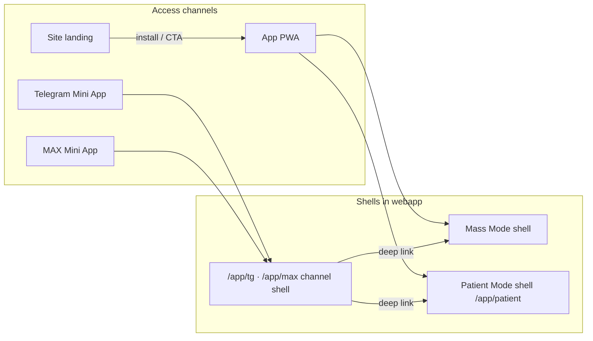

# Access-tier и product-status: разделение канонов

Нормативный документ для roadmap **Product Platform** (Mass Mode + Patient Mode). Дополняет [`PLATFORM_IDENTITY_SPECIFICATION.md`](PLATFORM_IDENTITY_SPECIFICATION.md), не заменяет его.

**Версия:** 2026-06-06 · **Статус:** канон этапа 0 (до появления кода `productStatus`).

---

## 1. Зачем два слоя

Сегодня в коде есть **access-tier** (`guest` / `onboarding` / `patient`) — техническая политика «можно ли открыть закрытый кабинет и выполнить мутацию». Продуктовый roadmap добавляет **режим приложения** (Mass vs Patient) и жизненный цикл пользователя (лид, покупатель, бывший пациент).

Если смешать оба слоя в одно поле `patient`, неизбежны:

- путаница «зарегистрирован = клинический пациент»;
- невозможность продавать курс без включения clinical shell;
- дубли бота и PWA как двух кабинетов.

**Правило:** `accessTier` отвечает на «**разрешён ли доступ к закрытой зоне и API**»; `productStatus` — на «**какой продуктовый режим и сценарии показывать**».

---

## 2. Термины (обязательные имена в коде и доках)

| Термин | Значение | Где живёт сегодня |
|--------|----------|-------------------|
| **accessTier** | `guest` \| `onboarding` \| `patient` для `dbRole === client` | `PlatformAccessContext.tier` в `modules/platform-access/types.ts`; спека §3 в [`PLATFORM_IDENTITY_SPECIFICATION.md`](PLATFORM_IDENTITY_SPECIFICATION.md) |
| **productStatus** | `guest` \| `lead` \| `customer` \| `patient` \| `archived_patient` | **Планируется** отдельно от tier; не путать с `tier=patient` |
| **productMode** | `mass` \| `patient` — итог для shell, nav, home | Вычисляется resolver'ом из `productStatus` + активных программ/сопровождения |
| **accessChannel** | `app` \| `telegram` \| `max` \| `site` — как пользователь пришёл | Cookie `bersoncare_platform`, `bersoncare_messenger_surface`; entry `/app/tg`, `/app/max` — см. [`platform.md`](../../apps/webapp/src/shared/lib/platform.md) |
| **channel shell** | Тонкая оболочка Mini App: cookies, compact chrome, auth bootstrap, deep link | **Не** отдельный кабинет; бизнес-экраны — в app |
| **Patient Mode shell** | Текущий guarded `/app/patient/**` после декомпозиции layout | Клинический кабинет: программа, чат, статистика, запись |
| **Mass Mode shell** | Публичная/массовая ветка до guarded patient shell | SOS, разминки, публичные программы, профиль-лид |

### Запрещённые формулировки

- «Пользователь в tier patient» = «продуктовый пациент» — **неверно** (tier patient = активация email/телефона для закрытого PWA).
- «Telegram-кабинет» / «бот-приложение» — **неверно**; канал = доставка + thin actions + deep links.
- Использовать слово **patient** в UX Mass Mode для клинического сопровождения — см. правило «программа реабилитации» в patient-lfk-means-rehab-program.

---

## 3. Access-tier (без изменений семантики)

Канон — [`PLATFORM_IDENTITY_SPECIFICATION.md`](PLATFORM_IDENTITY_SPECIFICATION.md) §3–§5.

Кратко:

| accessTier | Смысл |
|------------|--------|
| **guest** | Нет сессии |
| **onboarding** | Канон есть, нет активации patient (доверенный телефон **или** verified email) |
| **patient** | Канон + активация → закрытый PWA; **запись на приём** дополнительно требует доверенный телефон |

**accessTier не определяет** Mass vs Patient Mode и **не заменяет** product-status.

---

## 4. Product-status (целевая модель)

| productStatus | Кто это в продукте | Типичные источники (черновик) |
|---------------|-------------------|-------------------------------|
| **guest** | Аноним или без привязанного канона | Нет сессии; сессия без стабильного канона |
| **lead** | Оставил контакт, прошёл тест/старт, привязал бот | Channel binding, 3-day start, quiz, messenger bind **без** покупки и **без** clinical patient |
| **customer** | Купил курс/подписку/доступ к библиотеке | Оплата, активная подписка, grant access rule |
| **patient** | Активное клиническое сопровождение | `doctor_patient_support.on_support = true` **или** активная персональная doctor-программа (`treatment_program_instances` в статусе active по правилам resolver) |
| **archived_patient** | Был пациентом, сопровождение снято | `on_support = false`, нет активной personal program; история сохраняется |

### Инварианты (продуктовые)

1. **Бот-привязка максимум `lead`** — сама по себе не переводит в product `patient`.
2. **product `patient` включают** специалист/админ (сопровождение) **или** активная персональная doctor-программа — не сам факт регистрации.
3. **customer** может иметь `accessTier=patient` (закрытый PWA) и при этом оставаться в **Mass Mode** (без clinical nav).
4. **archived_patient** → Mass Mode + блок «была программа» / read-only история; не откатывать в guest.

### productMode resolver (черновик матрицы)

| productStatus | Активная personal doctor-program / on_support | productMode |
|---------------|-----------------------------------------------|-------------|
| guest, lead, customer | нет | **mass** |
| archived_patient | нет | **mass** (+ heritage UI) |
| patient | да | **patient** |
| patient | нет (рассинхрон — ops) | **mass** + алерт; backfill обязателен |

Финальная матрица и приоритеты источников — в этапе 3 roadmap; unit-тесты на resolver обязательны до UI-переключения nav.

---

## 5. Каналы доступа



**Канон:**

- `/app/tg` и `/app/max` — **entry + channel shell** ([`AppEntryRsc.tsx`](../../apps/webapp/src/app/app/AppEntryRsc.tsx), [`platform.md`](../../apps/webapp/src/shared/lib/platform.md)).
- После auth bootstrap пользователь попадает в **тот же** Mass или Patient shell, что и из PWA — по `productMode`, не по каналу.
- Бот: уведомления, короткие карточки записи, mute topic, deep links — **не** полный дневник/каталог/статистика.

---

## 6. Связь с существующим кодом

| Область | Сегодня | После roadmap |
|---------|---------|---------------|
| `patient/layout.tsx` | Редирект без сессии на login; `patientClientBusinessGate` | Остаётся **границей Patient Mode**; guest/mass **не** проходит через этот layout |
| `platform-access` | tier + API/page policy | **Не** добавлять productStatus в tier; отдельный модуль/resolver |
| `navigation.ts` | Один набор Patient nav | Два конфига: Patient Mode vs Mass Mode |
| Booking hub | `/app/patient/booking/**` | Единый хаб; mass — контекстный CTA; patient — вкладка «Запись» |
| `doctor_patient_support` | Кабинет врача | Источник product `patient` / снятие → `archived_patient` |

---

## 7. Что не входит в этот документ

- Схема БД и миграции `product_status` — этап 3.
- Access rules для курсов (`free`, `subscription`, …) — этап 8.
- Оплата и подписки — этап 9.
- Детальная IA Mass home — этап 4.

---

## 8. Проверки канона (этап 0)

```bash
rg "productStatus|product_status|productMode|archived_patient" docs apps/webapp/src/modules/platform-access
rg "tier.*patient" apps/webapp/src/modules/platform-access --glob "*.ts"
```

Ожидание на этапе 0: документ есть; в `platform-access` **нет** смешения product-status с tier.

---

## 9. Ссылки

- Инициатива: [`../PRODUCT_PLATFORM_INITIATIVE/README.md`](../PRODUCT_PLATFORM_INITIATIVE/README.md)
- План: [`.cursor/plans/archive/product-platform-roadmap_e6f81831.plan.md`](../../.cursor/plans/archive/product-platform-roadmap_e6f81831.plan.md)
- Identity tier: [`PLATFORM_IDENTITY_SPECIFICATION.md`](PLATFORM_IDENTITY_SPECIFICATION.md)
- Сценарии и код: [`PLATFORM_IDENTITY_SCENARIOS_AND_CODE_MAP.md`](PLATFORM_IDENTITY_SCENARIOS_AND_CODE_MAP.md)
