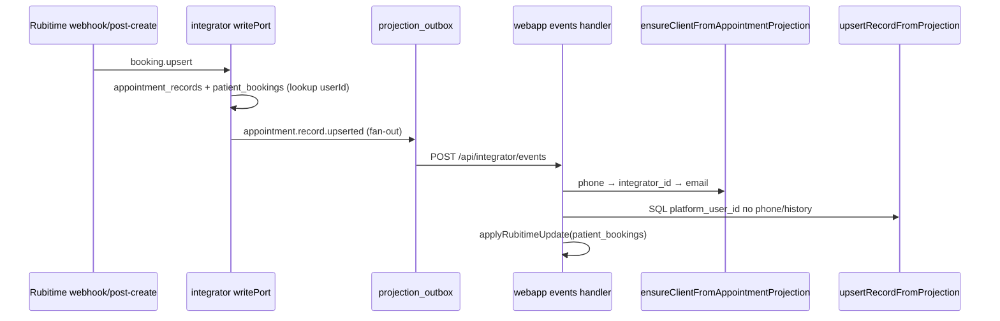

# Аудит PHASE_01 — Rubitime → `platform_user`

**Документ фазы:** `docs/LOGIN_REGISTER_NEW_LOGIC/PHASE_01_RUBITIME_PLATFORM_USER.md`  
**Заявленный статус:** `completed` (2026-05-19)  
**Вердикт:** **фаза по live-path в целом закрыта** — ключевой разрыв из PHASE_00 (нет `appointment.record.upserted` после `booking.upsert`) устранён, логика find/create/link в webapp соответствует MAIN PLAN §1 и SCOPE_DECISIONS. Есть **пробелы в тестах**, **косвенная** запись `appointment_records.platform_user_id` и **устаревшие** соседние документы.

---

## 1. Контекст: что было до фазы

По [`AUDIT_REPORT.md`](docs/LOGIN_REGISTER_NEW_LOGIC/AUDIT_REPORT.md) (PHASE_00):

- Rubitime → `booking.upsert` **не** порождал `appointment.record.upserted` → webapp **не** вызывал `ensureClientFromAppointmentProjection`.
- `ensureAppointmentClientTx` **перезаписывал** ФИО существующего пользователя.
- Не было поиска по email, trusted phone, fan-out в outbox.

PHASE_01 нацелен именно на это; backfill, email setup, AuthFlow — вне scope.

---

## 2. Definition of Done — по пунктам

| Критерий (PHASE_01) | Статус | Доказательство |
|---------------------|--------|----------------|
| Новый phone → `platform_user` + привязка appointment | **Выполнено** | `ensureAppointmentClientTx`: INSERT с `patient_phone_trust_at` при phone; integrator fan-out → webapp `appointment.record.upserted` → `ensureClient` + `upsertRecordFromProjection` |
| phone+email → user, email unverified, phone trusted | **Выполнено** | INSERT: `email` + `email_normalized`, без `email_verified_at`; trust через `patient_phone_trust_at`; тест `creates client with trusted phone and unverified email` |
| Существующий phone → appointment к user, имя **не** перезаписано | **Выполнено** | UPDATE **без** `display_name` / `first_name` / `last_name` (комментарий и SQL); тест `does not overwrite display_name` |
| existing email user → appointment + trusted phone | **Выполнено** | Поиск email только если phone/integrator не нашли; UPDATE: `phone_normalized = COALESCE(...)`, `patient_phone_trust_at`; тест `finds user by email when phone misses` |
| bot/phone user + Rubitime → без дубля | **Частично** | В `ensureAppointmentClientTx` есть поиск по `integrator_user_id` (2-й шаг после phone). Явного unit-теста «бот + Rubitime» **нет**; в `events.test.ts` есть fallback `findByIntegratorId` для `patient_bookings`, но **без** `ensureClient` |
| Тесты MAIN PLAN §11 (Rubitime) | **Частично** | 3 сценария в `pgUserProjection.ensureAppointmentClient.test.ts` + integrator fan-out + `events.test.ts`; **нет** отдельного теста «только phone» и «bot user» |
| Запись в `LOG.md` | **Выполнено** | Секция `2026-05-19 — PHASE_01` |

**Локальные проверки из фазы:** integrator/webapp тесты по затронутым файлам — **прогнаны сейчас, зелёные** (8 + 3 теста).

---

## 3. Реализованные изменения (цепочка)

### 3.1 Integrator

- `buildAppointmentRecordUpsertedFanout` — сбор payload (`patientEmail`, `integratorUserId`, ФИО, manage URL).
- `writePort.ts` после каждого `booking.upsert` вызывает `fanoutProjectionsAfterTx([buildAppointmentRecordUpsertedFanout(...)])`.
- Тесты: `buildAppointmentRecordUpsertedFanout.test.ts`, `writePort.appointments.test.ts` (outbox `APPOINTMENT_RECORD_UPSERTED`).

### 3.2 Webapp — identity

`ensureAppointmentClientTx` (`pgUserProjection.ts`):

1. **phone** → 2. **integrator_user_id** → 3. **email** (только если кандидатов ещё нет).
2. **Новый user:** display name из Rubitime, `role=client`, `patient_phone_trust_at=now()`, email contact без верификации.
3. **Существующий:** обогащение email/phone/trust; **без** смены ФИО.

Прод-проводка: `buildAppDeps` → `events/route.ts` → `handleIntegratorEvent` → `ensureClientFromAppointmentProjection` при наличии phone.

### 3.3 Webapp — appointment + UI врача

- `upsertRecordFromProjection` проставляет `platform_user_id` **подзапросом** по `user_phone_history` / единственному `platform_users.phone_normalized` (не из `ensuredPlatformUserId` напрямую).
- `pgDoctorClients` + UI: подпись «В Rubitime: …» при расхождении имён (`appointments/page.tsx`, `DoctorTodayDashboard.tsx`).

### 3.4 Документация pipeline

`RUBITIME_BOOKING_PIPELINE.md` обновлён: post-create путь с fan-out `appointment.record.upserted` (стр. 41–42).

---

## 4. Сверка с правилами фазы

| Правило | Оценка |
|---------|--------|
| Телефон обязателен, без phone не проектируем | **Соблюдено** в hot path: `ensureClient` только при `phoneNormalized` |
| Поиск: phone → email | **Соблюдено** (+ integrator_id между ними — расширение, autobind/бот не ломает) |
| Имя существующего не затирать | **Соблюдено** в `ensureAppointmentClientTx` |
| Rubitime name в payload/UI | **Соблюдено** (payload + «В Rubitime») |
| Новый user: имя из Rubitime, phone trusted, email unverified | **Соблюдено** |
| Autobind не ломать | **Соблюдено** — `applyRubitimeEmailAutobind` отдельный путь; тесты в `patchAdminClientProfile.test.ts` / `events.test.ts` |

**Вне scope (корректно не тронуто):** setup tokens (PHASE_03–04), AuthFlow (PHASE_05), backfill (PHASE_07) — в `LOG.md` явно «не делали».

---

## 5. Тесты vs MAIN PLAN §11 (Rubitime)

| Сценарий §11 | Покрытие |
|--------------|----------|
| new phone → `platform_user` | **Логика есть**, отдельного теста «только phone без email» **нет** (ближайший — phone+email) |
| phone+email, trusted + unverified | **`ensureAppointmentClient.test.ts`** |
| existing phone, name preserved | **тот же файл** |
| existing email + trusted phone | **тот же файл** |
| bot/phone + Rubitime attach | **Нет** целевого теста на `ensureClient` + `integrator_user_id`; есть **другой** тест fallback без `ensureClient` |

**Integrator/events:** нормализация phone, merge-conflict, branch/FIO, `applyRubitimeUpdate` — покрыты в `events.test.ts`, но **не** end-to-end связка «fan-out → ensure → `appointment_records.platform_user_id`».

---

## 6. Риски и архитектурные нюансы

### 6.1 `appointment_records.platform_user_id` — косвенная привязка

`ensuredPlatformUserId` используется для `patient_bookings` (`applyRubitimeUpdate`), но **не передаётся** в `upsertRecordFromProjection`. Колонка выставляется SQL по телефону **после** `ensureClient`.

**Обычно OK:** ensure в той же обработке события сначала пишет/обновляет `phone_normalized`, затем upsert appointment по тому же нормализованному phone.

**Риски:**

- merge-conflict на ensure → `platform_user_id` может остаться NULL, хотя врач всё ещё видит клиента по phone join (`pgDoctorClients`).
- рассинхрон нормализации phone между шагами (маловероятно — один `normalizeRuPhoneE164` в handler).
- запись **без** phone в событии → ensure не вызывается (по дизайну волны 1).

### 6.2 Integrator `patient_bookings.userId` на первом проходе

В tx `booking.upsert` по-прежнему `resolvePlatformUserIdForRubitimeBooking` — **только lookup**, нового user там не создаёт. Для **нового** phone `userId` в compat-строке может быть NULL до обработки webapp; затем `applyRubitimeUpdate` может обновить. Для PHASE_01 (карточка врача) критичнее projection + doctor join, не patient_bookings.

### 6.3 Другой кодовый путь всё ещё затирает имя

`upsertFromProjectionTx` (мессенджер / `user.upsert`, не Rubitime appointment) **по-прежнему** обновляет `display_name` / first / last у существующего user. Это **не регрессия PHASE_01**, но расходится с духом MAIN PLAN §1 вне Rubitime-path.

### 6.4 Устаревшие документы

| Файл | Проблема |
|------|----------|
| `AUDIT_REPORT.md` | Шапка: «реализация **не начата**» — **не соответствует** PHASE_01 |
| `apps/webapp/scripts/PLATFORM_IDENTITY_OPS.md` | Утверждение, что `ensureClient` **не** ставит `patient_phone_trust_at` — **неверно** после PHASE_01 |

### 6.5 Ops / исторические данные

Старые записи без fan-out / без `platform_user_id` — **вне scope** (PHASE_07). Скрипт `resync-rubitime-records` и фильтр `platform_user_id` в `last_error` — для починки outbox, не замена backfill.

---

## 7. Scope boundaries

| В scope PHASE_01 | Статус |
|------------------|--------|
| integrator/webapp Rubitime handlers | **Сделано** |
| find/create/link `platform_user` | **Сделано** |
| `appointment_records.platform_user_id` на live-path | **Сделано** (через webapp projection после ensure) |
| trusted phone при match по email | **Сделано** |

| Вне scope | Подтверждение |
|-----------|---------------|
| Email setup tokens | Не в этом diff |
| AuthFlow register/forgot | Не в этом diff |
| Backfill истории | Отложено в SCOPE_DECISIONS / PHASE_07 |

---

## 8. Итоговая оценка

| Измерение | Оценка |
|-----------|--------|
| Продуктовая цель фазы (врач видит пациента после Rubitime live) | **Достигнута** при доставке outbox и наличии phone |
| Соответствие MAIN PLAN §1 / SCOPE_DECISIONS | **Высокое** |
| Definition of Done в документе фазы | **5/6 полностью**, **1/6 частично** (тест bot + полнота §11) |
| Готовность к PHASE_02 | **Да** — identity live-path не блокирует contact-email policy |

**Рекомендации (не блокеры закрытия фазы):**

1. Добавить 2 unit-теста: «только phone, без email» и «match по `integrator_user_id` (бот), без дубля INSERT».
2. Контрактный/интеграционный тест: после `ensureClient` mock — `upsertRecordFromProjection` получает ненулевой `platform_user_id` при единственном владельце phone.
3. Обновить шапку `AUDIT_REPORT.md` и строку в `PLATFORM_IDENTITY_OPS.md` про `patient_phone_trust_at`.
4. Опционально: передавать `platformUserId` в `upsertRecordFromProjection` явно (убрать косвенность) — отдельное решение, не требование PHASE_01.

---

**ИТОГ:** PHASE_01 **можно считать выполненной** для live-flow: fan-out после `booking.upsert`, исправленный `ensureClientFromAppointmentProjection`, правила phone/email/trust/имени соблюдены, журнал и pipeline-doc обновлены. Для «аудиторской строгости» остаются **дыры в тестах** (bot, phone-only), **косвенная** запись `platform_user_id` и **устаревший** AUDIT_REPORT — на прод-поведение live-записей это не должно влиять при рабочем poller/outbox.