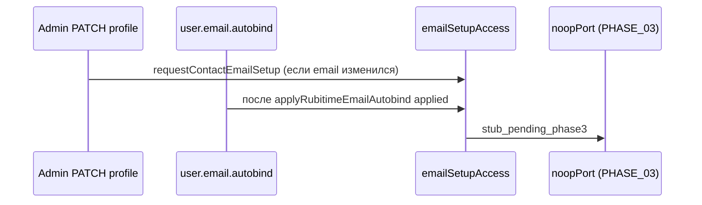

# Аудит PHASE_02 — Contact email (Rubitime / врач)

**Документ фазы:** [`PHASE_02_CONTACT_EMAIL_POLICY.md`](PHASE_02_CONTACT_EMAIL_POLICY.md)  
**Канон:** [MAIN PLAN.md](MAIN%20PLAN.md) §2  
**Заявленный статус:** `completed` (2026-05-19)  
**Вердикт:** **фаза закрыта по политике contact email и хукам enqueue** — сброс верификации, отсутствие auto-password, порт `emailSetupAccess` + noop до PHASE_03, тесты и LOG на месте. **Отправка письма и токены — сознательно не в этой фазе** (PHASE_03 `pending`). Есть **пробел по триггеру setup** для email, пришедшего только через `appointment.record.upserted` (без `user.email.autobind`).

---

## 1. Цель фазы и границы

| | |
|--|--|
| **Цель** | Email от Rubitime/врача = contact / unverified; без auto `user_password_credentials`; при появлении/смене — **вызов** сервиса выпуска setup link (реальная отправка — PHASE_03). |
| **В scope** | Политика `email_verified_at`; хуки после `patchAdminClientProfile` и Rubitime autobind; документирование forgot для contact-only. |
| **Вне scope** | `/app/auth/email-setup` (PHASE_04); матрица register (PHASE_05); таблица токенов и письмо (PHASE_03). |

---

## 2. Definition of Done — по пунктам

| Критерий (PHASE_02) | Статус | Доказательство |
|---------------------|--------|----------------|
| Смена email врачом → `email_verified_at = null` при новом адресе | **Выполнено** | `patchAdminClientProfile`: SQL `email_verified_at = CASE … IS DISTINCT FROM … THEN NULL`; тест `clears email_verified_at when doctor sets a new email` |
| Сохранение при том же email не сбрасывает verified | **Выполнено** | `ELSE email_verified_at`; тест `preserves email_verified_at when email value is unchanged` |
| Rubitime email — unverified contact | **Выполнено** | `applyRubitimeEmailAutobind`: `email_verified_at = NULL`; skip если уже verified; `ensureAppointmentClientTx` сбрасывает verified при **новом** email (PHASE_01 path) |
| Нет автосоздания `user_password_credentials` | **Выполнено** | В `pgUserProjection` по путям admin/autobind/ensure **нет** INSERT в `user_password_credentials`; тесты явно `expect(…user_password_credentials…).toBe(false)` |
| Вызов `requestContactEmailSetup` из doctor patch + Rubitime autobind | **Выполнено (stub)** | `route.ts` (doctor, при смене email); `events.ts` (`user.email.autobind`, `outcome: applied`); DI: `createNoopEmailSetupAccessPort()` → `stub_pending_phase3` |
| Unit/integration: не verify, не password row | **Выполнено** | `pgUserProjection.patchAdminClientProfile.test.ts`, `profile/route.test.ts`, `emailSetupAccess/service.test.ts`, `events.test.ts` (autobind + setup) |
| Запись в `LOG.md` | **Выполнено** | Секция `2026-05-19 — PHASE_02 Contact email policy` |

**Локальные проверки (прогон 2026-05-19, аудит):**

```text
pnpm --filter @bersoncare/webapp exec vitest run \
  emailSetupAccess/service.test.ts \
  pgUserProjection.patchAdminClientProfile.test.ts \
  profile/route.test.ts
→ 3 files, 10 tests passed
```

---

## 3. Реализованные компоненты

### 3.1 Политика в репозитории (`pgUserProjection.ts`)

| Путь | Поведение contact email |
|------|-------------------------|
| `patchAdminClientProfile` | Новый/изменённый email → `email_normalized` + сброс `email_verified_at`; очистка email → NULL verified |
| `applyRubitimeEmailAutobind` | Только user по `phone_normalized`; не трогает уже verified; conflict → skip; apply → `email_verified_at = NULL` |
| `ensureAppointmentClientTx` | При отличии email от текущего → `email_verified_at = NULL` (дополнение PHASE_01, без enqueue setup) |

### 3.2 Модуль `emailSetupAccess`

```text
ports.ts          — EmailSetupAccessSource, RequestContactEmailSetupParams/Result
service.ts        — normalizeEmail + валидация перед port
noopPort.ts       — stub_pending_phase3 до PHASE_03
buildAppDeps.ts   — createEmailSetupAccessService(createNoopEmailSetupAccessPort())
```

Прод: вызовы **fire-and-forget** (`void …catch(() => undefined)`), не блокируют HTTP/integrator event ack.

### 3.3 Хуки enqueue (интерфейс)



| Источник | Условие вызова | `source` |
|----------|----------------|----------|
| `PATCH /api/admin/users/:userId/profile` | Новый email ≠ прежний (после успешного patch) | `doctor_profile` |
| `handleIntegratorEvent` → `user.email.autobind` | `outcome === "applied"` | `rubitime` |

**Не вызывается:** `appointment.record.upserted` / `ensureClientFromAppointmentProjection` при email в projection payload (см. §6).

### 3.4 Forgot (документирование до PHASE_05)

`apps/webapp/src/app/api/auth/email-password/forgot/route.ts`:

- JSDoc: contact-only **не** получает reset; нужны `email_verified_at` + `user_password_credentials` через `findVerifiedUserIdWithPassword`.
- Поведение: при отсутствии verified+password → neutral 200, `startEmailChallenge` не вызывается.
- Тест `forgot/route.test.ts`: missing user vs verified user — одинаковая форма ответа (без утечки).

### 3.5 UI врача/админа

`AdminClientProfileEditPanel.tsx`:

- PATCH на `/api/admin/users/.../profile`.
- Подсказка: «Был подтверждён; при смене адреса подтверждение сбрасывается» / «Не подтверждён» — согласовано с политикой PHASE_02.

Якорь из фазы покрыт (логика в API + panel, не дублируется в panel).

---

## 4. Сверка с MAIN PLAN §2

| Требование §2 | PHASE_02 | Комментарий |
|---------------|----------|-------------|
| 1. Сохранить `email_normalized` | **Да** | admin / autobind / ensure |
| 2. `email_verified_at = null` если пациент не подтверждал | **Да** | при смене адреса |
| 3. Не создавать `user_password_credentials` | **Да** | |
| 4. Отправить setup link | **Интерфейс only** | noop stub; письмо — PHASE_03 |
| 5. TTL 24h, одноразовость | **Вне фазы** | PHASE_03 |
| Врач меняет email → unverified + новая ссылка | **Enqueue stub** | реальная ссылка — PHASE_03 |
| Forgot не шлёт reset на unverified doctor/Rubitime email | **Да (код + комментарий)** | PHASE_05 может расширить UX register/setup |

---

## 5. Rubitime: два пути email

| Путь | Когда | Contact policy | `requestContactEmailSetup` |
|------|-------|----------------|----------------------------|
| **`user.email.autobind`** | Integrator: только `event-create-record` + phone + email (`buildUserEmailAutobindWebappEvent`) | `applyRubitimeEmailAutobind` | **Да** при `applied` |
| **`appointment.record.upserted`** | После каждого `booking.upsert` (PHASE_01 fan-out) | `ensureAppointmentClientTx` (email в payload) | **Да** при `contactEmailSetup` (новый/изменённый email) — **2026-05-20 hardening** |

**Следствие (до 2026-05-20):** запись Rubitime **updated** с новым email (без create-record autobind) сохраняла contact email через projection, но **не ставила** setup в очередь. **Hardening 2026-05-20:** при новом/изменённом email `ensureClientFromAppointmentProjection` возвращает `contactEmailSetup` → enqueue в `events.ts`.

---

## 6. Тестовое покрытие

| Область | Файл | Сценарии |
|---------|------|----------|
| SQL policy admin | `pgUserProjection.patchAdminClientProfile.test.ts` | new email clears verified; unchanged preserves; autobind unverified, no password |
| Admin API | `profile/route.test.ts` | enqueue on change; no enqueue if same; 409 email conflict |
| Setup service | `emailSetupAccess/service.test.ts` | invalid email; normalize + delegate |
| Integrator events | `events.test.ts` | autobind → apply + `requestContactEmailSetup` |
| Forgot | `forgot/route.test.ts` | neutral response (косвенно contact-only) |

**Пробелы (не блокеры закрытия PHASE_02):**

- Нет теста: `appointment.record.upserted` с новым email в projection **не** вызывает setup (зафиксировать как known gap или добавить хук в PHASE_03).
- Нет интеграционного теста «forgot + contact-only user в БД» (только mock `findVerifiedUserIdWithPassword`).

---

## 7. Зависимость PHASE_03

| PHASE_02 сдал | PHASE_03 должен |
|---------------|-----------------|
| `EmailSetupAccessPort` + sources enum | Drizzle `user_email_setup_tokens`, hash, revoke, TTL 24h |
| noop → `stub_pending_phase3` | Реальный port: `status: "enqueued"` + send-email link |
| Триггеры doctor + rubitime autobind | Подключить тот же port; **рассмотреть** триггер на appointment projection |

Статус PHASE_03 в репозитории: **`pending`** — ожидаемо.

---

## 8. Scope boundaries

| Вне scope PHASE_02 | Подтверждение |
|--------------------|---------------|
| Страница email-setup | Нет route/UI consume token |
| Register `existing_account_needs_email_setup` | PHASE_05 |
| Реальное письмо / OTP link | noop only |

| Сознательно не делали (LOG) | |
|-----------------------------|--|
| Таблица `user_email_setup_tokens` | |
| Отправка письма | |

---

## 9. Риски и нюансы

1. **Stub в проде:** пациент после смены email врачом **не получит письмо**, пока не закрыт PHASE_03 — ожидаемо; продукт должен это понимать.
2. **Только autobind на create-record:** webhook `updated` с email не дублирует autobind (см. §5).
3. **`applyRubitimeEmailAutobind` и verified email:** при уже подтверждённом email Rubitime-адрес **не перезаписывается** (`skipped_verified`) — корректно для contact policy, но может удивить ops.
4. **Async enqueue без await:** сбой port логируется через `enqueueContactEmailSetup.ts` (`[emailSetupAccess:enqueue_failed|enqueue_error]`) — **2026-05-20**; HTTP/event ack по-прежнему не блокируется.

---

## 10. Документация

| Документ | Актуальность |
|----------|--------------|
| `LOG.md` PHASE_02 | **Актуален** |
| `PHASE_02_CONTACT_EMAIL_POLICY.md` | DoD `[x]` согласован с кодом |
| `INTEGRATOR_CONTRACT.md` § `user.email.autobind` | Описывает unverified/conflict; **не** упоминает `emailSetupAccess` (можно дополнить в PHASE_03) |
| `AUDIT_REPORT.md` (PHASE_00) | По-прежнему «реализация не начата» — **устарел** относительно фаз 1–2 |

---

## 11. Рекомендации

1. **PHASE_03:** заменить `noopPort` на реализацию с миграцией; в DoD PHASE_03 явно включить подключение существующих хуков из PHASE_02.
2. **PHASE_03 или follow-up:** вызов `requestContactEmailSetup` при **изменении** email в `appointment.record.upserted` (сравнение до/после patch), если продукт хочет письмо на все Rubitime updates, не только create-record.
3. Добавить contract-тест: ensure + новый email в projection → setup called — **есть** `events.test.ts` «enqueues setup when ensure returns contactEmailSetup» (2026-05-20).
4. ~~Обновить шапку `AUDIT_REPORT.md`~~ — **§12** (2026-05-20).

---

## ИТОГ

**PHASE_02 можно считать выполненной:** contact/unverified политика зафиксирована в данных (admin, Rubitime autobind, ensure), пароль не создаётся автоматически, forgot для contact-only документирован и опирается на `findVerifiedUserIdWithPassword`, интерфейс выпуска setup link подключён с noop до PHASE_03, тесты и LOG на месте.

**Не входит в закрытие фазы (by design на 2026-05-19):** реальные токены и письма до PHASE_03.

**Follow-up 2026-05-20:** gap projection enqueue **закрыт**; enqueue failures **логируются**. См. [`LOG.md`](LOG.md).
