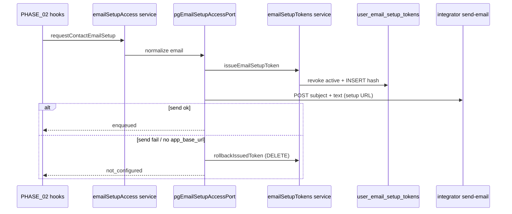

# Аудит PHASE_03 — Email setup tokens + письмо

**Документ фазы:** [`PHASE_03_EMAIL_SETUP_TOKENS.md`](PHASE_03_EMAIL_SETUP_TOKENS.md)  
**Канон:** [MAIN PLAN.md](MAIN%20PLAN.md) §9, §2 (отправка ссылки)  
**Заявленный статус:** `completed` (2026-05-19)  
**Вердикт:** **фаза по коду закрыта** — таблица и модуль токенов, hash + TTL 24h, revoke, письмо через integrator `send-email` с `text`/`subject`, подключение хуков PHASE_02, тесты зелёные. **Риск деплоя:** файл миграции `0076_user_email_setup_tokens.sql` есть, но **нет записи в** `db/drizzle-migrations/meta/_journal.json` — на чистой БД `drizzle-kit migrate` может **не применить** 0076 без ручного шага. **UI consume/resend** — PHASE_04 (`pending`).

---

## 1. Цель фазы и границы

| | |
|--|--|
| **Цель** | Одноразовые setup-токены (TTL 24h, hash в БД) + отправка письма со ссылкой `{origin}/app/auth/email-setup?token=…`. |
| **В scope** | Drizzle + migration; create / validate / consume / revoke; integrator send-email (link, не OTP); триггеры PHASE_02. |
| **Вне scope** | Страница `/app/auth/email-setup`, submit → credentials + session (PHASE_04); register lookup (PHASE_05). |

---

## 2. Definition of Done — по пунктам

| Критерий (PHASE_03) | Статус | Доказательство |
|---------------------|--------|----------------|
| Миграция + schema в `apps/webapp/db/schema` | **Частично** | `0076_user_email_setup_tokens.sql`, `userEmailSetupTokens.ts`, экспорт в `schema/index.ts`, `drizzle.config.ts`; **journal без 0076** (см. §7) |
| Revoke предыдущих active для user+email | **Выполнено** | `revokeActiveForUserEmail` перед `insertToken`; тест `issues token with 24h TTL and revokes previous` |
| TTL 24h | **Выполнено** | `EMAIL_SETUP_TOKEN_TTL_MS`; `expires_at` при issue; validate + `markUsedById` с `expires_at >= now()` |
| Письмо через integrator `send-email` (link, не только code) | **Выполнено** | `sendEmailRoute.ts`: `code` **или** `text`; `pgEmailSetupAccessPort` → `sendEmailSetupLinkViaIntegrator`; тест integrator `transactional text body without code` |
| Тесты: create, revoke, expired, used, hash not plain | **Выполнено** | `service.test.ts`, `tokenCrypto.test.ts`, `pgEmailSetupAccessPort.test.ts`; отдельного теста **revoked** на validate — нет (покрыто косвенно в issue) |
| Запись в `LOG.md` | **Выполнено** | Секция `2026-05-19 — PHASE_03` |

**Локальные проверки (аудит 2026-05-19):**

```text
pnpm --filter @bersoncare/webapp exec drizzle-kit check  → ok
pnpm --filter @bersoncare/webapp exec vitest run emailSetupTokens pgEmailSetupAccessPort emailSetupAccess/service
  → 4 files, 10 tests passed
pnpm --filter @bersoncare/integrator exec vitest run sendEmailRoute.test.ts
  → 5 tests passed
```

---

## 3. Схема БД vs MAIN PLAN §9

| Поле MAIN PLAN | Реализация |
|----------------|------------|
| `id` uuid | `id` PK `defaultRandom()` |
| `user_id` | `userId` FK → `platform_users`, ON DELETE CASCADE |
| `email_normalized` | `emailNormalized` text NOT NULL |
| `token_hash` | `tokenHash` UNIQUE |
| `expires_at` | `expiresAt` timestamptz |
| `used_at` / `revoked_at` | nullable timestamps |
| `created_at` | `createdAt` default now |
| `source` enum | CHECK: rubitime, doctor_profile, manual_resend, registration_claim |
| `created_by_user_id` | nullable FK SET NULL |

Plain token **не** хранится в БД — только `hashEmailSetupToken(plain)` (SHA-256 + pepper из `integratorWebhookSecret`).

---

## 4. Архитектура модулей



| Слой | Файлы | Назначение |
|------|-------|------------|
| Domain | `modules/auth/emailSetupTokens/service.ts` | issue, validate, consume, rollback |
| Domain | `modules/auth/emailSetupTokens/tokenCrypto.ts` | `est_*` plain, hash, format check |
| Port | `modules/auth/emailSetupTokens/ports.ts` | `EmailSetupTokensPort` |
| Infra | `infra/repos/pgEmailSetupTokens.ts` | SQL port |
| Infra | `infra/repos/pgEmailSetupAccessPort.ts` | issue + mail + rollback |
| Facade | `modules/auth/emailSetupAccess/service.ts` | email normalize/validate |
| DI | `buildAppDeps.ts` | PG port если `!inMemoryRepos`, иначе noop |
| Integrator | `sendEmailRoute.ts` | `text` без обязательного `code` |
| Purge | `platformUserFullPurge.ts` | удаление токенов по `user_id` |

**ESLint / слои:** `user_email_setup_tokens` используется только из `infra/repos/*`; `modules/auth/emailSetupTokens` не импортирует `@/infra/repos/*` — соответствует phase checklist.

---

## 5. Подключение триггеров PHASE_02

| Триггер | Условие | Результат (prod DB) |
|---------|---------|---------------------|
| `PATCH /api/admin/users/:userId/profile` | email изменился | `requestContactEmailSetup` → `enqueued` |
| `user.email.autobind` | `outcome === "applied"` | то же, `source: rubitime` |

**По-прежнему без setup enqueue (до 2026-05-20):** email только из `appointment.record.upserted` / `ensureClient` — **закрыто hardening:** `contactEmailSetup` + enqueue в handler.

**In-memory / тесты без PG:** `createNoopEmailSetupAccessPort()` → `stub_pending_phase3` — корректно для `inMemoryRepos`.

---

## 6. Integrator `send-email`

| Требование | Статус |
|------------|--------|
| Расширить контракт: `subject` + `text` без OTP | **Да** — Zod `code` OR `text`; дефолт subject для OTP сохранён |
| Webapp adapter | `sendTransactionalEmail` / `sendEmailSetupLinkViaIntegrator` |
| Документация | `INTEGRATOR_CONTRACT.md` Flow 5 — пример setup-link JSON |

Письмо: тема «Подтвердите email и создайте доступ к кабинету BersonCare», текст со ссылкой; `app_base_url` из `getAppBaseUrl()` (system_settings).

---

## 7. Риски и пробелы

### 7.1 Миграция 0076 не в Drizzle journal (**важно**)

- Файл: `apps/webapp/db/drizzle-migrations/0076_user_email_setup_tokens.sql`
- `meta/_journal.json` заканчивается на **`0075_webapp_reminder_occurrences`**
- Нет snapshot `meta/*0076*` в репозитории

**Следствие:** CI/новый стенд с `drizzle-kit migrate` может не создать таблицу → `requestContactEmailSetup` → `database_error` / `not_configured`. LOG утверждает локальный `migrate` 0076 — нужно **добавить запись в journal** (или перегенерировать миграцию каноничным `drizzle-kit generate`) перед prod.

### 7.2 Ссылка ведёт на несуществующий UI

URL выпускается: `/app/auth/email-setup?token=…` — **PHASE_04 pending**. Пациент получит письмо, но happy path завершения доступа ещё не реализован.

### 7.3 Validate/consume без проверки email карточки

`validateEmailSetupToken` проверяет hash, expiry, used, revoked — **не** сверяет `email_normalized` с текущим contact email пользователя (запланировано в PHASE_04).

### 7.4 Устаревшие комментарии

- `emailSetupAccess/ports.ts` — «До миграции … noop stub»
- `noopPort.ts` — «PHASE_02: заглушка до PHASE_03»
- `AUDIT_REPORT.md` — «таблицы нет»

### 7.5 Prod SMTP / `app_base_url`

Отправка зависит от integrator SMTP (`smtp_outbound`) и `app_base_url` в admin settings; при сбое — rollback токена, внешний ответ `not_configured` (ошибка глотается в fire-and-forget хуках PHASE_02).

---

## 8. Тестовое покрытие

| Файл | Сценарии |
|------|----------|
| `emailSetupTokens/service.test.ts` | revoke при re-issue; TTL; validate/consume used; expired; hash-only insert |
| `emailSetupTokens/tokenCrypto.test.ts` | prefix `est_`; hash stability |
| `pgEmailSetupAccessPort.test.ts` | успешная отправка + URL; rollback при failed send |
| `emailSetupAccess/service.test.ts` | invalid email; normalize delegate |
| `integrator/sendEmailRoute.test.ts` | OTP; transactional text; signature; 503 mailer |

**Пробелы:** нет интеграционного теста PG port + реальная БД; нет e2e «doctor patch → row in DB → mail»; `events.test` / `profile/route.test` мокают `stub_pending_phase3` (допустимо для route unit).

---

## 9. Сверка с PHASE_02 и готовность к PHASE_04

| PHASE_02 ожидал | PHASE_03 |
|-----------------|----------|
| Заменить noop на реальный port | **Да** — `createPgEmailSetupAccessPort` |
| `status: enqueued` | **Да** при успехе |
| Таблица токенов | **Да** (с оговоркой journal) |

**PHASE_04 может использовать:**

- `createEmailSetupTokensService(pgEmailSetupTokensPort)` — уже есть `validateEmailSetupToken`, `consumeEmailSetupToken`
- Внутренний API из черновика фазы: `issueEmailSetupToken` / resend через тот же `requestContactEmailSetup` с `source: manual_resend`

---

## 10. Scope boundaries

| Вне scope PHASE_03 | Подтверждение |
|--------------------|---------------|
| UI `/app/auth/email-setup` | Нет route/page в `app/` |
| Register `existing_account_needs_email_setup` | PHASE_05 |
| Проверка «email совпадает с contact» при validate | PHASE_04 |

---

## 11. Документация

| Документ | Актуальность |
|----------|--------------|
| `LOG.md` PHASE_03 | **Актуален** |
| `PHASE_03_EMAIL_SETUP_TOKENS.md` | DoD `[x]` согласован с кодом (кроме journal) |
| `INTEGRATOR_CONTRACT.md` Flow 5 | **Обновлён** (text + setup example) |
| `PHASE_02_AUDIT.md` | Устаревший вердикт «PHASE_03 pending» в шапке |
| `AUDIT_REPORT.md` | Устарел (нет таблицы) |

---

## 12. Рекомендации

1. **Обязательно перед prod:** добавить `0076_user_email_setup_tokens` в `drizzle-migrations/meta/_journal.json` (+ snapshot по конвенции проекта) или пересоздать миграцию через `drizzle-kit generate`.
2. **PHASE_04:** страница + API complete/resend; validate с match contact email; wire `consumeEmailSetupToken`.
3. Добавить unit: `validateEmailSetupToken` → `revoked` после re-issue.
4. Обновить JSDoc в `emailSetupAccess/ports.ts` и `noopPort.ts`.
5. Опционально: enqueue setup при новом email в `appointment.record.upserted` — **сделано** (2026-05-20 hardening).

---

## ИТОГ

**PHASE_03 можно считать выполненной по продуктовой логике:** токены, hash, revoke, TTL, письмо со ссылкой, integrator контракт расширен, хуки врача и Rubitime autobind подключены к реальному port.

**Блокер для уверенного prod-deploy:** ~~синхронизация Drizzle journal~~ — **снято в PHASE_04** (запись `0076` в `_journal.json`).

**Follow-up 2026-05-20:** projection enqueue + structured logging enqueue — см. [`LOG.md`](LOG.md).
