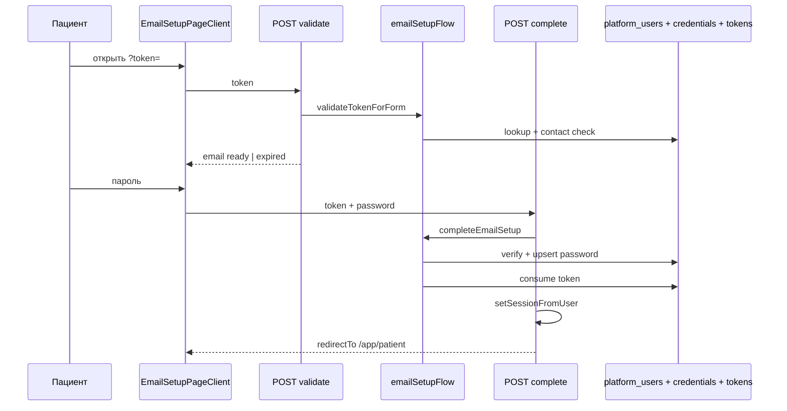

# Аудит PHASE_04 — Email setup flow (UI + API)

**Документ фазы:** [`PHASE_04_EMAIL_SETUP_FLOW.md`](PHASE_04_EMAIL_SETUP_FLOW.md)  
**Канон:** [MAIN PLAN.md](MAIN%20PLAN.md) §3, §4  
**Заявленный статус:** `completed` (2026-05-20)  
**Вердикт:** **фаза закрыта по коду** — публичная страница `/app/auth/email-setup`, три API (`validate` / `complete` / `resend`), модуль `emailSetupFlow` с проверкой contact email, транзакция verify+password, consume token, сессия и редирект на `/app/patient` для `client`. Автотесты (19) покрывают happy path на уровне service + routes + RTL; **browser E2E и ручной smoke в DoD не закрыты**. Зависимость PHASE_03: journal `0076` добавлен в рамках этой фазы (см. LOG).

---

## 1. Цель фазы и границы

| | |
|--|--|
| **Цель** | Пациент по ссылке из письма задаёт пароль на **существующей** карточке → verified email + credentials + session. |
| **В scope** | Validate token; форма readonly email + password; complete; expired UI + resend. |
| **Вне scope** | Register/login state machine (PHASE_05); merge (PHASE_06). |

---

## 2. Definition of Done — по пунктам

| Критерий (PHASE_04) | Статус | Доказательство |
|---------------------|--------|----------------|
| Happy path: token → password → session в patient app | **Выполнено (авто)** | `emailSetupFlow/service.test.ts` complete; `email-setup.routes.test.ts` complete + `redirectTo: /app/patient`; `EmailSetupPageClient.test.tsx` submit → `router.replace` |
| Happy path E2E (формулировка в DoD) | **Частично** | Нет Playwright/Cypress e2e в `apps/webapp/e2e`; покрытие — unit + RTL + route handlers |
| Used token cannot reuse | **Выполнено** | `validateEmailSetupToken` → `used`; UI «Ссылка уже использована»; service test `used token cannot complete` |
| Expired → resend | **Выполнено** | `lookupEmailSetupToken` → `expired`; validate **410** + email; `resendFromExpiredToken` → `requestContactEmailSetup(manual_resend)`; RTL «Ссылка устарела» + кнопка resend |
| Readonly email для keychain | **Выполнено** | `Input` `readOnly`, `autoComplete="username"`, `name="email"`; RTL `toHaveAttribute("readonly")` |
| Тесты API + RTL (lean) | **Выполнено** | 3 файла: routes, page client, flow service (+ tokens из PHASE_03) |
| Запись в `LOG.md` | **Выполнено** | `2026-05-20 — PHASE_04` |
| Ручной smoke (чеклист фазы) | **Не отмечен** | В PHASE_04 DoD `[ ]` — ожидаемо вне автоматического аудита |

**Локальные проверки (аудит 2026-05-20):**

```text
pnpm --filter @bersoncare/webapp exec vitest run \
  emailSetupFlow email-setup EmailSetupPageClient emailSetupTokens
→ 5 files, 19 tests passed
```

---

## 3. Реализованные компоненты

### 3.1 API

| Endpoint | Реализация | Ответы |
|----------|------------|--------|
| `POST /api/auth/email-setup/validate` | `validate/route.ts` | 200 ready + email; **410** expired + email; 400/409 used, revoked, mismatch, already_has_login |
| `POST /api/auth/email-setup/complete` | `complete/route.ts` | 200 + `redirectTo` + `setSessionFromUser`; 400/409/410 по ошибкам flow |
| `POST /api/auth/email-setup/resend` | `resend/route.ts` | 200; 503 `not_configured`; 409 already_has_login |

**Замечание:** в таблице фазы указано «GET/POST validate» — реализован **только POST** (достаточно для SPA).

### 3.2 Domain: `emailSetupFlow`

`modules/auth/emailSetupFlow/service.ts`:

| Шаг | MAIN PLAN §3 | Код |
|-----|--------------|-----|
| Проверка token | exists, not expired/used/revoked | `lookup` (validate UI) / `validateEmailSetupToken` (complete) |
| User + email match | contact email | `assertContactEmailForSetup` в `pgEmailSetupFlowPort` |
| Форма | readonly email + password | `EmailSetupPageClient` |
| Submit | re-validate → verify → password → consume → session | `completeEmailSetup` + `complete/route` |
| Redirect | `/app/patient` | `getRedirectPathForRole("client")` → `/app/patient` |

**Contact check** (`pgEmailSetupFlowPort`):

- `email_normalized` токена = текущий в `platform_users`;
- блокировка, если **`email_verified_at` IS NOT NULL и есть `user_password_credentials`** (`already_has_login`);
- contact-only (verified_at null или нет пароля) — setup **разрешён**.

**Completion** (одна транзакция):

```sql
UPDATE platform_users SET email_verified_at = now() WHERE id = … AND email_normalized = …
INSERT … user_password_credentials ON CONFLICT DO UPDATE password_hash
```

Затем **`consumeEmailSetupToken`** (отдельный шаг после COMMIT).

### 3.3 UI

| Файл | Назначение |
|------|------------|
| `app/app/auth/email-setup/page.tsx` | `searchParams.token` → client |
| `EmailSetupPageClient.tsx` | Состояния: loading, missing_token, ready, expired, resend_sent, error; patient chrome (`AppShell` variant patient) |

Тексты: «Ссылка устарела», «Отправить новую ссылку», «Создайте пароль» — без лишних пояснений.

### 3.4 DI (`buildAppDeps.ts`)

```text
emailSetupTokensService  → pgEmailSetupTokensPort (всегда PG port)
emailSetupAccessService  → pg port | noop (inMemoryRepos)
emailSetupFlowService    → pgEmailSetupFlowPort | noopEmailSetupFlowPort
```

`emailSetupFlow` экспортируется в `deps.emailSetupFlow` для routes.

### 3.5 PHASE_03 дополнение

- `lookupEmailSetupToken` — отдельно от strict `validate` (expired всё ещё возвращает user+email для resend).
- `0076_user_email_setup_tokens` — запись в `_journal.json` (LOG PHASE_04); замечание [PHASE_03_AUDIT.md](PHASE_03_AUDIT.md) §7.1 **снято** для актуального дерева.

---

## 4. Сверка с MAIN PLAN §3–4

| Требование | Статус |
|------------|--------|
| Одноразовый token, TTL 24h, hash | PHASE_03 + consume на complete |
| Revoke при новом выпуске (resend) | `requestContactEmailSetup` → issue revokes active |
| URL `/app/auth/email-setup?token=…` | Страница + ссылка в письме PHASE_03 |
| email совпадает с contact | **Да** — `assertContactEmailForSetup` |
| Readonly email + autocomplete | **Да** |
| email_verified_at, credentials, session, redirect patient | **Да** |
| Expired UI + resend | **Да** |

---

## 5. Поток (sequence)



**Resend (expired):**

```text
POST resend → lookup (must be expired) → contact check → requestContactEmailSetup(manual_resend)
```

---

## 6. Тестовое покрытие

| Файл | Сценарии |
|------|----------|
| `emailSetupFlow/service.test.ts` | ready; expired+email; complete chain; resend; used blocked |
| `email-setup.routes.test.ts` | validate 200/410; complete session+redirect; resend 200 |
| `EmailSetupPageClient.test.tsx` | readonly email; expired UI; submit redirect |
| `emailSetupTokens/*` (PHASE_03) | lookup/validate/consume/revoke |

**Пробелы:**

- Нет интеграционного теста с реальной БД (`pgEmailSetupFlowPort` + tokens).
- Нет теста `already_has_login` / `email_mismatch` на UI.
- Нет browser e2e «письмо → клик → кабинет».
- `api.md` **не** документирует три endpoint (можно дополнить).

---

## 7. Риски и нюансы

### 7.1 Порядок complete: apply → consume

**Исправлено 2026-05-20:** consume token в **той же транзакции**, что verify+password (`setupTokenId` в `pgEmailSetupFlowPort`). Ранее apply и consume были разными шагами.

### 7.2 `already_has_login` критерий

Блок только при **verified + password**. **UI 2026-05-20:** единое сообщение + ссылка «Перейти ко входу» на `/app/auth/email-setup`.

### 7.3 In-memory / тесты без PG

`noopEmailSetupFlowPort` → complete всегда `user_not_found`; полный flow только с реальной БД.

### 7.4 Публичный доступ к маршруту

Страница под `app/app/auth/` без отдельного middleware-исключения в grep; опирается на общий auth layout (как login). При появлении жёсткого global guard — убедиться, что `/app/auth/email-setup` остаётся доступен без сессии (smoke из DoD).

### 7.5 Resend повторно с тем же expired token

Повторный resend с **той же** истёкшей ссылкой разрешён (lookup status expired) — каждый раз новый token + revoke active; приемлемо.

### 7.6 PHASE_02 gap (наследие)

~~Enqueue setup при email только из `appointment.record.upserted` по-прежнему **не** подключён~~ **Закрыто 2026-05-20:** см. [`LOG.md`](LOG.md) post-MVP hardening.

---

## 8. Scope boundaries

| Вне scope PHASE_04 | Подтверждение |
|--------------------|---------------|
| Register `existing_account_needs_email_setup` | PHASE_05 |
| Merge | PHASE_06 |
| Полный login screen FSM | PHASE_05 |

---

## 9. Документация

| Документ | Актуальность |
|----------|--------------|
| `LOG.md` PHASE_04 | **Актуален** |
| `PHASE_04_EMAIL_SETUP_FLOW.md` | DoD в основном `[x]`; ручной smoke `[ ]` |
| `PHASE_03_AUDIT.md` | Journal 0076 — **устарело** в §7.1 (исправлено в PHASE_04) |
| `INTEGRATOR_CONTRACT.md` | Ссылка на URL setup в примере письма |
| `apps/webapp/src/app/api/api.md` | Endpoints email-setup **не** перечислены |

---

## 10. Рекомендации

1. Закрыть чеклист **ручного smoke** из PHASE_04 (письмо → ссылка → пароль → кабинет) или перенести в QA-runbook.
2. Добавить краткий блок в `api.md` для трёх routes.
3. Опционально: Playwright smoke один сценарий с test helper token (без реального SMTP).
4. ~~Рассмотреть consume token **в той же транзакции**~~ — **сделано** (2026-05-20).
5. PHASE_05: register на contact-only email → redirect/issue setup вместо duplicate — **сделано** в PHASE_05.

---

## ИТОГ

**PHASE_04 можно считать выполненной:** end-to-end логика «ссылка → пароль → сессия пациента» реализована и покрыта автотестами на уровне service, HTTP routes и RTL.

**Не закрыто формально:** ручной smoke (пункт DoD фазы); полноценный browser E2E под формулировкой «Happy path E2E».

**Готовность к PHASE_05:** **да** — setup flow готов; остаётся связать register/forgot с contact-only пользователями.
