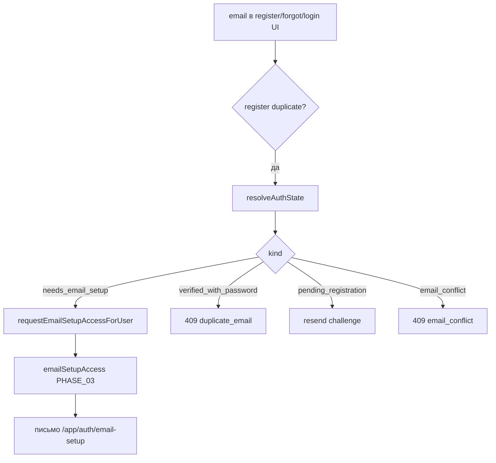

# Аудит PHASE_05 — Register / login / forgot

**Документ фазы:** [`PHASE_05_AUTH_REGISTER_LOGIN_FORGOT.md`](PHASE_05_AUTH_REGISTER_LOGIN_FORGOT.md)  
**Канон:** [MAIN PLAN.md](MAIN%20PLAN.md) §5–6  
**Заявленный статус:** `completed` (2026-05-20)  
**Вердикт:** **фаза закрыта** — тупик `duplicate_email` для contact-only снят (`existing_account_needs_email_setup` + setup-link), forgot разделяет reset OTP и setup access, UI `AuthFlowV2` и lookup/setup-access API на месте. **`duplicate_email` (409)** остаётся только для verified+password и прочих «настоящих» дублей регистрации. Автотесты: **24** зелёных (routes + RTL).

---

## 1. Цель фазы и границы

| | |
|--|--|
| **Цель** | Предсказуемые состояния email: register / login / forgot без тупика contact-only. |
| **В scope** | Register, forgot, `AuthFlowV2`, lookup, setup-access, тесты Auth §11. |
| **Вне scope** | Rubitime create (PHASE_01), merge (PHASE_06). |

---

## 2. Канон состояний (MAIN PLAN §5) vs реализация

| # | Состояние | `resolveAuthState` | Поведение API/UI |
|---|-----------|-------------------|------------------|
| 1 | Email свободен | `free` | Обычная регистрация + challenge |
| 2 | Verified + password | `verified_with_password` | Login / forgot → reset OTP |
| 3 | Contact-only / unverified, нет credentials | `needs_email_setup` | Register → **200** `existing_account_needs_email_setup`; forgot → setup-link, neutral 200 |
| 4 | Verified, нет credentials | `needs_email_setup` | Тот же fallback (ветка `else` после проверок verified+password и pending) |
| 5 | Конфликт (несколько строк) | `email_conflict` | Register **409** `email_conflict`; UI «Обратитесь в поддержку» |

**Реализация lookup:** `infra/repos/pgEmailPasswordLookup.ts` — один SQL по `email_normalized`, `merged_into_id IS NULL`.

---

## 3. Definition of Done — по пунктам

| Критерий (PHASE_05) | Статус | Доказательство |
|---------------------|--------|----------------|
| Register + bot/doctor contact email → setup, не `duplicate_email` | **Выполнено** | `register/route.ts`: `needs_email_setup` → `registration_claim` + **200**; `register/route.test.ts`; `AuthFlowV2.test.tsx` |
| Forgot + contact-only → setup mail, не silent no-op | **Выполнено** | `forgot/route.ts`: после `findVerifiedUserIdWithPassword` null → `needs_email_setup` → `requestEmailSetupAccessForUser(manual_resend)`; `forgot/route.test.ts` |
| Forgot + verified+password → reset как раньше | **Выполнено** | `findVerifiedUserIdWithPassword` → `startEmailChallenge`; тест neutral 200 + вызов challenge |
| Forgot не шлёт reset на unverified doctor-only | **Выполнено** | Reset только при verified+password; contact-only не проходит `findVerifiedUserIdWithPassword` |
| Существующий email+password без регрессий | **Выполнено** | `verified_with_password` → register **409** `duplicate_email`; login/forgot paths сохранены |
| `LOG.md` | **Выполнено** | `2026-05-20 — PHASE_05` |

**Локальные проверки (аудит 2026-05-20):**

```text
pnpm --filter @bersoncare/webapp exec vitest run \
  src/app/api/auth/email-password src/shared/ui/auth/AuthFlowV2.test.tsx
→ 5 files, 24 tests passed
```

---

## 4. API

### 4.1 `POST /api/auth/email-password/register`

| `resolveAuthState` после `duplicate_email` | HTTP | Тело |
|------------------------------------------|------|------|
| `needs_email_setup` | **200** | `ok: true`, `error: existing_account_needs_email_setup`, `setupLinkSent: true` |
| `email_conflict` | **409** | `email_conflict` |
| `verified_with_password` | **409** | `duplicate_email` |
| `pending_registration` | **200** | challenge (tryResend + `startEmailChallenge`) |

Источник setup: `registration_claim`.

### 4.2 `POST /api/auth/email-password/forgot`

```text
findVerifiedUserIdWithPassword → да → startEmailChallenge (reset OTP), neutral 200
                              → нет → resolveAuthState
                                      needs_email_setup → setup-link (manual_resend), neutral 200
                                      иначе → только neutral 200
```

Внешний ответ **всегда** `{ ok: true, retryAfterSeconds }` — anti-enumeration сохранён.

### 4.3 `POST /api/auth/email-password/lookup` (опционально в фазе — **сделано**)

Публичный `state` без `userId` — только kind для UI.

### 4.4 `POST /api/auth/email-password/setup-access`

Явный resend setup-link при `needs_email_setup`; иначе **400** `not_eligible`.

### 4.5 `POST /api/auth/email-password/login`

Без изменений по смыслу PHASE_05: **401** `invalid_credentials`; **409** `email_not_verified`. При неверном пароле UI вызывает **lookup** и при `needs_email_setup` показывает экран setup (без автоматической отправки до forgot/submit).

---

## 5. UI: `AuthFlowV2`

| Сценарий | Поведение |
|----------|-----------|
| Register → `existing_account_needs_email_setup` | `emailSetupPromptEmail`, toast, кнопка «Отправить ссылку» → `setup-access` |
| Register/login → `duplicate_email` / 409 | «Войдите с паролем или восстановите доступ» |
| Login 401 + lookup `needs_email_setup` | Экран setup (без лишнего duplicate) |
| Forgot + lookup `needs_email_setup` | `forgot` (setup в фоне) + экран setup |
| Forgot + `verified_with_password` | Код сброса (reset flow) |
| `email_conflict` | «Обратитесь в поддержку» |

Копирайт setup-блока: «Аккаунт с этой почтой уже есть…» (см. RTL test).

---

## 6. Архитектура



**Модули:**

| Слой | Файл |
|------|------|
| Lookup port | `modules/auth/emailPasswordLookup/ports.ts`, `types.ts` |
| Lookup PG | `infra/repos/pgEmailPasswordLookup.ts` |
| Setup enqueue helper | `modules/auth/emailPasswordLookup/requestSetupAccess.ts` |
| DI | `buildAppDeps.emailPasswordLookup` |

**Документация:** `modules/auth/auth.md` § Email + пароль обновлён (register, lookup, setup-access, forgot).

---

## 7. `duplicate_email` — согласованность

| Место | Когда |
|-------|--------|
| `register/route.ts` | `verified_with_password`, failed pending resend, fallback |
| `AuthFlowV2.tsx` | 409 или `error === "duplicate_email"` → подсказка войти/восстановить |
| **Не** для contact-only | Заменён на `existing_account_needs_email_setup` (**200**) |

`rg duplicate_email` в webapp: register + UI + credentials repo + тесты — согласовано с политикой фазы.

---

## 8. Тестовое покрытие

| Файл | Сценарии |
|------|----------|
| `register/route.test.ts` | challenge rollback; contact-only setup; pending resend |
| `forgot/route.test.ts` | neutral 200; verified reset; contact setup; send fail neutral |
| `lookup/route.test.ts` | public state |
| `reset/route.test.ts` | (регрессия reset, вне ядра PHASE_05) |
| `AuthFlowV2.test.tsx` | setup prompt на register; forgot subflow |

**Пробелы:**

- Нет отдельного теста **`setup-access/route.ts`**.
- Нет unit-теста **`pgEmailPasswordLookup.resolveAuthState`** (ветки verified без password, conflict).
- Нет RTL: forgot → contact-only → setup prompt (только register).
- MAIN PLAN §11 Auth — нет отдельного файла «auth integration suite»; покрытие разнесено по route tests.

---

## 9. Риски и нюансы

### 9.1 Forgot: fire-and-forget setup

`void requestEmailSetupAccessForUser(...).catch(() => undefined)` — при сбое SMTP UI всё равно neutral 200 / success toast на ветке lookup в forgot subflow. Согласовано с anti-enumeration, но пациент может не получить письмо без явной ошибки на forgot-only path (на register setup при сбое — **503**).

### 9.2 Lookup до forgot для contact-only в UI

`AuthFlowV2` сначала **lookup**, при `needs_email_setup` вызывает **forgot** (дублирует логику setup-access). Работает; лишний round-trip.

### 9.3 `pending_registration` vs contact-only

Пользователь с credentials, но без `email_verified_at` — **pending_registration**, не setup-link. Отдельно от contact-only карточки врача — корректно.

### 9.4 In-memory deps

`inMemoryEmailPasswordLookupPort` всегда `free` — полный flow только с PG.

### 9.5 PHASE_02 gap (наследие)

Пациент с email только из `appointment.record.upserted` без autobind не получит письмо, пока не пройдёт register/forgot/lookup — не задача PHASE_05.

---

## 10. Зависимости от предыдущих фаз

| Фаза | Использование в PHASE_05 |
|------|-------------------------|
| PHASE_03 | `emailSetupAccess.requestContactEmailSetup` |
| PHASE_04 | Ссылка в письме → `/app/auth/email-setup` complete |

---

## 11. Scope boundaries

| Вне scope | Подтверждение |
|-----------|---------------|
| Merge PHASE_06 | Не в diff |
| Rubitime user create | PHASE_01 |

---

## 12. Рекомендации

1. Добавить `setup-access/route.test.ts` (needs_email_setup / not_eligible).
2. Unit-тест `pgEmailPasswordLookup` на SQL-ветки (mock pool).
3. RTL: forgot + `needs_email_setup` → setup prompt.
4. Унифицировать ошибку отправки на forgot contact-only (503 vs silent) — продуктовое решение.
5. `api.md`: перечислить lookup и setup-access рядом с register/forgot.

---

## ИТОГ

**PHASE_05 выполнена:** contact-only больше не упирается в голый `duplicate_email`; forgot и register ведут в setup access; verified+password сохраняют login/reset; UI и документация согласованы.

**Готовность к PHASE_06 (merge):** логика **не** automerge при `email_conflict` — задел есть; hardening merge — отдельная фаза.
