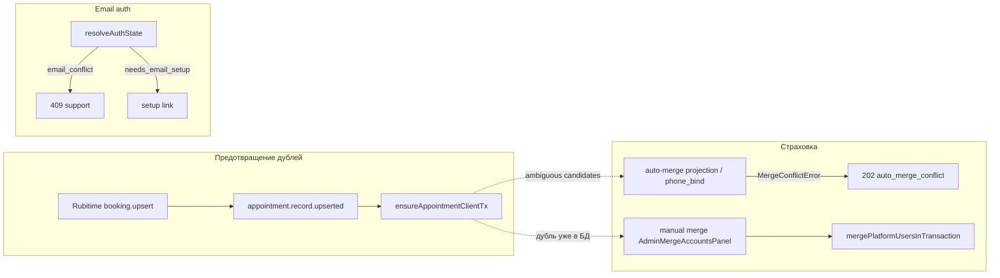

# Аудит PHASE_06 — Merge и identity (страховка)

**Документ фазы:** [`PHASE_06_MERGE_IDENTITY.md`](PHASE_06_MERGE_IDENTITY.md)  
**Канон:** [MAIN PLAN.md](MAIN%20PLAN.md) §7  
**Заявленный статус:** `completed` (2026-05-20)  
**Вердикт:** **фаза закрыта по заявленному scope** — новый merge engine не вводился, manual merge API не менялся; задокументирована связка live identity (фазы 1–5) ↔ merge-страховка; закрыт пробел AUDIT_REPORT §6.1 (регрессионный unit-тест «приёмы + дневник/разминка»). **Не** добавлены E2E merge, integrator-тесты, перенос `user_email_setup_tokens` при merge.

---

## 1. Цель фазы и границы

| | |
|--|--|
| **Цель** | Убедиться, что при уже существующем дубле merge сохраняет данные Rubitime и PWA; дубли по возможности предотвращаются фазой 1, не merge. |
| **В scope** | Ревью `PLATFORM_USER_MERGE.md`, ограничения auto-merge, unit-тест MAIN PLAN §7, журнал. |
| **Вне scope** | Merge engine v3, изменение CI, backfill (PHASE_07), правки `POST /api/doctor/clients/merge`. |

---

## 2. Сценарии MAIN PLAN §7 — по пунктам

| # | Сценарий | Ожидание | Статус | Доказательство |
|---|----------|----------|--------|----------------|
| 1 | Rubitime: user по email, из Rubitime приходит phone | Trusted phone на **том же** user, без дубля | **Live-path (PHASE_01)** | `ensureAppointmentClientTx`: phone → integrator_id → email; UPDATE trusted phone; тесты `ensureAppointmentClient.test.ts`, autobind в `events.test.ts` — merge **не вызывается** |
| 2 | Позже bot user с тем же телефоном | Безопасный merge / resolution | **Частично** | Auto: `mergeCanonicalPlatformUserCandidates` (`projection` / `phone_bind`) + `pickMergeTargetId`; конфликт → `MergeConflictError` → 202 + `auto_merge_conflict` (`events.ts`, `events.test.ts`). **Нет** целевого теста «bot + Rubitime ensure → один canonical без INSERT дубля» |
| 3 | User A: appointments; User B: diary/warmup/reminders | После merge всё на canonical | **Выполнено (unit, manual)** | `mergePlatformUsersInTransaction` переносит `appointment_records`, `patient_bookings`, `reminder_rules`, `symptom_*`, dedupe singleton; тест `repoints appointments and diary/warmup domains to canonical user` |

**Сводка:** сценарий §7.3 закрыт тестом фазы; §7.1 — зона PHASE_01; §7.2 — поведение merge-движка уже было, явная регрессия на bot+Rubitime **не** добавлялась (вне узкого scope PHASE_06).

---

## 3. Definition of Done — по пунктам

| Критерий (PHASE_06) | Статус | Доказательство |
|---------------------|--------|----------------|
| Чеклист сценариев §7 | **Выполнено** | Таблица §2; backlog только на bot E2E (не блокер фазы) |
| Нет регрессии manual merge API | **Выполнено** | Контракт `ManualMergeResolution` / routes не менялись; 36 тестов merge-related зелёные (см. §8) |
| Ревью `PLATFORM_USER_MERGE.md` | **Выполнено** | Секция «Login / Register initiative — identity vs merge» + таблица ограничений auto-merge |
| Тест appointments + diary/warmup | **Выполнено** | `pgPlatformUserMerge.test.ts` (новый `it`) |
| Ограничения automerge (`email_conflict` → support) | **Выполнено** | Док + код: `resolveAuthState` → 409, без вызова merge; `events.ts` → 202 при projection conflict |
| `LOG.md` | **Выполнено** | `2026-05-20 — PHASE_06` |

**Локальные проверки (аудит 2026-05-20):**

```text
pnpm --filter @bersoncare/webapp exec vitest run \
  src/infra/repos/pgPlatformUserMerge.test.ts \
  src/infra/manualPlatformUserMerge.test.ts \
  src/app/app/doctor/clients/adminMergeAccountsLogic.test.ts
→ 3 files, 36 tests passed
```

Integrator `mergeIntegratorUsers.test.ts` — **не** гонялся (пути фазы не затронуты).

---

## 4. Документация

### 4.1 `docs/ARCHITECTURE/PLATFORM_USER_MERGE.md`

| Добавлено | Содержание |
|-----------|------------|
| Слои identity | Live (PHASE_01), email setup/register (PHASE_03–05), merge-страховка |
| Таблица ограничений auto-merge | `email_conflict`, verified email conflict, projection 202, integrator_id v1/v2, shared phone meaningful data |
| Ссылка на тест | `repoints appointments and diary/warmup domains…` |

Согласовано с [`PHASE_05_AUDIT.md`](PHASE_05_AUDIT.md) §11: register **не** automerge при `email_conflict`.

### 4.2 Устаревшие документы

| Файл | Проблема |
|------|----------|
| [`AUDIT_REPORT.md`](AUDIT_REPORT.md) §6.1, §6.3 | Шапка и таблица от **2026-05-19** («реализация не начата», «нет email-find», «нет теста appointments+diary») — **не отражают** PHASE_01–06. Рекомендация: обновить §6 или добавить отсылку к phase-аудитам. |
| [`SCOPE_DECISIONS.md`](SCOPE_DECISIONS.md) | Строка «PHASE_06 deferred» — **расходится** с фактическим закрытием merge-страховки (2026-05-20). |

---

## 5. Связка с фазами 1 и 5 (код)



| Поток | Merge? | Источник |
|-------|--------|----------|
| Register `email_conflict` | **Нет** | `register/route.ts` 409 |
| Rubitime ensure, один кандидат | **Нет** (link) | `ensureAppointmentClientTx` |
| Несколько canonical на strong id | **Да** или conflict | `mergeCandidates` / throw |
| Ручной merge врача | **Да** | `runManualPlatformUserMerge` |

---

## 6. Движок merge — переносы, релевантные инициативе

Реализация: `packages/platform-merge/src/pgPlatformUserMerge.ts` (реэкспорт webapp `pgPlatformUserMerge.ts`).

| Домен (MAIN PLAN §7) | SQL в merge tx | Покрытие тестом PHASE_06 |
|----------------------|----------------|---------------------------|
| Приёмы Rubitime | `UPDATE appointment_records`, `patient_bookings` | **Да** (assert в SQL log) |
| Напоминания | `UPDATE reminder_rules` | **Да** |
| Дневник / разминка | dedupe `general_wellbeing`, `warmup_feeling` + bulk `symptom_trackings` / `symptom_entries` | **Да** (порядок dedupe → bulk) |
| ЛФК | `lfk_complexes`, `lfk_sessions`, `patient_lfk_assignments` | **Нет** в новом тесте (есть в движке, другие `it` не расширялись) |
| Email/password auth | `email_challenges`, `user_password_credentials`, `email_send_cooldowns` | Существующие `it` на email_verified_at |
| **Setup tokens (PHASE_03)** | **Нет** явного `UPDATE user_email_setup_tokens` | **Пробел** — токены остаются на `user_id` alias; ссылка с `user_id` дубликата может работать до purge, канонический id в письме — на target |

---

## 7. Тестовое покрытие

| Файл | Роль в PHASE_06 |
|------|-----------------|
| `pgPlatformUserMerge.test.ts` | **+1** сценарий §7.3; всего **18** `it` в файле |
| `manualPlatformUserMerge.test.ts` | Регрессия apply/gate |
| `adminMergeAccountsLogic.test.ts` | Регрессия preview orientation / submit |
| `events.test.ts` | auto_merge_conflict на projection (не перепрогонялся в DoD фазы) |

**Пробелы (не блокеры закрытия фазы):**

- Нет **интеграционного** теста с реальной БД: две строки `platform_users` + merge → счётчики appointments/symptom на target.
- Нет теста **auto-merge** `reason: "projection"` с appointment + symptom на разных id (только manual path).
- Нет теста **AdminMergeAccountsPanel** RTL для пары «Rubitime + PWA».
- MAIN PLAN §11 merge — по-прежнему только unit SQL-log, не prod-like fixture.

---

## 8. Риски и нюансы

### 8.1 Дубль всё ещё возможен до merge

PHASE_01 снижает частоту, но не исключает: исторические записи (PHASE_07), race двух webhook, email-only без phone в событии, merge-conflict на ensure → `platform_user_id` NULL при видимости врачу по phone join (см. [PHASE_01_AUDIT.md](PHASE_01_AUDIT.md) §6.1).

### 8.2 `email_conflict` vs merge по email

`resolveAuthState` при `rows.length > 1` на `email_normalized` — **409**, без слияния. Ручной merge с выбором email — единственный путь; preview покажет `scalarConflicts` / hard blockers.

### 8.3 Auto-merge не знает про setup tokens

После manual merge дубликат — alias (`merged_into_id`). Токены setup на `duplicateId` не переносятся автоматически; при необходимости — reissue setup (PHASE_05 `manual_resend`) на canonical email.

### 8.4 v1 / v2 integrator

Поведение двух `integrator_user_id` **не** менялось в PHASE_06; флаг `platform_user_merge_v2_enabled` и M2M canonical-pair — по [`PLATFORM_USER_MERGE.md`](../ARCHITECTURE/PLATFORM_USER_MERGE.md).

### 8.5 Секция «Фаза v2 (Phase 6)» в PLATFORM_USER_MERGE.md

Заголовок в архитектурном доке про **Platform User Merge v2 (integrator)** — **не** путать с **PHASE_06** инициативы Login/Register (в [`STRICT_PURGE_MANUAL_MERGE_EXECUTION_LOG.md`](../REPORTS/STRICT_PURGE_MANUAL_MERGE_EXECUTION_LOG.md) уже была правка формулировок).

---

## 9. Scope boundaries

| Вне scope PHASE_06 | Подтверждение |
|--------------------|---------------|
| Новый merge engine | Нет изменений в `packages/platform-merge` логики merge |
| CI workflow | Не трогали |
| Backfill / mass setup | PHASE_07/08 |
| Изменение `ensureAppointmentClientTx` | PHASE_01 |

---

## 10. Рекомендации

1. Обновить [`AUDIT_REPORT.md`](AUDIT_REPORT.md) §6: снять gap «нет теста appointments+diary»; таблицу §6.3 привести к post-PHASE_01 состоянию.
2. Уточнить [`SCOPE_DECISIONS.md`](SCOPE_DECISIONS.md): PHASE_06 выполнена как страховка, 7–8 по-прежнему deferred.
3. Добавить в merge tx перенос или revoke `user_email_setup_tokens` с duplicate → target (низкий приоритет, отдельный тикет).
4. Опционально: dev-db integration test на пару пользователей с реальными FK (как `pgPlatformUserMerge.devDb.integration.test.ts`, новый кейс).
5. README инициативы: блок «Аудиты этапов» со ссылками `PHASE_01_AUDIT` … `PHASE_06_AUDIT` (сейчас в README только PHASE_00 `AUDIT_REPORT`).

---

## ИТОГ

**PHASE_06 выполнена в заявленном объёме:** документация identity↔merge, ограничения auto-merge и `email_conflict`, регрессионный unit-тест переноса appointments + diary/warmup при **manual** merge, регрессия manual merge API по существующим тестам.

**Остаётся вне фазы:** исторический backfill дублей, E2E merge в UI, перенос setup-токенов, обновление устаревшего `AUDIT_REPORT` §6.

**Готовность к PHASE_07:** merge-страховка для **новых** live-дублей документирована; массовое связывание старых `appointment_records` — отдельная фаза.
