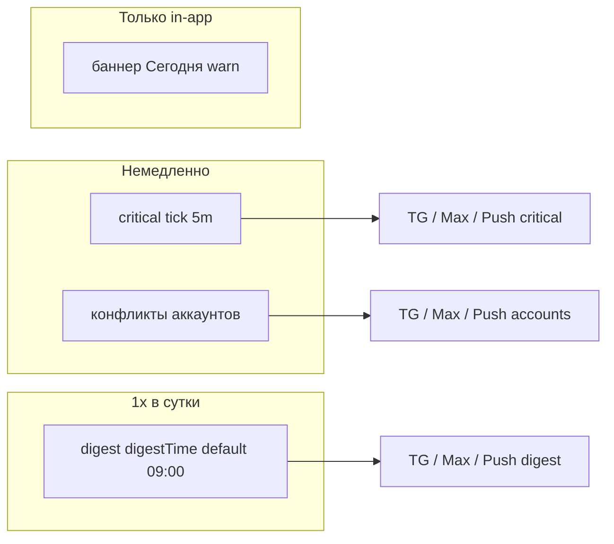

# ROADMAP Wave 2 — Операторские уведомления

**Статус:** постановка утверждена (2026-06-09).  
**Решения:** [`SCOPE_DECISIONS.md`](SCOPE_DECISIONS.md) — читать **до** кода.  
**Трекер:** [`.cursor/plans/operator_health_alerting_wave2.plan.md`](../../.cursor/plans/operator_health_alerting_wave2.plan.md).  
**Журнал:** [`LOG.md`](LOG.md).  
**Предшественник:** [`MASTER_PLAN.md`](MASTER_PLAN.md) + MVP (закрыт); PHASE E **superseded**.

---

## 0. Навигация по документам

| Документ | Роль | Статус |
|----------|------|--------|
| [`SCOPE_DECISIONS.md`](SCOPE_DECISIONS.md) | Канон продукт/архитектура/Ops | **Active** |
| **ROADMAP_WAVE2** (этот файл) | Волны, шаги, DoD | **Active** |
| [`MASTER_PLAN.md`](MASTER_PLAN.md) | Полное видение интеграций | Reference; доставка — Wave 2 |
| [`MVP_IMPLEMENTATION_PLAN.md`](MVP_IMPLEMENTATION_PLAN.md) | Сделано в коде до Wave 2 | **Closed** |
| PHASE A | Модель инцидентов | **Partial** (integrator path) |
| PHASE B | Синтетические пробы | **Partial** (MAX/Rubitime); rest → волна 4 |
| PHASE C | Last-status вебхуков | **Open** → волна 4 |
| PHASE D | Событийные хуки | **Partial** (GCal); D.3/D.4 → волна 3 |
| PHASE E | Recovery push | **Superseded** |
| PHASE F | UI интеграций | **Partial**; блок «Интеграции» → волна 4 |
| PHASE G | Тесты/docs полного MASTER | **Open** → финал Wave 2 |

### Правила агентов (обязательно перед волной)

- План: [`.cursor/rules/plan-authoring-execution-standard.mdc`](../../.cursor/rules/plan-authoring-execution-standard.mdc) — шаги с checklist, без «опционально», `LOG.md` после каждой волны.
- Конфиг: [`.cursor/rules/000-critical-integration-config-in-db.mdc`](../../.cursor/rules/000-critical-integration-config-in-db.mdc) — ключи только `system_settings` + `ALLOWED_KEYS` + mirror integrator.
- Слои: [`.cursor/rules/clean-architecture-module-isolation.mdc`](../../.cursor/rules/clean-architecture-module-isolation.mdc) — порты в `modules/*`, без `getPool` в modules.
- Тесты: [`.cursor/rules/test-execution-policy.md`](../../.cursor/rules/test-execution-policy.md) — между волнами целевые тесты; **`pnpm run ci`** один раз в DoD всей Wave 2 (перед merge/push).

---

## 1. Продуктовая модель

Три уровня (матрица: [`SCOPE_DECISIONS.md` §3](SCOPE_DECISIONS.md)):



| Уровень | Когда | Каналы | Формат |
|---------|--------|--------|--------|
| **critical** | Падения из §3 (вкл. outbox **error**) | Свои TG/Max/Push | Один push на `dedup_key`; tick ≤5 мин |
| **account_conflicts** | Чекбокс «Конфликты аккаунтов» | Свои TG/Max/Push | Немедленно |
| **digest** | 1×/день в `digestTime` (default `09:00`) | Свои TG/Max/Push | `⚠️` + до ~15 строк **или** `✅ Всё в порядке` |
| **warn** | due backlog, projection retries, … | — | Баннер + сводка за окно |

**Не делаем:** push на каждый `degraded` в health UI.

---

## 2. Архитектура (целевое состояние)

```
cron/internal tick
  → classify / aggregate
  → dispatchOperatorAlert (webapp)
  → relayOutbound / staff push (TG, Max, Web Push)
```

| Компонент | Путь (план) |
|-----------|-------------|
| Конфиг | `operator_health_alert_config` + merge legacy `admin_incident_alert_config` |
| Диспетчер (функция, не процесс) | `dispatchOperatorAlert` → существующие `relayOutbound` + `outgoing_delivery_queue` + integrator worker |
| Critical classify | `apps/webapp/src/modules/operator-health/criticalHealthSignals.ts` |
| Digest build | `apps/webapp/src/modules/operator-health/buildOperatorHealthDigest.ts` (+ `digestHealthSnapshotLines`, `collectOperatorHealthDigestInput`) |
| Dedup sent | `apps/webapp/db/schema/operatorHealthAlertSent.ts` (имя уточнить в миграции) |
| Integrator enqueue | `reportOperatorFailure` → unified payload + `admin_telegram_ids` lists |
| Ticks | `operator-health-critical/tick`, `operator-health-digest/tick`, `system-health-guard/tick` |

---

## 3. Волны (порядок строгий)

| Волна | Цель | Оценка | Закрытие |
|-------|------|--------|----------|
| **0** | Диспетчер, конфиг, UI, dedup table, deploy snippets | 2–3 дн | DoD §8.0 |
| **1** | Critical tick + classify + баннер из общей матрицы | 2–3 дн | DoD §8.1 |
| **2** | Суточная сводка 1× (`digestTime`, default 09:00) ⚠️/✅ | 3–4 дн | DoD §8.2 |
| **3** | Projection/media хуки + recovery в сводке | 3–4 дн | DoD §8.3 |
| **4** | PHASE B/C/F остаток | 4–5 дн | DoD §8.4 |

---

## 4. Волна 0 — Фундамент

### Scope

| Разрешено | Запрещено |
|-----------|-----------|
| `apps/webapp/src/modules/operator-alerts/**` | Patient routes |
| `apps/webapp/src/modules/admin-incidents/**` (рефактор под диспетчер) | Новые env для интеграций |
| `apps/webapp/src/modules/operator-health/**` | GitHub CI workflow |
| `apps/integrator/src/infra/operatorIncident/**` | LFK DDL |
| `apps/webapp/db/schema/**`, миграция Drizzle | |
| `deploy/host/cron.d/**`, `HOST_DEPLOY_README.md` | |

### Шаг 0.1 — `dispatchOperatorAlert`

1. API: `dispatchOperatorAlert({ block: "critical" | "digest" | "account_conflicts"; topic; dedupKey; lines })`.
2. Читает `operator_health_alert_config`: `topics.*` + `channels.critical` / `channels.digest` / `channels.account_conflicts` (каждый блок — свои TG/Max/Push).
3. Проверяет включение блока и dedup в `operator_health_alert_sent`.
4. Делегирует в существующий relay (TG/Max/staff push).

**Checklist:**

- [ ] `rg sendAdminIncidentRelayAlert` — identity-хуки переведены на диспетчер или thin wrapper.
- [ ] Unit: dedup 24h / disabled topic / empty recipients.

### Шаг 0.2 — Конфиг `operator_health_alert_config`

1. Zod + `ALLOWED_KEYS`. Минимальная форма:
   - `topics.critical_enabled`, `topics.digest_enabled`, `topics.account_conflicts`
   - `digestTime`: `"09:00"` (строка `HH:mm`)
   - `channels.critical`, `channels.digest`, `channels.account_conflicts` — каждый `{ telegram, max, web_push }`
2. Lazy merge из `admin_incident_alert_config` (legacy per-topic → `account_conflicts`; `system_health_db_guard` → не отдельный UI, покрывается `critical_enabled`).
3. `syncSettingToIntegrator` после `updateSetting`.

**Checklist:**

- [ ] `route.test.ts` PATCH нового ключа.
- [ ] Integrator mirror row при admin save (smoke или unit на sync).

### Шаг 0.3 — UI `/app/doctor/admin/technical`

1. Блок **«Уведомления админу»** (вместо «Инциденты идентичности»).
2. Три подблока, у каждого: **вкл** + TG / Max / Push:
   - **Критичные сбои** (вкл. очередь синка integrator — без отдельного пункта)
   - **Суточная сводка** + одно поле времени (`digestTime`, default **09:00**)
   - **Конфликты аккаунтов**
3. В коде `account_conflicts` мапит все legacy identity topics.
4. Без лишних поясняющих абзацев ([`ui-copy-no-excess-labels`](../../.cursor/rules/ui-copy-no-excess-labels.mdc)).

**Checklist:**

- [ ] RTL: блок рендерится; один чекбокс аккаунтов управляет всеми identity relay.

### Шаг 0.4 — Dedup persistence + integrator unify

1. Drizzle-таблица `operator_health_alert_sent` (`dedup_key`, `severity`, `sent_at`).
2. `reportOperatorFailure`: payload с получателями из DB-списков (через shared contract / internal read — без дублирования логики списков в integrator env).

**Checklist:**

- [ ] `operatorHealthDrizzle` / webhook tests green.
- [ ] `rg adminTelegramId` в report path — только fallback deprecated, документировать в LOG.

### Шаг 0.5 — Deploy cron templates

1. `deploy/host/cron.d/bersoncarebot-operator-health-critical.cron.template`
2. `deploy/host/cron.d/bersoncarebot-operator-health-digest.cron.template`
3. `deploy/host/cron.d/bersoncarebot-system-health-guard.cron.template`
4. Секция в [`deploy/HOST_DEPLOY_README.md`](../../deploy/HOST_DEPLOY_README.md): gate `INTERNAL_JOB_SECRET`.

**Checklist:**

- [ ] `rg operator-health-critical` в `deploy/`.

### DoD волны 0 (§8.0)

- [ ] Один диспетчер; legacy relay не дублирует transport.
- [ ] Конфиг в `ALLOWED_KEYS`; UI три секции.
- [ ] Cron templates в репо; LOG § Wave 0.

**Проверки волны 0:** `pnpm --dir apps/webapp typecheck`; targeted vitest затронутых `route.test` / `adminIncident*` / новый `operator-alerts*.test.ts`. **Не** полный `ci`.

---

## 5. Волна 1 — Critical

### Шаг 1.1 — `criticalHealthSignals.ts`

1. `collectCriticalHealthSignals()` — облегчённый сбор (DB, integrator `/health`, projection snapshot, outgoing dead, ipo error, backup last run).
2. `classifyCriticalHealthSignals()` → кандидаты с `dedupKey`.
3. `classifyOperatorHealthBannerSignals()` → superset для баннера (warn + critical) — **единый файл порогов**.

**Checklist:**

- [x] Unit: матрица §3 SCOPE_DECISIONS (табличные кейсы).
- [x] `adminDoctorTodayHealthBanner` использует banner-classifier.

### Шаг 1.2 — `POST /api/internal/operator-health-critical/tick`

1. Auth: `INTERNAL_JOB_SECRET`.
2. classify → dispatch critical → `{ alerted: number, keys: string[] }`.
3. `cronJobRegistry` + `recordOperatorCronJobTickBestEffort`.

**Checklist:**

- [x] `route.test.ts` 401/200.
- [x] Повтор при том же dedup → `alerted: 0`.

### Шаг 1.3 — Probe incidents (3-strike)

1. Счётчик consecutive probe fail в `operator_job_status` или поле в classify input.
2. Третий подряд fail → critical topic `critical:probe_outbound`.

**Checklist:**

- [x] Unit: 1–2 fail → не critical; 3 → critical.

### DoD волны 1 (§8.1)

- [x] Critical из матрицы §3 → push ≤5 мин.
- [x] due-only backlog → не push.
- [x] LOG § Wave 1.

**Проверки:** vitest `criticalHealthSignals.test.ts`, `operator-health-critical/tick/route.test.ts`, `adminDoctorTodayHealthBanner` test.

---

## 6. Волна 2 — Суточная сводка

### Шаг 2.1 — `buildOperatorHealthDigest`

1. Окно: с прошлой успешной сводки ([`SCOPE_DECISIONS` A5](SCOPE_DECISIONS.md)).
2. Источники: audit log, incidents, job failures, snapshot (ongoing critical + non-critical degraded, матрица §3).
3. Формат: `⚠️` или `✅`; тело ≤15 строк; ссылка `/app/doctor/system-health`.

**Checklist:**

- [x] Unit: пустое окно → `✅`; audit error → `⚠️`.
- [x] Recovery-строка при `resolved_at` в окне.

### Шаг 2.2 — `POST /api/internal/operator-health-digest/tick`

1. Сравнение локального времени с `digestTime` из конфига (`app_display_timezone`).
2. Dedup: `digest:{YYYY-MM-DD}` в `operator_health_alert_sent`.
3. Cron **`0 * * * *`**; отправка `channels.digest` только при совпадении времени.

**Checklist:**

- [x] Повтор в тот же день → `sent: false`, `reason: dedup`.
- [x] `cronJobRegistry`: `operator_health.digest.daily` (`job_key=health.operator_health_digest.tick`).

### Шаг 2.3 — UI

1. Поле времени в подблоке «Суточная сводка» (default 09:00).
2. System-health: «Последняя сводка: …».

### DoD волны 2 (§8.2)

- [x] 1×/сутки в `digestTime` — одно сообщение; пустой день — `✅`; каналы сводки отдельные.
- [x] LOG § Wave 2.

**Проверки:** `buildOperatorHealthDigest.test.ts`, `extractDigestDegradedLines.test.ts`, `digestHealthSnapshotLines.test.ts`, `digestSchedule.test.ts`, digest route test, RTL строка в SystemHealthSection при mock.

**Ограничение v1:** `digestTime` — только целый час (`:00`); cron digest `0 * * * *` (SCOPE O3).

---

## 7. Волна 3 — Хуки и recovery в сводке

Связь: [`PHASE_D`](PHASE_D_EVENT_HOOKS.md), PHASE E superseded.

### Шаг 3.1 — Projection (D.3)

1. `deadCount > 0` → critical (уже в волне 1 через snapshot).
2. retries / stale pending: debounce 15 мин → только digest line.
3. Ключ `operator_health_projection_thresholds` в `ALLOWED_KEYS`.

**Checklist:**

- [x] `projectionDigestDebounce.ts` + state `health.projection_digest.debounce` в `operator_job_status`.
- [x] PATCH `operator_health_projection_thresholds` + unit parse/normalize.
- [x] `extractDigestDegradedLines` — retries/stale только после debounce.

### Шаг 3.2 — Transcode (D.4)

1. `videoTranscode.status === "error"` → critical (**сделано в волне 1**).
2. `degraded` → digest only (волна 2).

### Шаг 3.3 — Recovery без отдельного push

1. Агрегатор digest добавляет секцию «Восстановлено за окно» из `operator_incidents.resolved_at`.
2. Ручной resolve-all — **без** строки recovery ([`health_ui_operator_actions`](../.cursor/plans/archive/health_ui_operator_actions.plan.md)).

**Checklist:**

- [x] `buildOperatorHealthDigest` — заголовок «Восстановлено за окно:» (не отдельный push).
- [x] `suppressRecovery` после `operator_incidents_resolve_all` в окне.

### DoD волны 3 (§8.3)

- [x] Нет отдельного TG «восстановлено».
- [x] Projection/media по матрице §3.
- [x] LOG § Wave 3.

**Проверки:** `projectionDigestDebounce.test.ts`, `operatorHealthProjectionThresholds.test.ts`, `extractDigestDegradedLines.test.ts`, `buildOperatorHealthDigest.test.ts`, `route.test.ts` (projection thresholds); `pnpm --dir apps/webapp typecheck`.

---

## 8. Волна 4 — Интеграции (PHASE B/C/F)

| Шаг | Содержание | Политика алертов |
|-----|------------|------------------|
| 4.1 | Пробы TG, GCal ([`PHASE_B`](PHASE_B_SYNTHETIC_PROBES_CRON.md)) | P7: 3-strike critical |
| 4.2 | Last-status webhooks ([`PHASE_C`](PHASE_C_INBOUND_WEBHOOK_LAST_STATUS.md)) | P8: burst → critical |
| 4.3 | UI «Интеграции» ([`PHASE_F`](PHASE_F_UI_AND_ADMIN_API.md)) | Только in-app |

**Вне scope волны 4:** SMSC, SMTP, email.

### DoD волны 4 (§8.4)

- [ ] Блок outbound/inbound в system-health.
- [ ] LOG § Wave 4.

---

## 9. Definition of Done — вся Wave 2

- [ ] §8.0–8.2 закрыты; prod cron установлен (ops-подтверждение в LOG).
- [ ] Матрица §3 SCOPE_DECISIONS покрыта unit-тестами classify/digest.
- [ ] `operator_health_alert_config` — единственный ключ; три блока со своими каналами; `digestTime` default 09:00; mirror integrator.
- [ ] PHASE E помечен superseded; MASTER ссылается на Wave 2.
- [ ] `apps/webapp/src/app/api/api.md` — три internal tick endpoint.
- [ ] **`pnpm run ci`** зелёный перед merge.

---

## 10. Вне scope

- Push на любой `degraded` без классификации.
- Email (до отдельного backlog).
- Blue/green webapp ([`docs/TODO.md`](../TODO.md)).
- In-app merge toasts ([`PHASE_D` §8](PHASE_D_EVENT_HOOKS.md)).
- GitHub CI workflow changes.

---

## 11. Связанные файлы

| Область | Путь |
|---------|------|
| Решения | [`SCOPE_DECISIONS.md`](SCOPE_DECISIONS.md) |
| Сбор health (полный) | [`collectAdminSystemHealthData.ts`](../../apps/webapp/src/app-layer/health/collectAdminSystemHealthData.ts) |
| Баннер | [`adminDoctorTodayHealthBanner.ts`](../../apps/webapp/src/app-layer/health/adminDoctorTodayHealthBanner.ts) |
| Legacy relay | [`sendAdminIncidentAlerts.ts`](../../apps/webapp/src/modules/admin-incidents/sendAdminIncidentAlerts.ts) |
| Integrator incidents | [`reportOperatorFailure.ts`](../../apps/integrator/src/infra/operatorIncident/reportOperatorFailure.ts) |
| Cron registry | [`cronJobRegistry.ts`](../../apps/webapp/src/modules/operator-health/cronJobRegistry.ts) |
| Deploy | [`deploy/HOST_DEPLOY_README.md`](../../deploy/HOST_DEPLOY_README.md) |
