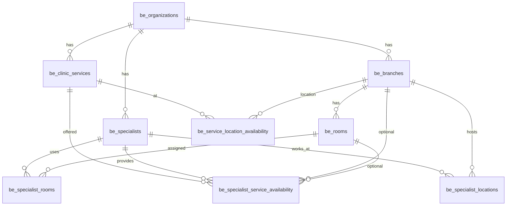
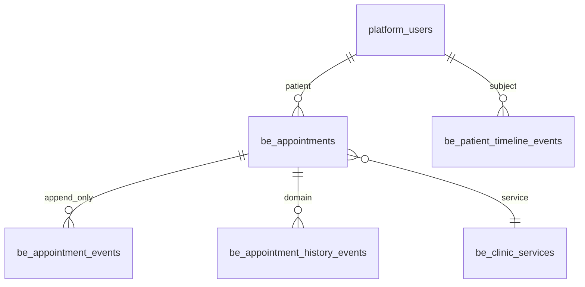

# Каноническая модель — этап 1 (зафиксировано)

Ориентир для Drizzle (`apps/webapp/db/schema/bookingEngine.ts`). Источник требований: ТЗ §17, §21–22, [`DATA_MODEL_REFERENCE.md`](DATA_MODEL_REFERENCE.md).

## Tenant

- Все доменные таблицы с префиксом `be_*` несут `organization_id` (FK → `be_organizations`).
- Дефолтная клиника: seed-UUID `a0000000-0000-4000-8000-000000000001` («Берсон»), ключ `booking_default_organization_id` в `system_settings` (admin).
- Переключатель Rubitime-моста: `booking_rubitime_bridge_enabled` (boolean, admin).

## ER (организация и доступность)

- **Филиал** не хранит список услуг — только `be_service_location_availability` и `be_specialist_service_availability`.
- **Услуга** одна на клинику (`title` + `duration_minutes` unique per org); разная доступность — только через связи.

## Запись и история

- `payment_ref`, `package_usage_ref` — text без FK (полиморф, этапы 5/6).
- `be_external_entity_mappings` — внешние id Rubitime (не в канонических колонках).

## Enum `appointment_status` (ТЗ §17)

| Значение | Смысл |
|----------|--------|
| `created` | Создана |
| `awaiting_payment` | Ожидает оплаты/предоплаты |
| `paid` | Оплачена |
| `confirmed` | Подтверждена |
| `rescheduled` | Перенесена (промежуточный после переноса) |
| `cancelled_by_patient` | Отменена пациентом |
| `cancelled_by_specialist` | Отменена специалистом |
| `late_cancellation` | Поздняя отмена |
| `no_show` | Неявка |
| `completed` | Завершена |
| `visit_confirmed` | Посещение подтверждено |
| `charged_to_package` | Списана по абонементу |
| `manual_review_required` | Требует ручного решения |

Терминальные: `cancelled_by_patient`, `cancelled_by_specialist`, `late_cancellation`, `no_show`, `completed`, `visit_confirmed`, `charged_to_package` (без выхода в активные, кроме `manual_review_required`).

## FSM (валидные переходы)

Реализация: `apps/webapp/src/modules/booking-engine/appointmentStatusFsm.ts`.

- Из `created` → `awaiting_payment`, `confirmed`, `manual_review_required`, отмены.
- Из `awaiting_payment` → `paid`, `confirmed`, отмены, `manual_review_required`.
- Из `paid` / `confirmed` → `rescheduled`, отмены, `completed`, `no_show`, `visit_confirmed`, `charged_to_package`, `manual_review_required`.
- Из `rescheduled` → `confirmed`, отмены, `manual_review_required`.
- Из `manual_review_required` → большинство не-терминальных (ручное решение).
- Терминальные — без исходящих (кроме запрета любых).

Каждая мутация статуса в service порождает `be_appointment_events` (+ при необходимости `be_appointment_history_events`, `be_patient_timeline_events`).

## Миграция с legacy

- `booking_cities` → `be_branches.city_code`
- `booking_branches` → `be_branches` + mapping `rubitime_branch_id`
- `booking_specialists` → `be_specialists` + `be_specialist_locations`
- `booking_services` → `be_clinic_services`
- `booking_branch_services` → `be_specialist_service_availability` + mappings
- `appointment_records` / `rubitime_records` → read-bridge в `be_appointments` (не удаляя legacy)

## Live mirror (2026-06-05)

При `booking_rubitime_bridge_enabled` и `be_external_entity_mappings` для записи:

- **Inbound:** Rubitime webhook → `AppointmentMirrorSync.applyInboundFromRubitime` → `be_appointments` + тот же snapshot в `appointment_records`.
- **Outbound:** канон lifecycle → Rubitime M2M (`update-record` / `cancelRecord`); порядок staff cancel vs reschedule — см. [`RUBITIME_BOOKING_PIPELINE.md`](../ARCHITECTURE/RUBITIME_BOOKING_PIPELINE.md).
- **Attribution:** `mirror_last_synced_from`, `mirror_synced_at`, `mirror_sync_version` в `payload_json` / meta; echo-guard ~8 с.

Код: `modules/booking-appointment-sync/`, `infra/repos/pgBookingRubitimeBridge.ts`.

Rollback: новые таблицы `DROP` в обратном порядке; legacy `booking_*` не трогаются.
