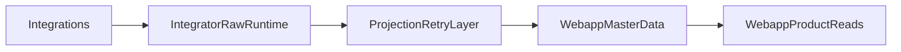

# DB Zones Restructure

## Статус документа

Это маршрут миграции верхнего уровня, а не build-plan реализации.

Документ фиксирует:
- целевое распределение ответственности между `webapp` и `integrator`;
- безопасный порядок этапов;
- ограничения и правила миграции.

Документ пока не фиксирует:
- точную целевую схему таблиц;
- детальную декомпозицию каждого этапа;
- конкретные implementation tasks по коду.

## Цель

Перевести patient-oriented и product-oriented данные в `webapp`, сохранив `integrator` как сервис интеграций, transport/runtime и raw integration storage.

Целевая модель:
- `webapp` владеет человеком, контактами, channel bindings, настройками коммуникаций, patient history, doctor-facing communication history, delivery analytics, appointments как продуктовой сущностью.
- `integrator` владеет только integration-specific/raw/runtime данными: webhook payloads, provider-specific records/events, transport state, dedup/retry/runtime jobs.
- На переходный период допускается дублирование данных, но только как управляемая проекция с явным master-owner и механизмом retry/reconciliation.

## Зафиксированные архитектурные решения

- `webapp` — master для `person/contact/bindings`.
- `integrator` должен стать обслуживающим сервисом для `webapp`.
- Допустим поэтапный перенос через отложенную синхронизацию и retry, даже если действие уже исполнено.
- БД логически общая, но сервисы должны оставаться разведены по ownership и схемам.
- Перенос делать не "всё сразу", а доменами и группами таблиц.
- Projection слой считается критическим инфраструктурным контуром, а не best-effort интеграцией: потеря projection-события недопустима.

## Усиленные guardrails (добавлено после review Stage 2)

Эти пункты обязательны для всех следующих domain moves:

- Projection delivery должен быть durable: outbox/queue + retry/backoff + dead-letter, а не fire-and-forget.
- Idempotency key должен быть детерминированным от бизнес-события; нельзя строить ключ на `Date.now()` для событий, которые должны дедуплицироваться.
- Контракт user identity между сервисами должен быть bigint-safe: не использовать JS `number` как канонический тип для `BIGSERIAL/BIGINT` идентификаторов.
- Webapp event handlers должны быть устойчивы к out-of-order доставке projection событий.
- Reconciliation считается обязательной частью каждого cutover, а не пост-фактум активностью.

## Инструкция для планирующих агентов (GPT/Claude/авто-агент)

> **Контекст:** этот roadmap реализуется через автоматических агентов (Cursor agent mode).
> При создании детального implementation plan для любого этапа (3–14) следуй этим правилам:

### Правила декомпозиции этапов

1. **Каждый этап** → 1 document с пошаговой инструкцией (по образцу [`STAGE2_REMEDIATION_TASKS_FOR_JUNIOR_AGENT.md`](./STAGE2_REMEDIATION_TASKS_FOR_JUNIOR_AGENT.md)).
2. **Каждая задача внутри этапа** = 1 PR. Одна задача делает одно: создаёт миграцию, или добавляет репозиторий, или рефакторит обработчик.
3. **Каждый шаг внутри задачи** — атомарное изменение одного файла: путь к файлу, что искать, на что заменить, что проверить.
4. **Тесты** — всегда отдельный шаг после production-изменений. Никогда не смешивать.
5. **Финальный шаг каждой задачи** — `pnpm run ci` должен быть зелёным.
6. **Не редактировать документы-планы.** Агент работает только с кодом и тестами.

### Шаблон задачи для авто-агента

```
## T<N> (P<приоритет>): <Название>
**Цель:** <одно предложение>.
**Текущее состояние:** <что сломано/отсутствует, с точными строками файлов>.
**Решение:** <краткое описание подхода>.
### Шаг T<N>.1: <описание>
**Файл:** <полный путь>
**Что найти:** <точный search pattern из кода>
**Заменить на:** <точный код замены>
**Верификация:** <как проверить>
### Шаг T<N>.X: Тесты
**Файл:** <путь к тест-файлу>
**Тесты:** <список тест-кейсов>
### Шаг T<N>.Y: Верификация
pnpm run ci
**DoD:** <критерии завершения>
```

### Обязательный контекст в каждом плане

- Таблица затронутых файлов.
- Ключевые факты о кодовой базе (DbPort.tx для транзакций, projection outbox, idempotency cache).
- Ссылки на guardrails из этого документа.
- Список "НЕ ДЕЛАТЬ" — что агент не должен менять.

### Порядок создания планов

Перед созданием плана для этапа N:
1. Убедиться что этап N-1 стабилизирован (reconciliation пройден, DLQ пуст).
2. Изучить текущий код — он мог измениться после предыдущих этапов.
3. Провести review плана (plan mode) перед запуском автоагента.
4. Не запускать автоагента без green CI на текущей ветке.

## Текущая база для roadmap

Опорные места в коде:
- `integrator` core сейчас хранит user/messaging state в `apps/integrator/src/infra/db/migrations/core`, `apps/integrator/src/infra/db/writePort.ts`, `apps/integrator/src/infra/db/readPort.ts`.
- `webapp` уже владеет platform-side user model и preferences в `apps/webapp/migrations/006_platform_users.sql` и `apps/webapp/migrations/003_channel_preferences.sql`.
- M2M-контракты уже есть в `apps/integrator/src/infra/adapters/webappEventsClient.ts`, `apps/integrator/src/infra/adapters/deliveryTargetsPort.ts`, `apps/webapp/src/app/api/integrator`.
- Backup перед integrator-migrations уже предусмотрен в `deploy/host/deploy-prod.sh` и `deploy/HOST_DEPLOY_README.md`.
- Отдельный риск: webapp migrations пока менее безопасны из-за `apps/webapp/scripts/run-migrations.mjs`.

## Принцип миграции



Смысл:
- входящие transport/provider payloads сначала сохраняются в `integrator` как raw/runtime truth;
- затем отдельная projection/sync-логика переносит user-oriented представление в `webapp`;
- продуктовые чтения и UI постепенно переводятся на `webapp`;
- только после стабилизации удаляются старые product/user reads и writes из `integrator`.

## Поэтапный маршрут

Ниже перечислен полный путь от подготовительного состояния до финального `prod state`.

### Этап 0. Зафиксировать ownership map и migration rules

Сделать единый ownership-документ по всем текущим таблицам:

`table -> owner -> source of truth -> projection target -> deprecation plan`

Результат этапа:
- все таблицы разбиты на категории: `raw integration`, `runtime transport`, `platform person`, `product history`, `analytics/audit`;
- для каждой таблицы определён конечный owner;
- для каждого домена выбран безопасный migration path: backfill -> dual-write/projection -> switch reads -> switch writes -> cleanup.

### Этап 1. Усилить safety rails для миграций и переноса данных

Перед любым переносом подготовить безопасный контур миграции:
- подтвердить и описать обязательный backup для обеих схем/обеих logical DB частей перед миграциями;
- добавить явный pre-migration checklist и post-migration verification checklist;
- отдельно закрыть риск webapp migrations, чтобы перенос patient-data не зависел от небезопасного повторного запуска SQL;
- предусмотреть reconciliation/verification scripts для сравнения counts и выборок между old/new storage.

Это обязательный фундамент до первого domain move.

### Этап 2. Ввести единый integration-to-webapp projection contract

Сначала не переносить таблицы, а стабилизировать способ передачи данных из `integrator` в `webapp`:
- определить единый формат durable projection events/commands из `integrator` в `webapp`;
- разделить события на группы: `identity/contact`, `booking/provider`, `message/history`, `delivery/status`, `preferences/state`;
- для каждой группы определить idempotency key, retry policy и reconciliation strategy;
- заложить правило: raw save в `integrator` не отменяется, даже если projection в `webapp` временно не доехала.
- зафиксировать explicit delivery policy: outbox + retry/backoff + dead-letter; plain fire-and-forget не считается достаточным.
- зафиксировать порядок и модель обработки out-of-order: downstream должен уметь принимать связанное событие даже если master upsert ещё не был подтверждён.
- зафиксировать ID contract для user link: bigint-safe формат (`string`/`decimal string`) между сервисами.

Именно этот слой потом позволит переносить домены по одному, не ломая runtime.

### Этап 3. Перенести master-данные пациента в `webapp`

Первым переносить базовый patient master:
- человек/пациент;
- verified contacts;
- channel bindings;
- channel preferences / notification settings.

Порядок:
1. подготовить целевую модель в `webapp`;
2. сделать backfill из текущих `integrator` таблиц в `webapp`;
3. включить projection/dual-write из `integrator` в `webapp` для новых изменений;
4. перевести product/read-side на `webapp`;
5. оставить в `integrator` только transport/runtime shadow-данные, нужные для доставки и state.

Важно: notification flags (`notify_spb`, `notify_msk`, `notify_online`, `notify_bookings`) сейчас живут в `integrator.telegram_state` — channel-specific runtime state. При переносе person domain эти флаги проецируются в `webapp.user_channel_preferences` (или расширение модели), а `telegram_state` остаётся в `integrator` как transport/runtime.
Важно: backfill и online projection для person-domain должны использовать единый canonical identifier contract без потери точности ID.

Результат этапа:
- `webapp` становится master для `person/contact/bindings/preferences`;
- новые и существующие пользователи обслуживаются через новую модель;
- `integrator` перестаёт быть source of truth для этого домена.

### Этап 4. Стабилизировать patient master после cutover

После первого переноса нужно отдельно стабилизировать домен:
- выполнить reconciliation old/new;
- проверить retry/failure paths projection;
- убрать legacy product reads для этого домена;
- зафиксировать cutover rules и rollback boundaries;
- подтвердить, что `webapp` обслуживает домен без fallback на старый ownership.
- подтвердить устойчивость к out-of-order delivery (`contact/preferences` события не ломают обработку при временном отсутствии master row).
- подтвердить, что неуспешные projection события не теряются и повторно обрабатываются до достижения консистентности.

Результат этапа:
- первый домен не просто перенесён, а устойчиво работает в новой модели;
- этот паттерн можно повторять для следующих доменов.

### Этап 5. Перенести коммуникационную историю в `webapp`

Следующим независимым блоком переносить messaging/support history:
- `conversations`;
- `conversation_messages`;
- `user_questions`;
- `question_messages`;
- text/file metadata сообщений;
- `message_drafts` (draft UX: user-facing, но runtime-тяжёлые; при переносе решить — webapp master или оставить в integrator как technical);
- doctor/admin outbound logs;
- delivery result history по каналам.

Принцип:
- `integrator` остаётся местом raw inbound/outbound transport processing;
- `webapp` становится местом общей user-facing communication history across channels;
- каждое сообщение/файл получает channel metadata + normalized text/file references + delivery status trail.

Важно: это делать отдельным этапом после patient master, а не вместе с ним.

Результат этапа:
- в `webapp` появляется единая user-facing communication history;
- новые сообщения и вопросы проецируются в новую модель.

### Этап 6. Стабилизировать communication domain

После переноса коммуникаций:
- выполнить reconciliation исторических сообщений и тредов;
- проверить вложения, metadata и delivery statuses;
- убрать legacy product reads из `integrator`;
- подтвердить, что support/question flows читаются из `webapp`.

Результат этапа:
- communication history стабильно работает в новой модели;
- `integrator` больше не нужен как product read source для этого домена.

### Этап 7. Перенести reminders и content access в `webapp`

Отдельным этапом после communication history перенести user-facing reminder domain:
- `user_reminder_rules` — patient-facing правила напоминаний;
- `content_access_grants` — доступ к защищённому контенту.

`user_reminder_occurrences` и `user_reminder_delivery_logs` — граница runtime/product:
- occurrences со статусом `planned`/`queued` — runtime scheduling, может оставаться в `integrator`;
- occurrences со статусом `sent`/`failed` и delivery logs — product history, проекция в `webapp`.

Порядок:
1. определить целевую модель reminder rules / access grants в `webapp`;
2. backfill из текущих таблиц `integrator`;
3. включить projection для новых правил и occurrence history;
4. перевести product reads на `webapp`;
5. в `integrator` оставить runtime scheduling и technical delivery.

Результат этапа:
- `webapp` является master для reminder rules и content access;
- product history напоминаний читается из `webapp`;
- runtime scheduling может оставаться в `integrator`.

### Этап 8. Стабилизировать reminders domain

После переноса reminders:
- выполнить reconciliation reminder rules и access grants;
- проверить delivery logs projection;
- убрать legacy product reads для reminders;
- подтвердить, что webapp обслуживает reminder настройки и историю.

Результат этапа:
- reminders domain устойчиво работает в новой модели.

### Этап 9. Перенести product appointments view в `webapp`

Для appointment-domain идти после patient master и communication history:
- сначала оставить `rubitime_records`/`rubitime_events` как raw provider storage в `integrator`;
- в `webapp` завести user-oriented appointment representation, не завязанную жёстко на RubiTime;
- сделать projection из provider-specific storage в product appointment model;
- перевести doctor/patient reads на `webapp` модель;
- сохранить в `integrator` только provider payload/history и retry/integration state.

Это позволит потом без ломки UI добавить второй провайдер записи или собственную запись.

Результат этапа:
- patient/doctor product reads по appointments переходят на `webapp`;
- provider-specific данные остаются технической зоной `integrator`.

### Этап 10. Стабилизировать appointments domain

После переноса appointments:
- выполнить reconciliation между provider storage и product projection;
- проверить отмены, обновления, дубликаты и переигровку событий;
- убрать старые product read paths;
- подтвердить, что product appointment model устойчива к новым provider events.

Результат этапа:
- appointments живут в новой архитектуре без опоры на legacy product reads.

### Этап 11. Перенести subscription/mailing stack и channel analytics в `webapp`

Объединённый этап для двух связанных по масштабу доменов.

**Subscription/mailing stack:**
- `mailing_topics` (product-level категории подписок) и `user_subscriptions` (выбор пользователя) — product/preferences → webapp;
- `mailings` — runtime queue → остаётся в `integrator`;
- `mailing_logs` — audit → projection в `webapp`.

**Channel analytics и SMS delivery accounting:**
- журнал отправленных сообщений;
- доставлено/не доставлено;
- количество SMS и их статусы;
- payload summary и текст сообщения для операционного анализа;
- channel-level aggregates для специалиста/админки.

`integrator` остаётся источником transport facts; `webapp` — источником user-facing и business-facing reporting.

Результат этапа:
- product-level подписки управляются через `webapp`;
- бизнесовые журналы отправок и delivery-аналитика собираются в `webapp`;
- runtime queues и transport facts остаются в `integrator`.

### Этап 12. Стабилизировать subscription/mailing и analytics domain

После переноса:
- reconciliation subscription data и mailing logs;
- reconciliation delivery data и агрегатов;
- проверить SMS delivered/failed counts;
- убрать старые product-level отчёты и subscription reads из `integrator`;
- подтвердить достоверность новой бизнесовой аналитики.

Результат этапа:
- subscription preferences и specialist/admin-facing audit работают в новой модели.

### Этап 13. Cleanup и деактивация legacy

Когда все домены стабилизированы:
- перевести оставшиеся UI/API чтения на `webapp`;
- запретить создание новых product/user writes в `integrator` для перенесённых доменов;
- ввести мониторинг lag/retry/failures для projection paths;
- архивировать или freeze старые user-oriented таблицы `integrator`;
- убрать устаревшие read и write paths;
- задокументировать final ownership map;
- оставить только те shadow/runtime таблицы, которые реально нужны для transport-state и raw replay/audit.

Cleanup делать по доменам, а не одним большим удалением.

Результат этапа:
- `integrator` больше не владеет product domains как source of truth;
- legacy product storage выведен из штатной работы;
- остаются только нужные technical shadow/runtime/raw таблицы.

### Этап 14. Финализация целевого `prod state`

На последнем шаге:
- обновить документацию ownership и постоянные guardrails;
- зафиксировать финальную модель добавления новых интеграций;
- подтвердить, что новый канал или новый provider добавляется как integration-data, а не как новый product storage;
- проверить, что все активные product domains читаются из `webapp`, а `integrator` обслуживает только integration/runtime слой.

Результат этапа:
- достигнуто целевое `prod state`;
- `webapp` окончательно является master для patient/product domains;
- `integrator` окончательно является integration/runtime service.

## Рекомендуемый порядок доменов

1. Ownership map + safety rails + projection contract.
2. Patient master migration.
3. Patient master stabilization.
4. Communication history migration.
5. Communication history stabilization.
6. Reminders + content access migration.
7. Reminders stabilization.
8. Product appointments migration.
9. Product appointments stabilization.
10. Subscription/mailing + analytics/audit migration.
11. Subscription/mailing + analytics stabilization.
12. Legacy cleanup.
13. Final `prod state`.

Такой порядок минимизирует риск: сначала стабилизирует master-данные (person), затем историю коммуникаций, потом user-facing rules (reminders), затем provider-driven сущности (appointments), и в конце — subscription/analytics. Каждый домен стабилизируется до начала следующего.

## Что не делать в первом проходе

- Не пытаться сразу слить все таблицы `integrator` в `webapp`.
- Не делать один общий "mega migration".
- Не переводить raw provider storage (`rubitime_events`, provider payloads, transport state) в `webapp`.
- Не удалять старые таблицы до завершения backfill, projection и switch-over чтений.
- Не опираться на webapp migrations без отдельного усиления их safety-модели.
- Не строить idempotency keys для projection на недетерминированных значениях (`Date.now()`, random suffix), если событие требует дедупликации.
- Не передавать canonical `BIGINT` IDs между сервисами как JS `number`.

## Критерий готовности к следующему шагу

После утверждения этого roadmap следующий шаг должен быть уже не кодинг, а детальная декомпозиция первого этапа:
- финальная ownership map по текущим таблицам;
- требования к backup/reconciliation;
- целевой migration contract `integrator -> webapp`;
- только потом проектирование целевой схемы `webapp` по доменам.

## Что считается финальной точкой

Финальная цель roadmap достигнута только когда одновременно выполнены все условия:
- `webapp` является master для patient/product domains;
- все product reads идут из `webapp`;
- новые product writes не создаются в `integrator` как в source of truth;
- `integrator` хранит только raw/provider/runtime/transport данные;
- legacy product storage в `integrator` выведен из штатной работы;
- backup, reconciliation и cutover rules закреплены как постоянные эксплуатационные правила.

## Связанные документы

- [DB_MIGRATION_PREPARATION_FOUNDATION.md](./DB_MIGRATION_PREPARATION_FOUNDATION.md) — Stage 1: реестр таблиц, ownership, backup, safeguards, projection draft, readiness checklist.
- [DB_MIGRATION_STAGE2_PATIENT_MASTER.md](./DB_MIGRATION_STAGE2_PATIENT_MASTER.md) — Stage 2: план переноса patient master domain.
- [STAGE2_REMEDIATION_PLAN.md](./STAGE2_REMEDIATION_PLAN.md) — план исправления ошибок Stage 2.
- [STAGE2_REMEDIATION_TASKS_FOR_JUNIOR_AGENT.md](./STAGE2_REMEDIATION_TASKS_FOR_JUNIOR_AGENT.md) — **образец** детальной пошаговой инструкции для авто-агента (T1–T6).
- [DB_STRUCTURE_AND_RECOMMENDATIONS.md](../ARCHITECTURE/DB_STRUCTURE_AND_RECOMMENDATIONS.md) — модель integrator users/identities/contacts.
- [apps/integrator/src/infra/db/schema.md](../../apps/integrator/src/infra/db/schema.md) — контракт core/integration таблиц integrator.
