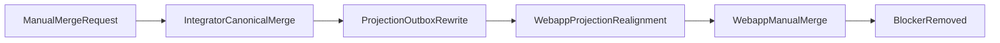

# Platform User Merge v2 — Master Plan

## Проблема

В **v1** (webapp) ручной merge двух клиентов с **разными non-null `integrator_user_id`** жёстко запрещён (`different_non_null_integrator_user_id`): иначе риск «фантомного» пользователя и рассинхрона проекций между БД integrator (`users.id`) и webapp (таблицы с `integrator_user_id`).

**v2** закрывает этот разрыв: в **integrator DB** вводится canonical-модель (alias / `merged_into_user_id`), транзакционный merge двух integrator-пользователей, переписывание/дедуп `projection_outbox`, затем **realignment** webapp projection-таблиц. После валидации — feature-flag и смена операторского flow: **сначала integrator merge, потом webapp merge**.

## Цели (DoD)

1. В integrator DB есть устойчивая модель alias для `users` и merge двух `id` без потери идемпотентности outbox.
2. Loser `integrator_user_id` **не появляется** в read-side webapp projection-таблицах после успешного merge + realignment.
3. Нет **resurrection**: stale loser id не может снова породить отдельные канонические строки в integrator или webapp при нормальном write path.
4. `projection_outbox` остаётся согласованным с **уникальным `idempotency_key`** после merge/rewrite.
5. Сценарий merge при **двух разных** non-null integrator id проходит end-to-end под флагом.
6. Инварианты **v1** сохранены: нет регрессий `503`-loop на merge-class конфликтах ingestion, strict purge / manual merge / audit.

## Non-goals (явно вне v2 или отложено)

- Physical delete alias-строк `platform_users` / `users` (как в v1 для webapp).
- Полный replay всех отложенных событий после `auto_merge_conflict` (например `preferences.updated` — см. ограничения v1; отдельная задача при необходимости).
- Замена двух отдельных БД одной.

## Техническая карта

## Deploy slicing (4 деплоя в `main`)

Каждый деплой = merge PR в `main` → CI → `deploy/host/deploy-prod.sh` (бэкап **обеих** БД → миграции integrator → миграции webapp → рестарт API, worker, webapp). Подробно: [`CHECKLISTS.md`](CHECKLISTS.md), [`CUTOVER_RUNBOOK.md`](CUTOVER_RUNBOOK.md).

| Deploy | Содержание | Webapp blocker |
|--------|------------|----------------|
| **1** | Integrator DDL: `users.merged_into_user_id` (+ CHECK, index), без изменения поведения | Сохранён |
| **2** | Integrator canonical read/write перед enqueue и guards от записи в loser | Сохранён |
| **3** | `mergeIntegratorUsers`, rewrite/dedup outbox, webapp realignment jobs/SQL | Сохранён до проверки данных |
| **4** | `system_settings` feature flag, API/UI: integrator merge → webapp merge, снятие unconditional blocker | Управляется флагом |

## Readiness gates (перед включением флага)

Закрытие инициативы и репозиторное evidence: **[`STAGE_C_CLOSEOUT.md`](STAGE_C_CLOSEOUT.md)** (**2026-04-10**, audited repository tree / working-tree snapshot с зафиксированными проверками).

- [x] Нет строк projection в webapp с loser `integrator_user_id` по чек-листу из [`sql/README.md`](sql/README.md) — **инструменты + реализация + аудиты Stage 3–4**; **на production** после каждого merge пары оператор фиксирует вывод gate SQL в тикете (см. `STAGE_C_CLOSEOUT` §4).
- [x] `projection_outbox`: нет противоречий уникальному `idempotency_key`; pending не несут «ломающих» loser-only ключей без политики — **код merge + тесты + projection health**; **на production** — сводка статусов и шаблон проверки pending в `STAGE_C_CLOSEOUT` §4.
- [x] Ручной e2e: два разных integrator id → merge → одна каноническая связка в webapp — **репозиторно:** stub-flow + API/route тесты Stage 5; **полный UI/две БД** — опциональное усиление ([`AUDIT_STAGE_5.md`](AUDIT_STAGE_5.md) MANDATORY §5).
- [x] Регрессия: `pnpm run ci`, targeted тесты ingestion / merge / purge — **выполнено 2026-04-10** (см. `STAGE_C_CLOSEOUT`).

## Статус инициативы (Stage C)

**Завершено (audited repository tree): 2026-04-10.** Детали, closure report и команды проверок: [`STAGE_C_CLOSEOUT.md`](STAGE_C_CLOSEOUT.md). Аудит закрытия: [`AUDIT_STAGE_C.md`](AUDIT_STAGE_C.md).

## Координация коммитов и деплоя

См. раздел **«Коммиты, миграции и деплой»** в [`CHECKLISTS.md`](CHECKLISTS.md) (кратко) и детали в [`CUTOVER_RUNBOOK.md`](CUTOVER_RUNBOOK.md).

- Миграции integrator: `apps/integrator/src/infra/db/migrations/core/` (и при необходимости `apps/integrator/src/integrations/*/db/migrations/`).
- Миграции webapp: `apps/webapp/migrations/`.
- Production env: [`../ARCHITECTURE/SERVER CONVENTIONS.md`](../ARCHITECTURE/SERVER%20CONVENTIONS.md) — `api.prod` / `webapp.prod` / `cutover.prod`.

## Декомпозиция для агентов

| Агент | Фокус |
|-------|--------|
| Docs / runbook | Эта папка + ссылки в `docs/README.md`, `PLATFORM_USER_MERGE.md` |
| Integrator schema | STAGE_1 + миграция DDL |
| Canonical write path | STAGE_2 + `writePort.ts`, repos |
| Merge + outbox | STAGE_3 |
| Webapp realignment | STAGE_4 |
| Feature flag + UI | STAGE_5 + `ALLOWED_KEYS`, admin merge flow |
| Release | STAGE_C + `CUTOVER_RUNBOOK` verification |

## Связанные документы

- Архитектура v1/v2 инварианты: [`../ARCHITECTURE/PLATFORM_USER_MERGE.md`](../ARCHITECTURE/PLATFORM_USER_MERGE.md)
- Журнал strict purge / manual merge v1: [`../REPORTS/STRICT_PURGE_MANUAL_MERGE_EXECUTION_LOG.md`](../REPORTS/STRICT_PURGE_MANUAL_MERGE_EXECUTION_LOG.md)
- Структура БД: [`../ARCHITECTURE/DB_STRUCTURE.md`](../ARCHITECTURE/DB_STRUCTURE.md)
- Integrator schema contract: [`../../apps/integrator/src/infra/db/schema.md`](../../apps/integrator/src/infra/db/schema.md)
