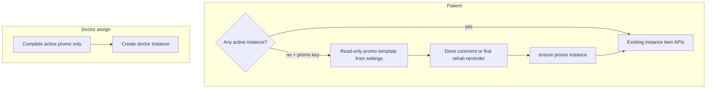

# Источник назначения программы (`assignment_source`) и промо по умолчанию

**Статус:** закрыто (v1). **Канон:** этот файл — полная спецификация, решения после выката и чеклист; архивный указатель Cursor — [`.cursor/plans/archive/promo_assignment_source.plan.md`](../.cursor/plans/archive/promo_assignment_source.plan.md).

---

## Реализованные решения (журнал)

- **Один активный инстанс на пациента:** partial unique index в миграции [`apps/webapp/db/drizzle-migrations/0072_treatment_program_assignment_source.sql`](../apps/webapp/db/drizzle-migrations/0072_treatment_program_assignment_source.sql) + retry в `assignTemplateToPatient` для `promo` при `23505` / `SECOND_ACTIVE_TREATMENT_PROGRAM_MESSAGE`.
- **Метрики использования шаблонов/курсов** (`activeTreatmentProgramInstanceCount` и т.п.): в v1 агрегаты **не** исключали `promo`/`course`; **клиническая** нагрузка в кабинете врача отделена фильтром `assignment_source = 'doctor'` в [`pgDoctorClients`](../apps/webapp/src/infra/repos/pgDoctorClients.ts) и в `onSupportCount`.
- **Напоминание `rehab_program` без инстанса:** клиент передаёт `PATIENT_REHAB_PROGRAM_LINKED_PLACEHOLDER`; [`POST /api/patient/reminders/create`](../apps/webapp/src/app/api/patient/reminders/create/route.ts) подставляет id активного плана или вызывает `ensureDefaultPromoProgramForPatient`.
- **Транзакции (v1):** завершение промо при врачебном назначении и цепочка «материализация → действие пациента» — **последовательные** вызовы сервиса/порта; согласованность обеспечивают БД (partial unique) и повторное чтение при коллизии. Одна обёртка `db.transaction` на весь сценарий **не** внедрялась (техдолг при необходимости строгой атомарности).
- **Покрытие тестами:** contract на SQL в `pgDoctorClients.appointmentJoin.contract.test.ts`; `instance-service.test.ts` (промо + врач, параллельный ensure, нет ключа); `reminders/create/route.test.ts`; `courses/service.test.ts` (`assignmentSource: "course"`); моки home/treatment для `getPatientDefaultPromoTreatmentProgramTemplateId`.

### Вынесено из v1 (backlog)

Смена **глобального** промо-шаблона: уведомление пациентам, согласие, миграция инстансов и напоминаний — см. [`BACKLOG_TAILS.md`](BACKLOG_TAILS.md).

---

## Ключевые артефакты

| Область | Где |
|--------|-----|
| Схема Drizzle | [`apps/webapp/db/schema/treatmentProgramInstances.ts`](../apps/webapp/db/schema/treatmentProgramInstances.ts) |
| Миграция | `0072_treatment_program_assignment_source.sql` |
| Сервис экземпляров | [`instance-service.ts`](../apps/webapp/src/modules/treatment-program/instance-service.ts) |
| Ключ настроек | `patient_default_promo_treatment_program_template_id` в `ALLOWED_KEYS`, [`system-settings/service.ts`](../apps/webapp/src/modules/system-settings/service.ts), [`admin/settings/route.ts`](../apps/webapp/src/app/api/admin/settings/route.ts) |
| Админ промо | [`/app/admin/promo`](../apps/webapp/src/app/app/admin/promo/) |
| Материализация (API) | [`treatment-program-promo/action`](../apps/webapp/src/app/api/patient/treatment-program-promo/action/route.ts) |
| Врач: назначение | [`treatment-program-instances/route.ts`](../apps/webapp/src/app/api/doctor/clients/[userId]/treatment-program-instances/route.ts) (`assignmentSource: "doctor"`) |
| Курс | [`courses/service.ts`](../apps/webapp/src/modules/courses/service.ts) (`assignmentSource: "course"`) |

---

## Контекст в коде (актуализировано)

- Экземпляр создаётся в Drizzle: [`pgTreatmentProgramInstance.ts`](../apps/webapp/src/infra/repos/pgTreatmentProgramInstance.ts) — в т.ч. колонка `assignment_source`.
- Врач при назначении: [`treatment-program-instances/route.ts`](../apps/webapp/src/app/api/doctor/clients/[userId]/treatment-program-instances/route.ts) — `assignedBy`, **`assignmentSource: "doctor"`**.
- Пустой индивидуальный план: `createBlankIndividualPlan` — **`assignment_source = doctor`**.
- Курс: `enrollPatient` → **`assignment_source = course`**.
- «На сопровождении» / клиенты с программой: `pgDoctorClients` — активный план для флага и ссылок: **`status = 'active' AND assignment_source = 'doctor'`** (промо и курс не попадают в клинический счёт).
- Рассылки: аудитория строится от `listClients` → тот же клинический флаг.
- Напоминания `rehab_program`: `validateLinkedFields`; UI — `listForPatient` / ensure по placeholder.

## Scope и не-цели (v1)

**В scope (v1):** колонка + семантика `assignment_source`, backfill, фильтр врача `doctor`, ключ `system_settings`, виртуальный промо без active, материализация по действию/напomинанию, завершение промо при назначении врача, админ-страница и минимальная статистика, backlog про смену шаблона.

**Вне scope v1:** мультиактивные планы; миграция пациентов при смене глобального шаблона; полная продуктовая воронка.

## Продуктовая модель

| Состояние | Поведение |
|-----------|-----------|
| Есть любой `active` (`doctor` / `course` / `promo`) | Не показывать виртуальный промо; `rehab_program` → реальный `instanceId`. |
| Нет `active`, ключ промо валиден | Просмотр шаблона промо без строки `treatment_program_instances` (где предусмотрено UX). |
| Первое действие по пункту промо | Материализация `promo` + действие на созданных `stageItem` (последовательные шаги в v1). |
| Первое `rehab_program` без active | `ensureDefaultPromoProgramForPatient` до создания правила. |
| Врач назначает при активном `promo` | Завершить `promo` (событие), создать `doctor`. |
| Активный `course` или `doctor` | Не создавать второй `promo` в обход правил. |

### Семантика `ensureDefaultPromoProgramForPatient`

- Есть **любой** `active` → не создавать промо для чисто-промо операций; для напоминаний — существующий активный план.
- Нет `active`, ключ валиден → один инстанс `promo` (идемпотентность при гонке).
- Нет `active`, ключ пуст/невалиден → 4xх там, где нужен инстанс.

### Гонки: «один active на пациента»

**Реализовано (вариант A):** partial unique `UNIQUE (patient_user_id) WHERE status = 'active'` + обработка `23505` / повторное чтение активного `promo`.

## Разделы спецификации (детализация)

### 1. Данные и миграции

- `assignment_source` `NOT NULL`, `CHECK ('doctor','promo','course')`, backfill (`assigned_by` → `doctor`, иначе → `course`), дедуп лишних active при вводе индекса — в `0072`.
- Drizzle-схема и типы в [`types.ts`](../apps/webapp/src/modules/treatment-program/types.ts), in-memory порт с `assignment_source`.

### 2. Сервис экземпляров

См. [`instance-service.ts`](../apps/webapp/src/modules/treatment-program/instance-service.ts): `assignTemplateToPatient`, `createBlankIndividualPlan`, `ensureDefaultPromoProgramForPatient`, зав completion промо при врачебном assign, события `status_changed` / payload с `supersededBy` где применимо.

### 3. Конфиг промо

Только БД: ключ admin, валидация published шаблона при PATCH, зеркало через `updateSetting`, без env для шаблона.

### 3.1 Безопасность

Пациентский промо-API не принимает произвольный `templateId`; материализация привязана к сессии и опубликованному шаблону из настроек.

### 4. Врачебный кабинет

`pgDoctorClients` и `onSupportCount` — только `assignment_source = 'doctor'`. Usage-агрегаты шаблонов/курсов без фильтра по источнику (оговорено выше).

### 5–6. Пациент и напоминания

Виртуальный промо при отсутствии любого active; RSC/home/treatment/go; `revalidatePatientTreatmentProgramUi`; sentinel для `rehab_program` в create.

### 7. Админ

Маршрут `/app/admin/promo`, выбор шаблона, stats по `promo`.

### 8. Вызывающие стороны

Курс и врач задают источник явно. Модуль `lfk-assignments` относится к **LFK-комплексам**, не к `treatment_program_instances`.

### 9–10. Документация и тесты

Этот файл заменяет прежний `docs/LOG/PROMO_ASSIGNMENT_SOURCE.md`. Тесты — см. раздел «Покрытие тестами» выше.

## Definition of Done (v1)

- [x] `assignment_source` в схеме, миграция, backfill, типы, in-memory.
- [x] Явный источник у путей создания экземпляра программы лечения (курс / врач / промо / blank).
- [x] Врачебные списки и `onSupportCount` — клинический фильтр `doctor`.
- [x] Промо: виртуальный показ без любого active; материализация по триггерам; безопасность §3.1 (транзакция «всё в одном round-trip» — вынесена в техдолг, см. журнал выше).
- [x] Напоминания: ensure → create → sync.
- [x] Admin: ключ + UI + валидация published.
- [x] Backlog про смену глобального шаблона; документ в `docs/` синхронизирован с архивным указателем плана.
