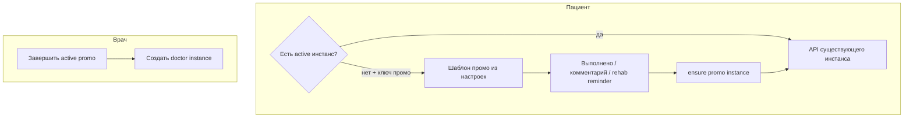

# Источник назначения программы (`assignment_source`) и промо по умолчанию

**Статус:** v1 **закрыт** в коде. Этот файл — **единый канон**: спецификация, принятые решения, ссылки на реализацию и DoD.  
**Служебная запись Cursor:** [`.cursor/plans/archive/promo_assignment_source.plan.md`](../.cursor/plans/archive/promo_assignment_source.plan.md) (только указатель на этот документ).

## Решения после реализации (факты)

- **Один активный инстанс на пациента:** partial unique index в [`apps/webapp/db/drizzle-migrations/0072_treatment_program_assignment_source.sql`](../apps/webapp/db/drizzle-migrations/0072_treatment_program_assignment_source.sql) + retry в `assignTemplateToPatient` для `promo` при `23505` / `SECOND_ACTIVE_TREATMENT_PROGRAM_MESSAGE` ([`instance-service.ts`](../apps/webapp/src/modules/treatment-program/instance-service.ts)).
- **Метрики использования шаблонов/курсов** (`activeTreatmentProgramInstanceCount` и т.п.): в v1 **не** исключали `promo`/`course` из агрегатов; **клиническая** нагрузка у врача отделена фильтром `assignment_source = 'doctor'` в [`pgDoctorClients.ts`](../apps/webapp/src/infra/repos/pgDoctorClients.ts) и в `onSupportCount`.
- **Напоминание `rehab_program` без инстанса:** sentinel `PATIENT_REHAB_PROGRAM_LINKED_PLACEHOLDER`; [`POST /api/patient/reminders/create`](../apps/webapp/src/app/api/patient/reminders/create/route.ts) подставляет id активного плана или вызывает `ensureDefaultPromoProgramForPatient`.
- **Транзакции (v1):** завершение активного `promo` при врачебном назначении и цепочка «материализация → действие пациента» идут **последовательными** вызовами порта/сервиса, не одной обёрткой `db.transaction` на весь сценарий. Целостность «один active» — **partial unique** и повторное чтение при коллизии. Объединение в одну SQL-транзакцию — техдолг при необходимости строгой атомарности.
- **Покрытие тестами:** contract на SQL в `pgDoctorClients`; [`instance-service.test.ts`](../apps/webapp/src/modules/treatment-program/instance-service.test.ts) (авто-complete промо, параллельный ensure, нет ключа); [`reminders/create/route.test.ts`](../apps/webapp/src/app/api/patient/reminders/create/route.test.ts); [`courses/service.test.ts`](../apps/webapp/src/modules/courses/service.test.ts) (`assignmentSource: "course"`).

## Ключевые артефакты (быстрый указатель)

| Область | Где |
|--------|-----|
| Схема + CHECK | [`apps/webapp/db/schema/treatmentProgramInstances.ts`](../apps/webapp/db/schema/treatmentProgramInstances.ts) |
| Миграция + backfill + partial unique | `0072_treatment_program_assignment_source.sql` |
| Ключ настройки | `patient_default_promo_treatment_program_template_id` в [`types.ts`](../apps/webapp/src/modules/system-settings/types.ts), чтение [`service.ts`](../apps/webapp/src/modules/system-settings/service.ts) (`getPatientDefaultPromoTreatmentProgramTemplateId`) |
| Admin UI промо | [`/app/admin/promo`](../apps/webapp/src/app/app/admin/promo/page.tsx) |
| Материализация / действие | [`POST .../treatment-program-promo/action`](../apps/webapp/src/app/api/patient/treatment-program-promo/action/route.ts) |
| Виртуальный промо (RSC) | [`treatment/promo/`](../apps/webapp/src/app/app/patient/treatment/promo/), home / list программ |
| Follow-up (вне v1) | [`BACKLOG_TAILS.md`](BACKLOG_TAILS.md) — смена глобального промо-шаблона |

---

## Спецификация (исходный усиленный план)

### Контекст в коде (актуализировано к состоянию репозитория)

- Экземпляр создаётся в Drizzle: [`pgTreatmentProgramInstance.ts`](../apps/webapp/src/infra/repos/pgTreatmentProgramInstance.ts) — в т.ч. колонка **`assignment_source`**.
- Врач при назначении: [`treatment-program-instances/route.ts`](../apps/webapp/src/app/api/doctor/clients/%5BuserId%5D/treatment-program-instances/route.ts) — `assignedBy` + **`assignmentSource: "doctor"`**.
- Пустой индивидуальный план: [`createBlankIndividualPlan`](../apps/webapp/src/modules/treatment-program/instance-service.ts) → **`assignment_source = doctor`**.
- Курс: [`courses/service.ts`](../apps/webapp/src/modules/courses/service.ts) — **`assignmentSource: "course"`** при `enrollPatient`.
- «На сопровождении» / клиенты с программой у врача: [`pgDoctorClients.ts`](../apps/webapp/src/infra/repos/pgDoctorClients.ts) — активная программа для флага и ссылок только при **`assignment_source = 'doctor'`** (тот же фильтр в `getDashboardPatientMetrics` / `onSupportCount`).
- Рассылки: аудитория строится через `listClients` из портов врача → та же семантика `activeTreatmentProgram`.
- Напоминания `rehab_program`: [`validateLinkedFields`](../apps/webapp/src/modules/reminders/service.ts); UI — [`RemindersPageBody.tsx`](../apps/webapp/src/app/app/patient/reminders/RemindersPageBody.tsx).
- Действия по пунктам с инстансом: [`/api/patient/treatment-program-instances/[instanceId]/...`](../apps/webapp/src/app/api/patient/treatment-program-instances/).

### Scope и не-цели

**В scope (v1):**

- Колонка + семантика `assignment_source`, backfill, врачебный фильтр «только специалист» (`doctor`).
- Ключ `system_settings` (admin) для UUID шаблона промо + чтение на сервере.
- Виртуальный показ опубликованного шаблона промо, если **нет ни одного** `active` экземпляра.
- Материализация `promo` при первом «Выполнено» / комментарии к пункту промо / первом создании `rehab_program` напоминания.
- Авто-`completed` для активного `promo` при успешном назначении врача (в v1 — последовательные шаги сервиса; см. блок «Решения» выше).
- Admin UI: выбор шаблона промо + минимальная статистика по `promo`.
- Документация и backlog-пункт про смену промо-шаблона (без реализации смены в v1).

**Вне scope (v1):**

- Мультиактивные планы и перелистывание UI.
- Миграция существующих пациентов на новый промо-шаблон после смены в админке.
- Воронка/полноценная аналитика конверсий.

### Продуктовая модель

| Состояние | Поведение |
|-----------|-----------|
| Есть любой `active` экземпляр (`doctor` / `course` / `promo`) | **Не** показывать виртуальный промо-оверлей; напоминания `rehab_program` ведут на реальный `instanceId` текущего плана. |
| Нет `active` и задан опубликованный шаблон промо | Пациент видит контент **шаблона промо** без строки `treatment_program_instances`. |
| Первое «Выполнено» или комментарий по пункту промо | Материализация `promo` + действие на сопоставленных `stageItem` id (см. реализацию API). |
| Первое создание напоминания `rehab_program` | Перед записью: при отсутствии `active` — `ensureDefaultPromoProgramForPatient` → валидный `linkedObjectId`. |
| Назначение врачом при активном `promo` | Завершить активный `promo` (событие с причиной), создать инстанс `doctor`. |
| Активный `course` или `doctor` | Не создавать второй `promo`; ensure не обходит проверку «нет active». |

#### Строгая семантика ensure (имя в коде: `ensureDefaultPromoProgramForPatient`)

- Есть **любой** `active` → промо не создавать; для напоминаний использовать существующий `instanceId`.
- Нет `active` и ключ промо валиден → один инстанс `promo` (идемпотентность при гонке).
- Нет `active` и ключ пуст/невалиден → 4xx там, где нужен инстанс/напоминание по программе.

#### Гонки и «один active на пациента»

**Реализовано:** вариант A — partial unique index `UNIQUE (patient_user_id) WHERE status = 'active'` + обработка коллизии (`23505`) и повторное чтение активного `promo` в сервисе.

### Данные и миграции

- Колонка `assignment_source` `NOT NULL` + `CHECK` ∈ `doctor`, `promo`, `course`.
- Backfill: `assigned_by IS NOT NULL` → `doctor`; иначе → `course`.
- Drizzle-схема и журнал миграций — см. `db/schema`, `db/drizzle-migrations/meta/_journal.json`.

### Сервис экземпляров

Файл: [`instance-service.ts`](../apps/webapp/src/modules/treatment-program/instance-service.ts) — `assignTemplateToPatient`, `createBlankIndividualPlan`, `ensureDefaultPromoProgramForPatient`, завершение промо при врачебном assign, события auto-complete.

### Конфиг промо (только БД)

- Ключ в `ALLOWED_KEYS`, scope `admin`; валидация published при сохранении в [`admin/settings/route.ts`](../apps/webapp/src/app/api/admin/settings/route.ts).
- Зеркало integrator — через `updateSetting` (см. правила проекта по `system_settings`).

### Безопасность

- Пациентский промо-API не принимает произвольный `templateId` от клиента.
- Материализация только для текущего пользователя и опубликованного шаблона.

### Врачебный кабинет: специалист = `doctor`

- Фильтр в SQL patient list и метриках — см. `pgDoctorClients.ts`.
- Usage-агрегаты шаблонов/курсов без фильтра по источнику — осознанно v1; специалист ≠ все инстансы по шаблону.

### Пациент: виртуальный промо и материализация

- Условие: нет ни одного `active` + валидный ключ промо.
- Терминология UX: «программа реабилитации» (см. `.cursor/rules/patient-lfk-means-rehab-program.mdc`).
- После материализации: [`revalidatePatientTreatmentProgramUi`](../apps/webapp/src/app-layer/cache/revalidatePatientTreatmentProgramUi.ts).

### Напоминания `rehab_program`

- Порядок: при необходимости ensure → `createObjectReminder` → sync интегратора (как в цепочке сервиса).
- Sentinel на сервере: не писать placeholder в БД как постоянный id.

### Админ: страница промо

- Маршрут под `app/app/admin/promo`, статистика по инстансам с `assignment_source = 'promo'`.

### Обход создания экземпляра

- Курс → `course`; врач → `doctor`; blank → `doctor`.
- Модуль `lfk-assignments` относится к **LFK-комплексам**, не к `treatment_program_instances`; для программ лечения см. курс/врач/API выше.

### Тесты (ожидания)

- Клинический фильтр; авто-complete промо при врачебном assign; параллельный ensure; reminder + placeholder; enroll с `course`; отсутствие ключа промо.

### Definition of Done (v1)

- [x] `assignment_source` в схеме, миграция, backfill, типы, in-memory.
- [x] Явный источник при создании инстанса на основных путях.
- [x] Врачебные списки и `onSupportCount` с фильтром `doctor`.
- [x] Промо: виртуальный показ, триггеры материализации, безопасность; транзакция «всё в одном запросе» для promo+doctor v1 не требовалась (см. раздел «Решения»).
- [x] Напоминания: ensure до create при отсутствии active.
- [x] Admin: ключ + UI + валидация published.
- [x] Backlog на смену глобального шаблона.
- [x] Тесты и регрессии по перечню выше.

## Вынесено из v1

Смена глобального промо-шаблона: уведомление пациентам, согласие, миграция инстансов и напоминаний — отдельная постановка; учёт в [`BACKLOG_TAILS.md`](BACKLOG_TAILS.md).
