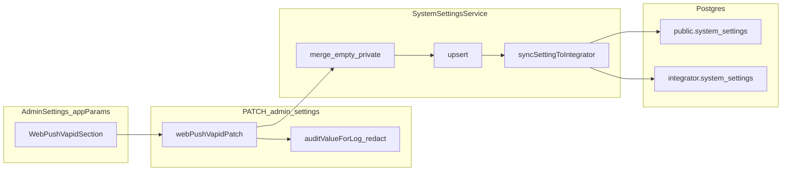

# План: VAPID для Web Push — админка и `system_settings`

**Канон:** только этот файл в репозитории. Любой одноимённый черновик в `~/.cursor/plans/` считать устаревшим и не использовать.

## 0. Scope boundaries

### Разрешено менять

- [`apps/webapp/src/modules/system-settings/types.ts`](../../apps/webapp/src/modules/system-settings/types.ts)
- [`apps/webapp/src/modules/system-settings/service.ts`](../../apps/webapp/src/modules/system-settings/service.ts)
- новый модуль `apps/webapp/src/modules/system-settings/webPushVapidPatch.ts` (parse + validate для PATCH)
- новый модуль чтения (например `webPushVapidRuntime.ts`) с `getWebPushVapidKeyPair()` **или** экспорт из существующего модуля рядом с [`integrationRuntime.ts`](../../apps/webapp/src/modules/system-settings/integrationRuntime.ts) — **без** новых env для ключей
- [`apps/webapp/src/app/api/admin/settings/route.ts`](../../apps/webapp/src/app/api/admin/settings/route.ts) и [`route.test.ts`](../../apps/webapp/src/app/api/admin/settings/route.test.ts)
- [`apps/webapp/src/app/app/settings/page.tsx`](../../apps/webapp/src/app/app/settings/page.tsx) и новый `WebPushVapidSection.tsx` в той же директории; [`AdminSettingsTabsClient.tsx`](../../apps/webapp/src/app/app/settings/AdminSettingsTabsClient.tsx) не менять, если секция встраивается в существующий `appParams` в `page.tsx`

### Вне scope (не трогать в этом плане)

- [`apps/webapp/public/sw.js`](../../apps/webapp/public/sw.js), patient install UX, `web-push` в dependencies, таблицы подписок `PushSubscription`, cron отправки
- GitHub CI workflow, схемы Drizzle **новых** таблиц (строка в существующей `system_settings` не требует миграции DDL)
- Правила ESLint allowlist, архитектура вне `system-settings` + admin settings route + admin settings UI

## 1. Продукт и модель данных

- Ключ **`web_push_vapid`**, `scope: admin`, форма хранения как у остальных настроек: `value_json = { value: { publicKey, privateKey } }` (см. [`smtp_outbound`](../../apps/webapp/src/modules/system-settings/service.ts)).
- Одна пара на **origin приложения** (не на пациента); пациентские подписки появятся позже и будут ссылаться на тот же публичный ключ при `subscribe()`.

## 1.1 Полный контур Web Push — все этапы и кто что делает

Ниже — **дорожная карта целиком** (чтобы ничего не забыть). **Тело этого файла (§0–9)** реализует только **шаг 1** (хранение VAPID в админке). Остальное — отдельные постановки/PR после закрытия текущих `todos`.

| № | Этап | Можно сделать в репозитории без вас (код, тесты, доки) | Нужны вы / оператор |
|---|------|--------------------------------------------------------|---------------------|
| 1 | VAPID в `system_settings` + админ UI + PATCH + `getWebPushVapidKeyPair()` | Да (этот план) | **Прод:** один раз сгенерировать пару и ввести в админку на стенде (см. ниже про CLI). |
| 2 | Таблица(ы) хранения `PushSubscription` (endpoint, ключи, user, device, timestamps), Drizzle + миграция | Да | Выбор политики хранения нескольких устройств на пользователя — продукт; миграция на prod по вашему процессу. |
| 3 | API пациента: сохранить / удалить подписку (после сессии), валидация тела | Да | — |
| 4 | Расширение [`public/sw.js`](../../apps/webapp/public/sw.js): `push`, при необходимости `notificationclick`; не ломать Mini App (без регистрации SW там) | Да | Ручной smoke Telegram/MAX WebView по [`PHASE_02`](PHASE_02_INSTALL_FLOW.md). |
| 5 | Клиент пациента: запрос разрешения, `pushManager.subscribe` с `applicationServerKey` из `getWebPushVapidKeyPair` (публичная часть на клиент — отдельный безопасный endpoint или вшито в конфиг страницы), отправка JSON на API п.3 | Да | UX-тексты и момент показа диалога — согласование с продуктом. |
| 6 | Зависимость `web-push` на сервере процесса, который шлёт пуши; использование пары из `getWebPushVapidKeyPair()` | Да | Привязка к очереди/cron и доменным событиям (напоминания, сообщения) — ваша постановка приоритетов. |
| 7 | Обработка 410/404 от push-сервиса, удаление мёртвой подписки | Да | — |
| 8 | Каналы доставки в профиле пациента (push vs прочее) — если ещё не покрыто существующей моделью | Частично | Продуктовые правила приоритета каналов. |
| 9 | Верификация на реальных устройствах (Chrome PWA, iOS standalone по версии Safari, ограничения) | Документировать чеклист | **Вы:** ручной прогон на стенде/проде. |

### Генерация VAPID: CLI и ответственность

- **Нигде регистрироваться не нужно** (чистый Web Push + VAPID): пара ключей — локальная криптография, не аккаунт у Google/Firebase для базового сценария.
- **Команда** (после того как пакет `web-push` будет добавлен в тот workspace, откуда запускаете CLI, чаще всего `apps/webapp`):  
  `pnpm --filter @bersoncare/webapp exec web-push generate-vapid-keys`  
  (до добавления пакета в монорепо — эквивалент `npx web-push generate-vapid-keys` на машине с Node).
- **Агент в Cursor** при реализации **этого** плана **не обязан** выполнять CLI для продакшена: вывод попал бы в лог сессии — **риск утечки private**. Прод-пару генерирует **человек с доступом к админке**, локально, и вставляет только в UI / одноразово в безопасном канале.
- **В автотестах** использовать **выдуманные** строки в алфавите base64url нужной длины (как фикстуры), **не** ключи из реального `generate-vapid-keys`, и не коммитить секреты.
- **Для локальной разработки** разработчик может сам выполнить CLI и ввести ключи в локальную админку — те же правила: не коммитить.

## 2. Валидация (зафиксировать в коде, без «опционально»)

Парсер в `webPushVapidPatch.ts` (или эквивалент), вызываемый из `PATCH` до `updateSetting`:

- После `trim` для обеих строк.
- **Алфавит:** только URL-safe base64 (`A–Z`, `a–z`, `0–9`, `-`, `_`), без пробелов и переносов.
- **Максимальная длина** каждого поля (например 256 символов) — защита от мусора в JSONB.
- **Первичное сохранение** (в БД ещё нет валидной пары или нет сохранённого `privateKey`): если `publicKey` непустой, **`privateKey` обязателен** (нельзя оставить пустым «как у SMTP» без предыдущего значения).
- **Обновление:** если `privateKey` пустой — в `service.ts` merge: подставить предыдущий `privateKey` из порта (как `mergeSmtpOutboundPasswordRetain`).
- Пустой `publicKey` при PATCH: **отклонять** (`invalid_value`), если в теле явно передан пустой публичный ключ. Полное удаление строки настройки из БД в этой фазе **не** делаем — только смена значения валидной парой или обновление с merge приватного.

## 3. Сервис и синхронизация

- В [`createSystemSettingsService`](../../apps/webapp/src/modules/system-settings/service.ts) перед `upsert` для `web_push_vapid` + `admin` вызвать merge функции (async, читает предыдущую строку через `port.getByKey`).
- `updateSetting` уже вызывает [`syncSettingToIntegrator`](../../apps/webapp/src/modules/system-settings/syncToIntegrator.ts) — отдельный POST в route дублировать **нельзя**.
- Integrator [`settingsSyncRoute`](../../apps/integrator/src/integrations/bersoncare/settingsSyncRoute.ts) принимает произвольный `key` — отдельная правка integrator **в DoD этой фазы не входит**. Если позже integrator начнёт читать VAPID из своей БД — добавить `invalidate*` там по образцу `smtp_outbound`.

## 4. API route

Файл [`route.ts`](../../apps/webapp/src/app/api/admin/settings/route.ts):

- Добавить `web_push_vapid` в `ADMIN_SCOPE_KEYS` и в цепочку нормализации после `normalizeValueJson`.
- Расширить [`auditValueForLog`](../../apps/webapp/src/app/api/admin/settings/route.ts): отдельная функция `redactWebPushVapidForAudit` — в лог уходит `[REDACTED]` или маска для `privateKey`, **публичный** можно оставить читаемым (он всё равно попадёт в клиент как `applicationServerKey`).
- Не класть весь ключ в `SECRET_LIKE_KEYS` (там строковые ключи); только кастомный redact для объекта.

## 5. UI админки

- Новый клиентский блок `WebPushVapidSection.tsx`: поле публичного ключа (text), приватного (`type="password"`), одна кнопка сохранения через [`patchAdminSetting`](../../apps/webapp/src/app/app/settings/patchAdminSetting.ts).
- Встроить в [`page.tsx`](../../apps/webapp/src/app/app/settings/page.tsx) в блок `appParams` (вкладка «Параметры приложения»), логично рядом с [`NotificationsTopicsSection`](../../apps/webapp/src/app/app/settings/NotificationsTopicsSection.tsx) / почтой / видео.
- Копирайт: коротко, без лишних пояснений (правило проекта); одна строка-подсказка: генерация `web-push generate-vapid-keys`.

## 6. Чтение для sender (обязательный задел этого плана)

- Реализовать **`getWebPushVapidKeyPair()`** (или аналог), который читает `getSetting("web_push_vapid", "admin")`, парсит `value`, возвращает `{ publicKey, privateKey }` или `null` если не настроено.
- **Не** использовать [`getConfigValue`](../../apps/webapp/src/modules/system-settings/configAdapter.ts) для этой пары: для вложенного объекта адаптер даёт `JSON.stringify`, что неудобно и легко сломать.

## 7. Безопасность и приватность (явно)

- Доступ к UI и PATCH только **admin** — уже обеспечено страницей и guard’ом route (как у остальных ключей).
- SSR передаёт в клиент текущие значения из БД — **как для OAuth-секретов** на той же странице; это приемлемый компромисс проекта. Не логировать полный объект в server console кроме redacted audit.
- Секреты **только** в `system_settings`, не в env (правило `.cursor/rules/000-critical-integration-config-in-db.mdc`).

## 8. Тесты и локальные проверки

### Автотесты

- [`route.test.ts`](../../apps/webapp/src/app/api/admin/settings/route.test.ts): как минимум три кейса — валидный PATCH; тело без нужных полей → `invalid_value` / `invalid_body`; сценарий «в БД уже есть private, PATCH с пустым private → в `updateSetting` уходит прежний private» (через мок `getSetting` / цепочку deps, по аналогии с существующими моками сервиса).

### Локальные команды исполнителя

- `pnpm --filter @bersoncare/webapp lint`
- `pnpm --filter @bersoncare/webapp typecheck`
- `pnpm --filter @bersoncare/webapp exec vitest run src/app/api/admin/settings/route.test.ts` (или эквивалентный скрипт пакета из `package.json`)

### Проверка `rg` после реализации

- `rg "web_push_vapid" apps/webapp` — все вхождения осмысленны; нет дублирующего bypass `updateSetting`.

## 8.1 Риски и контрмеры

| Риск | Контрмера в этой фазе |
|------|------------------------|
| Утечка приватного ключа в логах PATCH | `redactWebPushVapidForAudit`; негативный тест на отсутствие сырого `privateKey` в audit-представлении |
| Случайное обнуление `privateKey` при правке только public | Merge в `service.ts` при пустом private + тест «retain existing private» |
| Невалидные строки (пробелы/не base64url) в БД | Строгий parse+validate в `webPushVapidPatch.ts` с `invalid_value` |
| Хрупкий runtime-read через `configAdapter` | Явный `getWebPushVapidKeyPair()` через `getSetting`, без `getConfigValue` |
| Попытка вести ключи через env | Прямой запрет в этом плане + ссылка на правило DB config |

## Чеклисты по шагам (локальные проверки)

| Шаг | Проверка |
|-----|----------|
| allowlist-key | `rg "web_push_vapid" apps/webapp/src/modules/system-settings/types.ts` — одно вхождение в массиве + JSDoc |
| patch-parse-merge | PATCH с заведомо неверным алфавитом → 400; `auditValueForLog` для старого/нового значения без сырого `privateKey` |
| admin-ui | Только под сессией admin виден блок; сохранение не ломает остальные секции `appParams` |
| tests | `vitest` по `route.test.ts` зелёный |
| reader-stub | Вызов из теста или временный `expect` типов: возвращаемый объект либо `null`, либо оба ключа непустые после настроенной БД |
| pwa-docs-index | Запись в LOG.md с датой и ссылкой на этот план |

## 9. Документация инициативы

- [`LOG.md`](LOG.md): при **закрытии реализации кода** — дата, ключ `web_push_vapid`, ссылка на этот план.
- [`ROADMAP.md`](ROADMAP.md): строка «4 — Web Push: VAPID в админке» — статус этапа **done** после merge кода в репозиторий; оглавление корневых доков (`docs/README.md`, `ARCHITECTURE.md`, `CONFIGURATION_ENV_VS_DATABASE.md`, `api.md`) согласовано с ключом **`web_push_vapid`**.
- [`README.md`](README.md): ссылка на этот план в списке материалов (уже добавлена).
- [`BACKLOG.md`](BACKLOG.md): разбиение Web Push на «ключи в админке» / «полный контур» уже отражено при переносе плана.

## Definition of Done

- `web_push_vapid` в `ALLOWED_KEYS` и в `ADMIN_SCOPE_KEYS`; PATCH валидирует и отклоняет мусор.
- Первое сохранение требует оба ключа; повторное может менять только публичный с пустым приватным (merge).
- Аудит-лог route не содержит сырого `privateKey`.
- UI на `/app/settings` в блоке админа; сохранение через существующий патч-хелпер.
- `getWebPushVapidKeyPair()` доступен для следующего этапа.
- [`LOG.md`](LOG.md) обновлён после merge реализации.
- После выполнения всех работ в frontmatter этого плана все `todos` переведены в `status: completed` (процедура закрытия плана — см. `.cursor/rules/plan-authoring-execution-standard.mdc`).
- **Стенд/прод (вне репозитория):** оператор один раз генерирует пару VAPID локально и сохраняет через admin UI на целевом окружении (см. §1.1); ключи не попадают в git и чат-логи.

## Порядок исполнения (gate-based)

1. `allowlist-key` → `patch-parse-merge` (backend contract и безопасность).
2. `admin-ui` + `reader-stub` (вкладка настроек и runtime accessor).
3. `tests` + локальные команды из §8.
4. `pwa-docs-index` (LOG по факту merge).
5. `operator-handoff` (вне репо): генерация и ввод реальных ключей на стенде/проде.

### Критерий перехода между шагами

- К следующему шагу переходить только после зелёных проверок текущего (таблица §«Чеклисты по шагам»).

### Мини-rollback (если что-то пошло не так)

- Если PATCH/UI для `web_push_vapid` вызывает регресс, откатить изменения кода этой фазы; существующие ключи OAuth/SMTP и другие настройки не затрагиваются.
- Если в окружении сохранена неверная VAPID-пара, исправление делается повторным сохранением валидной пары через admin UI (без ручных SQL правок вне аварийного сценария).

