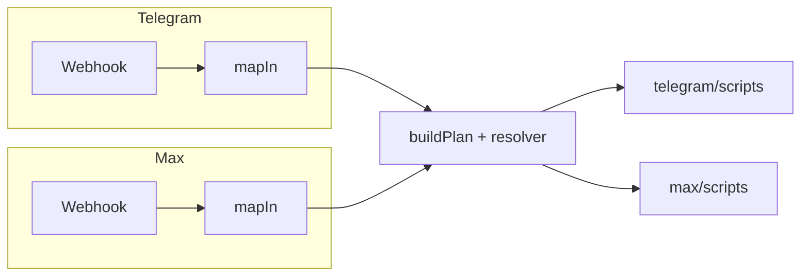

# Telegram и Max: сценарии, совпадения и актуальность

**Дата:** 2026-04-13  
**Обновлено:** 2026-04-13 — паритет deep link `/start` (общий [`messengerStartParse.ts`](../../apps/integrator/src/integrations/common/messengerStartParse.ts)), компактное главное меню (Запись / Дневник / Меню), настройки уведомлений только в вебаппе; `MESSENGER_START_SPECIAL_ACTIONS`; Max `menu.more` → вебапп как в Telegram.

**Основа:** код `apps/integrator/src/content/*/user/scripts.json`, `mapIn`, [`INTEGRATOR_TELEGRAM_START_SCRIPTS.md`](../AUTH_RESTRUCTURE/INTEGRATOR_TELEGRAM_START_SCRIPTS.md), `SCENARIOS_AND_CODE_MAP.md`.

---

## Короткий вывод

- **Один движок** (webhook → `buildPlan` → `scripts.json`). Разбор **особых `/start`** для Telegram и Max идёт через **`parseMessengerStartCommand`** (после словаря действий в TG и с **`canonicalizeMessengerStartText`** в Max для `bot_started`).
- **Главное меню (inline `main`):** одна строка — **Запись / Дневник / Меню** в [`menu.json`](../../apps/integrator/src/content/telegram/user/menu.json) и [`menu.json` Max](../../apps/integrator/src/content/max/user/menu.json). **«Меню»** (`menu.more`): промпт + WebApp — [`telegram.more.menu`](../../apps/integrator/src/content/telegram/user/scripts.json) и [`max.more.menu`](../../apps/integrator/src/content/max/user/scripts.json).
- **Уведомления:** настраиваются в **вебаппе**; сценарии **`telegram.notifications.*`** и кнопки старого «ещё»-меню удалены из контента.
- **Вебапп из MAX Mini App без `?t=`:** без изменений по смыслу — `POST /api/auth/max-init`, `max_bot_api_key` (см. `auth.md`, `MAX_SETUP.md` §4). Диагностические логи `resolution_hints` в auth — только при **`DEBUG_AUTH=1`**.

---

## Схема: куда попадает сообщение

Для **`/start`** и Max **`bot_started`** входящее событие формируется после **`canonicalizeMessengerStartText` + `parseMessengerStartCommand`** внутри `mapIn` / webhook (общий модуль [`messengerStartParse`](../../apps/integrator/src/integrations/common/messengerStartParse.ts)); остальной трафик идёт в `buildPlan` без этого шага.

---

## Таблица: насколько совпадают сценарии

| Область | Telegram | Max | Комментарий |
|--------|----------|-----|-------------|
| `/start` без телефона | Reply `request_contact` | Inline `request_contact` | Как раньше |
| `/start` с телефоном | Reply `chooseMenu` | Inline `main` (3 кнопки) | Один смысл |
| Deep link `link_*`, `setphone`, Rubitime, `noticeme`, `start.set` | `mapBodyToIncoming` + `messengerStartParse` | `fromMax` + тот же `messengerStartParse` | Паритет |
| Антидуп голого `/start` | `tryConsumeStart` (только `resource=telegram`) | Пока нет на уровне pipeline | См. INTEGRATOR doc |
| Запись на приём | `telegram.booking.*` | `max.booking.*`, `/book` | См. TELEGRAM_BOOKING_INLINE_NAV |
| Slash | Reply-текст | `/book`, `/diary`, `/menu` | MAX_SETUP |
| Уведомления | Вебапп | Вебапп | Бот-инлайн убран |
| Произвольный текст | `telegram.default` / draft | `max.default` + draft | Как раньше |

---

## Документация (синхронизация)

| Документ | Статус |
|----------|--------|
| `INTEGRATOR_TELEGRAM_START_SCRIPTS.md` | Max + общий парсер + `MESSENGER_START_SPECIAL_ACTIONS` + debounce Max |
| `TELEGRAM_BOOKING_INLINE_NAV.md` | Актуально для ветки записи |
| `ARCHITECTURE/MAX_SETUP.md` | Slash, WebApp, deep link (все `/start` аргументы как в TG) |
| `ARCHITECTURE/MAX_CAPABILITY_MATRIX.md` | Уточнить при изменении API Max |

---

## Рекомендации (коротко)

1. При изменении списка «особых» `/start` — синхронизировать [`messengerStartParse.ts`](../../apps/integrator/src/integrations/common/messengerStartParse.ts), [`messengerStartConstants.ts`](../../apps/integrator/src/kernel/orchestrator/messengerStartConstants.ts), `excludeActions` в `scripts.json`, дедуп в `incomingEventPipeline.ts`.
2. При расширении цепочки **записи** в Telegram — сверять **`max.booking.*`** и шаблоны **`max:`**.
3. Сообщения в чате со **старыми** длинными inline-клавиатурами могут давать пустой план по удалённым callback — при необходимости позже добавить низкоприоритетный «legacy» ответ.

---

*Отчёт отражает состояние репозитория после сведения меню и паритета `/start`.*
