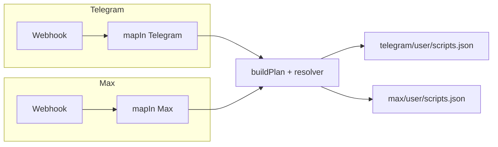
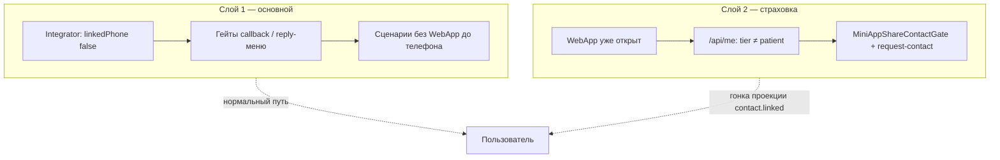

# Telegram и Max: сценарии, совпадения и актуальность

**Дата:** 2026-04-13  
**Основа:** код `apps/integrator/src/content/*/user/scripts.json`, `mapIn` (Telegram / Max), доки `AUTH_RESTRUCTURE/`, `BOT_CONTACT_MINI_APP_GATE.md`, `SCENARIOS_AND_CODE_MAP.md`.

---

## Короткий вывод

- **Один движок** (webhook → `buildPlan` → `scripts.json`), но **контент и разбор входа разные**. Telegram намного богаче.
- **Политика «сначала телефон в канале»** и **страховка Mini App** описаны в коде и доках свежо (2026-04); часть старых абзацев в доках **расходится с текущим `scripts.json`**.
- В **Max** в меню есть кнопки с колбэками, для которых **нет сценариев** в `max/user/scripts.json` — риск «тишины» при нажатии.

---

## Схема: куда попадает сообщение

---

## Схема: два слоя (бот + Mini App)

---

## Таблица: насколько совпадают сценарии

| Область | Telegram | Max | Комментарий |
|--------|----------|-----|-------------|
| `/start` без телефона | Приветствие + **reply-клавиатура** с `request_contact` | Приветствие + **inline** `request_contact` (`textTemplateKey` + `requestPhone: true` → API `type: request_contact`) + состояние `await_contact:subscription` | UX разный (reply vs inline), механика шаринга контакта та же; вложением тоже можно |
| `/start` с телефоном | Состояние idle + **reply-меню** (Запись / Дневник / Ещё + WebApp) | idle + **inline** «главное меню» | UX разный, идея та же |
| Deep link `link_*` | Есть | Есть | Ок |
| Deep link `setphone`, Rubitime, `noticeme`, прочие `/start …` | Разбор в webhook / `mapIn` | **Почти нет** в `mapIn` Max — по сути только `link_*` и текст меню | `excludeActions` в Max совпадает с Telegram по списку, но **лишние действия из Max текстом не прилетают** |
| Запись на приём (`booking.open`) | Полная ветка: сообщение, inline, `booking.menu`, списки записей, инфо | **Нет** отдельных сценариев `max.booking.*` в user scripts | Кнопка «Запись» в Max мапится в `booking.open`, но **скрипта под Max нет** |
| Кабинет, вопрос врачу, черновики | Много сценариев | **Нет** аналогов | Max — урезанный набор |
| Дневник (симптомы, ЛФК) | Есть | Похожие callback-сценарии есть | Частичное совпадение |
| Напоминания snooze/skip | Есть | Есть | Ок |
| Помощник / WebApp entry | Есть + need_phone | Есть + need_phone | Ок |
| Уведомления (toggle) | Есть | В **menu.json** есть `notifications.show`, в **scripts.json** сценария **нет** | Вероятная дыра |
| «Мои записи» в главном меню Max | — | В **menu.json** есть `bookings.show`, в **scripts.json** сценария **нет** | Вероятная дыра |
| Любой текст (`max.default`) | Нет такого глобального catch-all | Показывает `chooseMenu` | Отличается от Telegram (там draft / вопрос и т.д.) |

---

## Что считать «рабочим»

| Категория | Статус |
|-----------|--------|
| Онбординг TG с телефоном через контакт | Задумано и покрыто сценариями + гейтами |
| Онбординг Max | Текст + inline-кнопка запроса контакта (как в ветках `need_phone` и M2M); альтернатива — вложение; после привязки — `max.contact.phone.link` → приветствие + меню |
| Mini App без tier patient | Гейт + M2M request-contact (см. `BOT_CONTACT_MINI_APP_GATE.md`) |
| Запись / уведомления **в Max из главного меню** | **Под вопросом** из-за отсутствующих сценариев под колбэки меню |

Проверка «в бою» для Max: нажать в главном меню пункты с `bookings.show` и `notifications.show` и убедиться, что integrator отвечает (если пустой план — нужно добавить сценарии или убрать кнопки).

---

## Устаревшее в документации (важно поправить при следующем ревью доков)

| Документ | Что не так |
|----------|------------|
| `INTEGRATOR_TELEGRAM_START_SCRIPTS.md` | В таблице для `telegram.start` при `linkedPhone: true` написано, что **только** `user.state.set` и **без исходящих сообщений**. В **текущем** `telegram/user/scripts.json` после `/start` с телефоном ещё идёт **`message.replyKeyboard.show`** с меню (Запись / Дневник / Ещё). |
| `TELEGRAM_BOOKING_INLINE_NAV.md` | Актуально для Telegram; для Max явно сказано «синхронизировать вручную» — фактически **не синхронизировано** (нет ветки записи как в TG). |

---

## Новые политики логина / Mini App (с чем согласованы сценарии)

- **`linkedPhone`** в integrator = телефон в контактах с **лейблом канала** (`telegram` / `max`), не «любой телефон пользователя» — см. `INTEGRATOR_TELEGRAM_START_SCRIPTS.md`, `SCENARIOS_AND_CODE_MAP.md`.
- **Tier `patient` в webapp** завязан на **доверенный** телефон (`patient_phone_trust_at`), не только на наличие номера в snapshot — гейт Mini App смотрит на **`platformAccess.tier === "patient"`**, а не только на `user.phone`.
- **Центральный гейт** для колбэков и reply-меню без телефона — в `resolver.ts`; legacy `handleUpdate` / `handleMessage` **не** прод-путь для webhook.

---

## Рекомендации (коротко)

1. **Max:** добавить сценарии под `bookings.show` и `notifications.show` **или** убрать кнопки из `max/user/menu.json`, пока нет реализации.  
2. **Max:** отдельно решить продуктово: нужна ли запись на приём в чате как в Telegram (и тогда — сценарии + шаблоны).  
3. **Доки:** обновить строку про `telegram.start` при `linkedPhone: true` под фактический JSON.  
4. При изменении списка «особых» `/start` — держать в синхроне `telegramStartConstants.ts`, webhook, `excludeActions`, дедуп в `incomingEventPipeline.ts` (уже описано в `INTEGRATOR_TELEGRAM_START_SCRIPTS.md`).

---

*Отчёт сгенерирован по состоянию репозитория на дату в шапке.*
