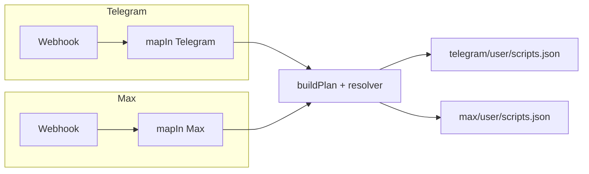
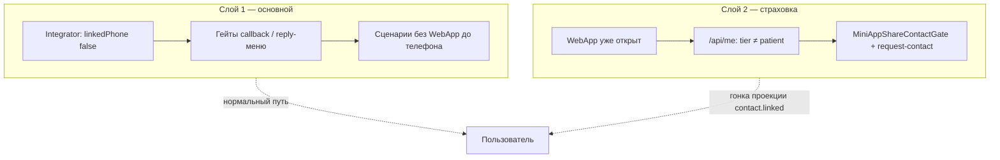

# Telegram и Max: сценарии, совпадения и актуальность

**Дата:** 2026-04-13  
**Обновлено:** 2026-04-13 (синхронизация с кодом после ветки MAX booking / slash / support draft).

**Основа:** код `apps/integrator/src/content/*/user/scripts.json`, `mapIn` (Telegram / Max), доки `AUTH_RESTRUCTURE/`, `BOT_CONTACT_MINI_APP_GATE.md`, `SCENARIOS_AND_CODE_MAP.md`.

---

## Короткий вывод

- **Один движок** (webhook → `buildPlan` → `scripts.json`), но **контент и разбор входа разные**. Telegram по-прежнему богаче по deep link и админ-командам.
- **Политика «сначала телефон в канале»** и **страховка Mini App** описаны в коде и доках; таблица `telegram.start` / `max.start` при `linkedPhone: true` в [`INTEGRATOR_TELEGRAM_START_SCRIPTS.md`](../AUTH_RESTRUCTURE/INTEGRATOR_TELEGRAM_START_SCRIPTS.md) приведена в соответствие с JSON (после `/start` с телефоном показывается меню).
- **Max — запись на приём:** есть сценарии `max.booking.*`, `max.bookings.show`, slash **`/book`**, **`/diary`**, **`/menu`** и факты `links.webapp*` в webhook; цепочка inline «Назад» согласована с идеей `booking.menu` (см. [`TELEGRAM_BOOKING_INLINE_NAV.md`](../AUTH_RESTRUCTURE/TELEGRAM_BOOKING_INLINE_NAV.md)).
- **Оставшаяся дыра Max:** callback **`notifications.show`** в [`menu.json`](../../apps/integrator/src/content/max/user/menu.json) — **отдельного сценария в `max/user/scripts.json` нет**; нажатие может дать пустой план, пока не добавят сценарий или не уберут кнопку.

---

## Схема: куда попадает сообщение

---

## Схема: два слоя (бот + Mini App)

---

## Таблица: насколько совпадают сценарии

| Область | Telegram | Max | Комментарий |
|--------|----------|-----|-------------|
| `/start` без телефона | Приветствие + **reply-клавиатура** с `request_contact` | Приветствие + **inline** `request_contact` (`textTemplateKey` + `requestPhone: true` → API `type: request_contact`) + состояние `await_contact:subscription` | UX разный (reply vs inline), механика шаринга контакта та же; вложением тоже можно |
| `/start` с телефоном | `idle` + **`message.replyKeyboard.show`** (`telegram:chooseMenu`: Запись / Дневник / Ещё + WebApp) | `idle` + **`message.inlineKeyboard.show`** (`max:welcome`, меню `main`) | Идея та же; разный тип клавиатуры |
| Deep link `link_*` | Есть | Есть | Ок |
| Deep link `setphone`, Rubitime, `noticeme`, прочие `/start …` | Разбор в webhook / `mapIn` | **Почти нет** в `mapIn` Max — по сути только `link_*` и текст/slash меню | `excludeActions` в Max совпадает с Telegram по списку, но **лишние действия из Max текстом не прилетают** |
| Запись на приём (`booking.open`) | Полная ветка + `booking.menu`, списки, инфо | Сценарии **`max.booking.open`**, **`max.booking.menu`**, **`max.booking.open.callback`**, **`need_phone`**, **`max.bookings.show`** | Паритет по «хабу» записи; шаблоны **`max:*`** |
| Slash: запись / дневник / меню | Текст меню / reply-кнопки | **`/book`**, **`/diary`**, **`/menu`** → `booking.open`, `nav.webapp.diary`, `nav.webapp.menu`; в меню команд бота **`start` нет** | См. `setupCommands.ts`, `mapIn.ts` |
| Кабинет, вопрос врачу | Много сценариев | Урезанный набор | Max — не полное зеркало |
| Дневник (симптомы, ЛФК) | Есть | Похожие callback-сценарии + **`nav.webapp.diary`** | Частичное совпадение |
| Напоминания snooze/skip | Есть | Есть | Ок |
| Помощник / WebApp entry | Есть + need_phone | Есть + need_phone | Ок |
| Уведомления (toggle) | Есть | В **menu.json** есть `notifications.show`, в **scripts.json** сценария **нет** | Дыра — добавить сценарий или убрать кнопку |
| «Мои записи» в главном меню Max | — | Callback **`bookings.show`** → **`max.bookings.show`** (+ need_phone) | Закрыто в коде |
| Произвольный текст (не команда / не меню) | Цепочка draft / поддержка (Telegram) | **`max.default`**: `draft.upsertFromMessage` + подтверждение («Да»/«Нет») перед пересылкой | Согласовано с политикой черновика; не «только chooseMenu» |

---

## Что считать «рабочим»

| Категория | Статус |
|-----------|--------|
| Онбординг TG с телефоном через контакт | Задумано и покрыто сценариями + гейтами |
| Онбординг Max | Текст + inline-кнопка запроса контакта; после привязки — `max.contact.phone.link` → приветствие + меню |
| Mini App без tier patient | Гейт + M2M request-contact (см. `BOT_CONTACT_MINI_APP_GATE.md`) |
| Запись и «Мои записи» в Max из меню / `/book` | Сценарии **`max.booking.*`**, **`max.bookings.show`** |
| Уведомления из главного меню Max | **Под вопросом**, пока нет сценария под **`notifications.show`** |

Проверка «в бою» для Max: нажать **«Настройка уведомлений»** в меню «ещё»; если тишина — добавить сценарий или убрать кнопку.

---

## Документация (синхронизация)

| Документ | Статус |
|----------|--------|
| `INTEGRATOR_TELEGRAM_START_SCRIPTS.md` | Обновлено: при `linkedPhone: true` и **`telegram.start`**, и **`max.start`** включают шаг показа главного меню после `user.state.set`. |
| `TELEGRAM_BOOKING_INLINE_NAV.md` | Обновлено: Max не «вручную отстаёт», а имеет зеркальные **`max.booking.*`** / **`max.bookings.show`**. |
| `ARCHITECTURE/MAX_SETUP.md` | Команды **`book` / `diary` / `menu`**, smoke-шаги. |
| `ARCHITECTURE/MAX_CAPABILITY_MATRIX.md` | Slash-команды, WebApp через `link`, deep link `link_*`. |

---

## Новые политики логина / Mini App (с чем согласованы сценарии)

- **`linkedPhone`** в integrator = телефон в контактах с **лейблом канала** (`telegram` / `max`), не «любой телефон пользователя» — см. `INTEGRATOR_TELEGRAM_START_SCRIPTS.md`, `SCENARIOS_AND_CODE_MAP.md`.
- **Tier `patient` в webapp** завязан на **доверенный** телефон (`patient_phone_trust_at`), не только на наличие номера в snapshot — гейт Mini App смотрит на **`platformAccess.tier === "patient"`**, а не только на `user.phone`.
- **Центральный гейт** для колбэков и reply-меню без телефона — в `resolver.ts`; legacy `handleUpdate` / `handleMessage` **не** прод-путь для webhook.

---

## Рекомендации (коротко)

1. **Max:** добавить сценарий под **`notifications.show`** **или** убрать кнопку из `max/user/menu.json`.  
2. При изменении списка «особых» `/start` — держать в синхроне `telegramStartConstants.ts`, webhook, `excludeActions`, дедуп в `incomingEventPipeline.ts` (см. `INTEGRATOR_TELEGRAM_START_SCRIPTS.md`).  
3. При расширении цепочки **записи** в Telegram — сверять ветку **`max.booking.*`** и шаблоны **`max:`**.

---

*Первичный отчёт — по состоянию репозитория на дату в шапке; блок «Обновлено» — после правок MAX booking, slash-команд и support draft.*
