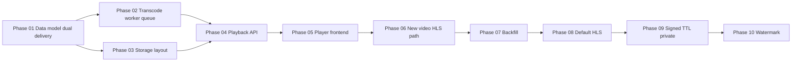

# Video HLS delivery — master plan

Документ верхнего уровня: цель, текущая проблема, целевая архитектура, этапы, зависимости, риски, rollback, критерии готовности, ссылки на детальные файлы.

**Статус:** проектная документация для поэтапного внедрения без простоя и без резкой миграции с MP4.

**Связанные документы**

| Документ | Назначение |
|----------|------------|
| [01-current-state-and-gap-analysis.md](./01-current-state-and-gap-analysis.md) | Аудит текущей выдачи видео и пробелов (обязательный gap analysis) |
| [02-target-architecture.md](./02-target-architecture.md) | Целевая схема: webapp API, S3, `apps/media-worker`, без video microservice |
| [03-rollout-strategy.md](./03-rollout-strategy.md) | Порядок выкатки, canary, backfill, переключение default |
| [04-test-strategy.md](./04-test-strategy.md) | Пирамида тестов, контракты, негативные сценарии |
| [05-risk-register.md](./05-risk-register.md) | Реестр рисков и митигации |
| [06-execution-log.md](./06-execution-log.md) | Журнал работы агента / команды |
| [07-post-documentation-implementation-roadmap.md](./07-post-documentation-implementation-roadmap.md) | Этап B: дорожная карта реализации после утверждения доков |
| [phases/](./phases/) | Детализация фаз 01–10 с чек-листами |

---

## 1. Цель

- Ввести **VOD HLS** (`.m3u8` + сегменты) параллельно с текущей выдачей **MP4 через presigned URL**, без остановки приложения.
- Обеспечить **dual delivery**: метаданные и API выбирают `mp4` | `hls` | `auto` с **fallback на MP4**.
- После стабилизации — по отдельным этапам усилить «умеренную» защиту (signed URLs / TTL / private object / watermark). **Без DRM**, без live, без multi-CDN логики на старте.
- Реализация через **готовые инструменты**: **FFmpeg CLI**, существующий **S3-compatible storage**, **hls.js** (+ native HLS в Safari), расширение **apps/webapp** API routes, новый процесс **`apps/media-worker`** в том же репозитории.

---

## 2. Текущая проблема (продуктово-техническая)

- Сегодня воспроизведение опирается на **прямой MP4** (presigned GET). Для прогрессивного download это работает, но:
  - сложнее единообразно масштабировать адаптивный битрейт;
  - дальнейшее усложнение скачивания (короткоживущие URL, сегментация) логичнее строить вокруг **HLS**.
- Требование: **не ломать** текущий путь (`GET /api/media/[id]` → 302 → S3) до явного переключения стратегии и не удалять MP4 как источник/фоллбек на ранних фазах.

Подробный разбор «как сейчас» и «чего не хватает»: [01-current-state-and-gap-analysis.md](./01-current-state-and-gap-analysis.md).

---

## 3. Целевая архитектура (кратко)

- **Источник истины по файлам:** таблица `media_files` (расширяется полями HLS и статусом обработки) и объекты в **private** бакете S3.
- **Транскодинг:** процесс **`apps/media-worker`** (Node), забирает задания из **очереди в PostgreSQL** (webapp DB), вызывает **FFmpeg**, заливает артефакты в S3, обновляет статусы.
- **Плейбэк:** новый (или расширенный) **playback resolution** в webapp: по сессии и политике выдаёт контракт `{ mode, mp4Url?, hlsMasterUrl?, posterUrl?, … }` с presigned URL **на объекты S3**; **не** проксировать видеобайты через Node stream.
- **Клиент:** dual-mode — нативный `<video>` для MP4; для HLS — **Safari: native**, прочие: **hls.js**.

Детали и анти-паттерны (что не строим): [02-target-architecture.md](./02-target-architecture.md).

---

## 4. Этапы внедрения и зависимости

| Фаза | Файл | Кратко |
|------|------|--------|
| 01 | [phases/phase-01-data-model-and-dual-delivery-foundation.md](./phases/phase-01-data-model-and-dual-delivery-foundation.md) | Поля БД, `processingStatus`, `deliveryMode`, без изменения поведения MP4 |
| 02 | [phases/phase-02-transcoding-pipeline-and-worker.md](./phases/phase-02-transcoding-pipeline-and-worker.md) | Очередь, `apps/media-worker`, FFmpeg, retries |
| 03 | [phases/phase-03-storage-layout-and-artifact-management.md](./phases/phase-03-storage-layout-and-artifact-management.md) | Префиксы S3, master playlist, сегменты, cleanup |
| 04 | [phases/phase-04-playback-api-and-delivery-strategy.md](./phases/phase-04-playback-api-and-delivery-strategy.md) | Единый playback endpoint, флаги, fallback |
| 05 | [phases/phase-05-player-integration-and-dual-mode-frontend.md](./phases/phase-05-player-integration-and-dual-mode-frontend.md) | hls.js / Safari, ошибки, fallback UX |
| 06 | [phases/phase-06-new-video-hls-default-path.md](./phases/phase-06-new-video-hls-default-path.md) | Новые загрузки → HLS pipeline при включённом флаге |
| 07 | [phases/phase-07-backfill-legacy-library.md](./phases/phase-07-backfill-legacy-library.md) | Батч backfill, пауза, отчёты |
| 08 | [phases/phase-08-default-switch-to-hls.md](./phases/phase-08-default-switch-to-hls.md) | Переключение default delivery, откат |
| 09 | [phases/phase-09-signed-urls-ttl-and-private-access.md](./phases/phase-09-signed-urls-ttl-and-private-access.md) | Усиление без DRM |
| 10 | [phases/phase-10-watermark-and-further-hardening.md](./phases/phase-10-watermark-and-further-hardening.md) | Watermark, опциональные шаги |

---

## 5. Риски (сводка)

Полный реестр: [05-risk-register.md](./05-risk-register.md).

Критичные темы: регрессия MP4, перегруз CPU на хосте worker, частично готовые HLS, CORS/presigned для сегментов, длинные presigned URL в логах, смешение с integrator worker.

---

## 6. Rollback / fallback

- **На уровне продукта:** `system_settings` / delivery strategy = `mp4_only` или `auto` с приоритетом MP4 при `hls_ready === false`.
- **На уровне деплоя:** откат версии webapp + отключение флагов; worker можно остановить без потери MP4-выдачи (если MP4 объект не удаляется).
- **Данные:** миграции additive (новые nullable колонки, новые ключи S3); не удалять исходный MP4 до явной политики retention (отдельное решение после фазы 08).

Детали по фазам: [03-rollout-strategy.md](./03-rollout-strategy.md) и чек-листы rollback в каждом phase-файле.

---

## 7. Критерии готовности по фазам (high level)

- **После 01:** миграции применены; старый клиентский путь без изменений; новые поля заполняются NULL/defaults.
- **После 02–03:** тестовый ролик в S3 в виде HLS; worker идемпотентен; ошибки FFmpeg не роняют API.
- **После 04–05:** контракт playback стабилен; UI играет HLS в staging; fallback на MP4 проверен.
- **После 06:** новые видео (за флагом) получают HLS без регресса старых.
- **После 07:** измеримый % библиотеки с `hls_ready`; отчёт битых файлов.
- **После 08:** default HLS при готовности; быстрый откат на MP4 проверен.
- **После 09–10:** политика TTL/signed и (опционально) watermark согласована с безопасностью и производительностью.

---

## 8. Тестирование и выкатка

- Стратегия тестов: [04-test-strategy.md](./04-test-strategy.md).
- Выкатка: [03-rollout-strategy.md](./03-rollout-strategy.md); прод-сервисы см. `docs/ARCHITECTURE/SERVER CONVENTIONS.md` (при добавлении `media-worker` — обновить conventions и `deploy/HOST_DEPLOY_README.md` в соответствующей фазе реализации).

---

## 9. Принципы (напоминание)

1. Не ломать текущую MP4-выдачу.  
2. Обратимые изменения и feature flags.  
3. Независимые безопасные инкременты.  
4. Без DRM, без live, без отдельного video microservice на старте.  
5. Heavy work только в **`apps/media-worker`**, не в Next.js request path.  
6. Видео **не** стримить через тело ответа API — только presigned URL к S3.

---

## 10. Карта соответствия запросу заказчика

| Требование | Где отражено |
|------------|----------------|
| Dual delivery MP4 + HLS | Phase 01, 04, 02-target-architecture |
| Очередь + worker + FFmpeg | Phase 02, 03 |
| Playback API + strategy | Phase 04 |
| Frontend dual mode | Phase 05 |
| Новые → HLS, старые → старое | Phase 06 |
| Backfill | Phase 07 |
| Default HLS | Phase 08 |
| Signed / TTL / private | Phase 09 |
| Watermark | Phase 10 |
| Gap analysis отдельным файлом | 01-current-state-and-gap-analysis |
| Execution log | 06-execution-log |
