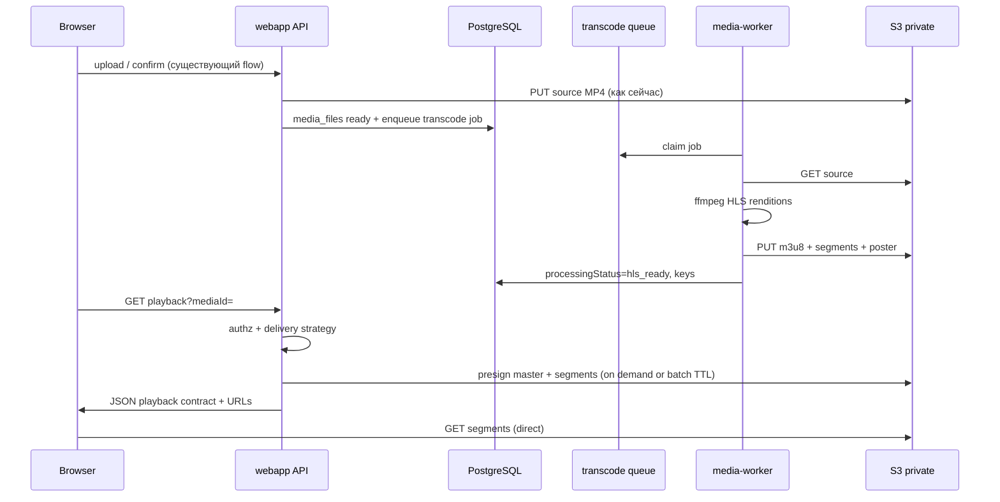

# Target architecture — HLS dual delivery

Целевая схема в терминах **реального** монорепо BersonCareBot и ограничений из ТЗ (без DRM, VOD only, без отдельного video-сервиса).

**Связь:** [00-master-plan.md](./00-master-plan.md) · исходное состояние: [01-current-state-and-gap-analysis.md](./01-current-state-and-gap-analysis.md)

---

## 1. Компоненты и границы

| Компонент | Роль | Что **не** делает |
|-----------|------|-------------------|
| **`apps/webapp`** (Next.js) | Метаданные медиа, авторизация, создание jobs, **playback API** (JSON), presigned URL | Транскодинг, стриминг байт через себя |
| **`apps/media-worker`** (новый пакет) | Poll очереди, **FFmpeg CLI**, upload артефактов в S3, обновление статусов в БД | HTTP API для клиентов |
| **PostgreSQL (webapp DB)** | `media_files` + таблица очереди (или колонки статуса + отдельная jobs) | Хранение сегментов |
| **S3-compatible private bucket** | Source MP4, HLS tree (`.m3u8`, сегменты), постер | Публичный анонимный listing |
| **`apps/integrator`** | Без изменений для HLS на старте | Не смешивать с медиа-очередью |

**Запрещено по ТЗ:** отдельный streaming server, собственный transcoding engine (кроме оркестрации **FFmpeg**), DRM, проксирование видеопотока через Node.

---

## 2. Поток данных (упрощённо)



---

## 3. Готовые инструменты (явно)

| Инструмент | Где используется |
|------------|------------------|
| **FFmpeg** | `apps/media-worker` (subprocess), не библиотека-транскодер |
| **aws-sdk / текущий S3 client** | webapp + worker: PutObject, GetObject, presign |
| **hls.js** | webapp client bundle (фаза 05) |
| **Native HLS** | Safari / iOS — `<video src="master.m3u8">` или hls.js capability detect |

**Не реализуем:** собственный packager, origin-сервер, DRM license server.

---

## 4. Пример команд FFmpeg (уровень эскиза, не production-финал)

Два рендера + master playlist (вариант с `hls_var_stream_map`):

```bash
ffmpeg -y -i input.mp4 \
  -filter_complex "[0:v]split=2[v1][v2]; [v1]scale=w=1280:h=-2[vout1]; [v2]scale=w=640:h=-2[vout2]" \
  -map "[vout1]" -map a:0 -c:v libx264 -b:v 2800k -c:a aac -b:a 128k \
  -f hls -hls_time 6 -hls_playlist_type vod -hls_segment_filename 'seg_1080p_%03d.ts' stream_1080p.m3u8 \
  -map "[vout2]" -map a:0 -c:v libx264 -b:v 800k -c:a aac -b:a 96k \
  -f hls -hls_time 6 -hls_playlist_type vod -hls_segment_filename 'seg_480p_%03d.ts' stream_480p.m3u8
# Затем отдельным шагом или -master_pl_name сгенерировать master.m3u8 (зависит от выбранного шаблона FFmpeg).
```

Постер (кадр):

```bash
ffmpeg -y -i input.mp4 -ss 00:00:01 -vframes 1 -q:v 3 poster.jpg
```

Точные профили согласовать в фазе 02/03 (2–3 качества по ТЗ).

---

## 5. Модель в БД (логическая, детали в phase-01)

Расширение **`media_files`** (или сопоставимая схема):

- `video_processing_status`: например `none | pending_transcode | processing | hls_ready | failed` (имена финализировать в миграции).
- `video_delivery_mode_preference`: nullable / `inherit` — опционально для override.
- `hls_master_playlist_s3_key`, `hls_artifact_prefix` (если нужен быстрый list), `poster_s3_key`.
- `video_duration_seconds`, `available_qualities_json` (массив строк/объектов).
- Исходный объект: текущий `s3_key` **остаётся** MP4 source для transcoding и MP4 fallback.

**Не дублировать** логику статусов загрузки (`pending` multipart) с транскодингом — разные state machines, возможна матрица «upload ready + transcode pending».

---

## 6. Playback contract (логический)

Ответ API (пример полей):

- `mediaId`, `delivery: "mp4" | "hls"`, `reason` (для диагностики и support).
- `mp4Url` — presigned или `/api/media/id` (на ранних фазах можно оставить redirect URL как сейчас).
- `hlsMasterUrl` — presigned master `.m3u8` при `delivery=hls` и готовности.
- `posterUrl` — опционально.
- `expiresAt` / `ttlSeconds` — особенно важно в фазе 09.

Клиент **не** должен хардкодить S3 ключи — только URL из ответа.

---

## 7. Деплой и процессы

- **Сейчас:** `bersoncarebot-webapp-prod`, `bersoncarebot-api-prod`, `bersoncarebot-worker-prod` (integrator).
- **После внедрения:** добавить **`bersoncarebot-media-worker-prod.service`** (имя согласовать с ops), `WorkingDirectory` → сборка из `apps/media-worker`, `EnvironmentFile` → `webapp.prod` (тот же `DATABASE_URL`, S3, секреты) или отдельный env-файл с ссылкой на те же переменные.
- **FFmpeg:** системный пакет на хосте worker (`apt install ffmpeg`) — зафиксировать в `deploy/HOST_DEPLOY_README.md` при появлении сервиса.
- Масштабирование: v1 — тот же хост, что webapp; v2 — отдельная машина с тем же env и доступом к S3/DB (без изменения кода, только systemd и сеть).

---

## 8. CDN

- В репозитории нет обязательной привязки к CDN для медиа (private presigned).  
- **План:** абстракция URL = «то, что выдал playback API»; в будущем можно подменить генерацию на CloudFront signed URL **без** смены контракта полей (фаза 09).

---

## 9. Монорепо

- Добавить `apps/media-worker` в **`pnpm-workspace.yaml`** при реализации.
- Общие типы (контракт job / статусы): либо лёгкий `packages/shared-video-types` (только при реальной потребности в DRY), либо дублирование минимальных констант — не раздувать scope.

---

## 10. Анти-паттерны (явно запрещены в этой инициативе)

- Запуск FFmpeg внутри Next.js request или Server Action.
- Публикация HLS в public bucket без контроля доступа.
- Использование integrator `projection_outbox` для транскодинга.
- «Видеоплатформа» с отдельным репозиторием или отдельным team-owned microservice на старте.
