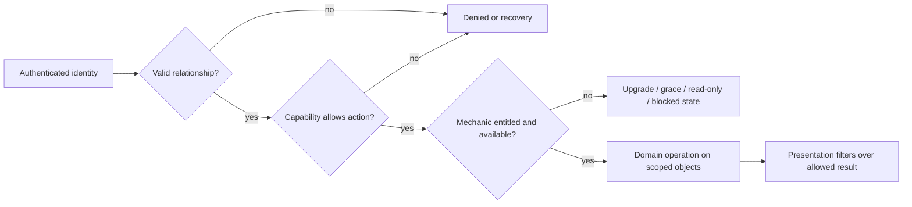
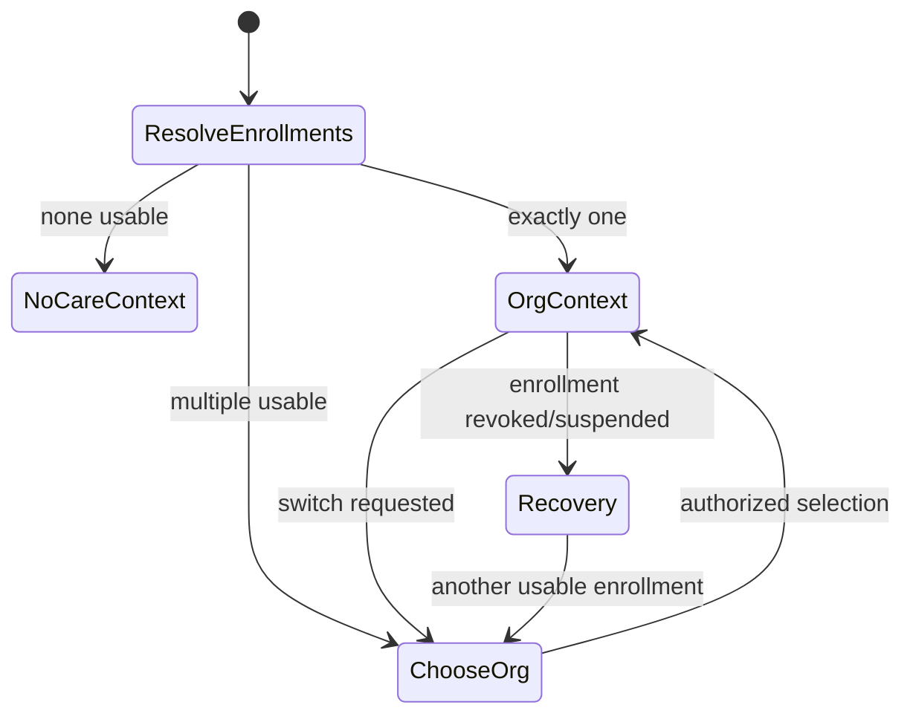
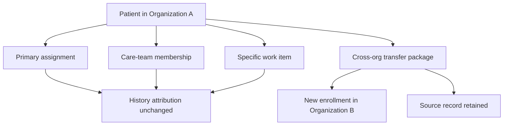

# UX-03 — Product operating model

**Статус:** independently audited decision-ready candidate; owner P0/P1 rulings remain open.
**Дата:** 2026-07-15.
**Scope:** actor/context model, solo/clinic composition, patient record/history, handoff и entitlement boundaries.

## 1. Как читать документ

В документе используются три уровня утверждений:

- **Инвариант** — уже зафиксированный канон identity/tenant/security; последующие UX-этапы обязаны ему следовать.
- **Рекомендуемый кандидат** — предпочтительная продуктовая модель на основании UX-01/02 и architecture review,
  но не owner ruling.
- **Решение владельца** — открытый выбор, меняющий доступ, IA или launch scope. До решения действует указанный
  safe default; это не означает, что safe default автоматически становится target product policy.

Исходные рабочие документы сохраняются отдельно:
[`UX03_OPERATING_MODEL_DRAFT.md`](./UX03_OPERATING_MODEL_DRAFT.md) и
[`UX03_CAPABILITY_ARCH_REVIEW.md`](./UX03_CAPABILITY_ARCH_REVIEW.md).

## 2. Каноническая модель identity и context

### Инварианты

1. Tenant/workspace — `Organization`; solo practice и clinic — разные композиции одной сущности, не разные типы
   account и не разные tenant models.
2. Staff login имеет ровно один active organization membership. Ноль membership закрывает staff workspace;
   несколько — fail-closed integrity error `multiple_active_staff_memberships`, а не organization picker.
3. Membership role — `owner | admin | doctor | assistant`. Clinical authorship дополнительно требует specialist
   binding и соответствующей capability; `owner/admin` сам по себе не делает пользователя специалистом.
4. Один owner/admin может одновременно быть specialist и работает под одним login. Management/clinical mode меняет
   рабочую поверхность, но не identity, organization context и не authorization.
5. Patient имеет одну global canonical identity и ноль или больше organization enrollments. Patient может выбирать
   только уже разрешённый enrollment; staff organization switcher запрещён.
6. Host, custom domain, invite, route, slug, selected specialist и display filter не являются источником прав.
7. Проверка выполняется в порядке: relationship/context → capability → entitlement/mechanic → presentation filter.

Two existing owner rulings need a precise reading in this UX layer:

- staff visibility is organization-wide at the tenant/RLS wall and `Мои пациенты` is an application UX filter, not
  a new database wall. This does **not** by itself settle which clinical record classes are shared, private or
  author-only; the later owner addendum explicitly asks UX-03 to work out that history policy;
- global admin/platform owner is not categorically prohibited from database data. Nevertheless, patient-level
  behavior is not ordinary SaaS analytics, and a product support/intervention workflow still needs an explicit,
  audited surface. Separating that surface does not revoke platform operational authority.



## 3. Staff workspace composition

### Рекомендуемый кандидат: один shell, явные рабочие поверхности

```text
Organization workspace
├── Clinical work               specialist binding + clinical capabilities
│   ├── Today
│   ├── Patients / patient card
│   ├── Schedule
│   └── Programs, messages and care content
├── Organization management    owner/admin capabilities
│   ├── Overview
│   ├── Team and invitations
│   ├── Booking/services setup
│   ├── Branding/public page/channels
│   └── Plan, usage and billing
├── Operations                  assistant/delegated operational capabilities
│   ├── Schedule and intake
│   └── Patient contact/invites (exact scope TBD)
└── Account                     every staff user
    ├── Profile/security/2FA
    ├── Personal notifications
    └── Install app
```

- Owner/admin with specialist binding opens daily clinical work and has an explicit
  **«Управление организацией»** entry. Switching surfaces does not re-authenticate or elevate access.
- Non-clinical owner/admin opens management overview and never receives an empty doctor dashboard.
- Specialist without management capability sees clinical + account surfaces only.
- Assistant receives a bounded operations surface; doctor/admin routes are not used as a temporary shortcut.
- Global admin uses a separate platform-operations IA. Organization diagnostics or support intervention must be
  purpose-specific and audited, not ordinary patient-chart browsing.

**Owner decision OM-1:** explicit management/clinical mode switch (recommended) versus one navigation with grouped
sections. This blocks target navigation in UX-06, but not invite journey mechanics in UX-04.

### Solo specialist versus clinic specialist

Both use the same components and route contracts where possible; composition is driven by binding, capabilities,
organization shape and entitlement, not by a permanent `solo=true` branch.

| Surface | Solo owner-specialist | Clinic specialist |
|---|---|---|
| Header/context | «Моя практика»; no redundant specialist selector | Clinic identity; own specialist context visible |
| Today/patients | Own practice; «Мои» control omitted when it cannot change result | «Мои» by default; optional «Все доступные» after authorization |
| Patient history | All permitted solo history without team chrome | Own attributed events by default; optional permitted shared history/specialist filter |
| Team/handoff | Hidden, not empty | Care team and distinct handoff actions when capable/entitled |
| Schedule | Own calendar; setup entry if management-capable | Own calendar; organization calendar/setup separately gated |
| Settings | Personal + compact practice setup | Personal and organization settings clearly separated |
| Growth | First staff invite activates team composition without account migration | Staff lifecycle, seats and collaboration mechanics |

An organization with one active specialist is not permanently commercialized as “solo”: inviting an assistant,
adding locations or preparing a team must not produce contradictory navigation.

## 4. Assistant operating boundary

### Инварианты

- Assistant is a real membership role, normally without specialist binding.
- Assistant never gains clinical authorship, unrestricted chart access, ownership transfer or billing-contract powers
  merely through that role.
- Direct URL, export, search counts and suggestions must enforce the same scope as visible screens.

### Рекомендуемый candidate baseline, pending ruling

- organization schedule read/write for explicitly permitted appointment operations;
- intake queue and administrative demographics/contact maintenance;
- send/resend/revoke trusted patient invites;
- operational message routing only where message class is explicitly non-clinical;
- no treatment notes, private entries, clinical exports or program authorship.

**Safe default until owner decision:** deny clinical history and clinical writes; allow only capabilities that are
explicitly assigned and separately server-enforced.

**Owner decision OM-2:** exact schedule, contact, invite, messaging, payment and limited-history permissions, and
whether custom assistant templates are launch scope. This blocks assistant journeys in UX-04 and assistant IA in
UX-06.

## 5. Patient organization context

### Инварианты

- Global: identity, recovery/security, list of relationships, global channel consent and platform support.
- Organization-scoped: visits, programs, clinical timeline, messages, payments/benefits and organization support.
- Clinical data from different organizations is not merged into one raw timeline by default.
- Deep link resolves its target and verifies enrollment before changing context. Revoked/foreign contexts show a
  neutral recovery state without leaking organization data.



### Рекомендуемый кандидат

- With one active enrollment, keep organization name/brand visible but collapse the picker.
- With multiple enrollments, show a persistent organization picker and clearly attribute appointment, specialist,
  program and message recipient.
- Default to last successfully used active organization. A trusted invite/booking deep link may override only for
  that journey and must visibly show the context change. If preference is invalid, show the chooser.

**Owner decision OM-3:** last-active default (recommended) versus chooser on every neutral entry; treatment of
suspended/archived relationships and patient-visible care-team roster. This blocks returning-patient details in
UX-04 and patient navigation in UX-06.

## 6. Patient card and clinic history

### Рекомендуемый кандидат, not approved

Use one **organization-scoped patient card** per enrollment. Visits, notes, programs, messages and assignments retain
immutable author/specialist attribution and their own visibility class. Introduce restricted episodes/cases only for
a demonstrated privacy, legal or independent workflow boundary; do not duplicate the ordinary card per specialist.

Why this is preferred: it preserves one clinic identity, avoids merge/copy problems, supports a coherent history and
keeps handoff separate from historical ownership. It also requires entry/episode-level privacy; “one card” does not
mean “all staff see everything”.

### Permission before filter

```text
server-derived organization and actor relation
  → object ownership + role/capability
  → record-class / entry / episode visibility
  → permitted dataset (including list/count/search/export parity)
  → filter: my attributed events | all available | specialist X | period | type
```

### Рекомендуемые filter defaults

- Solo specialist: no `Мои / Все` toggle when both produce the same permitted result.
- Clinic specialist: `Мои события` by default; `Вся доступная история` and `Специалист X` only when a capability
  permits the corresponding dataset.
- `Мои пациенты` should be a defined operational union, not an ambiguous visual label. Candidate union:
  primary responsibility OR active care-team membership OR assigned active work/future appointment. Merely having
  authored an old historical entry should not keep a patient forever in the daily roster.
- Every timeline event displays author/specialist, event type, date and visibility indicator when restricted.

**Safe default until owner decision:** shared demographics/scheduling only where already authorized; clinical
history outside the actor's own/assigned scope and all private entries remain denied. UI uses “Вся доступная история”,
never an absolute promise of all stored data.

**Owner decisions OM-4/5:** approve the one-card candidate; define `Мои`; define which roles may request shared
history and which record classes remain private. These are the highest-priority gates for patient-card composition in
UX-06.

## 7. Four distinct handoff semantics

There is no generic `transfer_patient` action. Every UI action names its object and resulting responsibility.

| Primitive | Meaning | Minimum states | Does not do |
|---|---|---|---|
| Primary assignment | Changes main coordinator inside one organization | `unassigned`, `assigned`, `pending`, `accepted/completed`, `rejected`, `cancelled`, `expired` | Rewrite history or move every work item |
| Care-team membership | Adds/removes a participant with explicit capabilities | `not_member`, `pending/added`, `active`, `removed` | Change primary or reveal private history automatically |
| Work-item reassignment | Moves one appointment/task/program/episode responsibility | `owned`, `pending`, `accepted/completed`, `rejected`, `cancelled` | Transfer the whole patient relationship |
| Cross-organization transfer | Creates destination enrollment and controlled share/copy package | `requested`, `consent_pending`, `destination_verified`, `approved`, `copied/shared`, `received`, `rejected/revoked/failed` | Re-parent source rows or delete source retention record |



Every transition records organization, patient canonical id, operation and object id, old/new responsible party,
actor identity/membership, request/accept/complete/reject timestamps, reason/category and correlation/idempotency id.
General audit logs exclude clinical narrative, raw tokens and unrelated PII. Deactivated source/destination staff
triggers preflight/recovery rather than leaving a silent pending or unassigned state.

Deactivation recovery is part of the handoff contract, not an implementation detail:

- a destination that becomes inactive before acceptance makes the request non-acceptable and routes it to
  `cancelled`/`expired` with an explicit reassignment recovery action;
- a source that becomes inactive does not silently complete the request or erase responsibility: an authorized
  owner/admin must resolve pending primary assignments and affected work items;
- staff deactivation must preflight future appointments, active work items, primary assignments and care-team
  membership; unresolved objects are shown as a bounded recovery queue, not assigned to an arbitrary specialist;
- historical authorship remains visible and immutable after either party is deactivated.

### Recommended launch candidate

- Launch primary assignment, bounded care-team membership and reassignment of explicitly supported work items.
- Require destination specialist accept/reject for specialist-initiated transfers; allow owner/admin override only as
  a separate audited action.
- Keep the previous responsible specialist active until acceptance; post-completion care-team membership is explicit.
- Exclude cross-organization record transfer from initial launch unless consent, retention and share-package contract
  is deliberately funded as a separate epic.

**Owner decisions OM-6/7:** launch primitives; accept versus immediate transition; initiator/cancel/escalation powers;
what, if anything, follows primary assignment; former specialist visibility. These block handoff screens in UX-06.

## 8. Entitlement relation

### Инварианты

- Capability answers **who may act**; entitlement answers **whether the organization has the mechanic**.
- Enabled entitlement never broadens patient/history scope. Missing entitlement never masquerades as login or role
  denial and never deletes identity, enrollment or authored history.
- Billing/recovery remains reachable to authorized owner/admin when clinical mechanics are unavailable.

### Recommended presentation contract

Each entitlement-dependent capability declares one degradation state: `hidden`, `read_only`, `grace`, or `blocked`,
plus recovery owner and CTA. Team/handoff may be packaged, but core access to retained patient data and safe
offboarding cannot depend on buying a collaboration feature.

**Owner decision OM-8:** packaging and degradation per mechanic. This informs UX-05 tiers and blocks final denied/
recovery states in UX-06; it must not delay identity-safe UX-04 flows.

## 9. Owner decision packet, ordered by downstream block

| Priority | Decision | Recommended candidate | Blocks |
|---|---|---|---|
| P0 | Patient card + shared-history policy + meaning of `Мои` | One org card; entry visibility; operational-union roster; own-events default | UX-06 patient list/card/history |
| P0 | Assistant baseline | Bounded schedule/intake/contact/invite; deny clinical history/write | UX-04 staff invite role outcome; UX-06 assistant IA |
| P0 | Handoff launch/acceptance/scope | Primary + care team + explicit work items; accept/reject; no cross-org launch | UX-06 clinic collaboration screens |
| P1 | Owner/admin clinical composition | One shell with explicit management/clinical mode | UX-06 staff navigation |
| P1 | Patient multi-org default/roster | Last active with persistent switcher; explicit deep-link context | UX-04 returning patient; UX-06 patient shell |
| P1 | Owner vs admin + non-clinical record access | Owner-only irreversible contract actions; no clinical authorship; explicit section grants | UX-06 management and denial states |
| P1 | Entitlement packaging/degradation | Separate mechanic from permission; declared hidden/read-only/grace/blocked | UX-05 tier contract; UX-06 recovery states |
| P2 | Cross-org transfer | Exclude from initial launch; retain explicit future workflow | UX-06 only if launch scope changes |
| P2 | Global-admin support intervention | Diagnostics/repair first; audited purpose-specific session for deeper intervention | UX-06 global-admin detail screens |

UX-04 can proceed on invite/token/activation mechanics while marking the assistant landing surface and patient neutral
multi-org default conditional. UX-05 can proceed on branding/domain surfaces while leaving exact entitlement packaging
open. UX-06 cannot freeze patient-card, assistant, handoff or dual-mode navigation screens before the P0/P1 rulings.

## 10. Acceptance criteria for the independent critic

- No candidate is described as owner-approved.
- No allow path relies on UI filter, route, Host, client organization or entitlement alone.
- Solo and clinic share one account model but do not show identical irrelevant UI.
- Owner/admin with and without specialist binding lead to different safe surfaces.
- One active staff organization and patient multi-org contexts are not conflated.
- Patient list, direct read, counts, search and export use the same permitted scope.
- All four handoff operations and their audit states remain distinct.
- Every unresolved matrix row maps to the decision packet and has a safe denial/read-only behavior.
