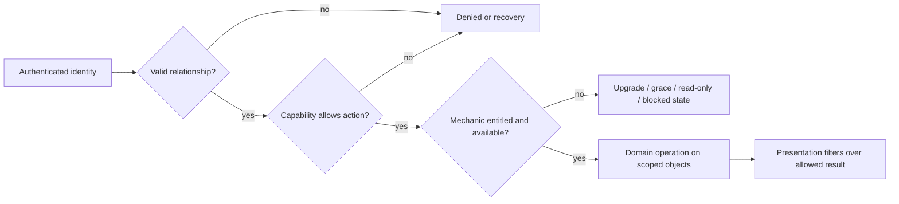
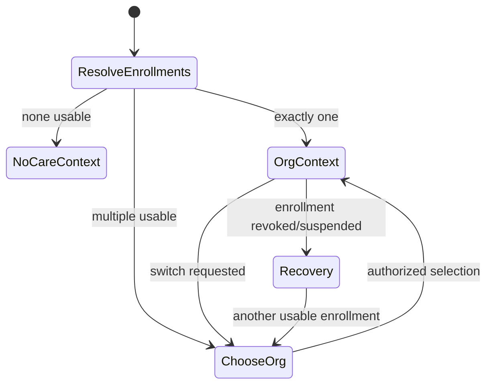

# UX-03 — Product operating model

**Статус:** latest owner clarifications integrated; awaiting full independent audit.
**Authority:** производный contract; `OWNER_RULINGS_2026-07-16.md` побеждает старые candidates этого документа.
**Дата:** 2026-07-15.
**Scope:** actor/context model, solo/clinic composition, patient record/history, visit coordination и entitlement boundaries.

## 1. Как читать документ

В документе используются три уровня утверждений:

- **Инвариант** — уже зафиксированный канон identity/tenant/security; последующие UX-этапы обязаны ему следовать.
- **Рекомендуемый кандидат** — предпочтительная продуктовая модель на основании UX-01/02 и architecture review,
  но не owner ruling.
- **Решение владельца** — датированный outcome из `OWNER_RULINGS_2026-07-16.md`. Открыты только явно перечисленные
  там deferred sub-decisions; старый safe default не является target policy.

Исходные рабочие документы сохраняются отдельно:
[`UX03_OPERATING_MODEL_DRAFT.md`](./UX03_OPERATING_MODEL_DRAFT.md) и
[`UX03_CAPABILITY_ARCH_REVIEW.md`](./UX03_CAPABILITY_ARCH_REVIEW.md).

## 2. Каноническая модель identity и context

### Инварианты

1. Tenant/workspace — `Organization`; solo practice и clinic — разные композиции одной сущности, не разные типы
   account и не разные tenant models.
2. Staff login имеет ровно один active organization membership. Ноль membership закрывает staff workspace;
   несколько — fail-closed integrity error `multiple_active_staff_memberships`, а не organization picker.
3. Membership role — `owner | admin | doctor | assistant`. Clinical authorship дополнительно требует specialist
   binding и соответствующей capability; `owner/admin` сам по себе не делает пользователя специалистом.
4. Один owner/admin может одновременно быть specialist и работает под одним login. Management/clinical mode меняет
   рабочую поверхность, но не identity, organization context и не authorization.
5. Patient имеет одну global canonical identity и ноль или больше organization enrollments. Patient может выбирать
   только уже разрешённый enrollment; staff organization switcher запрещён.
6. Host, custom domain, invite, route, slug, selected specialist и display filter не являются источником прав.
7. Проверка выполняется в порядке: relationship/context → capability → entitlement/mechanic → presentation filter.

Two existing owner rulings need a precise reading in this UX layer:

- staff visibility is organization-wide at the tenant/RLS wall and `Мои пациенты` is an application UX filter, not
  a new database wall. This does **not** by itself settle which clinical record classes are shared, private or
  author-only; the later owner addendum explicitly asks UX-03 to work out that history policy;
- global admin/platform owner is not categorically prohibited from database data. Nevertheless, patient-level
  behavior is not ordinary SaaS analytics, and a product support/intervention workflow still needs an explicit,
  audited surface. Separating that surface does not revoke platform operational authority.



## 3. Staff workspace composition

### Действующее launch-направление: один login, простая management surface

```text
Organization workspace
├── Clinical work               specialist binding + clinical capabilities
│   ├── Today
│   ├── Patients / patient card
│   ├── Schedule
│   └── Programs, messages and care content
├── Organization management    owner/admin capabilities
│   ├── Overview
│   ├── Team and invitations
│   ├── Booking/services setup
│   ├── Branding/public page/channels
│   └── Plan, usage and billing
├── Operations                  future clinic capability; absent from initial release
└── Account                     every staff user
    ├── Profile/security/2FA
    ├── Personal notifications
    └── Install app
```

- Owner/admin with specialist binding opens daily clinical work and has an explicit
  **«Управление организацией»** entry. Switching surfaces does not re-authenticate or elevate access.
- Non-clinical owner/admin opens management overview and never receives an empty doctor dashboard.
- Specialist without management capability sees clinical + account surfaces only.
- Assistant/receptionist workspace is absent from initial release; a future clinic extension must not reuse broad
  doctor/admin access as a shortcut.
- Global admin uses a separate platform-operations IA for aggregate/org/platform diagnostics and support reports;
  no patient chart browsing or patient-record repair surface is planned.

Owner ruling 2026-07-16: one login, with management as a distinct surface. A simple page/menu section is preferred
for launch; an explicit mode switch is allowed if the final composition needs it. This exact switch-vs-menu choice
is an implementation detail and no longer blocks product scope.

### Solo specialist versus clinic specialist

Both use the same components and route contracts where possible; composition is driven by binding, capabilities,
organization shape and entitlement, not by a permanent `solo=true` branch.

| Surface | Solo owner-specialist | Clinic specialist |
|---|---|---|
| Header/context | «Моя практика»; no redundant specialist selector | Clinic identity; own specialist context visible |
| Today/patients | Own practice; «Мои» control omitted when it cannot change result | «Мои» by default; optional «Все доступные» after authorization |
| Patient history | All permitted solo history without team chrome | Own attributed events by default; optional permitted shared history/specialist filter |
| Future clinic coordination | Absent | Reserved concept only; exact permissions/UI require a future clinic contract |
| Schedule | Own calendar; setup entry if management-capable | Own calendar; organization calendar/setup separately gated |
| Settings | Personal + compact practice setup | Personal and organization settings clearly separated |
| Growth | First staff invite activates team composition without account migration | Staff lifecycle, seats and collaboration mechanics |

Initial release is explicitly solo-first. Future clinic growth can reuse the same Organization/account model, but
assistant/team/complex communication capabilities must not appear in or delay launch.

## 4. Assistant / receptionist — future only

Owner ruling 2026-07-16: роли и отдельной рабочей зоны нет в initial release. Architecture may reserve a future
membership/capability extension for clinics, but exact schedule/contact/invite/messaging/payment/history grants are
not approved. No OPS navigation or assistant acceptance is required for solo-first launch. If built later, direct
URL/export/search/count enforcement must match explicit grants and clinical access cannot be inferred from the role.

## 5. Patient organization context

### Инварианты

- Global: identity, recovery/security, list of relationships, global channel consent and platform support.
- Organization-scoped: visits, programs, clinical timeline, messages, payments/benefits and organization support.
- Clinical data from different organizations is not merged into one raw timeline by default.
- Deep link resolves its target and verifies enrollment before changing context. Revoked/foreign contexts show a
  neutral recovery state without leaking organization data.



### Действующий platform-app contract

- With one active enrollment, keep organization name/brand visible but collapse the picker.
- With multiple enrollments, show a persistent organization picker and clearly attribute appointment, specialist,
  program and message recipient.
- Default to last successfully used active organization with a persistent visible switcher. A trusted invite/booking deep link may override only for
  that journey and must visibly show the context change. If preference is invalid, show the chooser.

Owner ruling 2026-07-16: a future paid organization-branded/custom-origin PWA is pinned to that organization and has
no org switcher. It may coexist with the platform app and may be generated from verified domain/subdomain + org
name/logo/manifest settings. Separate organization native apps are outside current scope.

## 6. Patient card and clinic history

### Owner-approved direction

Use one **organization-scoped patient card** per enrollment. Visits, notes, programs, messages and assignments retain
immutable author/specialist attribution and their own visibility class. Introduce restricted episodes/cases only for
a demonstrated privacy, legal or independent workflow boundary; do not duplicate the ordinary card per specialist.

Why this is preferred: it preserves one clinic identity, avoids merge/copy problems, supports a coherent history and
keeps future visit coordination separate from historical ownership. It also requires entry/episode-level privacy; “one card” does not
mean “all staff see everything”.

### Permission before filter

```text
server-derived organization and actor relation
  → object ownership + role/capability
  → record-class / entry / episode visibility
  → permitted dataset (including list/count/search/export parity)
  → filter: my attributed events | all available | specialist X | period | type
```

### Filter and visibility contract

- Solo specialist: no `Мои / Все` toggle when both produce the same permitted result.
- Clinic specialist: `Мои события` by default; `Вся доступная история` and `Специалист X` only when a capability
  permits the corresponding dataset.
- `Мои пациенты` is driven by an actual or scheduled visit/clinical relationship with the specialist. Merely being
  staff of the organization or having unrelated historical visibility does not add the patient to the daily roster.
- Every timeline event displays author/specialist, event type, date and visibility indicator when restricted.

Owner ruling 2026-07-16 approves one organization-scoped card, own events by default and on-demand authorized org
history/specialist filters. Record-class/private visibility remains an authorization/data-policy task; UI uses
“Вся доступная история”, never an unconditional promise of all stored data. No patient hierarchy is introduced.

## 7. Visit-based specialist relation; rejected transfer model

Owner ruling 2026-07-16 rejects the proposed primary/care-team/acceptance model for current product scope.
«Передать пациента» means create/book a visit with another specialist. That actual or scheduled visit creates the
working relationship through which the patient appears in the receiving specialist's workspace. There is no
primary specialist, care team, accept/reject, generic transfer object or cross-organization transfer.

Earlier discovery considered primary assignment, care-team membership, work-item reassignment and cross-org transfer
as separate lifecycle objects. That entire candidate model is **historical and rejected by the owner ruling**; none
of its pending/accept/reject/deactivation queues is a launch or target-default requirement. The implementation path
is ordinary visit creation and appointment audit. Historical authorship remains immutable, but no transfer object
rewrites it. Cross-organization transfer is outside this initiative.

## 8. Entitlement relation

### Инварианты

- Capability answers **who may act**; entitlement answers **whether the organization has the mechanic**.
- Enabled entitlement never broadens patient/history scope. Missing entitlement never masquerades as login or role
  denial and never deletes identity, enrollment or authored history.
- Billing/recovery remains reachable to authorized owner/admin when clinical mechanics are unavailable.

### Recommended presentation contract

Each entitlement-dependent capability declares one degradation state: `hidden`, `read_only`, `grace`, or `blocked`,
plus recovery owner and CTA. Future clinic collaboration may be packaged, but core access to retained patient data and safe
offboarding cannot depend on buying a collaboration feature.

**Owner decision OM-8:** packaging and degradation per mechanic. This informs UX-05 tiers and blocks final denied/
recovery states in UX-06; it must not delay identity-safe UX-04 flows.

## 9. Current owner-outcome registry

| Status | Decision | Current contract | Implementation policy / future backlog |
|---|---|---|---|
| Resolved launch | Patient card/history/`Мои` | One org card; visit relationship; own-events default; authorized history on demand | Record-class implementation policy only |
| Resolved launch absence | Assistant at launch | No role, workspace or grants | Future clinic design outside current scope; no owner gate |
| Rejected premise | Patient transfer lifecycle | No transfer object; ordinary future visit concept only | None for launch |
| Resolved launch | Owner/admin clinical composition | One login; simple distinct management surface | Menu versus mode switch is implementation choice |
| Resolved launch | Patient multi-org default | Last active with persistent switcher; explicit deep-link context | None |
| Rejected premise | Global-admin patient intervention | Aggregate/org/platform diagnostics only; no patient browsing/repair | None |

Current downstream contract: manual patient/card/visit creation precedes optional portal activation; assistant and
multi-specialist clinic surfaces remain future-only; last-active patient organization and one-card/visit-based
history are ruled. Full paid branding uses own domain or platform subdomain and org name/logo without a custom
layout/theme. Generated organization PWA remains post-launch; separate native org app is outside scope.

Owner/admin section authorization, record-class policy, entitlement degradation and sender retry/TTL/retention
remain engineering/data-policy contracts, not open product rulings. Solo-first launch has `0` pending owner product
decisions. Assistant/clinic communications and separate native org app are non-blocking future backlog.

## 10. Acceptance criteria for the independent critic

- Every owner-approved outcome cites the dated ruling; remaining research is explicitly non-blocking future backlog.
- No allow path relies on UI filter, route, Host, client organization or entitlement alone.
- Solo and clinic share one account model but do not show identical irrelevant UI.
- Owner/admin with and without specialist binding lead to different safe surfaces.
- One active staff organization and patient multi-org contexts are not conflated.
- Patient list, direct read, counts, search and export use the same permitted scope.
- No rejected transfer/hierarchy lifecycle leaks back into the target contract.
- Every engineering-policy row is distinguished from owner product decisions and has safe fail-closed/read-only behavior.
