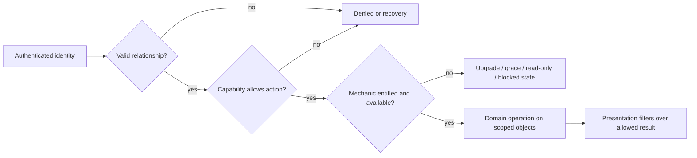
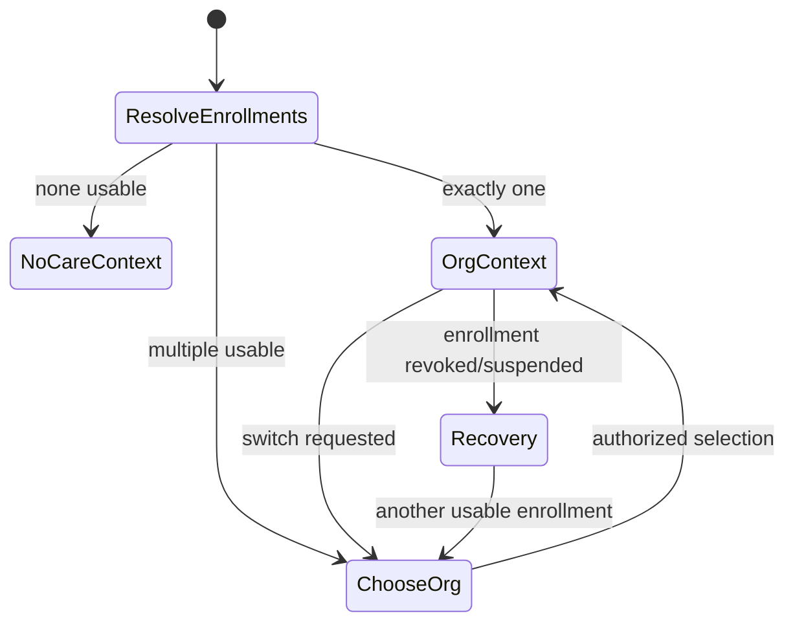

# UX-03 — Product operating model

**Статус:** U5B-0 record/section visibility contract passed terminal independent high-risk audit; application work waits remaining U5A live seals.
**Authority:** производный contract; `OWNER_RULINGS_2026-07-16.md` побеждает старые candidates этого документа.
**Дата:** 2026-07-15.
**Scope:** actor/context model, solo/clinic composition, patient record/history, visit coordination и entitlement boundaries.

## 1. Как читать документ

В документе используются три уровня утверждений:

- **Инвариант** — уже зафиксированный канон identity/tenant/security; последующие UX-этапы обязаны ему следовать.
- **Рекомендуемый кандидат** — предпочтительная продуктовая модель на основании UX-01/02 и architecture review,
  но не owner ruling.
- **Решение владельца** — датированный outcome из `OWNER_RULINGS_2026-07-16.md`. Открыты только явно перечисленные
  там deferred sub-decisions; старый safe default не является target policy.

Исходные рабочие документы сохраняются отдельно:
[`UX03_OPERATING_MODEL_DRAFT.md`](./UX03_OPERATING_MODEL_DRAFT.md) и
[`UX03_CAPABILITY_ARCH_REVIEW.md`](./UX03_CAPABILITY_ARCH_REVIEW.md).

## 2. Каноническая модель identity и context

### Инварианты

1. Tenant/workspace — `Organization`; solo practice и clinic — разные композиции одной сущности, не разные типы
   account и не разные tenant models.
2. Staff login имеет ровно один active organization membership. Ноль membership закрывает staff workspace;
   несколько — fail-closed integrity error `multiple_active_staff_memberships`, а не organization picker.
3. Membership role — `owner | admin | doctor | assistant`. Clinical authorship дополнительно требует specialist
   binding и соответствующей capability; `owner/admin` сам по себе не делает пользователя специалистом.
4. Один owner/admin может одновременно быть specialist и работает под одним login. Management/clinical mode меняет
   рабочую поверхность, но не identity, organization context и не authorization.
5. Patient имеет одну global canonical identity и ноль или больше organization enrollments. Patient может выбирать
   только уже разрешённый enrollment; staff organization switcher запрещён.
6. Host, custom domain, invite, route, slug, selected specialist и display filter не являются источником прав.
7. Проверка выполняется в порядке: relationship/context → capability → entitlement/mechanic → presentation filter.

Two existing owner rulings need a precise reading in this UX layer:

- staff visibility is organization-wide at the tenant/RLS wall and `Мои пациенты` is an application UX filter, not
  a new database wall. This does **not** by itself settle which clinical record classes are shared, private or
  author-only; the later owner addendum explicitly asks UX-03 to work out that history policy;
- global admin/platform owner is not categorically prohibited from database data. Nevertheless, patient-level
  behavior is not ordinary SaaS analytics, and a product support/intervention workflow still needs an explicit,
  audited surface. Separating that surface does not revoke platform operational authority.



## 3. Staff workspace composition

### Действующее launch-направление: один login, простая management surface

```text
Organization workspace
├── Clinical work               specialist binding + clinical capabilities
│   ├── Today
│   ├── Patients / patient card
│   ├── Schedule
│   └── Programs, messages and care content
├── Organization management    owner/admin capabilities
│   ├── Overview
│   ├── Team and invitations
│   ├── Booking/services setup
│   ├── Branding/public page/channels
│   └── Plan, usage and billing
├── Operations                  future clinic capability; absent from initial release
└── Account                     every staff user
    ├── Profile/security/2FA
    ├── Personal notifications
    └── Install app
```

- Owner/admin with specialist binding opens daily clinical work and has an explicit
  **«Управление организацией»** entry. Switching surfaces does not re-authenticate or elevate access.
- Non-clinical owner/admin opens management overview and never receives an empty doctor dashboard.
- Specialist without management capability sees clinical + account surfaces only.
- Assistant/receptionist workspace is absent from initial release; a future clinic extension must not reuse broad
  doctor/admin access as a shortcut.
- Global admin uses a separate platform-operations IA for aggregate/org/platform diagnostics and support reports;
  no patient chart browsing or patient-record repair surface is planned.

Owner ruling 2026-07-16: one login, with management as a distinct surface. A simple page/menu section is preferred
for launch; an explicit mode switch is allowed if the final composition needs it. This exact switch-vs-menu choice
is an implementation detail and no longer blocks product scope.

### Solo specialist versus clinic specialist

Both use the same components and route contracts where possible; composition is driven by binding, capabilities,
organization shape and entitlement, not by a permanent `solo=true` branch.

| Surface | Solo owner-specialist | Clinic specialist |
|---|---|---|
| Header/context | Identity специалиста/кабинета; no redundant specialist selector | Clinic identity; own specialist context visible |
| Today/patients | Own practice; «Мои» control omitted when it cannot change result | «Мои» by default; optional «Все доступные» after authorization |
| Patient history | All permitted solo history without team chrome | Own attributed events by default; optional permitted shared history/specialist filter |
| Future clinic coordination | Absent | Reserved concept only; exact permissions/UI require a future clinic contract |
| Schedule | Own calendar; setup entry if management-capable | Own calendar; organization calendar/setup separately gated |
| Settings | «Настройки» кабинета + отдельный «Аккаунт» | «Настройки» организации + отдельный «Аккаунт» |
| Growth | First staff invite activates team composition without account migration | Staff lifecycle, seats and collaboration mechanics |

Initial release is explicitly solo-first. Future clinic growth can reuse the same Organization/account model, but
assistant/team/complex communication capabilities must not appear in or delay launch.

## 4. Assistant / receptionist — future only

Owner ruling 2026-07-16: роли и отдельной рабочей зоны нет в initial release. Architecture may reserve a future
membership/capability extension for clinics, but exact schedule/contact/invite/messaging/payment/history grants are
not approved. No OPS navigation or assistant acceptance is required for solo-first launch. If built later, direct
URL/export/search/count enforcement must match explicit grants and clinical access cannot be inferred from the role.

## 5. Patient organization context

### Инварианты

- Global: identity, recovery/security, list of relationships, global channel consent and platform support.
- Organization-scoped: visits, programs, clinical timeline, messages, payments/benefits and organization support.
- Clinical data from different organizations is not merged into one raw timeline by default.
- Deep link resolves its target and verifies enrollment before changing context. Revoked/foreign contexts show a
  neutral recovery state without leaking organization data.



### Действующий platform-app contract

- With one active enrollment, keep organization name/brand visible but collapse the picker.
- With multiple enrollments, show a persistent organization picker and clearly attribute appointment, specialist,
  program and message recipient.
- Default to last successfully used active organization with a persistent visible switcher. A trusted invite/booking deep link may override only for
  that journey and must visibly show the context change. If preference is invalid, show the chooser.

Owner ruling 2026-07-16: a future paid organization-branded/custom-origin PWA is pinned to that organization and has
no org switcher. It may coexist with the platform app and may be generated from verified domain/subdomain + org
name/logo/manifest settings. Separate organization native apps are outside current scope.

## 6. Patient card and clinic history

### Owner-approved direction

Use one **organization-scoped patient card** per enrollment. Visits, notes, programs, messages and assignments retain
immutable author/specialist attribution and their own visibility class. Introduce restricted episodes/cases only for
a demonstrated privacy, legal or independent workflow boundary; do not duplicate the ordinary card per specialist.

Why this is preferred: it preserves one clinic identity, avoids merge/copy problems, supports a coherent history and
keeps future visit coordination separate from historical ownership. It also requires entry/episode-level privacy; “one card” does not
mean “all staff see everything”.

### Permission before filter

```text
server-derived organization and actor relation
  → object ownership + role/capability
  → record-class / entry / episode visibility
  → permitted dataset (including list/count/search/export parity)
  → filter: my attributed events | all available | specialist X | period | type
```

### Filter and visibility contract

- Solo specialist: no `Мои / Все` toggle when both produce the same permitted result.
- Clinic specialist: `Мои события` by default; `Вся доступная история` and `Специалист X` only when a capability
  permits the corresponding dataset.
- `Мои пациенты` is driven by an actual or scheduled visit/clinical relationship with the specialist. Merely being
  staff of the organization or having unrelated historical visibility does not add the patient to the daily roster.
- Every timeline event displays author/specialist, event type, date and visibility indicator when restricted.

Owner ruling 2026-07-16 approves one organization-scoped card, own events by default and on-demand authorized org
history/specialist filters. Record-class/private visibility remains an authorization/data-policy task; UI uses
“Вся доступная история”, never an unconditional promise of all stored data. No patient hierarchy is introduced.

### U5B-0 policy dimensions

The organization card is a projection over already-authorized objects, not an authorization boundary of its own.
Every projected object must resolve all of the following server-side before a query or mutation returns data:

1. **Organization ownership:** the record owns `organization_id` directly or reaches exactly one organization through
   a reviewed parent path (enrollment, appointment/visit, program assignment, conversation, membership or payment).
   A route parameter, selected specialist, patient identity or shared UI container is never ownership evidence.
2. **Record class:** one finite class from the registry below. An unknown/unmapped class is not operational or shared
   by default.
3. **Visibility class:** `operational`, `authored_or_assigned`, `shared_clinical`, `restricted` or `inherited` as
   defined below. Visibility is independent from entitlement and from a presentation filter.
4. **Provenance:** subject patient/enrollment, immutable original author when an author exists, attributed specialist
   or assignee when the workflow has one, and immutable parent linkage for inherited objects.
5. **Actor relation and capability:** valid organization membership plus specialist binding and visit relation for
   clinical work, or an explicit operational capability for a non-clinical owner/admin.

The policy names are semantic contract labels, not approval of exact schema columns or a second authorization engine.
U5B implementation must map them through the existing capability/principal ports and choose storage only after a
schema/API census.

### Patient-card section and record-class registry

“Section” describes where an authorized projection may appear. Removing duplicate `Overview` or `Communications`
tabs does not remove the underlying classes or weaken their policy. Each row applies to item lists, direct reads,
counts, search, export and writes.

| Contract class | Card projection / examples | Required organization ownership | Author / attributed specialist | Launch visibility baseline | Non-clinical owner/admin without specialist binding |
|---|---|---|---|---|---|
| `patient_profile` | Compact FIO, birth date, organization-local patient label and demographics | Active/retained organization enrollment; global patient identity alone is insufficient | Last editor is audit actor; no invented clinical author | `operational`, limited by profile capability | May read explicitly delegated fields; a write to global identity requires a separately reviewed identity capability and audit |
| `contact_channel` | Phone, email, supplementary contacts, messenger/channel availability and contact actions | Organization enrollment or reviewed organization-channel binding | Binding/consent actor where applicable; no specialist attribution implied | `operational`, field/action capability required | May use permitted contact operations; secret credentials and unrelated global bindings are never projected |
| `portal_access` | Invited/activated/linked, blocked/archived status and safe lifecycle actions | Exact organization enrollment/invite/booking ownership | Issuer and lifecycle actor are audit provenance, not clinical authors | `operational_security`; represented by `operational` plus a narrower action capability | Status/actions only when delegated; token, credential and cross-organization identity data never appear |
| `patient_physical_metric` | Height and weight shown in the compact header | Must resolve to one exact organization-owned observation or an explicitly approved global-patient policy | Measurement author/editor and attributed specialist must be retained when clinical | `unknown` for the current global `platform_users` shape; fail closed until ownership/provenance is reviewed | No clinical measurement read/write merely because global identity is enrolled |
| `appointment` | Past/future appointments, calendar linkage, service, location and appointment status | Exact organization appointment linked to the enrollment | Creator is audit actor; destination specialist remains immutable attribution | `operational` for permitted roster/schedule use; related specialist relation is server-derived | May read/change only with explicit booking-operation capability; this does not grant clinical history |
| `clinical_visit` | Visit facts and visit-bound protocol: findings, exam, manipulations, trial results and recommendations | Exact organization visit through appointment/enrollment or another reviewed clinical parent | Original author fixed from authenticated specialist binding; destination/performing specialist stored separately when different | `authored_or_assigned` by default; `shared_clinical` only by explicit reviewed classification; `restricted` never inferred | No read/count/search/export/write without a valid specialist binding and clinical capability |
| `clinical_anamnesis` | Standalone trauma/operation, illness/stress and lifestyle append-log entries, not visit-bound | Direct exact organization + patient/enrollment; no visit parent is assumed | `created_by` is immutable original author; attributed specialist requires a valid binding mapping | `authored_or_assigned`; broader visibility requires explicit reviewed classification | No content or existence indicators by management role alone |
| `clinical_comorbidity` | Active/removed comorbidities and restore lifecycle | Direct exact organization + patient/enrollment | `created_by` is immutable author; every edit/remove/restore needs a separate amendment actor | `authored_or_assigned`; no broad operational inference | No content, removed-count or lifecycle action by management role alone |
| `clinical_complaint` | Persistent active/resolved complaint plus visit-linked severity/status updates | Exact organization and patient from complaint; original source visit must resolve to the same organization | Original author/specialist inherits from immutable source visit; each update/amendment actor remains separate | Inherits source visit's clinical visibility; may narrow, never broaden | No content, priority/status or counts by management role alone |
| `clinical_diagnosis` | Persistent diagnosis, refinement/resolution updates and clinical-status history | Exact organization and patient from diagnosis; source/update visits must resolve to the same organization | Original author/specialist inherits from source visit; `changed_by` or amendment actor is separate | Inherits source visit's clinical visibility; may narrow, never broaden | No text/status/history/catalog association or counts by management role alone |
| `clinical_note` | Existing Notes and prepared/follow-up visit notes | Exact organization enrollment or clinical parent | Original author fixed from binding; assignee optional but never substituted for author | `authored_or_assigned` by default; explicit `shared_clinical` or `restricted` only | No clinical access by management role alone |
| `care_task` | Existing Tasks, reminders and patient-specific follow-up work | Exact organization enrollment plus assigned specialist/work owner | Creator and assignee are distinct immutable facts | `authored_or_assigned`; a task containing patient context is not broad operational data | No patient-task content without specialist binding; management may see only separate aggregate operations if later approved |
| `symptom_observation` | Dynamics, patient check-ins, measurements and symptom timeline | Exact organization enrollment/program/visit parent | Patient or authenticated specialist is immutable author; responsible specialist is separate attribution | `authored_or_assigned`; explicit shared/restricted classification governs broader access | No values, presence indicators or counts by management role alone |
| `care_signal` | Proactive insights, program-activity summaries and other derived card signals | Every contributing source must resolve to the same exact organization and an allowed base record | Derived record names its source set/policy version; it never invents an author | `inherited` intersection of contributing sources; any hidden/unknown source makes the signal hidden/unknown | No signal, count or explanation when its clinical sources are not permitted |
| `program_assignment` | Assigned program, care-plan state, support/warmup settings and specialist instructions | Exact organization enrollment plus organization-owned program assignment | Assigning specialist is immutable attribution; later editor is amendment actor | `authored_or_assigned`; explicit shared/restricted classification required for broader clinic access | No program content or existence signal without specialist binding |
| `program_progress` | Exercise completion calendar, patient reports, item events and test/progress results | Inherits exact organization and patient from one program assignment | Patient/specialist author retained per event; assigned specialist remains separate | `inherited` from assignment, narrowed by an explicit restricted child but never broadened by a child | No progress or aggregate counts without specialist binding |
| `care_communication` | Patient support chat, program discussion/comment content, unread/delivery-visible thread metadata | Exact organization conversation/discussion plus an explicit verified participant or recipient grant | Sender immutable; recipient/participant grant is distinct from program assignee or responsible specialist | `restricted`; only explicit verified participant/recipient grant permits content or existence | No content, snippets, unread counts, search or export by management role alone |
| `patient_file` | Patient files, visit attachments, program media and downloadable originals | Exact organization parent; standalone file must have an explicit reviewed enrollment parent | Uploader immutable; clinical author comes from parent when applicable | `inherited`; may narrow to `restricted`, never broaden parent visibility | Only operational files with explicit operational parent/capability; clinical-file metadata is hidden with content |
| `membership_benefit` | Membership list/history, benefits, balance, write-off and recalculation actions | Exact organization membership/subscription owned by the enrollment | Creator/operator is audit actor; no clinical author | `operational_financial`; represented by `operational` plus financial capability | Permitted read/actions with explicit billing/benefit capability; no clinical access follows |
| `payment_ledger` | Payments, refunds, invoices and patient financial history | Exact organization payment/customer/enrollment ownership | Initiator/operator retained for audit; no specialist attribution implied | `operational_financial`; represented by `operational` plus financial capability | Permitted financial projection/actions only; exports remain organization-scoped and capability-gated |
| `record_amendment` | Correction/version/tombstone metadata for any card record | Inherits exact organization and subject from the amended record | Original author never changes; amendment actor, time and reason are appended | `inherited` from the amended record and never more visible than it | Visible only when the base record and amendment metadata action are permitted |

### Current standalone-card source/API census

This is a current-state mapping, not proof that the route already satisfies the target policy. “Gap” means the later
U5B code stage must close it before that route can participate in shared/all history, search, count or export.
Families include their direct item/status/action subroutes.

| Current section/source and live route family | Contract class | Current ownership/provenance evidence | Required visibility and amendment behavior / current gap |
|---|---|---|---|
| Card shell SSR `/app/doctor/patients/[userId]`, catch-all tab redirects and `GET/PATCH /api/doctor/patients/[userId]`, `/fio` | `patient_profile` | Route resolves organization enrollment, then reads/writes global `platform_users`; names/birth date/gender have no organization-local parent | Read only after exact enrollment. Global identity write is not an org-local amendment and needs reviewed identity authority + actor trail; otherwise fail closed/read-only |
| Header physical projection and `GET/PATCH .../physical` | `patient_physical_metric` | Height/weight live only on global `platform_users`; route enrollment check does not give the values intrinsic organization ownership, author or specialist | Current shape is `unknown`: no shared/all/count/search/export and no U5B-compliant write until global-vs-org policy, author and amendment source are explicit |
| Header/contact/account `/api/doctor/clients/[userId]/supplementary-contacts`, `/api/doctor/patients/[userId]/email-change`, `/api/doctor/clients/[userId]/booking-profile` and channel projections | `contact_channel`, `portal_access` | Enrollment is route parent; supplementary contacts and account/channel bindings have their own current sources | Exact field/action capability; email/binding changes retain lifecycle actor. Unscoped global contact mutation cannot be treated as an org-local write |
| Account `block`, `archive` and any delete-like lifecycle route | `portal_access`, plus affected base classes | Enrollment/lifecycle object is organization context; management action is not clinical authorship | Append lifecycle actor/reason. Blocking/archive never silently deletes clinical history; permanent deletion remains behind retention/legal gates outside U5B |
| Karta aggregate `GET .../clinical` | `clinical_visit`, `clinical_complaint`, `clinical_diagnosis` | Current clinical tables carry organization/patient; complaint/diagnosis roots carry `source_visit_id` | Query each class with its own visibility before aggregation; mixed response cannot use visit visibility to expose unrelated persistent state |
| `GET/POST .../visits`, `PATCH .../visits/[visitId]` and unlinked-appointment preparation | `clinical_visit` | Direct organization/patient, immutable `created_by`; optional appointment links must agree with organization | Author from binding and visit visibility. Current mutable update path needs append-only amendment evidence before compliant edit |
| `GET/POST .../anamnesis` | `clinical_anamnesis` | Three direct organization/patient append-log tables; `created_by`; deliberately no visit link | Existing append is immutable. Any future edit/delete is a new amendment/tombstone, never an in-place overwrite |
| `GET/POST .../comorbidities`, `PATCH/DELETE .../comorbidities/[id]` | `clinical_comorbidity`, `record_amendment` | Direct organization/patient and immutable `created_by`; current active/removed timestamps exist | Classification is deterministic when org/author agree. Current edit/remove/restore lacks a complete immutable actor/reason trail, so lifecycle mutation needs amendment closure |
| `PATCH .../complaints/[complaintId]` plus complaint/update rows returned by `/clinical` | `clinical_complaint`, `record_amendment` | Complaint organization/patient and source visit are explicit; update rows inherit complaint + visit, but base has no separate `created_by` | Original author comes only from the valid source visit. Current inline text/priority mutation has no append-only actor trail and is non-compliant until amendment closure |
| `PATCH .../diagnoses/[diagnosisId]`, `GET/PATCH .../diagnoses/[id]/status` plus diagnosis/update/history rows | `clinical_diagnosis`, `record_amendment` | Diagnosis organization/patient/source visit explicit; status history has `changed_by`; visit-linked update rows lack their own actor | Source visit fixes original author. Status history is an amendment source; inline text/priority/comment and update rows need equivalent immutable actor/reason evidence |
| `GET/POST .../diagnosis-catalog` | Supporting organization/global clinical reference; not a patient-card record class | Catalog row has nullable organization and `created_by`; patient ID in route is only an access precondition | Require bound specialist + card relation for this route, then catalog scope. Never include catalog rows in patient count/timeline/export or infer patient history from a match |
| Overview `GET/POST /api/doctor/clients/[userId]/notes` | `clinical_note`, `record_amendment` | `doctor_notes.organization_id` + `user_id`; immutable original author is `author_id` | Own/assigned by default. `updated_at` alone is not an amendment trail; any edit/delete must preserve `author_id` and append actor/reason |
| Overview `tasks`, `tasks/summary` | `care_task`, `record_amendment` | `specialist_tasks.organization_id` + `patient_user_id`; current owner/assignee is `owner_user_id`, but there is no distinct creator field | Summary/count uses the same owner visibility. Creator is `unknown` where it cannot be recovered; any reassignment/amendment must preserve prior owner and record actor |
| Overview `proactive-insights` and `program-activity` | `care_signal` | Derived from patient/program/discussion/clinical sources under current workspace | Authorize every contributing source; hidden/unknown input hides signal and KPI. Derived endpoint is never broader than source APIs |
| Program list and detail: `clients/[userId]/treatment-program-instances`, `treatment-program-instances/[instanceId]/**`, `/api/doctor/clients/[userId]/support-settings` and `/warmup-schedule` | `program_assignment`, `program_progress`, `record_amendment` | Instance supplies `organization_id`, `patient_user_id`, `assigned_by` and `assignment_source`; child stage/item/event/test rows must resolve one instance | `assigned_by` is immutable attribution when present; null/legacy assigner is unknown. Structure/progress inherit only from the instance; action log keeps later editor actor. Discussion subroutes are excluded |
| `/api/doctor/patients/[userId]/exercise-calendar`, program-day activity, symptom-trackings and LFK exercise-row actions | `program_progress`, `symptom_observation`, `care_signal` | Exact program/enrollment/visit parent required per row | Child visibility is parent intersection; mixed aggregates omit hidden sources. No program child may broaden assignment visibility |
| Program discussion routes and embedded patient chat: `.../discussion/**`, `/api/doctor/messages/conversations/ensure`, conversation list/unread, `/messages/[conversationId]` and `/read` | `care_communication` | Support rows have `organization_id` + `platform_user_id`; discussion rows have `organization_id` + `patient_user_id` + stage-item parent. Current `admin_scope`/`sender_role='admin'` is not a staff participant, recipient or immutable sender identity | Current shapes do not prove the required staff grant/author, so U5B communication fails closed until an explicit participant/recipient and sender identity are available on list/direct/unread/ensure/send/read. Assignment routing remains deferred U5D |
| Files `GET/POST .../files`, `PATCH/DELETE .../files/[fileId]` | `patient_file`, `record_amendment` | `patient_files.organization_id` + `patient_user_id`; optional `visit_id`/`media_file_id`; immutable uploader is `uploaded_by_user_id` | Visit attachment inherits only from a visible same-org visit. Standalone/ambiguous parent is unknown. Relink/delete/metadata edit records actor and cannot broaden visibility |
| Appointments/records `.../appointments`, `/appointments/unlinked` and `clients/[userId]/history` | `appointment`, plus each returned clinical/financial class | Appointment owns exact organization/destination specialist; mixed history contains independently owned event types | List/count/history authorizes per event before merge. One permitted appointment cannot reveal clinical/payment events with a different class |
| Membership/package projections and write-off/recalculate actions under `/api/doctor/booking-engine/patient-packages` | `membership_benefit`, `record_amendment` | Exact organization package/customer/enrollment | Financial capability and organization scope on read/count/write; actions append operator and preserve ledger history |
| `payments`, `payment-timeline`, `acquiring-charge` and SSR payment history | `payment_ledger`, `record_amendment` | `patient_payment.organization_id` + `patient_user_id`; optional `visit_id`; immutable initiator is `created_by`; provider events retain provider IDs | Ledger/export parity; charge/refund/correction append operator/provider event and never rewrite another event |

The census covers the current standalone card tabs (`overview`, `karta`, `program`, `records`, `files`, `account`,
`comms`, `finances`), their SSR projections, the program detail route and the direct APIs used by those surfaces.
Legacy merge/search/admin utilities that are not a patient-card projection remain governed by their own stage and do
not acquire U5B access by omission from this table.

`operational_security` and `operational_financial` above are section qualifiers, not extra visibility values: they
require narrower capabilities in addition to `operational`. They must never be collapsed into a generic
“organization staff can read” rule.

### Visibility vocabulary and inheritance

| Visibility | Minimum allow rule | Explicitly does not mean |
|---|---|---|
| `operational` | Exact organization ownership + actor membership + explicit section/action capability | All staff, all fields, clinical data, or cross-organization identity access |
| `authored_or_assigned` | Bound specialist has the patient relation and is immutable author, attributed specialist or explicit assignee | A selected specialist filter, owner/admin role, or organization membership alone |
| `shared_clinical` | Exact organization + patient relation + clinical section capability + `clinical_history.view_shared`-equivalent capability + record explicitly classified shareable | “All stored history”; entitlement or UI `Все` alone |
| `restricted` | Exact organization + patient relation + explicit participant/recipient/episode grant for this record | General shared-history capability; counts or metadata disclosure to non-participants |
| `inherited` | Resolve a reviewed parent and apply the parent's visibility, optionally narrowed by the child | Standalone access, guessing a parent, or broadening a restricted parent |

No legacy row may be classified `shared_clinical` or downgraded from `restricted` by absence of a flag. An
unclassified record, an inherited object with no unique parent, or an ownership conflict is `unknown` and therefore
excluded from normal card reads, counts, search and export until deterministically resolved. `unknown` is a failure
state, not a sixth usable visibility class.

### Actor outcomes

- **Solo specialist:** still requires exact organization, binding and patient relation. They receive their permitted
  operational records and clinical records for which they are author/attributed/assignee, plus explicitly permitted
  shared records and restricted clinical records for which they hold the explicit record/episode grant. Care
  communication additionally requires its own verified participant/recipient grant. The UI omits a redundant
  `Мои / Все` control; solo composition is not a bypass around classification.
- **Clinic specialist A:** the default dataset is A's authored/attributed/assigned records plus permitted operational
  sections. Explicitly shareable history appears only with the shared-history capability. Restricted B records,
  communications and inherited metadata remain absent unless their respective record policy permits them;
  communication specifically requires A to be a verified participant/recipient and never follows assignment.
- **Clinic specialist B:** the symmetric rule applies. A visit relation can make the patient appear in B's roster but
  does not retroactively share A's clinical records. An empty own dataset remains empty and never falls back to the
  full organization history. Neither the visit nor program assignment creates a communication grant.
- **Owner/admin with specialist binding:** management and clinical grants are evaluated independently. Clinical
  access and authorship come only from the active specialist binding; management role never widens the clinical
  result. Communication still requires a verified participant/recipient grant for that binding.
- **Owner/admin without specialist binding:** may receive only the explicitly delegated `patient_profile`,
  `contact_channel`, `portal_access`, `appointment`, `membership_benefit` and `payment_ledger` projections. All
  clinical, program, symptom, patient-care communication, clinical-file and derived count/search/export paths deny
  without revealing whether records exist.
- **Global admin/support and absent assistant role:** have no ordinary patient-card path. Existing aggregate platform
  diagnostics and any future clinic role remain separate contracts and cannot be projected through U5B.

### Operation parity contract

One policy decision must be reusable by every path; filtering an already over-broad repository result is invalid.

| Operation | Required behavior |
|---|---|
| List/timeline/tab | Authorize organization, patient relation, section and record visibility before returning rows; pagination cursors must not encode hidden records |
| Direct read/deep link | Resolve the object and exact organization, then apply the same class predicate; foreign/hidden/missing returns one neutral outcome without metadata |
| Count/KPI/has-data | Aggregate only the permitted dataset; zero must not distinguish “hidden exists” from “none exists” |
| Search/autocomplete | Apply the permission predicate inside the query/index projection before matching or ranking; no hidden snippets, names, IDs or hit counts |
| Export/download | Use the same authorized query and attachment inheritance as the screen; if no parity-safe export exists, the operation is unavailable rather than implemented through a broader path |
| Write/create | Authorize exact organization, patient relation, writable class and action; server fixes author from the authenticated binding and validates attributed specialist/parent separately |
| Amend/delete-like action | Preserve original author and prior content/version; append actor/time/reason and use a policy-aware tombstone where removal is allowed; never rewrite history in place to impersonate another specialist |

The selected specialist, tab, date range or `Мои / Вся доступная` control is applied only after this permitted
dataset exists. Cache keys, server-rendered payloads and background/export jobs must carry the same trusted
organization and policy version; a stale or missing context fails closed rather than returning a previous scope.

### Legacy classification and rollback contract

A later U5B data stage must produce a PII-free census by contract class and choose exactly one outcome per legacy
shape:

- **Deterministic backfill:** allowed only when exact organization, patient/enrollment parent, record class,
  author/attributed specialist or operational action source, and inheritance parent can be proven from stable keys.
  Clinical rows with a proven author/assignee default to `authored_or_assigned`; they are never guessed shared.
- **Deterministic inheritance:** attachments/progress/amendments may inherit only from one reviewed parent whose
  organization and visibility agree. A child may be narrowed but not broadened.
- **Ambiguous queue:** missing/conflicting organization, orphaned parent, absent clinical author/assignee, multiple
  possible parents, standalone files, global physical values without approved ownership/author policy, mutation
  history without a recoverable actor, or legacy “visible to everyone” behavior without provenance remain `unknown`.
  They are excluded from shared/all views and parity operations; the report contains counts/reason codes and stable
  non-PII identifiers, not record contents.

Backfill and rollback must preserve original IDs, organization ownership, author/specialist facts and timestamps.
Each changed row needs a durable before/after classification mapping and run identity. Rollback restores the previous
classification projection; it must not delete the underlying clinical history or erase amendments. No live database
apply is authorized by this contract.

### U5B-0 contract acceptance

- Every registry row has one ownership path, provenance rule, visibility baseline and owner/admin outcome.
- Every current standalone-card tab, SSR source and direct API family is mapped to a class or explicitly classified
  as a non-patient supporting reference; a missing mapping is `unknown`, never an implicit operational grant.
- Solo, specialist A/B and owner/admin with/without binding produce deterministic results without role shortcuts.
- List, direct, count, search, export, write and amendment paths use one policy; hidden records leak no existence fact.
- Unknown and ambiguous legacy rows fail closed; deterministic backfill never guesses shared/private intent.
- Original author/specialist attribution remains immutable and every correction has a separate amendment actor.
- Communication content/existence requires an explicit verified participant/recipient grant; visit relation,
  responsible specialist, program assignment and visible parent are insufficient, and U5D routing stays deferred.
- U5B application/schema/UI work remains gated on independent high-risk review of this contract and the remaining
  U5A runtime seals; U3B and U4 are not added as DAG dependencies.

## 7. Visit-based specialist relation; rejected transfer model

Owner ruling 2026-07-16 rejects the proposed primary/care-team/acceptance model for current product scope.
«Передать пациента» means create/book a visit with another specialist. That actual or scheduled visit creates the
working relationship through which the patient appears in the receiving specialist's workspace. There is no
primary specialist, care team, accept/reject, generic transfer object or cross-organization transfer.

Earlier discovery considered primary assignment, care-team membership, work-item reassignment and cross-org transfer
as separate lifecycle objects. That entire candidate model is **historical and rejected by the owner ruling**; none
of its pending/accept/reject/deactivation queues is a launch or target-default requirement. The implementation path
is ordinary visit creation and appointment audit. Historical authorship remains immutable, but no transfer object
rewrites it. Cross-organization transfer is outside this initiative.

## 8. Entitlement relation

### Инварианты

- Capability answers **who may act**; entitlement answers **whether the organization has the mechanic**.
- Enabled entitlement never broadens patient/history scope. Missing entitlement never masquerades as login or role
  denial and never deletes identity, enrollment or authored history.
- Billing/recovery remains reachable to authorized owner/admin when clinical mechanics are unavailable.

### Recommended presentation contract

Each entitlement-dependent capability declares one degradation state: `hidden`, `read_only`, `grace`, or `blocked`,
plus recovery owner and CTA. Future clinic collaboration may be packaged, but core access to retained patient data and safe
offboarding cannot depend on buying a collaboration feature.

**Owner decision OM-8:** packaging and degradation per mechanic. This informs UX-05 tiers and blocks final denied/
recovery states in UX-06; it must not delay identity-safe UX-04 flows.

## 9. Current owner-outcome registry

| Status | Decision | Current contract | Implementation policy / future backlog |
|---|---|---|---|
| Resolved launch | Patient card/history/`Мои` | One org card; visit relationship; own-events default; authorized history on demand | Record-class implementation policy only |
| Resolved launch absence | Assistant at launch | No role, workspace or grants | Future clinic design outside current scope; no owner gate |
| Rejected premise | Patient transfer lifecycle | No transfer object; ordinary future visit concept only | None for launch |
| Resolved launch | Owner/admin clinical composition | One login; simple distinct management surface | Menu versus mode switch is implementation choice |
| Resolved launch | Patient multi-org default | Last active with persistent switcher; explicit deep-link context | None |
| Rejected premise | Global-admin patient intervention | Aggregate/org/platform diagnostics only; no patient browsing/repair | None |

Current downstream contract: manual patient/card/visit creation precedes optional portal activation; assistant and
multi-specialist clinic surfaces remain future-only; last-active patient organization and one-card/visit-based
history are ruled. Full paid branding uses own domain or platform subdomain and org name/logo without a custom
layout/theme. Generated organization PWA remains post-launch; separate native org app is outside scope.

Owner/admin section authorization, record-class policy, entitlement degradation and sender retry/TTL/retention
remain engineering/data-policy contracts, not open product rulings. Solo-first launch has `0` pending owner product
decisions. Assistant/clinic communications and separate native org app are non-blocking future backlog.

## 10. Acceptance criteria for the independent critic

- Every owner-approved outcome cites the dated ruling; remaining research is explicitly non-blocking future backlog.
- No allow path relies on UI filter, route, Host, client organization or entitlement alone.
- Solo and clinic share one account model but do not show identical irrelevant UI.
- Owner/admin with and without specialist binding lead to different safe surfaces.
- One active staff organization and patient multi-org contexts are not conflated.
- Patient list, direct read, counts, search and export use the same permitted scope.
- No rejected transfer/hierarchy lifecycle leaks back into the target contract.
- Every engineering-policy row is distinguished from owner product decisions and has safe fail-closed/read-only behavior.
