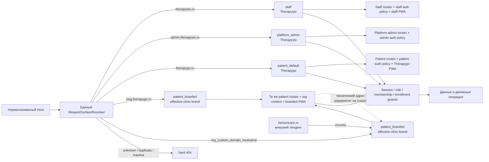

# Therapysto / Therapygo: карта доменов, поверхностей и входа

**Дата:** 2026-08-22. **Статус:** целевая схема для сверки с кодом, не описание уже реализованного состояния.
**Authority:** owner-решения и `TPB-16` из `IMPLEMENTATION_PLAN.md`. **Граница:** один webapp, один
`RequestSurfaceResolver`, существующие stores/ports; Host выбирает поверхность, но не даёт доступ к данным.

Две разведки уже приняты как входные данные и здесь не переоткрываются:

- `LEGAL_PAGE_BRANDING_WORLD_PRACTICE.md`: в 12 из 13 проверенных продуктов владельцем юридического текста
  выступает платформенное юрлицо, не клиника; для всех поверхностей нужен один комплект документов;
- `PASSKEY_ACROSS_DOMAINS_RESEARCH.md`: credential привязан к RP ID; поддомены собственного parent-domain
  покрываются одним RP ID, произвольные домены клиник — нет; лимит Related Origin Requests равен пяти labels.

## 1. Одна схема



Инварианты схемы:

1. `ResolvedSurface = { surface, publicOrigin, organizationId?, effectivePatientBrand?, authPolicy }` получается
   один раз на границе запроса и переиспользуется routing, metadata/manifest, auth, абсолютными ссылками и
   transactional delivery. Параллельных getters/resolvers/stores нет (`TPB-16`).
2. `organizationId` появляется только после точного совпадения Host с опубликованной активной клиникой. Это
   контекст поверхности, не авторизация. Доступ к данным по-прежнему дают session + role + membership/enrollment.
3. Неизвестный, дублирующийся или неактивный Host отвечает hard 404; platform fallback запрещён.
4. Cookie остаётся host-only; cross-domain SSO нет. Переход между доменами означает новый вход.
5. `bersoncare.ru` не проходит через resolver: это внешний лендинг первого арендатора.

## 2. Шесть хостов × семь вопросов

| Host / поверхность | 1. Корень | 2. Вход | 3. Что ставится с `/setup` | 4. Имя: header / письма / legal | 5. TLS | 6. RP ID passkey | 7. Деньги |
| --- | --- | --- | --- | --- | --- | --- | --- |
| `therapysto.ru` / `staff` | Визитка Therapysto с главным действием «войти специалисту»; patient-only URL уходит на `therapygo.ru` без cookie. | Email + password — включены. Второй фактор — единый выбор email-код **или** TOTP. OAuth и passkey присутствуют, выключены по умолчанию и переключаются в матрице. Patient/bot login выключен. | Staff PWA: `Therapysto`, `start_url=/app/doctor`; публичная инструкция на `https://therapysto.ru/setup`. | Header — Therapysto. Staff transactional mail — Therapysto. Legal — один общий комплект платформенного юрлица; Therapysto только имя продукта. | Let's Encrypt SAN для `therapysto.ru` + `admin.therapysto.ru`; выпускает, мониторит и продлевает оператор платформы. | `therapysto.ru`. Это покрывает также `admin.therapysto.ru`; менять после выдачи нельзя. | Тариф клиники оплачивает owner/admin клиники здесь, в settings/billing. Пациентские абонементы здесь не продаются. Org берётся из session/workspace guard, не из Host. |
| `admin.therapysto.ru` / `platform_admin` | Сразу отдельный вход платформенного администратора; маркетинга, clinic-admin login и patient tree нет. Нынешний URL-префикс `/app/admin` после host-развода становится внутренним route namespace, не переключателем поверхности. | Рекомендованный baseline до owner-ответа: email + password + обязательный TOTP. Email-код, OAuth, bot и passkey выключены; отдельная строка матрицы позволяет включать только явно. | По умолчанию ничего: admin работает в браузере. Если PWA понадобится, это отдельное owner-решение; staff PWA молча не подменяет admin app. | Header и служебные письма — Therapysto. Legal — тот же комплект платформенного юрлица. | Тот же SAN-сертификат, что у `therapysto.ru`; ответственность оператора платформы. | `therapysto.ru`; отдельный `admin.therapysto.ru` RP ID не заводится. | Здесь управление тарифами/провайдером и обзор, но не оплата тарифа за клинику и не оплата пациентского абонемента. Любое действие всё равно требует platform-admin guard. |
| `therapygo.ru` / `patient_default` | Общий вход пациента Therapygo; clinic card доступна по существующему slug URL, но корень не пытается выбрать клинику. | Password и TOTP выключены. Email-код и телефон через bot доступны. Yandex доступен через одну global registration. Passkey — переключаемый, безопасный default выключен до host-aware resolver. | Patient PWA `Therapygo`, `start_url=/app/patient`; публичная инструкция на `https://therapygo.ru/setup`. | Header и стандартные patient-письма — Therapygo. Legal — тот же комплект платформенного юрлица. | Один сертификат должен явно включать **оба** имени: apex `therapygo.ru` и wildcard `*.therapygo.ru`; DNS challenge, выпуск/monitoring/renewal у оператора платформы. Wildcard один apex не покрывает. | `therapygo.ru`. | Пациент покупает абонемент здесь, если пришёл без branded Host: после входа enrollment выбирает клинику. Тариф клиники здесь не оплачивается. |
| `<клиника>.therapygo.ru` / `patient_branded` | По умолчанию опубликованная clinic card: бренд, контакты, запись и вход. Org-флаг «сразу вход» пропускает визитку. При активном custom host технический поддомен редиректит на него. Неизвестный slug — 404. | Password/TOTP выключены. Email-код и телефон через **бота клиники** доступны; platform bot fallback нет. Global Yandex доступен по patient policy. Passkey переключаемый на собственных поддоменах. | Patient PWA с effective clinic/app brand и `start_url=/app/patient`; `https://<клиника>.therapygo.ru/setup`. Если включён custom host, setup и установка канонически идут с custom host. | Header — `patientAppName`, fallback `displayName`. Письмо показывает клинику; verified sender/Reply-To — по единому mail-profile. Legal — общее юрлицо, клиника не становится владельцем документа; внизу входа — неброское «платформа Therapysto». | Тот же сертификат `therapygo.ru` + `*.therapygo.ru`; оператор платформы. | `therapygo.ru`. | Пациентский абонемент оплачивается на этой поверхности; enrollment/session и guards фиксируют org. Тариф клиники — только на `therapysto.ru`. |
| `app.клиника.ru` / `patient_branded` | Та же clinic card/прямой вход и тот же patient route tree, что на нашем поддомене; org определяется точным `org_custom_domain_hostname`. Подключение только ручное, ожидаются единицы. | Та же patient policy, **кроме passkey: выключен структурно**. Email-код, clinic bot и global Yandex могут работать после exact callback/channel readiness; platform bot fallback нет. | Patient PWA клиники с этой же `/setup`; manifest, icons и `start_url` вычисляет тот же `ResolvedSurface`. | Как на branded subdomain: клиника в header/письме, общий legal owner — платформенное юрлицо, отметка Therapysto. | Отдельный exact-host Let's Encrypt certificate. Оператор вручную выпускает, мониторит и отвечает за продление; self-service и массовую автоматику не строим. | Passkey недоступен. Если когда-либо строится отдельная церемония для этого домена, RP ID будет ровно `app.клиника.ru` и потребует нового набора credentials; `therapygo.ru` здесь использовать нельзя. | Пациентский абонемент — здесь; org подтверждают enrollment/session guards. Host только задаёт brand/org context. Тариф клиники — на `therapysto.ru`. |
| `bersoncare.ru` / вне системы | Лендинг первого арендатора; ведёт на `app.bersoncare.ru` для входа и установки. Resolver/webapp его не обслуживает. | Нет входа. | Ничего не ставится с этого host; ссылка ведёт на `https://app.bersoncare.ru/setup`, откуда ставится BersonCare patient PWA. | Имя, письма и legal лендинга принадлежат владельцу внешнего сайта. Webapp legal на `app.bersoncare.ru` остаётся общим комплектом платформенного юрлица. | Сертификат и продление вне системы, у владельца лендинга. | Нет. | Оплаты вне этого лендинга. Пациентский абонемент — после перехода на `app.bersoncare.ru`; тариф клиники — на `therapysto.ru`. |

## 3. Матрица входа, которую должна редактировать админка

`ON` — включено по умолчанию; `OFF⇄` — присутствует и переключается, но default выключен; `—` — механика на
поверхности не предлагается. Включённость проверяется в resolver/route, а не только скрытием кнопки.

| Политика | Password | Email-код | Телефон / bot | TOTP | Passkey | OAuth / Yandex |
| --- | --- | --- | --- | --- | --- | --- |
| `staff` | ON | Второй фактор: owner choice | — | Второй фактор: owner choice | OFF⇄ | OFF⇄ |
| `platform_admin` | ON | OFF⇄ | — | ON, рекомендуемый baseline | OFF⇄ | OFF⇄ |
| `patient` на `therapygo.ru` и `*.therapygo.ru` | — | ON | ON | — | OFF⇄ | ON⇄ |
| `patient` на custom domain | — | ON | ON, clinic-required | — | — | ON⇄ |

Это три редактируемые политики (`staff`, `platform_admin`, `patient`) плюс вычисляемое ограничение passkey для
custom domain. Делать отдельную копию всей patient-матрицы на каждую клинику не требуется.

## 4. Что происходит с таблицей «путь → поверхность» этапа A

В текущем HEAD файлов `apps/webapp/src/config/surfaceRoutes.ts`, `productSurfaces.ts` и
`productSurfaceNames.ts` нет. Они существуют только в ещё не сведённой ветке `wt/therapysto-stage-a-20260822`
(`6a8068c19`) и поэтому ниже названы **кандидатом A**, а не текущим кодом.

После host-развода все правила кандидата A, которые выводят identity из пути, перестают быть источником
поверхности:

| Правило кандидата A | После Host-resolver |
| --- | --- |
| `/`, `/app?intent=specialist`, bare `/app` | Host уже выбрал `staff`, `platform_admin` или patient; path решает только страницу внутри поверхности. |
| `/app/patient/**`, `/book/**`, `/join/**`, `/<clinicSlug>` | Разрешены только на patient surface; это allowlist/route guard, не surface resolver. |
| `/app/doctor/**`, `/app/admin/**`, `/app/account/**`, `/app/settings/**`, `/app/clinic/**`, `/app/manage/**` | Разделяются между `staff` и `platform_admin` по Host + role guard. Сам префикс `/admin` не выдаёт admin surface. |
| `/legal/**` | Один общий ресурс платформенного юрлица доступен с webapp-host, не признак patient surface. |
| fallback `patient` | Удаляется: unknown Host должен дать hard 404, а не patient fallback. |

`proxy.ts` остаётся обязательным choke point для нормализации Host, удаления недоверенных входящих surface/org
headers, CSRF context, session/role guards и передачи одного проверенного `ResolvedSurface`. Лишней становится не
таблица маршрутов целиком, а её роль **выбирать бренд/поверхность по path**. Route allowlist остаётся полезным
вторым барьером.

## 5. Сверка схемы с кодом

Статус относится к текущему HEAD `a00b36817`; кандидат A отмечен явно. `Частично` и `Нет` считаются
расхождениями с целевой схемой.

| ID | Пункт схемы | Статус | Доказательство в коде |
| --- | --- | --- | --- |
| C01 | Один Host → `ResolvedSurface` resolver | Нет | Поиск не нашёл runtime resolver; `apps/webapp/src/proxy.ts:26-123` читает Host только для CSRF и маршрутизирует по path. |
| C02 | `proxy.ts` как единый request choke point | Частично | `apps/webapp/src/proxy.ts:33-42` уже строит request origin, `:74-110` охраняет role paths, `:111-123` передаёт pathname только patient tree; surface/org headers нет. |
| C03 | Типизированная таблица путей этапа A | Частично | Только кандидат `wt/therapysto-stage-a-20260822:apps/webapp/src/config/surfaceRoutes.ts:26-215`: две поверхности `staff/patient`, выбор по path и patient fallback; в HEAD файла нет. |
| C04 | Typed names/origins всех четырёх surface | Частично | Кандидат `wt/therapysto-stage-a-20260822:apps/webapp/src/config/productSurfaces.ts:16-34` знает только staff/patient и откладывает branded; `wt/therapysto-stage-a-20260822:apps/webapp/src/config/productSurfaceNames.ts:23-24` знает Therapysto/Therapygo. В HEAD файлов нет. |
| C05 | Header/metadata/manifest от Host-resolver | Нет | `apps/webapp/src/app/layout.tsx:20-36` всё ещё hardcode BersonCare; кандидат layout выбирает только две поверхности по path (`wt/therapysto-stage-a-20260822:apps/webapp/src/app/layout.tsx:19-67`). |
| C06 | Существующая public clinic card по slug | Есть | `apps/webapp/src/app/[clinicSlug]/page.tsx:17-159`, `apps/webapp/src/modules/clinic-public-card/ports.ts:26-67`. |
| C07 | Branded root = card либо прямой вход | Частично | Card и booking есть в `apps/webapp/src/app/[clinicSlug]/page.tsx:31-159`, но host-root reuse, login link и org-флаг «сразу вход» отсутствуют. |
| C08 | Каноническое поле custom hostname | Частично | Нормализация есть в `apps/webapp/src/modules/system-settings/orgCustomDomainHostname.ts:1-40`, registry key — `apps/webapp/src/modules/system-settings/registry.ts:542-544`, UI write — `apps/webapp/src/app/app/settings/OrgCustomDomainSection.tsx:40-126`; runtime read/resolution нет. |
| C09 | Запрет дублирующегося hostname | Нет | В write path/актуальной schema нет уникального ограничения для `org_custom_domain_hostname`; back-reference ведут в `apps/webapp/src/modules/system-settings/registry.ts:542-544`, `apps/webapp/src/modules/system-settings/orgCustomDomainHostname.ts:1-40` и `apps/webapp/src/app/app/settings/OrgCustomDomainSection.tsx:40-126`. |
| C10 | Опубликованный effective clinic brand | Частично | `apps/webapp/db/schema/orgBranding.ts:24-94` и `apps/webapp/src/modules/org-branding/service.ts:148-217` дают published brand, но только displayName/logo; patientAppName/accent отсутствуют. |
| C11 | Единый composed `EffectivePatientBrand` | Нет | Brand service и public-card projection раздельны; `apps/webapp/src/modules/org-branding/service.ts:172-175` прямо принимает trusted organizationId и не резолвит Host. Composed read model не найден. |
| C12 | Patient PWA вычисляется от surface/brand | Частично | `apps/webapp/src/app/manifest.ts:11-20` — один BersonCare manifest (`id=/app`, `start_url=/app/patient`), без Host/brand. |
| C13 | Staff PWA | Есть | `apps/webapp/src/shared/lib/pwa/staffPwaManifest.ts:8-17`: Therapysto, `id=/app-staff`, `start_url=/app/doctor`. |
| C14 | Публичный host-specific `/setup` | Нет | Exact search `/setup` в `apps/webapp/src` пуст; есть только закрытые install pages: patient `apps/webapp/src/app/app/patient/install/page.tsx:11-44`, staff `apps/webapp/src/app/app/(staff-personal)/doctor/install/page.tsx:13-35`. |
| C15 | Platform-admin route и platform guard | Есть | Сейчас живёт под `/app/admin`: `apps/webapp/src/app/app/admin/layout.tsx:1-40`; login — `apps/webapp/src/app/app/(role-login)/admin/login/page.tsx:1-15`. |
| C16 | `admin.therapysto.ru` как отдельная поверхность | Нет | `apps/webapp/src/modules/auth/roleLogin.ts:3-30` различает admin только route `/admin/login`; Host isolation/redirect отсутствуют. |
| C17 | Админка глобальных auth toggles | Есть | `apps/webapp/src/app/app/admin/auth/PlatformAuthChannelPolicySection.tsx:38-70,114-245`; API `apps/webapp/src/app/api/platform/settings/route.ts:24-50,147-160`; registry `apps/webapp/src/modules/system-settings/registry.ts:194-209`. |
| C18 | Матрица `staff × platform_admin × patient` | Нет | `apps/webapp/src/modules/auth/authChannelPolicy.ts:7-32,55-120` и `apps/webapp/src/modules/auth/publicAuthSnapshot.ts:12-33` читают один global набор без аргумента surface. |
| C19 | Staff/admin password login | Есть | `apps/webapp/src/modules/auth/passwordEligibility.ts:3-10` разрешает password staff/admin и запрещает client; `apps/webapp/src/app/api/auth/email-password/login/route.ts:102-180` проверяет роль и пароль. |
| C20 | Email-код как второй фактор staff | Нет | `apps/webapp/src/app/api/auth/email-password/login/factor/route.ts:18-99` принимает только TOTP или recovery code; email-MFA factor не найден. |
| C21 | TOTP второй фактор | Есть | `apps/webapp/src/modules/staff-security/totp.ts:40-53` и `apps/webapp/src/app/api/auth/email-password/login/factor/route.ts:18-99`. Issuer пока BersonCare — это branding gap C29/C36. |
| C22 | Patient email/bot вход на обеих patient surfaces | Частично | Потоки существуют, но общие настройки и brand: `apps/webapp/src/modules/auth/publicAuthSnapshot.ts:12-33`; интегратор hardcode BersonCare в `apps/integrator/src/integrations/bersoncare/sendEmailRoute.ts:161-162`, `apps/integrator/src/integrations/bersoncare/sendSmsRoute.ts:130`, `apps/integrator/src/integrations/bersoncare/sendOtpRoute.ts:112`. |
| C23 | Одна global Yandex config, gated по surface | Частично | Global provider уже есть в `apps/webapp/src/modules/system-settings/registry.ts:200-205`, но `apps/webapp/src/modules/auth/authChannelPolicy.ts:55-106` не принимает surface/Host. |
| C24 | Passkey registration/authentication core | Есть | `apps/webapp/src/modules/auth/passkeyAuth.ts:21-76,115-174`; login routes дополнительно gated одной global setting. |
| C25 | RP ID/origin от resolved surface | Нет | `apps/webapp/src/modules/auth/passkeyAuth.ts:21-35` вычисляет один `rpId` и `origin` из `APP_BASE_URL` на весь инстанс, `rpName` hardcoded BersonCare. |
| C26 | Credential связан со своим RP | Частично | Challenge хранит `rpId`, но credential model/port — нет: `apps/webapp/db/schema/schema.ts:963-1018`, `apps/webapp/src/modules/auth/passkeyStore.ts:5-31`. Для нескольких RP нет явной credential partition. |
| C27 | Замер цены смены RP ID на DEV | Есть | Credential table определена в `apps/webapp/db/schema/schema.ts:963-990`; на DEV в ней зарегистрировано 0 credentials, команда приведена в §6. |
| C28 | Один legal kit платформенного юрлица | Нет | `apps/webapp/src/app/legal/terms/page.tsx:3-15,56-58` и `apps/webapp/src/app/legal/privacy/page.tsx:3-15,80-82` содержат BersonCare и placeholder, а не реквизиты общего legal owner. |
| C29 | Header/mail/legal используют один resolved identity | Частично | Per-org SMTP resolver есть в `apps/integrator/src/infra/db/clinicDeliveryCredentials.ts:14-73`, но общий mail-profile resolver не найден; booking mail hardcode BersonCare в `apps/webapp/src/modules/patient-booking/sendBookingConfirmationEmail.ts:105,116`, входные письма — C22. |
| C30 | Оплата пациентского абонемента | Есть | `apps/webapp/src/app/app/patient/memberships/pay/page.tsx:14-32` получает org через enrollment; `apps/webapp/src/app/api/booking/memberships/purchase/route.ts:14-58` проверяет patient access/org entitlements. |
| C31 | Оплата тарифа клиникой | Есть | `apps/webapp/src/app/app/settings/PayTariffButton.tsx:74-130` вызывает clinic billing; `apps/webapp/src/app/api/clinic/billing/route.ts:21-68,191-242` требует clinic owner/admin и org context. |
| C32 | Host не выдаёт доступ к данным/деньгам | Есть | Оба payment write path — `apps/webapp/src/app/api/booking/memberships/purchase/route.ts:14-58` и `apps/webapp/src/app/api/clinic/billing/route.ts:21-68,191-242` — опираются на session/enrollment/role/org guards, а не на Host. |
| C33 | TLS для Therapysto/Therapygo/custom hosts | Нет | `deploy/nginx/bersoncarebot-webapp.vhost.template.conf:13` принимает один `__SERVER_NAME__`; exact search новых доменов в `deploy/` пуст. |
| C34 | Redirect технического поддомена на custom host | Нет | Runtime read и redirect не найдены; `apps/webapp/src/modules/system-settings/orgCustomDomainHostname.ts:1-40` только нормализует значение, `apps/webapp/src/app/app/settings/OrgCustomDomainSection.tsx:40-126` только пишет его. |
| C35 | Абсолютные ссылки от `publicOrigin` | Частично | `apps/webapp/src/modules/auth/passkeyAuth.ts:21-35` использует один `APP_BASE_URL`; единого `ResolvedSurface.publicOrigin` для passkey/delivery нет. |
| C36 | `bersoncare.ru` отделён от webapp как внешний landing | Нет | `apps/webapp/src/app/layout.tsx:20-36`, `apps/webapp/src/app/manifest.ts:11-20` и `deploy/nginx/bersoncarebot-webapp.vhost.template.conf:13` остаются BersonCare/одним webapp-host; граница внешнего лендинга в runtime не выражена. |

### Измеренный итог сверки

Команда подсчёта таблицы:

```bash
awk -F'|' '$2 ~ /^ C[0-9][0-9] / { s=$4; gsub(/^[[:space:]]+|[[:space:]]+$/, "", s); n[s]++ } END { for (s in n) print s, n[s] }' docs/_TODO/THERAPYSTO_PATIENT_BRANDING_INITIATIVE/SURFACE_AND_DOMAIN_MAP_2026-08-22.md | sort
awk -F'|' '$2 ~ /^ C[0-9][0-9] / { s=$4; gsub(/^[[:space:]]+|[[:space:]]+$/, "", s); if (s != "Есть") n++ } END { print n+0 }' docs/_TODO/THERAPYSTO_PATIENT_BRANDING_INITIATIVE/SURFACE_AND_DOMAIN_MAP_2026-08-22.md
```

Фактический результат команд: `Есть 11`, `Нет 13`, `Частично 12`; расхождений с целевой схемой — **25**.

## 6. Passkey: фактический замер

DEV измерен только на чтение, без временной базы и без обращения к TEST/PROD:

```bash
sudo -n -u postgres psql -X -h /var/run/postgresql -p 5432 -d bcb_webapp_dev -At -v ON_ERROR_STOP=1 -c "SELECT count(*) FROM public.user_passkey_credentials;"
```

Результат: **`0`**. Это снижает цену перехода DEV на выбранные RP ID, но ничего не доказывает про PROD.

PROD не трогался. Оператор измеряет его на хосте `135.106.162.170`, загружая штатный
`/opt/env/bersoncarebot/webapp.prod`, и выполняет тот же read-only `SELECT count(*)` через `psql -X -At
-v ON_ERROR_STOP=1` к `DATABASE_URL`. Значение не переносится из DEV и не угадывается.

## 7. Доказательство пустых результатов

Пустое здесь означает «нет в текущем HEAD» только после трёх видов проверки:

1. Поиск по индексу:

   ```bash
   node /home/dev/brain/tools/code-search.mjs "resolve hostname Host request to organization branded patient surface custom domain" --repo bcb -k 20
   ```

   Runtime Host-resolver не найден; результаты вели в plan/research и существующий setting.

2. Точный поиск известных seams и новых доменов:

   ```bash
   rg -n 'RequestSurfaceResolver|ResolvedSurface|patient_branded|patient_default|org_custom_domain_hostname|headers\.get\("host"\)|headers\.get\("Host"\)' apps/webapp/src apps/webapp/db
   rg -n '/setup' apps/webapp/src
   rg -n 'therapysto\.ru|therapygo\.ru' deploy
   ```

   Первый вернул только CSRF Host, custom-domain setting/UI/tests и не runtime resolver; два последних вернули
   ноль строк.

3. Back-references: `org_custom_domain_hostname` проверен в
   `modules/system-settings/orgCustomDomainHostname.ts`, `registry.ts`, `OrgCustomDomainSection.tsx`, settings
   page и tests. Файлы кандидата A отдельно проверены через
   `git show wt/therapysto-stage-a-20260822:apps/webapp/src/config/surfaceRoutes.ts`; они не выданы за текущий HEAD.

## 8. Прямые противоречия, исправленные в implementation plan

1. Три поверхности заменены на четыре: `platform_admin` отделён от `staff`; Gate B и `TPB-19` теперь его
   проверяют отдельно.
2. Убрана одновременно активная противоположная редакция `W2` про снятые custom domains.
3. Убраны per-org Yandex registrations/readiness из §1.4, C1/C2/C5/D1: действует одна global patient
   registration по более поздним `OG-4`/`W4`.
4. F1 больше не запрещает OAuth типом: он выключен значением и включается без правки кода по `OG-5`.
5. BersonCare приведён к §1.2a: `bersoncare.therapygo.ru` → `app.bersoncare.ru`, а `bersoncare.ru` — внешний
   лендинг.
6. B7 теперь включает apex `therapygo.ru`: один wildcard `*.therapygo.ru` его не покрывает.
7. Фраза «все owner inputs закрыты» заменена ссылкой на шесть точных решений §9, которые нужны до приёмки
   F/C/E, но не меняют границы A/B.
8. Запрет «passkey expansion» сужен до действительно исключённого: custom domains/Related Origin Requests; иначе
   он противоречил обязательному surface-aware RP resolver для двух собственных parent-domain.

## 9. Открытые вопросы владельцу

Замер: `rg -c '^### Q[0-9]+\.' docs/_TODO/THERAPYSTO_PATIENT_BRANDING_INITIATIVE/SURFACE_AND_DOMAIN_MAP_2026-08-22.md`
→ **6**.

### Q1. Политика входа platform admin

**Рекомендация:** email + password + обязательный TOTP; остальные механики выключены, но OAuth/passkey доступны
в отдельной admin-строке матрицы. **Безопасный default:** password + TOTP, без bot/OAuth/passkey.

### Q2. Какой второй фактор по умолчанию у специалистов

План оставляет выбор «email-код ИЛИ TOTP», а код умеет только TOTP/recovery. **Рекомендация:** email-код для
обычного staff как менее тяжёлый вход, TOTP — обязательный для platform admin и доступный staff. **Безопасный
default до реализации email-MFA:** оставить TOTP, не объявлять email-код готовым.

### Q3. Когда включать passkey на собственных доменах

**Рекомендация:** зафиксировать сейчас RP ID `therapysto.ru` и `therapygo.ru`, но оставить переключатели OFF до
единого surface-aware resolver и regression tests. На custom domains не включать. **Безопасный default:** OFF
везде; существующий код не удалять. DEV credentials = 0, PROD неизвестен до операторского замера.

### Q4. Нужна ли установка PWA платформенному админу

**Рекомендация:** нет — единичная операторская роль работает в браузере. **Безопасный default:** на
`admin.therapysto.ru/setup` не предлагать staff PWA и отвечать 404/redirect на admin root до отдельного решения.

### Q5. Точные реквизиты legal owner

Разведка отвечает «чьё имя», но в доступных документах нет точного наименования юрлица, адреса и реквизитов.
**Рекомендация:** владелец одним блоком даёт канонические реквизиты для общего legal kit. **Безопасный default:**
не публиковать страницы как готовые и не придумывать реквизиты; текущий placeholder — явный gap C28.

### Q6. Формат sender identity для branded email

**Рекомендация:** display name — точное `patientAppName/displayName` клиники, verified envelope sender —
clinic-scoped адрес платформы, `Reply-To` — подтверждённый адрес клиники; в теле неброско назвать Therapysto.
**Безопасный default:** platform verified sender + точное имя клиники; при отсутствии clinic mail-profile не
выдавать письмо за отправленное самой клиникой.
