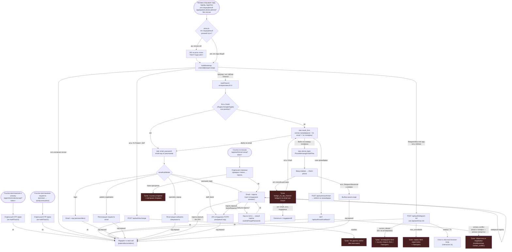

# Инвентаризация экранов входа — 2026-08-04

**СВЕДЕНО в `docs/ARCHITECTURE/AUTH_AND_IDENTITY_CANON.md` 04.08** — здесь остаётся история измерения (точные
`файл:строка`, тупики, дублирование), нормативная картина дверей и вопросов — в каноне.

Чистое измерение по брифу `ORCH_OPS` («давай-ка сначала проработаем порядок экранов, прежде чем
менять»). Продуктовый код не тронут. Каждое утверждение — с точным `файл:строка`.

Компоненты экрана:

- `apps/webapp/src/shared/ui/patient/auth/AuthFlowV2.tsx` — 2809 строк, публичный веб-вход (OAuth,
  email, телефон, пароль сотрудника, восстановление, регистрация специалиста).
- `apps/webapp/src/shared/ui/patient/auth/PhoneMessengerAuthFlow.tsx` — 615 строк, вход/привязка по
  телефону через мессенджер (Telegram/Max); используется двумя способами: как шаг `phone_login`
  внутри `AuthFlowV2` (`AuthFlowV2.tsx:2546-2562`) и напрямую из профиля для привязки телефона
  (`purpose="profile_bind"`).
- `apps/webapp/src/shared/ui/patient/AuthBootstrap.tsx` — 1246 строк, **фактическая точка входа
  раньше экрана**: до показа `AuthFlowV2` он пытается тихо войти по `initData` Telegram/Max mini
  app или по `?t=`/`?token=` JWT интегратора, и только при неудаче показывает интерактивный UI
  (`AuthBootstrap.tsx:1081-1132`).

---

## 1. Таблица входных точек

| Путь / способ | Кто попадает | Чем заканчивается | Файл |
|---|---|---|---|
| `GET /app` | любой неавторизованный (браузер) | `AppEntryRsc` → классификация входа → `AuthBootstrap` → тихий вход или `AuthFlowV2` | `apps/webapp/src/app/app/page.tsx`, `AppEntryRsc.tsx` |
| `GET /app/tg` | Telegram Mini App | то же, но surface жёстко задан `telegram` (без cookie/`ctx`) | `apps/webapp/src/app/app/tg/page.tsx:8` |
| `GET /app/max` | Max Mini App | то же, surface жёстко `max` | `apps/webapp/src/app/app/max/page.tsx` (симметрично tg) |
| `GET /app/patient/login` | пациент по прямой ссылке роли | тот же `AppEntryRsc`, но `roleLoginPortal="patient"` — после входа не-пациента редиректит в его хаб с тостом "доступ запрещён" | `apps/webapp/src/app/app/(role-login)/patient/login/page.tsx` |
| `GET /app/doctor/login` | специалист/клиника (роль `doctor` — клиника-админ и специалист делят одну роль, см. ниже) | `roleLoginPortal="doctor"`, показывает `RoleLoginPortalHeader` | `apps/webapp/src/app/app/(role-login)/doctor/login/page.tsx` |
| `GET /app/admin/login` | платформенный админ | `roleLoginPortal="admin"` | `apps/webapp/src/app/app/(role-login)/admin/login/page.tsx` |
| **Реальный путь на три строки выше** — редирект в `proxy.ts` (⚠️ middleware в этом репозитории НЕТ) | любой, у кого нет сессии, но открыл защищённый `/app/patient/**`, `/app/doctor/**`, `/app/admin/**` (в т.ч. по PWA-ярлыку — `manifest.ts` даёт `start_url:'/app/patient'`, `staffPwaManifest.ts` даёт `/app/doctor`) | 302 на `getRoleLoginPath(portal)` с `?next=<исходный путь>` — это и есть основной способ, которым живые пользователи попадают на три страницы выше, а не прямые ссылки | `apps/webapp/src/proxy.ts:74-90` (`portalForAppPath`, `isRoleLoginPath`) |
| `GET /app/clinic/invites/accept?token=` | приглашённый в команду клиники (сотрудник/специалист) | **отдельный, полностью самостоятельный OTP-экран** — не рендерит ни `AuthFlowV2`, ни `PhoneMessengerAuthFlow` | `apps/webapp/src/app/app/clinic/invites/accept/page.tsx`, `InviteAcceptClient.tsx`; создаётся клиникой через `apps/webapp/src/app/api/clinic/invites/route.ts` |
| `GET /join/[continuation]` и `GET /join/start` | пациент, приглашённый врачом в портал | тоже отдельный самостоятельный OTP-экран; `join/start` берёт токен из URL-фрагмента (`#…`, не хвост пути — чтобы не улетал в лог сервера) и меняет на continuation-cookie | `apps/webapp/src/app/join/[continuation]/page.tsx`, `JoinPatientClient.tsx`, `apps/webapp/src/app/join/start/page.tsx`, `JoinStartClient.tsx`; создаётся врачом через `apps/webapp/src/app/api/doctor/patients/[userId]/portal-invite/route.ts` |
| `?t=`/`?token=` JWT от интегратора (диплинк бота) | пользователь, пришедший по ссылке из Telegram/Max-бота вне mini app | `AuthBootstrap` меняет токен на сессию через `/api/auth/exchange`, минуя экран | `AuthBootstrap.tsx:668-778` (`postTokenExchange`) |
| Telegram/Max `initData` (внутри mini app) | пользователь уже открыл бота как mini app | тихий POST на `/api/auth/telegram-init` или `/api/auth/max-init` → редирект без единого клика; при отказе (`access_denied`, `max_unavailable`, timeout) — см. §3 | `AuthBootstrap.tsx:469-666`, `AuthBootstrap.tsx:626-666` |
| `?intent=specialist` / `?devView=registration` на `/app` | будущий специалист по маркетинговой ссылке | сразу открывает форму регистрации кабинета (`emailAuthMode='specialist_signup'`) | `AuthBootstrap.tsx:162-166`, `AuthFlowV2.tsx:939-962` |
| OAuth callback `GET /api/auth/oauth/callback/{yandex,google,apple,vk}` | вернувшийся из внешнего провайдера | резолв пользователя → сессия → редирект на `/app`; либо `?oauth=error&reason=contact_conflict` назад на экран | `apps/webapp/src/app/api/auth/oauth/callback/*/route.ts`, дед-энд обработан в `AuthBootstrap.tsx:1049-1079` |
| `GET /app/auth/email-setup?token=…` | пользователь по ссылке из письма «настройте пароль» | отдельная страница (не `AuthFlowV2`) — проверка токена → форма пароля | `apps/webapp/src/app/app/auth/email-setup/page.tsx`, `EmailSetupPageClient.tsx` |
| `POST /api/auth/telegram-login` (Telegram Login Widget) | теоретически — пользователь виджета на внешнем сайте | сервер полностью готов принять и провести вход | `apps/webapp/src/app/api/auth/telegram-login/route.ts` — **но кнопки/страницы, которая бы отправила сюда запрос, в кодовой базе нет** (см. §5) |
| `/api/auth/dev-bypass?token=dev:*`, `/api/auth/dev-public?view=clinic-registration` | только дев-режим (`ALLOW_DEV_AUTH_BYPASS=true`) | мгновенный вход без провайдера/пароля, роль зависит от токена | `AppEntryLoginContent.tsx:68-105` |
| Восстановление пароля / первичная установка пароля («забыли пароль?») | сотрудник клиники с почтовым логином | тот же экран, без ухода со страницы: код на sessionStorage-состоянии, не отдельная ссылка | `AuthFlowV2.tsx:718-766` (`submitForgotPassword`), хранение — `authFlowPendingStorage.ts:184-199` |

**Поправка лида 04.08 по замечаниям владельца.** Две ошибки в таблице выше исправлены прямо в ней:

1. **`(role-login)` — не сегмент адреса.** Скобки в Next.js означают группу маршрутов: папка складывает три
   страницы вместе и даёт им общий шаблон, но в URL не попадает. Реальные адреса — `/app/patient/login`,
   `/app/doctor/login`, `/app/admin/login`. В первой версии путь был выписан по файловой системе, а не по URL,
   и читался как «пациент/пациент».
2. **«middleware-редирект» — неверное слово.** Middleware в этом репозитории нет вовсе
   ([[no-middleware-use-proxy]]); перехват идёт через `proxy.ts`, на который документ и ссылается в той же
   строке.

**Поправка после второго прохода.** Первая версия этого документа утверждала «инвайт-ссылок не
найдено» — это было неверно: искал `invite` только в `modules/auth/**`, `app/api/auth/**`,
`app/app/auth/**`, а сами инвайты живут в `app/api/clinic/invites/**` и `app/api/join/**`, вне
проверенных путей. Оба инвайт-потока (клиника → сотрудник, врач → пациент) существуют, оба —
готовые самостоятельные экраны, независимые от `AuthFlowV2`/`PhoneMessengerAuthFlow` (см. таблицу
выше). Самостоятельная регистрация специалиста без приглашения (`AuthFlowV2.tsx:939-1099`,
`specialist_signup`) — это отдельный, третий путь: специалист сам создаёт кабинет и slug, без
инвайта вообще.

---

## 2. Схема действий входа



---

## 3. Тупики — что видит человек

| Тупик | Условие | Что видит человек | Выход | Файл |
|---|---|---|---|---|
| `access_denied` в mini app | Telegram/Max initData валиден, но пользователь не активировал бота | `MINIAPP_ACTIVATE_BOT_AND_AUTH_MESSAGE` + ссылка «Открыть бота в Telegram/Max» | Кнопка «Повторить» перезапускает опрос initData | `AuthBootstrap.tsx:561-564`, `561-568`, `1208-1222` |
| `max_unavailable` | сервис Max недоступен на сервере | `MAX_SERVICE_UNAVAILABLE_MESSAGE` | Кнопка «Повторить» | `AuthBootstrap.tsx:550-554` |
| Таймаут initData (~7 сек) | mini app не прислал initData вовремя | `MESSENGER_MINIAPP_INIT_TIMEOUT_USER_MESSAGE` / `MAX_INIT_DATA_TIMEOUT_USER_MESSAGE` | Если есть fallback-токен в URL — тихий обмен; иначе тот же «Повторить» | `AuthBootstrap.tsx:970-994` |
| `contact_conflict` после OAuth | подтверждённые email и телефон в OAuth-профиле принадлежат двум разным существующим аккаунтам | «Конфликт контактных данных… напишите в поддержку» | Только поддержка или «Войти иначе» → назад на `/app` | `AuthBootstrap.tsx:1045-1079` |
| `foreign_no_otp_channel` | номер телефона не привязан ни к Telegram/Max, ни к подтверждённому email | «Сейчас нет доступного способа отправить код. Войдите по email или OAuth» | OAuth-кнопки (если есть), поддержка, «Другой номер» | `AuthFlowV2.tsx:2596-2661` |
| Пустой `ChannelPicker` | у номера в принципе нет публичного канала доставки кода | «нужны Telegram/Max… или email в профиле. Войдите через Яндекс/Google/Apple или другой номер» — без единой кнопки действия на этом экране | Нужно самому вернуться назад | `ChannelPicker.tsx:59-68` |
| Обмен `/api/auth/exchange` не удался | `?t=` токен истёк/невалиден | `error === 'Сервис временно недоступен'` либо `'Не удалось войти'`, без предложенного следующего шага | Нет явной кнопки — только перезагрузка страницы вручную | `AuthBootstrap.tsx:724-731` |
| Просроченная ссылка `email-setup` | токен из письма истёк | `kind: 'expired'` — форма повторной отправки | Кнопка «отправить письмо снова» | `EmailSetupPageClient.tsx:26-31, 77-80` (полный текст обработчика resend не читан построчно, состояние подтверждено) |
| SMS отключён | канал SMS выключен политикой | `SMS_DISABLED_WEB_MESSAGE`: «SMS для входа с сайта отключён. Используйте код в Telegram, Max или на email» | Возврат к выбору канала | `AuthFlowV2.tsx:69-70, 1224-1227` |
| `specialist_signup_disabled` | регистрация кабинетов выключена флагом | «Регистрация кабинета специалиста пока недоступна» / отдельный экран «оставьте заявку» с CTA на поддержку | Поддержка или «Войти» назад на `/app` | `AuthFlowV2.tsx:939-943`, `AuthBootstrap.tsx:1081-1117` |

---

## 4. Дублирование — точные строки

### 4.1. Провайдеры OAuth перечислены поимённо в `AuthFlowV2.tsx`

- Тип-литерал: `type OauthProviderFlags = { yandex: boolean; google: boolean; apple: boolean };` —
  `AuthFlowV2.tsx:216`.
- Копии объекта `{ yandex: …, google: …, apple: … }` (создание/сброс состояния): строки `258-261`,
  `339`, `349-353`.
- Вычисление «включён ли хоть один провайдер» — разные выражения в разных местах:
  `oauth.yandex || oauth.google || oauth.apple || passkeyEnabled` (`355`),
  `showOauthRow = oauthProviders.yandex || oauthProviders.google` (`494`),
  `showAppleFallback = oauthProviders.apple && !oauthProviders.yandex && !oauthProviders.google`
  (`496-497`), `hasWebOauthAlternatives = showOauthRow || showAppleFallback || passkeyEnabled`
  (`498`).
- Два одинаковых ряда кнопок «Войти через Яндекс/Google/Apple» — первый на шаге `oauth_first`
  (`2488-2520`), второй на шаге `foreign_no_otp_channel` (`2602-2637`) — один и тот же набор из трёх
  условных блоков с вызовом `startOauth(...)`, продублированный целиком.
- Всего упоминаний токенов провайдеров в файле: `yandex` — 15 вхождений, `google` — 15, `apple`/`Apple`
  — 20 (посчитано `grep -c`, 2026-08-04).

### 4.2. VK как канал messenger-подобной привязки — отдельный тип-литерал в 5+ местах

`'telegram' | 'max' | 'vk'` (или обратный порядок) повторяется как встроенный литерал, а не общий
тип, минимум в:
`apps/webapp/src/app/app/doctor/clients/adminMergeAccountsLogic.ts:178`,
`apps/webapp/src/app/api/auth/channel-link/start/route.ts:13`,
`apps/webapp/src/modules/auth/service.ts:383, 471, 511`,
`apps/webapp/src/modules/auth/identityResolutionPort.ts:29, 36`,
`apps/webapp/src/modules/auth/channelLink.ts:80`,
`apps/webapp/src/infra/repos/identityPhoneRowSchemas.ts:11, 13, 51`,
`apps/webapp/src/infra/repos/inMemoryIdentityResolution.ts:4`.
Это отдельное дублирование от провайдерного (§4.1) — тут VK как *канал контакта/бинда*, уже
проведён насквозь; в §5 показано, что как *способ входа (OAuth-кнопка)* VK не проведён вообще.

### 4.3. `getWebChatId()` — идентичная функция в двух файлах

`AuthFlowV2.tsx:124-132` и `PhoneMessengerAuthFlow.tsx:32-40` — дословно одинаковая реализация
(ключ `bersoncare_web_chat_id`, `crypto.randomUUID` с фолбэком).

---

## 5. Что уже готово на сервере, но не подключено к экрану

### 5.1. VK ID (OAuth) — подтверждено, кнопки нет

Сервер полностью готов принять VK ID как полноценный OAuth-провайдер наравне с Яндекс/Google/Apple:

- Тип провайдера включает `'vk'`: `apps/webapp/src/modules/auth/authChannelPolicy.ts:60, 96`;
  `apps/webapp/src/modules/auth/oauthBindingsPort.ts:1`;
  `apps/webapp/src/infra/repos/pgOAuthBindings.ts:5`.
- `POST /api/auth/oauth/start` принимает `provider: z.enum(['yandex','google','apple','vk'])`
  (`apps/webapp/src/app/api/auth/oauth/start/route.ts:47`) и строит PKCE-редирект на
  `https://id.vk.com/authorize` (`route.ts:204-219`).
- `GET /api/auth/oauth/callback/vk` полностью реализован — сигнатура состояния, обмен кода на
  токен, резолв пользователя (`apps/webapp/src/app/api/auth/oauth/callback/vk/route.ts`,
  `apps/webapp/src/modules/auth/vkOAuthCallbackHandler.ts`, `oauthVkService.ts`, `oauthVkResolve.ts`
  — с юнит-тестами `oauthVkResolve.unit.test.ts`).
- `GET /api/auth/oauth/providers` возвращает флаг `vk` в JSON наравне с остальными:
  `apps/webapp/src/app/api/auth/oauth/providers/route.ts:15-22`.
- Админка уже умеет включать/настраивать VK ID (application id, client secret, redirect URI):
  `apps/webapp/src/app/app/settings/AuthProvidersSection.tsx:17, 114-157, 263-315`
  (комментарий в коде прямым текстом: «Ссылка для будущей кнопки «Вход с VK ID» на экране входа»,
  строка 17).

Но `AuthFlowV2.tsx` — единственный потребитель клиентского прогноза провайдеров — определяет
`OauthProviderFlags` без `vk` (`AuthFlowV2.tsx:216`), и сборщик снимка для этого компонента
запрашивает только три провайдера, отбрасывая `vk` целиком:

```
apps/webapp/src/modules/auth/publicAuthSnapshot.ts:12-22
  const [yandex, google, apple, passkeyEnabled, alt, specialistSignupEnabled] = await Promise.all([
    isOAuthProviderEnabled('yandex'),
    isOAuthProviderEnabled('google'),
    isOAuthProviderEnabled('apple'),
    ...
  ]);
  ...
  oauthProviders: { yandex, google, apple },
```

Вывод: не «забыли нарисовать кнопку» — сам прогноз (bootstrap-снимок), который видит
`AuthFlowV2`, физически не спрашивает сервер про VK. Кнопку некуда было бы подключить без правки
этого снимка.

**Не путать с другим VK в репозитории:** `apps/integrator/src/integrations/vk/index.ts` и
`.../vk/config.ts` — это отключённый (`enabled: false`) шаблон интеграции с **сообществом VK как
мессенджер-каналом** (входящие/исходящие сообщения от имени группы VK), не имеет отношения к VK ID
OAuth-входу и от него дальше по готовности — это незаполненный шаблон, а не готовый, но
неподключённый код.

### 5.2. Telegram Login Widget — компонент существует, нигде не импортируется

`apps/webapp/src/shared/ui/patient/auth/TelegramLoginButton.tsx` определяет полноценный React-
компонент виджета (`TelegramLoginButtonProps`, строка 48; функция `TelegramLoginButton`, строка 61)
и сервер принимает его колбэк:
`POST /api/auth/telegram-login` (`apps/webapp/src/app/api/auth/telegram-login/route.ts`) +
`GET /api/auth/telegram-login/config` + `verifyTelegramLoginWidgetSignature` в
`apps/webapp/src/modules/auth/telegramLoginVerify.ts`.

Проверено: `grep -rl "TelegramLoginButton" apps/webapp/src` находит только сам файл компонента —
ни одна страница или другой компонент его не импортирует. Экран входа получает Telegram только
через mini app (`initData`) или через код в мессенджере (`PhoneMessengerAuthFlow`), не через этот
виджет.

### 5.3. PIN-вход — третий случай «сервер готов, экрана нет»

`authChannelPolicy.ts:109` объявляет `IndependentAuthMethod = 'passkey' | 'pin'` — passkey и PIN
управляются одной и той же функцией `isIndependentAuthMethodEnabled(method)`
(`authChannelPolicy.ts:117-121`), с одинаковыми по форме тоглами
(`auth_passkey_enabled`/`auth_pin_enabled`). `POST /api/auth/pin/login`
(`apps/webapp/src/app/api/auth/pin/login/route.ts:22-38`) — рабочий обработчик: номер + 4-значный
PIN → `verifyPinForLogin` → сессия, механика один в один с passkey-входом.

Passkey подключён насквозь: `AuthFlowV2.tsx:220` (`passkeyEnabled` в пропах),
`AuthFlowV2.tsx:329`, `AuthFlowV2.tsx:2477-2487` (кнопка) — и `publicAuthSnapshot.ts` спрашивает
`isIndependentAuthMethodEnabled('passkey')` в прогнозе. PIN — нет: `PrefetchedPublicAuthConfig`
не содержит `pinEnabled`, `publicAuthSnapshot.ts` никогда не зовёт `isIndependentAuthMethodEnabled('pin')`,
и `/api/auth/pin/login` не вызывается ни из одного файла `shared/ui/patient/auth/**`.
Единственный клиент PIN-API в репозитории — `apps/webapp/src/app/app/patient/profile/PinSection.tsx`,
но это **экран настройки PIN после входа** («Задайте PIN для быстрого входа по номеру телефона»),
а не экран входа: он готовит PIN на будущее, которое пока не наступило — вход по PIN нигде не
предлагается.

### 5.4. Больше кандидатов «готово, но не на экране» не найдено

Проверены остальные флаги `authChannelPolicy` (`telegram`, `max`, `sms`, `email`) и
`OTP_PUBLIC_OTHER_CHANNELS_ORDER` / `OTP_OTHER_CHANNELS_ORDER` — все они читаются и в `AuthFlowV2`,
и в `PhoneMessengerAuthFlow`. Отдельных «висящих» серверных модулей `modules/auth/**`
без клиентского потребителя, кроме перечисленных в §5.1-5.3, не обнаружено.

---

## 6. Вопросы владельцу — по порядку экранов

Ниже не рекомендация, а развилки, которые нужно закрыть до правки. У каждой — цена варианта.

**В1. VK ID: включать кнопку сейчас или оставить как есть?**
Сервер полностью готов (§5.1); чтобы кнопка появилась, нужно (а) добавить `vk` в
`OauthProviderFlags`, (б) прокинуть его через `publicAuthSnapshot.ts`, (в) решить, встаёт ли VK в
основной ряд рядом с Яндекс/Google или под тем же условием, что Apple (Apple показывается, только
если нет Яндекс/Google — `AuthFlowV2.tsx:496-497`). Цена «включить»: 3 маленьких файла + решение по
месту кнопки. Цена «оставить»: сервер и админка простаивают, `vk_id_*` настройки в админке ведут в
никуда для пользователя.

**В2. Telegram Login Widget: удалить или подключить?**
Он не виден ни на одном экране; вход через Telegram сейчас идёт только через mini app и код в
мессенджере. Если виджет не нужен — это мёртвый код (компонент + два роута +
`telegramLoginVerify.ts`) и по правилу репозитория «мёртвый код не стоит миграции ради его
удаления», можно оставить как есть без работы. Если нужен — куда именно он встаёт (браузерный вход
без mini app для тех, кто не открыл бота)?

**В3. Порядок провайдеров на первом экране.**
Сейчас порядок жёстко закодирован: passkey → Яндекс → Google → Apple-фолбэк → email → телефон
(`AuthFlowV2.tsx:2477-2541`), без реестра/настройки. Владелец решает: менять ли порядок, добавлять
ли VK в этот же список, и остаётся ли правило «Apple только если нет Яндекс/Google» продуктовым
решением или это исторический артефакт для пересмотра.

**В4. Единый реестр провайдеров — делать сейчас или после решения по В1–В3?**
31 упоминание провайдеров в одном файле (§4.1) — это цена, которую платит любое следующее
изменение состава провайдеров (например, включение VK). Реестр не предлагается как решение в этом
документе (бриф это прямо запрещает) — но если владелец решит добавлять VK (В1), имеет смысл
сначала увидеть, что все три копии литерала и оба ряда кнопок придётся трогать вручную, и решить,
стоит ли это делать заодно или отдельным шагом.

**В5. Дублирование входа для разных ролей — один экран или три?**
Три `roleLoginPortal`-страницы (`patient`/`doctor`/`admin`) рендерят один и тот же `AppEntryRsc` с
разным пропом — экраны идентичны по механике, отличается только шапка (`RoleLoginPortalHeader`) и
куда редиректит после входа. Владелец видит уже как есть — вопрос не в объединении (это не отдельные
экраны с разным кодом), а в том, устраивает ли текущее визуальное различие ролевых порталов, или
нужен явный выбор роли на едином экране `/app` вместо трёх URL.

**В6. PIN-вход: включать наравне с passkey или снять недостроенное?**
Сервер и тоглы готовы один в один с passkey (§5.3), профильный экран уже предлагает пользователю
«задать PIN для быстрого входа» — то есть человек настраивает то, чем потом не может
воспользоваться. Это либо забытый последний шаг (тогда цена включения та же, что у passkey: один
проп + один вызов в `publicAuthSnapshot.ts`), либо решение сознательно отложить PIN и тогда стоит
поправить текст в `PinSection.tsx`, чтобы не обещать пользователю то, чего нет.

**В7. Инвайт-экраны (клиника→сотрудник, врач→пациент) — сводить к общему auth-компоненту или
оставить отдельными?**
Оба инвайт-потока — самостоятельные OTP-экраны, не переиспользующие ни `AuthFlowV2`, ни
`PhoneMessengerAuthFlow`, со своими API (`/api/clinic/invites/*`, `/api/join/*`). Это не то же
самое дублирование, что провайдеры в §4.1 (разные сценарии, не один и тот же факт в разных местах),
но владельцу стоит явно решить: это два оправданных отдельных экрана (человек уже знает контекст —
его пригласили, ему не нужен полный выбор способа входа) или ещё один кандидат на сведение к общей
механике, когда дойдёт очередь до самого входа.
