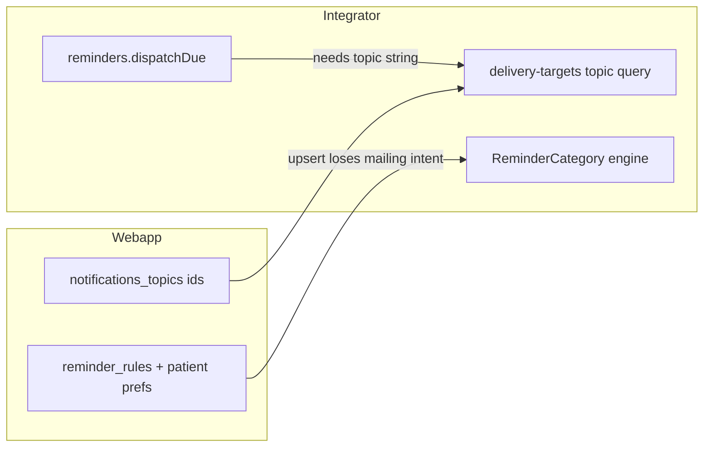

> Git-зеркало файла плана Cursor: `~/.cursor/plans/notification_topic_alignment_7fbdf2af.plan.md`. Держать содержимое синхронизированным при правках.

# Выравнивание тем уведомлений и reminder-движка

## Контекст (зафиксировано в коде)

- Пациентские темы и prefs: [`apps/webapp/src/modules/patient-notifications/notificationsTopics.ts`](apps/webapp/src/modules/patient-notifications/notificationsTopics.ts), фильтрация доставки — [`getDeliveryTargetsForUser`](apps/webapp/src/modules/channel-preferences/deliveryTargets.ts) + [`GET /api/integrator/delivery-targets`](apps/webapp/src/modules/integrator/deliveryTargetsApi.ts) с query `topic`.
- Диспетчер integrator: [`reminders.dispatchDue`](apps/integrator/src/kernel/domain/executor/handlers/reminders.ts) вызывает [`reminderOccurrenceTopicCode(rule, occ.category)`](apps/integrator/src/kernel/domain/reminders/reminderNotificationTopicCode.ts), затем [`deliveryTargetsPort.getTargetsByChannelBinding({ topic })`](apps/integrator/src/infra/adapters/deliveryTargetsPort.ts).
- Сжатие домена webapp → integrator: [`integratorCategoryFromRule`](apps/webapp/src/infra/integrator-push/integratorM2mPosts.ts) (например `appointment` → `supplements_medication`) — **теряется** связь с темой `appointment_reminders`.
- Слот-напоминания Rubitime: [`scheduleBookingReminders`](apps/integrator/src/integrations/rubitime/recordM2mRoute.ts) вызывает `getTargetsByPhone` **с** `topic=appointment_reminders` (мгновенные сообщения при `booking.created` / [`sendLinkedChannelMessage`](apps/integrator/src/integrations/rubitime/recordM2mRoute.ts) — без `topic`, отдельный продуктовый контракт).

## Scope boundaries (жёсткие рамки)

### Разрешено менять

- [`apps/webapp/db/schema/schema.ts`](apps/webapp/db/schema/schema.ts) и новая drizzle-миграция webapp.
- [`apps/webapp/src/modules/reminders/*`](apps/webapp/src/modules/reminders/) и [`apps/webapp/src/infra/repos/pgReminderRules.ts`](apps/webapp/src/infra/repos/pgReminderRules.ts) для записи `notification_topic_code`.
- [`apps/webapp/src/infra/integrator-push/integratorM2mPosts.ts`](apps/webapp/src/infra/integrator-push/integratorM2mPosts.ts).
- [`apps/webapp/src/infra/repos/pgReminderProjection.ts`](apps/webapp/src/infra/repos/pgReminderProjection.ts) при необходимости синхронизации projection-контракта.
- [`apps/integrator/src/kernel/contracts/reminders.ts`](apps/integrator/src/kernel/contracts/reminders.ts), [`apps/integrator/src/infra/db/repos/reminders.ts`](apps/integrator/src/infra/db/repos/reminders.ts), [`apps/integrator/src/kernel/domain/reminders/reminderNotificationTopicCode.ts`](apps/integrator/src/kernel/domain/reminders/reminderNotificationTopicCode.ts), [`apps/integrator/src/kernel/domain/executor/handlers/reminders.ts`](apps/integrator/src/kernel/domain/executor/handlers/reminders.ts).
- [`apps/integrator/src/integrations/bersoncare/reminderRulesRoute.ts`](apps/integrator/src/integrations/bersoncare/reminderRulesRoute.ts).
- [`apps/integrator/src/integrations/rubitime/recordM2mRoute.ts`](apps/integrator/src/integrations/rubitime/recordM2mRoute.ts).
- Тесты, напрямую покрывающие перечисленные области.
- Документация: [`docs/ARCHITECTURE/CONFIGURATION_ENV_VS_DATABASE.md`](docs/ARCHITECTURE/CONFIGURATION_ENV_VS_DATABASE.md) и execution log по инициативе.

### Запрещено в этом плане

- Не расширять `REMINDER_CATEGORIES` и не вводить новые категории движка вместо topic-кода.
- Не менять UX patient notifications page, тексты UI и список `notifications_topics`.
- Не менять unrelated pipeline (SMS, push provider, scheduler tick cadence).
- Не добавлять env-конфиг для integration topic mapping (только код/БД).
- Не трогать CI workflow и глобальные архитектурные правила вне задачи.

## Принцип решения

**Не** добавлять «симптомы» и «приём» в `REMINDER_CATEGORIES` ([`apps/integrator/src/kernel/contracts/reminders.ts`](apps/integrator/src/kernel/contracts/reminders.ts)).

Вместо этого:

1. Хранить на правиле **явный код темы рассылки** (`notification_topic_code`), совместимый с id из `notifications_topics` (те же строки, что уже в админке / миграции `083_notifications_topics.sql`).
2. При диспатче: **сначала** это поле, **иначе** текущая эвристика в `reminderOccurrenceTopicCode` (intent / `linkedObjectType` / категория occurrence).
3. Отдельно от движка правил: пути вне `DueReminderOccurrence` (booking jobs) передают `topic` в delivery API явно.

Продуктовое уточнение (принято): правила категории «важное» не настраиваются по темам и должны идти во все доступные каналы — для них **`notification_topic_code` = null** и поведение как сейчас при `undefined` topic (без фильтра prefs по теме).

## Шаги реализации (усиленный исполнимый план для Composer2)

### Фаза 0. Contract freeze перед кодом

- Зафиксировать canonical mapping:
  - `appointment`-правила -> `appointment_reminders`;
  - LFK/rehab/content правила -> `exercise_reminders`;
  - `important` -> `null` (без topic-фильтра, доставка во все доступные каналы);
  - `symptom_reminders` не выводить из текущих reminder rules, пока нет отдельного доменного сигнала.
- Зафиксировать fallback-policy: если `notification_topic_code` пуст, работает текущая `reminderOccurrenceTopicCode` эвристика.

Checklist:

- `rg "integratorCategoryFromRule|reminderOccurrenceTopicCode|scheduleBookingReminders" apps/webapp apps/integrator`
- `rg "symptom_reminders|appointment_reminders|exercise_reminders" apps/webapp apps/integrator`
- Обновить этот план при любом изменении mapping decision.

### Фаза 1. Контракт и хранилище (две БД-схемы)

- **Webapp:** колонка в [`reminder_rules`](apps/webapp/db/schema/schema.ts) (например `notification_topic_code text`), Drizzle-миграция.
- **Integrator:** колонка в `integrator.user_reminder_rules`, миграция core SQL рядом с существующими [`20260509_*_reminder_rules_*.sql`](apps/integrator/src/infra/db/migrations/core/).
- Расширить [`ReminderRuleRecord`](apps/integrator/src/kernel/contracts/reminders.ts) полем `notificationTopicCode?: string | null`.
- Обновить [`upsertReminderRule`](apps/integrator/src/infra/db/repos/reminders.ts), все SELECT для [`reminders.rules.forUser`](apps/integrator/src/infra/db/readPort.ts) / репозиторий, чтобы поле попадало в кэш правил в `handleReminders`.

Checklist:

- `rg "notification_topic_code|notificationTopicCode" apps/webapp apps/integrator`
- Точечный typecheck по затронутым пакетам:
  - `pnpm --dir apps/webapp run typecheck`
  - `pnpm --dir apps/integrator run typecheck`

### Фаза 2. Единая функция маппинга в webapp (single source of truth)

- Ввести функцию уровня модуля (например рядом с M2M или в [`modules/reminders/`](apps/webapp/src/modules/reminders/)): из [`ReminderRule`](apps/webapp/src/modules/reminders/types.ts) → `notification_topic_code | null`.
  - Минимальный обязательный маппинг для закрытия разрыва: **`appointment` → `appointment_reminders`**; пути реабилитации/контента/LFK → `exercise_reminders` (согласовать с текущей эвристикой и [`integratorCategoryFromRule`](apps/webapp/src/infra/integrator-push/integratorM2mPosts.ts)).
  - **`important` → null** (без темы; все каналы по общим prefs).
  - **`symptom_reminders`**: пока нет отдельного типа правила под дневник — колонка может оставаться null; предусмотреть ветку в функции на будущее (или документировать «зарезервировано»), без ложных данных в БД.
- При создании/обновлении правила выставлять колонку из этой функции (сервис / репозиторий), чтобы источник истины — webapp DB.

Checklist:

- Unit-test маппера (новый): appointment/lfk/important/symptom-reserved cases.
- `pnpm --dir apps/webapp test -- reminder` (или конкретный тестовый файл нового маппера).
- `pnpm --dir apps/webapp run lint`

### Фаза 3. Синхронизация webapp -> integrator (wire contract)

- Расширить payload в [`postReminderRuleUpsertToIntegrator`](apps/webapp/src/infra/integrator-push/integratorM2mPosts.ts) и Zod-схему в [`reminderRulesRoute.ts`](apps/integrator/src/integrations/bersoncare/reminderRulesRoute.ts); прокинуть в `writePort.writeDb({ type: 'reminders.rule.upsert', ... })`.
- Обновить обработчик write для нового поля (если есть отдельный слой от repo).

Checklist:

- `pnpm --dir apps/integrator test -- reminderRulesRoute`
- `pnpm --dir apps/webapp test -- integrator-push`
- `pnpm --dir apps/integrator run lint`

### Фаза 4. Integrator dispatch path

- В [`reminderOccurrenceTopicCode`](apps/integrator/src/kernel/domain/reminders/reminderNotificationTopicCode.ts): если `rule?.notificationTopicCode` задан и не пустой — вернуть его; иначе существующая логика.
- Юнит-тесты: кейсы для `appointment_reminders`, сохранение `exercise_reminders` для rehab, **null** для важного.

Checklist:

- `pnpm --dir apps/integrator test -- reminderNotificationTopicCode`
- `pnpm --dir apps/integrator test -- executeAction` (покрытие dispatch поведения).
- Локальный smoke через моки deliveryTargetsPort: topic передаётся и влияет на `sendChannels`.

### Фаза 5. Rubitime / записи на приём

- В [`scheduleBookingReminders`](apps/integrator/src/integrations/rubitime/recordM2mRoute.ts): заменить/дополнить вызов на `getTargetsByPhone(input.phoneNormalized, { topic: 'appointment_reminders' })` (константа рядом с кодом или общий enum строк из одного места в webapp — без дублирования «магии» в нескольких репах при возможности).

Checklist:

- `pnpm --dir apps/integrator test -- recordM2mRoute`
- Добавить/обновить тест: booking reminder не уходит в канал, отключённый для `appointment_reminders`.

### Фаза 6. Проекция / HTTP API (обязательная консистентность)

- Добавить поле в ответы [`pgReminderProjection`](apps/webapp/src/infra/repos/pgReminderProjection.ts) и типы в [`remindersReadsPort`](apps/integrator/src/infra/adapters/remindersReadsPort.ts) для консистентности push-mode и read-through-mode.
- Проверить backward compatibility: отсутствие поля в старых строках не должно ломать чтение (`null` допустим).

Checklist:

- `pnpm --dir apps/webapp test -- pgReminderProjection`
- `pnpm --dir apps/integrator test -- remindersReadsPort`

### Фаза 7. Документация и execution log

- Коротко обновить абзац в [`docs/ARCHITECTURE/CONFIGURATION_ENV_VS_DATABASE.md`](docs/ARCHITECTURE/CONFIGURATION_ENV_VS_DATABASE.md): тема доставки для напоминаний задаётся полем правила + bypass для «важного», booking использует `appointment_reminders`.
- Обновить execution log инициативы в профильной docs-области (минимум: что сделали, какие проверки, какие ограничения сознательно оставлены).

Checklist:

- `rg "appointment_reminders|notification_topic_code|important.*null|delivery-targets" docs`
- В execution log зафиксировать: migration IDs, тесты, residual gaps.

## Риски и меры

- **Legacy rows без topic-кода** -> риск изменения поведения.  
  Мера: fallback на старую эвристику, миграция без NOT NULL.
- **Разъезд webapp/integrator контракта** -> risk 400 в M2M route.  
  Мера: одновременно обновить отправитель и Zod route + тест wire-пути.
- **Ложный маппинг symptom** -> риск неверной фильтрации каналов.  
  Мера: symptom оставить `null` до отдельного доменного сигнала.
- **Breaking booking notifications** -> риск «тишины» у пациентов.  
  Мера: тест с topic-aware фильтром и кейс topic-disabled/topic-enabled.

## Порядок выполнения (безопасный rollout)

1. Фаза 1 (schema+contracts, fallback-safe).
2. Фаза 2 (webapp mapper, запись в БД).
3. Фаза 3 (M2M payload/route).
4. Фаза 4 (dispatch reader).
5. Фаза 5 (booking topic).
6. Фаза 6 (projection/read-through consistency).
7. Фаза 7 (docs/log + итоговая верификация).

## Итоговая верификация (перед merge/push)

- Целевые проверки по этапам уже зелёные.
- Финальный интеграционный прогон по затронутым пакетам:
  - `pnpm --dir apps/webapp run lint && pnpm --dir apps/webapp run typecheck && pnpm --dir apps/webapp test`
  - `pnpm --dir apps/integrator run lint && pnpm --dir apps/integrator run typecheck && pnpm --dir apps/integrator test`
- Для push в remote отдельно: полный барьер `pnpm install --frozen-lockfile && pnpm run ci` (по правилам репозитория).

## Definition of Done

- Для правила с webapp-категорией «запись» диспатч фильтрует каналы по **`appointment_reminders`**, а не только по эвристике category.
- Напоминания о слоте Rubitime учитывают prefs **`appointment_reminders`**.
- «Важное» не ограничивается темой рассылки (null / без topic filter).
- Тесты зелёные в обеих codebase-зонах (webapp + integrator) по затронутым модулям.
- Миграции обратносуместимы: старые строки без `notification_topic_code` не ломают runtime.
- Документация + execution log обновлены в том же PR.
- Без расширения `REMINDER_CATEGORIES` под симптомы/приём как engine enums.

## Закрытие аудита (2026-05-10)

- Добавлены тесты: Rubitime — нет постановки слот-напоминаний при `null` от `getTargetsByPhone` с `topic=appointment_reminders`; `remindersReadsPort` — маппинг `notificationTopicCode`; in-memory проекция — `notificationTopicCode` в списке правил; маппер — `broadcast` / резерв `symptom_reminders` в JSDoc.
- Документация в репозитории: `docs/archive/2026-05-initiatives/PATIENT_REMINDER_UX_INITIATIVE/NOTIFICATION_TOPIC_ALIGNMENT.md`, обновлены `LOG.md`, `README.md` инициативы, `docs/README.md`.
- Состояние сборки/проверки: `implementationStatus: verified`, `build.status: completed` в YAML этого файла; полный `pnpm run ci` — по правилам репозитория перед push.
