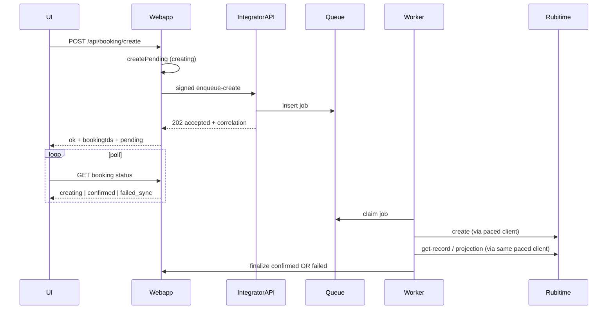

# Статус внедрения (закрыто по фазе 1)

| Часть | Состояние | Где зафиксировано |
|-------|-----------|-------------------|
| **Pacing 5.5s** | **Готово** | Код integrator + миграция `20260413_0001_rubitime_api_throttle.sql` |
| **Тесты фазы 1** | **Готово** | `client.test.ts`, `rubitimeApiThrottle.test.ts` |
| **Документация / контракт** | **Готово** | [`INTEGRATOR_CONTRACT.md`](apps/webapp/INTEGRATOR_CONTRACT.md), [`RUBITIME_API2_PACING_AND_PHASE2_BACKLOG.md`](docs/REPORTS/RUBITIME_API2_PACING_AND_PHASE2_BACKLOG.md), [`docs/README.md`](docs/README.md) |
| **Фаза 2** (очередь, async, мультислоты) | **Backlog** | Только в REPORT §«Фаза 2 — backlog»; отдельная инициатива после мержа фазы 1 |

# Очередь Rubitime (5.5s) + мультислоты

## Контекст по логам

- Текст `RUBITIME_API_ERROR: Limit on the number of consecutive requests: 5 seconds` приходит из ответа Rubitime ([`client.ts`](apps/integrator/src/integrations/rubitime/client.ts) — ветка `parsed.status !== 'ok'`).
- Сразу после успешного `create-record` вызывается [`runPostCreateProjection`](apps/integrator/src/integrations/rubitime/postCreateProjection.ts) → `get-record`: это **второй подряд** запрос к api2, он снова упирается в лимит (у вас уже видно `projectionOk:false` при `200` на create).
- Значит нужен не только «очередь на create», а **единый межзапросный интервал ≥5500 ms для всех вызовов** `postRubitimeApi2` (create, get-record, get-schedule, remove, update), иначе слоты/проекция/отмена снова будут ломать лимит.

## Часть A — глобальный pacing (обязательная база)

- Добавить в integrator **один общий механизм ожидания** перед каждым HTTP-вызовом в [`postRubitimeApi2`](apps/integrator/src/integrations/rubitime/client.ts) (или тонкая обёртка рядом), например:
  - таблица в схеме integrator: одна строка `last_rubitime_api_at` + `UPDATE ... RETURNING` под `FOR UPDATE` в транзакции, либо `pg_advisory_lock` с фиксированным ключом;
  - после захвата: `sleep(max(0, 5500 - (now - last)))`, обновить `last_rubitime_api_at`, затем выполнить `fetch`.
- Учесть **несколько инстансов API/воркера**: только БД-лок подходит; in-memory mutex недостаточен.
- При необходимости слегка поднять/согласовать retry для `postCreateProjection` (сейчас второй вызов через 500 ms — бессмысленно при лимите 5 s) — после pacing второй вызов может стать не нужен или редким.

## Часть B — очередь воркера + UX «выполняется запись»

**Цель:** HTTP ответ webapp не держит открытым синхронный вызов Rubitime; пользователь видит спиннер с текстом «выполняется запись», статус доходит поллингом.

**Поток (высокоуровнево):**

**Реализация:**

1. **Очередь:** расширить существующую инфраструктуру [`rubitime_create_retry_jobs`](apps/integrator/src/infra/db/repos/jobQueue.ts) новым `kind` (например `rubitime.patient_booking_create`) **или** завести отдельную таблицу только под бронирование — чтобы не смешивать с `message.deliver`. В payload хранить всё нужное для `createRubitimeRecord` (v2/v1) и **идентификатор строки `patient_bookings`** (UUID из webapp).
2. **Новый signed route на integrator**, например `POST /api/bersoncare/rubitime/create-record-enqueue`: валидация как у текущего [`create-record`](apps/integrator/src/integrations/rubitime/recordM2mRoute.ts), но вместо вызова Rubitime — `INSERT` job, ответ **202** с `jobId` / correlation.
3. **Worker:** в [`apps/integrator/src/infra/runtime/worker/main.ts`](apps/integrator/src/infra/runtime/worker/main.ts) добавить отдельный цикл (как уже сделано для delivery и projection outbox): claim due jobs нового типа → выполнить create + `runPostCreateProjection` с тем же `deps`, что в HTTP-роуте.
4. **Финализация в webapp:** после успеха воркер должен перевести `patient_bookings` из `creating` в `confirmed` с `rubitime_id` (и при ошибке — `failed_sync`). Варианты:
   - **предпочтительно при unified Postgres:** один репозиторий/SQL из integrator в `public.patient_bookings` (как уже делают ops-скрипты в [`stage6-historical-time-backfill.ts`](apps/integrator/src/infra/scripts/stage6-historical-time-backfill.ts)) + вызов существующего пути уведомлений (`emitBookingEvent` / аналог), **или**
   - signed **internal callback** на webapp (если не хотите cross-schema writes из integrator).
5. **Webapp:** [`createPatientBookingService.createBooking`](apps/webapp/src/modules/patient-booking/service.ts) — после `createPending` вызывать enqueue вместо синхронного [`createBookingSyncPort.createRecord`](apps/webapp/src/modules/integrator/bookingM2mApi.ts); убрать/ослабить in-process `inFlightCreateBySlot` там, где конкуренцию гарантирует очередь + БД exclusion.
6. **API/UI поллинга:** новый лёгкий `GET` (по `bookingId` или списку) возвращает `status` из [`patient_bookings`](apps/webapp/migrations/040_patient_bookings.sql). Клиент: [`useCreateBooking`](apps/webapp/src/app/app/patient/cabinet/useCreateBooking.ts) / [`ConfirmStepClient`](apps/webapp/src/app/app/patient/booking/new/confirm/ConfirmStepClient.tsx) — пока `creating`, показывать лоадер и фразу «выполняется запись».
7. **Конфликт слотов:** как сейчас при двух пользователях — первый успевает в Rubitime/БД, второй получает отказ (Rubitime или `patient_bookings_slot_no_overlap` при confirm); при частичном успехе для мультислотов нужна явная политика отката (см. часть C).

## Часть C — несколько слотов, отдельная запись Rubitime на каждый (подтверждено)

**UI**

- [`SlotStepClient`](apps/webapp/src/app/app/patient/booking/new/slot/SlotStepClient.tsx) / [`BookingSlotList`](apps/webapp/src/app/app/patient/cabinet/BookingSlotList.tsx): состояние `BookingSlot[]`, переключение по клику (toggle), не только один `selectedSlot`.
- **Правило недоступности:** для услуги с длительностью `D` минут (из каталога, уже есть [`durationMinutes`](apps/webapp/src/modules/patient-booking/service.ts) для v2) каждый выбранный слот задаёт занятый интервал `[startAt, startAt + D)` в UTC (или в зоне филиала — единообразно с текущей нормализацией). Кандидатный слот с интервалом `[s,e)` **disabled**, если пересекается по полуинтервалам: `s < occupiedEnd && occupiedStart < e`. Стык `12:00` после `11:00–12:00` для 60 мин **не** пересекается — можно выбрать 11:00 и 12:00.
- Кнопка «Продолжить» активна при `selectedSlots.length >= 1`; query string / state на confirm — сериализовать несколько слотов.

**Бэкенд**

- Расширить контракт [`CreatePatientBookingInput`](apps/webapp/src/modules/patient-booking/types.ts) и [`/api/booking/create`](apps/webapp/src/app/api/booking/create/route.ts): `slots: BookingSlot[]` (валидация: непустой массив, уникальные `startAt`, все в одной услуге/типе).
- В сервисе: для каждого слота — `createPending` → enqueue job (или одна транзакция N pending + N jobs). Воркер обрабатывает **последовательно** с pacing 5.5s между Rubitime-вызовами внутри одного пользователя и глобально.
- **Частичный фейл:** если 1-й слот подтверждён, 2-й отклонён Rubitime — зафиксировать в UI понятную ошибку по второму слоту; опционально автоматический `remove-record` для уже созданных в этой «сессии» (идемпотентный `groupId` в payload job) — заложить в план как явное решение при реализации.

## Тесты и наблюдаемость

- Unit: pacing (мок времени/БД), enqueue handler, worker handler (мок `createRubitimeRecord`).
- Интеграционные: два быстрых create подряд → оба успешно (второй после задержки).
- Логи: `jobId`, `bookingId`, длительность ожидания в очереди.

## Вне скоупа (но связано с вашими логами)

- Ошибка webapp `column "request_hash" does not exist` — рассинхрон миграций и деплоя; исправляется отдельным применением миграций, не частью этого функционала.
